本文档供 AI 阅读. NcatBot 文档 base_url 为 `https://docs.ncatbot.xyz/`, 文档中包含相对链接，为用户生成链接时必须加上这个前缀生成绝对链接。

# 文件: 1. 快速开始\1. 安装与配置.md

---
title: 安装与配置
createTime: 2026/03/19 17:26:45
permalink: /guide/0y9ejqdf/
---

> 安装 NcatBot、编写 config.yaml、确认 NapCat 连接 — 运行 Bot 前的必要准备。

---

## 前提条件

- Python ≥ 3.12
- NapCat 已安装并运行（提供 WebSocket 服务）

## 1. 安装 NcatBot

```bash
pip install ncatbot5
```

或使用 uv：

```bash
uv add ncatbot5
```

验证安装：

```bash
python -c "import ncatbot; print('NcatBot 可用')"
```

## 2. 编写 config.yaml

在项目根目录创建 `config.yaml`：

```yaml
bot_uin: '你的QQ号'
root: '管理员QQ号'
adapters:
  - type: napcat
    platform: qq
    enabled: true
    config:
      ws_uri: ws://localhost:3001
      ws_token: napcat_ws
plugin:
  load_plugin: true
```

**关键字段说明**：

| 字段 | 说明 |
|------|------|
| `bot_uin` | Bot 登录的 QQ 号 |
| `root` | 超级管理员 QQ 号，拥有所有权限 |
| `ws_uri` | NapCat WebSocket 地址，默认 `ws://localhost:3001` |
| `ws_token` | NapCat WebSocket 认证 Token |
| `load_plugin` | 是否启用插件加载（非插件模式可设为 `false`） |

> 也可以使用 `ncatbot init` 交互式生成此文件。

## 3. 确认 NapCat 连接

确保 NapCat 已启动并监听在 `ws_uri` 指定的地址。NcatBot 启动时会自动连接。

连接成功后终端会输出类似：

```text
[INFO] WebSocket 连接已建立: ws://localhost:3001
```

---

## 延伸阅读

- 配置项完整说明 → [配置管理指南](../configuration/)
- 各平台适配器登录与配置 → [适配器指南](../adapter/)（NapCat/Bilibili/GitHub/Mock）
- 下一步：选择启动模式 → [非插件模式](2.non-plugin-mode.md) 或 [插件模式](3.plugin-mode.md)


---

# 文件: 1. 快速开始\2. 非插件模式.md

---
title: 非插件模式启动
createTime: 2026/03/19 17:26:45
permalink: /guide/1tn9cgux/
---

> 在 main.py 中直接用 registrar 装饰器注册回调 — 最快的启动方式，适合快速原型和简单 Bot。

---

## 前提条件

- 已完成 [安装与配置](1.install-config.md)

## 完整示例

创建 `main.py`：

```python
from ncatbot.app import BotClient
from ncatbot.core import registrar
from ncatbot.event.qq import GroupMessageEvent, PrivateMessageEvent

bot = BotClient()

@registrar.on_group_command("hello", ignore_case=True)
async def on_hello(event: GroupMessageEvent):
    await event.reply(text="Hello, NcatBot!")

@registrar.on_private_command("ping")
async def on_ping(event: PrivateMessageEvent):
    await event.reply(text="pong!")

if __name__ == "__main__":
    bot.run()
```

启动：

```bash
python main.py
```

在群聊发送 `hello`，Bot 回复 "Hello, NcatBot!" 即成功。

## 项目结构

```text
my-bot/
├── config.yaml    # 配置文件
└── main.py        # 入口文件，所有逻辑写在这里
```

## 异步非阻塞启动

上面的 `bot.run()` 是**同步阻塞**调用——它会占据主线程直到 Bot 关闭。如果你需要在启动后继续执行自定义的异步逻辑（例如事件驱动主循环、定时推送、与其他异步服务集成），可以使用 `run_async()`：

```python
import asyncio
from ncatbot.app import BotClient
from ncatbot.core import registrar, from_event, msg_equals
from ncatbot.event.qq import GroupMessageEvent

bot = BotClient()

# 装饰器注册依然可用
@registrar.on_group_command("hello")
async def on_hello(event: GroupMessageEvent):
    await event.reply(text="Hello!")

async def main():
    await bot.run_async()
    # 此处 bot.api / bot.dispatcher 已可用，Bot 在后台监听事件

    # 示例：用 dispatcher 直接等待特定事件
    print("Bot 已就绪，等待第一条群消息...")
    first_msg = await bot.dispatcher.wait_event(
        predicate=lambda e: e.type.startswith("message.group"),
        timeout=60.0,
    )
    print(f"收到: {first_msg.data.raw_message}")

    # 保持运行，直到 Ctrl+C
    try:
        await asyncio.Event().wait()
    except asyncio.CancelledError:
        pass
    finally:
        await bot.shutdown()

if __name__ == "__main__":
    asyncio.run(main())
```

### `run()` vs `run_async()` 对比

| 维度 | `run()` | `run_async()` |
|------|---------|---------------|
| 阻塞性 | 同步阻塞，占据主线程 | 异步返回，Bot 在后台监听 |
| 调用方式 | `bot.run()` | `await bot.run_async()` |
| 适用场景 | 简单 Bot，无需启动后自定义逻辑 | 需要启动后执行异步编排、与其他服务集成 |
| `bot.api` | 阻塞期间可用（在 handler 内） | 返回后立即可用 |
| `bot.dispatcher` | 阻塞期间可用（在 handler 内） | 返回后立即可用 |

`run_async()` 完成 startup 后立即返回——适配器连接、分发器、API 客户端、插件全部就绪，后台 task 负责持续监听事件。

> 更多非阻塞启动与事件编排的高级用法，参见 [复杂工作流模式](../plugin/4b.event-advanced.md#复杂工作流模式) 和 [事件驱动工作流编排](../plugin/7a.patterns.md#事件驱动工作流编排)。

---

## 适用场景与限制

**适合**：快速验证想法、简单的单文件 Bot、学习框架基础。

**不支持**：Mixin 能力（配置持久化 / 数据存储 / RBAC / 定时任务）、热重载、插件依赖管理。

需要这些能力时 → [插件模式](3.plugin-mode.md)。

---

## 延伸阅读

- 消息发送方式 → [消息发送指南](../send_message/)
- 更多事件类型 → [事件注册方式](../plugin/4a.event-registration.md)
- 完整 Bot API → [API 使用指南](../api_usage/)


---

# 文件: 1. 快速开始\3. 插件模式.md

---
title: 插件模式启动
createTime: 2026/03/19 17:26:45
permalink: /guide/k587fhub/
---

> 创建插件目录 + manifest.toml + NcatBotPlugin 子类 — 推荐的正式项目启动方式，支持配置持久化、权限控制、定时任务和热重载。

---

## 前提条件

- 已完成 [安装与配置](1.install-config.md)

## 方式一：使用 CLI 快速初始化

```bash
mkdir my-bot && cd my-bot
ncatbot init          # 交互式生成 config.yaml + 模板插件
ncatbot run           # 启动 Bot
```

`ncatbot init` 会生成完整的项目结构，包括一个可运行的模板插件。

开发时使用 `ncatbot dev` 代替 `ncatbot run`，自动开启 debug 模式和热重载。

## 方式二：手动创建

### 1. 项目结构

```text
my-bot/
├── config.yaml
├── main.py              # 入口文件
└── plugins/
    └── hello_world/     # 插件目录
        ├── manifest.toml
        └── plugin.py
```

### 2. manifest.toml

```toml
name = "hello_world"
version = "1.0.0"
main = "plugin.py"
entry_class = "HelloWorldPlugin"
author = "你的名字"
description = "最小可运行插件"

[dependencies]
pip_dependencies = []
```

### 3. plugin.py

```python
from ncatbot.plugin import NcatBotPlugin
from ncatbot.core import registrar
from ncatbot.event.qq import GroupMessageEvent
from ncatbot.utils import get_log

LOG = get_log("HelloWorld")

class HelloWorldPlugin(NcatBotPlugin):
    name = "hello_world"
    version = "1.0.0"

    async def on_load(self):
        LOG.info("HelloWorld 插件已加载！")

    async def on_close(self):
        LOG.info("HelloWorld 插件已卸载。")

    @registrar.on_group_command("hello", ignore_case=True)
    async def on_group_hello(self, event: GroupMessageEvent):
        await event.reply(text="Hello from plugin!")
```

### 4. main.py

```python
from ncatbot.app import BotClient

bot = BotClient()

if __name__ == "__main__":
    bot.run()
```

### 5. 启动

```bash
python main.py
```

## 插件模式 vs 非插件模式

| 能力 | 非插件模式 | 插件模式 |
|------|-----------|---------|
| 配置持久化（ConfigMixin） | ❌ | ✅ |
| 数据存储（DataMixin） | ❌ | ✅ |
| 权限控制（RBACMixin） | ❌ | ✅ |
| 定时任务（TimeTaskMixin） | ❌ | ✅ |
| 热重载 | ❌ | ✅ |
| 依赖管理 | ❌ | ✅ |

---

## 延伸阅读

- 插件结构详解 → [插件结构](../plugin/2.structure.md)
- 插件生命周期 → [生命周期](../plugin/3.lifecycle.md)
- Mixin 能力 → [配置与数据](../plugin/5a.config-data.md)
- 事件注册方式 → [事件注册](../plugin/4a.event-registration.md)


---

# 文件: 1. 快速开始\README.md

---
title: Quick Start
createTime: 2026/03/19 17:26:45
permalink: /guide/695ruqzj/
---

> 从零开始，5 分钟运行你的第一个 NcatBot。覆盖安装、配置、非插件模式和插件模式两种启动方式。

---

## Quick Reference

### 最小非插件模式

安装 → 写 config.yaml → 写 main.py → 运行：

```bash
pip install ncatbot5
```

```python
# main.py
from ncatbot.app import BotClient
from ncatbot.core import registrar
from ncatbot.event.qq import GroupMessageEvent

bot = BotClient()

@registrar.on_group_command("hello", ignore_case=True)
async def on_hello(event: GroupMessageEvent):
    await event.reply(text="Hello, NcatBot!")

if __name__ == "__main__":
    bot.run()
```

### 最小插件模式

```bash
pip install ncatbot5
ncatbot init        # 交互式生成 config.yaml + 模板插件
ncatbot run         # 启动 Bot
```

---

## 本目录索引

| 文件 | 内容 |
|------|------|
| [1.install-config.md](1.install-config.md) | 安装 NcatBot、编写 config.yaml、确认 NapCat 连接 |
| [2.non-plugin-mode.md](2.non-plugin-mode.md) | 非插件模式完整流程 — 直接在 main.py 注册回调，适合快速原型 |
| [3.plugin-mode.md](3.plugin-mode.md) | 插件模式完整流程 — 创建插件目录 + manifest + 插件类，适合正式项目 |

---

## 交叉引用

- 两种模式的区别 → [使用指南首页](../README.md)
- 插件开发深入 → [插件开发指南](../plugin/)
- CLI 命令详解 → [CLI 指南](../cli/)


---

# 文件: 2. 适配器\1. NapCat QQ.md

---
title: NapCat / QQ 适配器
createTime: 2026/03/19 17:26:45
permalink: /guide/1xckxeos/
---

> NapCat (OneBot v11) 适配器完整指南 — 两种运行模式、WebUI 登录、配置与诊断。

---

## Quick Reference

| 属性 | 值 |
|------|-----|
| 适配器名称 | `napcat` |
| 平台标识 | `qq` |
| 协议 | OneBot v11 (WebSocket) |
| 类 | `NapCatAdapter` |
| 导入 | `from ncatbot.adapter import NapCatAdapter` |

```yaml
# 最小配置
adapters:
  - type: napcat
    platform: qq
    enabled: true
    config:
      ws_uri: ws://localhost:3001
      ws_token: napcat_ws
```

---

## 两种运行模式

NapCat 适配器提供两种模式，适应不同的部署场景：

### Setup 模式（默认）

自动完成 NapCat 安装、配置、启动和登录。适合**本地开发**和**首次部署**。

```yaml
config:
  ws_uri: ws://localhost:3001
  ws_token: napcat_ws
  enable_webui: true
  webui_token: napcat_webui
  # skip_setup 默认为 false，即 Setup 模式
```

**流程**：

```text
检测 NapCat 服务是否在线
  ├─ 已在线 → 验证账号 → 完成
  └─ 未在线 → 安装/更新 NapCat → 生成配置 → 启动进程 → 登录 → 完成
```

登录优先尝试**快速登录**（如果该 QQ 号之前登录过），失败则自动切换到**二维码登录**（在终端显示 ASCII 二维码，使用手机 QQ 扫码）。

### Connect 模式

直接连接已运行的 NapCat 服务，不管理 NapCat 进程。适合 **NapCat 独立部署** 或 **Docker 环境**。

```yaml
config:
  ws_uri: ws://your-napcat-host:3001
  ws_token: napcat_ws
  skip_setup: true
```

**流程**：

```text
尝试连接 WebSocket
  ├─ 成功 → 完成
  └─ 失败 → 抛出错误（不会自动安装或启动 NapCat）
```

---

## 配置项详解

```yaml
bot_uin: '123456789'           # Bot 登录的 QQ 号
root: '987654321'              # 超级管理员 QQ 号

adapters:
  - type: napcat
    platform: qq
    enabled: true
    config:
      # WebSocket 连接
      ws_uri: ws://localhost:3001     # NapCat WebSocket 地址
      ws_token: napcat_ws             # WebSocket 认证 Token

      # WebUI（Setup 模式用于登录引导）
      enable_webui: true              # 是否启用 WebUI
      webui_token: napcat_webui       # WebUI 认证 Token
      # webui_host 和 webui_port 从 webui_uri 解析，默认 localhost:6099

      # 运行模式
      skip_setup: false               # true = Connect 模式, false = Setup 模式
```

| 配置项 | 类型 | 默认值 | 说明 |
|--------|------|--------|------|
| `ws_uri` | string | `ws://localhost:3001` | NapCat WebSocket 地址 |
| `ws_token` | string | `napcat_ws` | WebSocket 认证 Token，需与 NapCat 配置一致 |
| `enable_webui` | bool | `true` | 启用 WebUI（Setup 模式下用于登录引导） |
| `webui_token` | string | `napcat_webui` | WebUI 认证 Token |
| `skip_setup` | bool | `false` | `true` = Connect 模式，`false` = Setup 模式 |

---

## 登录流程详解

### 快速登录

NapCat 会缓存之前登录过的 QQ 号。如果目标 QQ 号在快速登录列表中，会自动完成登录，无需扫码。

### 二维码登录

快速登录不可用时，会在终端打印 ASCII 二维码：

```text
[INFO] 快速登录列表: []
[INFO] 正在获取二维码...

█████████████████████████████
█████████████████████████████
████ ▄▄▄▄▄ █ ▀▄▀█ ▄▄▄▄▄ ████
...
请使用手机 QQ 扫描二维码登录
```

扫码后系统会自动检测登录状态并继续。二维码有效期约 60 秒，超时前会提示。

### 缓存登录

NapCat 启动后会先检查本地缓存的 session。如果 session 仍有效，会跳过登录流程直接连接。

---

## 连接诊断

使用 CLI 工具诊断连接问题：

```bash
ncatbot napcat diagnose
```

诊断内容包括：
- WebSocket 连接测试
- WebUI 可达性
- Token 验证
- NapCat 进程状态

### 常见问题

| 问题 | 原因 | 解决方案 |
|------|------|---------|
| WebSocket 连接超时 | NapCat 未启动或端口不对 | 检查 `ws_uri` 和 NapCat 是否运行 |
| Token 错误 (retcode=1403) | `ws_token` 与 NapCat 配置不一致 | 确认两端 Token 匹配 |
| WebUI 认证失败 | `webui_token` 不匹配 | 检查 NapCat WebUI 配置中的 Token |
| 账号不匹配 | 当前登录 QQ 号与 `bot_uin` 不同 | 确认 `bot_uin` 正确，或重新登录 |
| 不支持 Setup 模式 | 运行在不受支持的平台 | 使用 `skip_setup: true` 手动管理 NapCat |

---

## 示例

- `examples/qq/01_hello_world/` — 最简 QQ Bot
- `examples/qq/02_event_handling/` — 事件处理
- `examples/qq/03_message_types/` — 消息类型
- `examples/qq/04_bot_api/` — Bot API 调用
- `examples/qq/09_full_featured_bot/` — 完整功能 Bot

---

## 延伸阅读

- 消息发送 → [send_message/qq/](../send_message/qq/)
- QQ Bot API → [api_usage/qq/](../api_usage/qq/)
- 连接管理参考 → [reference/adapter/1_connection.md](../../reference/adapter/1_connection.md)
- 协议处理参考 → [reference/adapter/2_protocol.md](../../reference/adapter/2_protocol.md)
- NapCat Setup 内部 → `ncatbot/adapter/napcat/setup/README.md`


---

# 文件: 2. 适配器\2. Bilibili.md

---
title: Bilibili 适配器
createTime: 2026/03/19 17:26:45
permalink: /guide/1dg3rfzt/
---

> Bilibili 平台适配器完整指南 — 扫码登录、凭据持久化、直播/私信/评论多数据源。

---

## Quick Reference

| 属性 | 值 |
|------|-----|
| 适配器名称 | `bilibili` |
| 平台标识 | `bilibili` |
| 协议 | bilibili-api-python (WebSocket + REST Polling) |
| 类 | `BilibiliAdapter` |
| 导入 | `from ncatbot.adapter.bilibili import BilibiliAdapter` |
| 额外依赖 | `bilibili-api-python >= 17.0.0`（自动安装） |

```yaml
# 最小配置（首次运行会弹出扫码）
adapters:
  - type: bilibili
    platform: bilibili
    enabled: true
    config:
      live_rooms: [12345]
```

---

## 扫码登录

Bilibili 适配器使用**二维码扫码登录**获取凭据。

### 首次登录流程

1. 启动 Bot 时，若 `config.yaml` 中未配置凭据（`sessdata` 为空），自动触发扫码登录
2. 终端显示压缩的 ASCII 二维码，同时保存 PNG 图片到临时目录

```text
==================================================
  Bilibili 扫码登录 (第 1/3 次)
==================================================
█▀▀▀▀▀█ ▀▄█▀ █▀▀▀▀▀█
█ ███ █ █▄▀  █ ███ █
...
  二维码图片: C:\Users\...\Temp\ncatbot_bilibili_qr.png
  请使用 Bilibili APP 扫描上方二维码
==================================================
```

3. 使用 Bilibili 手机 APP 扫描二维码并确认
4. 登录成功后，凭据**自动写回 `config.yaml`**

### 凭据持久化

登录成功后，`sessdata`、`bili_jct`、`dedeuserid`、`ac_time_value` 会自动保存到 `config.yaml` 的 bilibili 适配器配置中。下次启动时直接使用已保存的凭据，无需重复扫码。

如果凭据过期，适配器会自动检测并重新触发扫码登录。

### 手动填写凭据

也可以跳过扫码，直接在配置中填入 Cookie 凭据（从浏览器开发者工具获取）：

```yaml
config:
  sessdata: "your_sessdata_here"
  bili_jct: "your_bili_jct_here"
  dedeuserid: "your_uid_here"
  ac_time_value: "your_ac_time_value_here"
```

---

## 配置项详解

```yaml
adapters:
  - type: bilibili
    platform: bilibili
    enabled: true
    config:
      # 认证凭据（扫码后自动填入，也可手动配置）
      sessdata: ""
      bili_jct: ""
      buvid3: ""
      dedeuserid: ""
      ac_time_value: ""

      # 数据源 — 直播间
      live_rooms:              # 监听的直播间房间号列表
        - 12345
        - 67890

      # 数据源 — 私信
      enable_session: false    # 是否启用私信监听

      # 数据源 — 视频评论
      comment_watches:         # 监听评论的视频/动态列表
        - id: "BV1xx411c7xx"
          type: video

      # 轮询间隔
      session_poll_interval: 6.0    # 私信轮询间隔（秒）
      comment_poll_interval: 30.0   # 评论轮询间隔（秒）

      # 连接重试
      max_retry: 5             # 最大重连次数
      retry_after: 1.0         # 重连初始延迟（秒）
```

### 配置项说明

| 配置项 | 类型 | 默认值 | 说明 |
|--------|------|--------|------|
| `sessdata` | string | `""` | Bilibili SESSDATA Cookie |
| `bili_jct` | string | `""` | Bilibili CSRF Token |
| `buvid3` | string | `""` | 设备指纹标识 |
| `dedeuserid` | string | `""` | 用户 UID |
| `ac_time_value` | string | `""` | 账号时间戳凭据 |
| `live_rooms` | list[int] | `[]` | 监听的直播间房间号 |
| `enable_session` | bool | `false` | 启用私信监听 |
| `comment_watches` | list | `[]` | 监听评论的视频列表（`id` + `type`） |
| `session_poll_interval` | float | `6.0` | 私信轮询间隔（秒） |
| `comment_poll_interval` | float | `30.0` | 评论轮询间隔（秒） |
| `max_retry` | int | `5` | 连接断开后最大重试次数 |
| `retry_after` | float | `1.0` | 重连初始延迟（秒） |

---

## 三种数据源

Bilibili 适配器通过 `SourceManager` 同时管理三种独立的数据源：

### 1. 直播间弹幕（WebSocket）

通过 WebSocket 实时接收直播间事件：弹幕、SC（SuperChat）、礼物、上舰、点赞等。

```yaml
live_rooms:
  - 12345    # 房间号
  - 67890
```

可通过 API 动态添加/移除监听的直播间。

### 2. 私信（REST Polling）

定时轮询 Bilibili 私信接口，获取新消息。

```yaml
enable_session: true
session_poll_interval: 6.0   # 每 6 秒轮询一次
```

### 3. 视频评论（REST Polling）

定时轮询指定视频的评论区，获取新回复。

```yaml
comment_watches:
  - id: "BV1xx411c7xx"
    type: video
comment_poll_interval: 30.0  # 每 30 秒轮询一次
```

---

## 常见问题

| 问题 | 原因 | 解决方案 |
|------|------|---------|
| 扫码登录超时 | 二维码约 3 分钟过期 | 过期后自动重新生成（最多 3 次） |
| 凭据失效 | Cookie 过期（通常几天到几周） | 适配器自动检测并触发重新扫码 |
| 直播间无事件 | 房间号错误或主播未开播 | 确认房间号正确；部分事件仅在开播时产生 |
| 依赖安装失败 | `bilibili-api-python` 安装问题 | 手动 `pip install bilibili-api-python>=17.0.0` |
| 私信无响应 | `enable_session` 未开启 | 设置 `enable_session: true` |

---

## 示例

- `examples/bilibili/01_hello_world/` — 最简 Bilibili Bot
- `examples/bilibili/02_live_room/` — 直播间弹幕处理
- `examples/bilibili/03_private_message/` — 私信收发
- `examples/bilibili/04_comment/` — 视频评论处理
- `examples/bilibili/05_live_manager/` — 直播间管理

---

## 延伸阅读

- Bilibili 消息发送 → [send_message/bilibili/](../send_message/bilibili/)
- Bilibili Bot API → [api_usage/bilibili/](../api_usage/bilibili/)
- 多平台开发 → [multi_platform/](../multi_platform/)


---

# 文件: 2. 适配器\3. GitHub.md

---
title: GitHub 适配器
createTime: 2026/03/19 17:26:45
permalink: /guide/edaizgkz/
---

> GitHub 平台适配器完整指南 — Token 认证、Webhook / Polling 双模式、内网穿透方案。

---

## Quick Reference

| 属性 | 值 |
|------|-----|
| 适配器名称 | `github` |
| 平台标识 | `github` |
| 协议 | GitHub Webhook (HTTP) / REST API Polling |
| 类 | `GitHubAdapter` |
| 导入 | `from ncatbot.adapter.github import GitHubAdapter` |

```yaml
# 最小配置
adapters:
  - type: github
    platform: github
    enabled: true
    config:
      token: "ghp_xxxxxxxxxxxx"
      repos:
        - "owner/repo"
      mode: webhook
```

---

## Token 认证

GitHub 适配器使用 **Personal Access Token (PAT)** 认证，无交互式登录流程。

### 创建 Token

1. 访问 [GitHub Settings → Developer settings → Personal access tokens](https://github.com/settings/tokens)
2. 点击 **Generate new token (classic)** 或使用 Fine-grained tokens
3. 勾选所需权限（推荐最小权限）：
   - `repo` — 仓库读写（Issue / PR / Comment）
   - `read:org` — 组织仓库（如需要）
4. 生成后复制 Token，填入 `config.yaml`

### 验证

适配器启动时自动调用 `GET /user` 验证 Token 有效性。验证失败会报错并终止启动。

::: tip
不配置 Token 也可运行（适用于公开仓库 Webhook 接收），但 API 调用会受到严格速率限制（60 次/小时 vs 5000 次/小时）。
:::


---

## 两种模式

### Webhook 模式（默认）

启动 HTTP Server 监听 GitHub Webhook 推送，**实时性最好**。

```yaml
config:
  token: "ghp_xxxx"
  repos: ["owner/repo"]
  mode: webhook
  webhook_host: "0.0.0.0"
  webhook_port: 8080
  webhook_path: "/webhook"
  webhook_secret: "your-secret"    # 推荐配置，用于签名验证
```

**流程**：

```text
GitHub → POST /webhook → NcatBot HTTP Server → 解析事件 → Dispatcher
```

配置 GitHub 仓库的 Webhook：

1. 仓库 → Settings → Webhooks → Add webhook
2. **Payload URL**: `http://your-server:8080/webhook`
3. **Content type**: `application/json`
4. **Secret**: 与 `webhook_secret` 一致
5. 选择需要接收的事件（或 "Send me everything"）

#### 内网环境使用 Webhook

如果 Bot 运行在内网（无公网 IP），可以使用 [smee.io](https://smee.io) + [gosmee](https://github.com/chmouel/gosmee) 方案将 Webhook 转发到本地。

**方案一：smee.io（推荐入门）**

[smee.io](https://smee.io) 是 GitHub 官方推荐的 Webhook 代理服务，免费使用。

1. 访问 https://smee.io ，点击 **Start a new channel**，获得一个唯一 URL（如 `https://smee.io/AbCdEfGh`）
2. 将该 URL 填入 GitHub 仓库的 Webhook Payload URL
3. 本地安装 smee-client 并启动转发：

```bash
npm install -g smee-client
smee -u https://smee.io/AbCdEfGh -t http://localhost:8080/webhook
```

4. smee-client 会将 GitHub 发到 smee.io 的 Webhook 请求实时转发到本地的 NcatBot HTTP Server

**方案二：gosmee（推荐生产）**

[gosmee](https://github.com/chmouel/gosmee) 是用 Go 编写的高性能 smee 兼容客户端，支持自建服务端，适合生产环境。

1. 安装 gosmee：

```bash
# Go install
go install github.com/chmouel/gosmee@latest

# 或下载二进制
# https://github.com/chmouel/gosmee/releases
```

2. 使用 smee.io 作为中转（与 smee-client 兼容）：

```bash
gosmee client https://smee.io/AbCdEfGh http://localhost:8080/webhook
```

3. 或者自建 gosmee server（完全自托管，无需依赖第三方服务）：

```bash
# 在有公网 IP 的服务器上启动 gosmee server
gosmee server --port 3333

# GitHub Webhook Payload URL 填: http://your-server:3333/webhook-channel-id
# 本地运行 gosmee client 连接到自建 server
gosmee client http://your-server:3333/webhook-channel-id http://localhost:8080/webhook
```

**整体拓扑**：

```text
GitHub ──POST──→ smee.io / gosmee server (公网)
                        │
                    SSE 推送
                        │
              smee-client / gosmee client (内网)
                        │
                   POST 转发
                        │
              NcatBot HTTP Server (localhost:8080)
```

::: warning
smee.io 的 channel 是公开的，不要依赖它做安全控制。始终配置 `webhook_secret` 进行签名验证。
:::


### Polling 模式

定时调用 GitHub Events API 获取事件。适合**无法接收 Webhook** 的环境（如防火墙限制且不想配内网穿透）。

```yaml
config:
  token: "ghp_xxxx"
  repos: ["owner/repo"]
  mode: polling
  poll_interval: 60.0    # 每 60 秒轮询一次
```

**流程**：

```text
NcatBot → GET /repos/{owner}/{repo}/events → 解析新事件 → Dispatcher
```

| 对比 | Webhook | Polling |
|------|---------|---------|
| 实时性 | 秒级 | poll_interval 延迟 |
| 网络要求 | 需要公网可达或内网穿透 | 仅需出站 HTTPS |
| API 配额 | 不消耗 | 消耗 REST API 配额 |
| 适用场景 | 生产环境 | 开发/测试、防火墙内 |

---

## 配置项详解

```yaml
adapters:
  - type: github
    platform: github
    enabled: true
    config:
      # 认证
      token: "ghp_xxxx"          # GitHub Personal Access Token

      # 监听仓库
      repos:                     # 仅 Polling 模式需要配置
        - "owner/repo1"          # Webhook 模式下 GitHub 自行推送
        - "owner/repo2"

      # 连接模式
      mode: webhook              # "webhook" 或 "polling"

      # Webhook 配置
      webhook_host: "0.0.0.0"   # HTTP Server 监听地址
      webhook_port: 8080         # HTTP Server 监听端口
      webhook_path: "/webhook"   # Webhook 路径
      webhook_secret: ""         # Webhook Secret（用于签名验证）

      # Polling 配置
      poll_interval: 60.0        # 轮询间隔（秒）
```

### 配置项说明

| 配置项 | 类型 | 默认值 | 说明 |
|--------|------|--------|------|
| `token` | string | `""` | GitHub PAT，为空时 API 受限 |
| `repos` | list[string] | `[]` | 监听的仓库列表（格式 `owner/repo`） |
| `mode` | string | `"webhook"` | `"webhook"` 或 `"polling"` |
| `webhook_host` | string | `"0.0.0.0"` | Webhook HTTP Server 监听地址 |
| `webhook_port` | int | `8080` | Webhook HTTP Server 端口 |
| `webhook_path` | string | `"/webhook"` | Webhook 接收路径 |
| `webhook_secret` | string | `""` | 用于验证 Webhook 签名（推荐配置） |
| `poll_interval` | float | `60.0` | Polling 模式轮询间隔（秒） |

---

## Webhook 签名验证

配置 `webhook_secret` 后，适配器会对每个 Webhook 请求验证 `X-Hub-Signature-256` 头，使用 HMAC-SHA256 算法比对签名。签名不匹配的请求返回 403。

```yaml
webhook_secret: "my-super-secret"  # 与 GitHub Webhook 设置中的 Secret 一致
```

---

## 常见问题

| 问题 | 原因 | 解决方案 |
|------|------|---------|
| Token 验证失败 | Token 过期或权限不足 | 重新生成 Token 并确认权限 |
| Webhook 不触发 | GitHub 无法访问 Bot 服务器 | 确认公网可达或使用 smee/gosmee 内网穿透 |
| Webhook 端口冲突 | 端口已被占用 | 修改 `webhook_port` |
| Polling 无事件 | `repos` 列表为空或 Token 无权限 | 确认仓库配置和 Token 权限 |
| 签名验证失败 | Secret 不匹配 | 确认两端 `webhook_secret` 一致 |

---

## 示例

- `examples/github/01_hello_world/` — 最简 GitHub Bot
- `examples/github/02_issue_bot/` — Issue 自动处理

---

## 延伸阅读

- GitHub 消息发送 → [send_message/github/](../send_message/github/)
- GitHub Bot API → [api_usage/github/](../api_usage/github/)
- 多平台开发 → [multi_platform/](../multi_platform/)
- 适配器接口参考 → [reference/adapter/](../../reference/adapter/)


---

# 文件: 2. 适配器\4. Mock 适配器.md

---
title: Mock 适配器
createTime: 2026/03/19 17:26:45
permalink: /guide/obgl9txz/
---

> Mock 适配器使用指南 — 用于插件集成测试的内存适配器，无需网络连接。

---

## Quick Reference

| 属性 | 值 |
|------|-----|
| 适配器名称 | `mock` |
| 平台标识 | `mock`（可自定义） |
| 协议 | 内存模拟 |
| 类 | `MockAdapter` |
| 导入 | `from ncatbot.adapter import MockAdapter` |

---

## 概述

Mock 适配器不连接任何外部服务，完全在内存中运行。它的主要用途是：

- **插件集成测试**：注入模拟事件，验证插件行为
- **API 调用验证**：记录所有 API 调用，断言调用参数和次数
- **无网络开发**：不需要运行 NapCat 或其他外部服务

---

## 基本用法

```python
from ncatbot.app import BotClient
from ncatbot.adapter import MockAdapter

adapter = MockAdapter()
bot = BotClient(adapter=adapter)

# 启动后注入事件
await adapter.inject_event(some_event_data)

# 检查 API 调用
assert adapter.mock_api.called("send_group_msg")

# 停止
adapter.stop()
```

### 自定义平台标识

Mock 适配器的 `platform` 可以自定义，模拟不同平台的事件：

```python
adapter = MockAdapter(platform="qq")      # 模拟 QQ 平台
adapter = MockAdapter(platform="bilibili") # 模拟 Bilibili 平台
```

---

## MockBotAPI

`MockBotAPI` 实现了 `IQQAPIClient` 接口，所有 API 方法均可调用但不会发送网络请求。API 调用会被记录，可用于断言。

### 断言方法

| 方法 | 签名 | 说明 |
|------|------|------|
| `called` | `(action) → bool` | 检查 action 是否被调用过 |
| `call_count` | `(action) → int` | 获取调用次数 |
| `get_calls` | `(action) → List[APICall]` | 获取指定 action 的所有调用记录 |
| `last_call` | `(action=None) → Optional[APICall]` | 获取最后一次调用 |
| `set_response` | `(action, response) → None` | 为指定 action 预设返回值 |
| `reset` | `() → None` | 清除所有记录和预设 |

### 示例

```python
# 预设 API 返回值
adapter.mock_api.set_response("send_group_msg", {"message_id": 12345})

# 触发插件逻辑（注入事件）
await adapter.inject_event(event_data)

# 验证 API 被调用
assert adapter.mock_api.called("send_group_msg")
assert adapter.mock_api.call_count("send_group_msg") == 1

# 检查调用参数
call = adapter.mock_api.last_call("send_group_msg")
assert call.params["group_id"] == 123456
```

---

## 与 TestHarness 的关系

`TestHarness` 和 `PluginTestHarness` 内部使用 `MockAdapter`。如果你使用测试框架，通常不需要直接操作 `MockAdapter`：

```python
from ncatbot.testing import PluginTestHarness

async with PluginTestHarness(MyPlugin) as harness:
    await harness.send_group_message("hello", group_id=123)
    harness.assert_replied("Hello!")
```

直接使用 `MockAdapter` 适合需要更底层控制的测试场景。

---

## 延伸阅读

- 插件测试指南 → [testing/](../testing/)
- 适配器接口参考（含 MockAdapter API）→ [reference/adapter/](../../reference/adapter/)
- TestHarness 详解 → [testing/2.harness.md](../testing/2.harness.md)


---

# 文件: 2. 适配器\README.md

---
title: 适配器登录与使用指南
createTime: 2026/03/19 17:26:45
permalink: /guide/vagz7643/
---

> 各内置适配器的认证、配置与使用流程 — 从零开始接入每个平台。

---

## 适配器一览

| 适配器 | 平台 | 认证方式 | 协议 | 适用场景 |
|--------|------|---------|------|---------|
| [NapCat](1_napcat_qq.md) | QQ | WebUI 扫码 / 快速登录 | OneBot v11 (WebSocket) | QQ 群聊/私聊 Bot |
| [Bilibili](2_bilibili.md) | Bilibili | 终端扫码 | bilibili-api-python | 直播弹幕 / 私信 / 视频评论 |
| [GitHub](3_github.md) | GitHub | Personal Access Token | Webhook / REST Polling | Issue/PR/Push 事件处理 |
| [Mock](4_mock.md) | 测试 | 无需认证 | 内存模拟 | 插件集成测试 |

## 配置入口

所有适配器均通过 `config.yaml` 的 `adapters` 列表配置：

```yaml
adapters:
  - type: napcat          # 适配器名称
    platform: qq          # 平台标识
    enabled: true
    config:               # 适配器专属配置
      ws_uri: ws://localhost:3001
      ws_token: napcat_ws
```

多个适配器可同时运行：

```yaml
adapters:
  - type: napcat
    platform: qq
    enabled: true
    config:
      ws_uri: ws://localhost:3001
  - type: bilibili
    platform: bilibili
    enabled: true
    config:
      live_rooms: [12345]
  - type: github
    platform: github
    enabled: true
    config:
      token: "ghp_xxxx"
      repos: ["owner/repo"]
```

## 本目录索引

| 文档 | 说明 | 难度 |
|------|------|------|
| [1_napcat_qq.md](1_napcat_qq.md) | NapCat/QQ — Setup/Connect 两种模式、WebUI 登录、诊断 | ⭐ |
| [2_bilibili.md](2_bilibili.md) | Bilibili — 扫码登录、凭据持久化、多数据源配置 | ⭐ |
| [3_github.md](3_github.md) | GitHub — Token 认证、Webhook/Polling 双模式、内网穿透 | ⭐⭐ |
| [4_mock.md](4_mock.md) | Mock — 测试用内存适配器 | ⭐ |

---

## 交叉引用

- 跨平台编程模式（Trait / Platform Filter）→ [multi_platform/](../multi_platform/)
- 适配器接口参考（BaseAdapter / AdapterRegistry）→ [reference/adapter/](../../reference/adapter/)
- 消息发送（按平台）→ [send_message/](../send_message/)
- Bot API（按平台）→ [api_usage/](../api_usage/)


---

# 文件: 3. 插件开发\1. 快速开始.md

---
title: 快速入门
createTime: 2026/03/19 17:26:45
permalink: /guide/nht6dmu3/
---

> 5 分钟跑通你的第一个 NcatBot 插件。

---

## 目录

- [环境准备](#环境准备)
- [asyncio 速查](#asyncio-速查)
- [安装 NcatBot](#安装-ncatbot)
- [准备配置文件](#准备配置文件)
- [启动 Bot](#启动-bot)
- [编写第一个插件](#编写第一个插件)
- [运行与测试](#运行与测试)
- [下一步](#下一步)

---

## 环境准备

| 依赖 | 要求 | 说明 |
|------|------|------|
| Python | ≥ 3.12 | `python --version` 验证 |
| uv | 最新版 | 推荐的包管理器，[安装指南](https://docs.astral.sh/uv/) |
| NapCat | 最新版 | QQ 协议端，NcatBot 会自动下载安装 |

::: tip
如果你还没有 uv，也可以直接用 pip。NapCat 在首次运行时会自动下载配置。
:::


---

## asyncio 速查

NcatBot 是一个 **异步框架**，插件中的事件处理器都是异步函数。如果你不熟悉 Python 异步编程，这里是 5 个核心概念：

```python
import asyncio

# 1. async def 定义协程函数
async def greet(name: str) -> str:
    return f"Hello, {name}"

# 2. await 等待协程完成并获取结果
async def main():
    result = await greet("World")
    print(result)  # Hello, World

# 3. asyncio.create_task() 并发执行多个协程
async def main():
    task1 = asyncio.create_task(greet("A"))
    task2 = asyncio.create_task(greet("B"))
    results = await asyncio.gather(task1, task2)

# 4. async for 异步迭代
async def consume(stream):
    async for item in stream:
        print(item)

# 5. async with 异步上下文管理器
async def use_resource():
    async with some_resource() as res:
        await res.do_something()
```

**在 NcatBot 中**，你只需记住：
- 事件处理器用 `async def` 定义
- 调用 API 时用 `await`（如 `await event.reply("hello")`）
- 框架负责运行事件循环，你不需要手动调用 `asyncio.run()`

---

## 安装 NcatBot

```bash
# 推荐：使用 uv
uv add ncatbot5

# 或者：使用 pip
pip install ncatbot5
```

验证安装：

```bash
python -c "import ncatbot; print(ncatbot.__version__)"
```

---

## 准备配置文件

在项目根目录创建 `config.yaml`：

```yaml
# 必填：你的 QQ 号
bot_uin: '123456789'

# 可选：超级管理员 QQ 号
root: '123456'

# 适配器配置（NapCat 连接）
adapters:
  - type: napcat
    platform: qq
    enabled: true
    config:
      ws_uri: ws://localhost:3001
      ws_token: napcat_ws

# 插件配置
plugin:
  plugins_dir: plugins    # 插件目录
  load_plugin: true       # 是否加载插件
```

> 将 `bot_uin` 替换为你的实际 QQ 号。其他配置项保持默认即可，完整配置说明参见 [配置管理指南](../configuration/)。

---

## 启动 Bot

创建入口文件 `main.py`：

```python
from ncatbot.app import BotClient

bot = BotClient()

if __name__ == "__main__":
    bot.run()
```

`bot.run()` 会依次完成：

1. 加载 `config.yaml` 配置
2. 启动 NapCat（首次运行自动下载安装）
3. 建立 WebSocket 连接
4. 扫描 `plugins/` 目录，加载所有插件
5. 开始监听事件

---

## 编写第一个插件

### 1. 创建插件目录

```text
plugins/
└── hello_world/
    ├── manifest.toml
    └── main.py
```

### 2. 编写 manifest.toml

每个插件必须有一个 `manifest.toml` 清单文件，声明插件的基本信息：

```toml
name = "hello_world"
version = "1.0.0"
main = "main.py"
entry_class = "HelloWorldPlugin"
author = "NcatBot"
description = "最小可运行插件 — 演示基础生命周期与消息回复"
```

| 字段 | 必填 | 说明 |
|------|------|------|
| `name` | ✅ | 插件唯一标识 |
| `version` | ✅ | 语义化版本号 |
| `main` | ✅ | 入口文件名 |
| `entry_class` | ❌ | 插件类名（省略则自动发现） |
| `author` | ❌ | 作者 |
| `description` | ❌ | 插件描述 |

> 完整字段说明参见 [插件结构 — manifest.toml 详解](2.structure.md#manifesttoml-详解)。

### 3. 编写 main.py

```python
from ncatbot.core import registrar
from ncatbot.event.qq import GroupMessageEvent, PrivateMessageEvent
from ncatbot.plugin import NcatBotPlugin
from ncatbot.utils import get_log

LOG = get_log("HelloWorld")


class HelloWorldPlugin(NcatBotPlugin):
    name = "hello_world"
    version = "1.0.0"
    author = "NcatBot"
    description = "最小可运行插件 — 回复 hello"

    async def on_load(self):
        LOG.info("HelloWorld 插件已加载！")

    async def on_close(self):
        LOG.info("HelloWorld 插件已卸载。")

    @registrar.on_group_command("hello", ignore_case=True)
    async def on_hello(self, event: GroupMessageEvent):
        """收到群消息 'hello' 时回复"""
        await self.api.qq.post_group_msg(event.group_id, text="Hello, World! 👋")

    @registrar.on_group_command("hi", ignore_case=True)
    async def on_hi(self, event: GroupMessageEvent):
        """用 event.reply() 快速回复（自动引用 + @发送者 + 文字）"""
        await event.reply(text="你好呀！这是通过 event.reply() 发送的快速回复 🎉")

    @registrar.on_private_command("hello", ignore_case=True)
    async def on_private_hello(self, event: PrivateMessageEvent):
        """收到私聊消息 'hello' 时回复"""
        await event.reply(text="你好！这是来自 HelloWorld 插件的私聊回复 👋")
```

> 完整源码：[examples/qq/01_hello_world/](../../../examples/qq/01_hello_world/)

### 关键概念解读

| 元素 | 说明 |
|------|------|
| `NcatBotPlugin` | 插件基类，内置了配置、数据、权限、定时任务等 Mixin 能力 |
| `on_load()` | 插件加载时调用——在这里注册事件处理器、初始化数据 |
| `on_close()` | 插件卸载时调用——在这里做清理工作 |
| `@registrar.on_group_command("hello")` | 注册群命令处理器：当群消息内容为 "hello" 时触发 |
| `@registrar.on_private_command("hello")` | 注册私聊命令处理器 |
| `event: GroupMessageEvent` | 事件实体，包含消息内容、发送者、群号等信息 |
| `event.reply(text="...")` | 便捷回复：自动引用原消息 + @发送者 |
| `self.api.qq.post_group_msg(group_id, text="...")` | 直接调用 API 发送群消息 |
| `get_log("name")` | 获取日志实例 |

---

## 运行与测试

```bash
# 启动 Bot
python main.py
```

启动后：
1. 在群里发送 `hello` → 收到 "Hello, World! 👋"
2. 在群里发送 `hi` → 收到引用回复 + @你 + "你好呀！..."
3. 私聊 Bot 发送 `hello` → 收到私聊回复

如果看到日志 `HelloWorld 插件已加载！`，说明插件加载成功。

---

## 下一步

恭喜！你已经成功运行了第一个 NcatBot 插件。接下来推荐阅读：

- [插件结构](2.structure.md) — 深入了解 manifest.toml 字段、基类选择、目录布局
- [生命周期](3.lifecycle.md) — 理解插件的加载/卸载流程
- [事件处理](4a.event-registration.md) — 掌握三种事件消费模式
- [消息类型详解](../send_message/) — 学习构造图文、@、转发等复杂消息


---

# 文件: 3. 插件开发\2. 插件结构.md

---
title: 插件结构
createTime: 2026/03/19 17:26:45
permalink: /guide/qj975eij/
---

> manifest.toml 清单文件、目录布局、基类选择和插件属性详解。

---

## 目录

- [标准目录布局](#标准目录布局)
- [manifest.toml 详解](#manifesttoml-详解)
- [插件基类](#插件基类)
- [类属性与注入属性](#类属性与注入属性)
- [多文件插件组织](#多文件插件组织)

---

## 标准目录布局

一个 NcatBot 插件的最小结构只需两个文件：

```text
plugins/
└── my_plugin/
    ├── manifest.toml    # 插件清单（必须）
    └── main.py          # 入口文件（必须）
```

带资源文件的完整布局：

```text
plugins/
└── my_plugin/
    ├── manifest.toml    # 插件清单
    ├── main.py          # 入口文件
    ├── resources/       # 静态资源（图片、文件等）
    │   ├── logo.png
    │   └── template.txt
    ├── utils.py         # 辅助模块
    └── models.py        # 数据模型
```

> 示例参考：[examples/qq/04_bot_api/](../../../examples/qq/04_bot_api/) 包含 `resources/` 目录。

所有插件放在 `plugins/` 目录下（可通过 `config.yaml` 的 `plugin.plugins_dir` 配置），框架启动时自动扫描加载。

---

## manifest.toml 详解

每个插件**必须**在根目录下有一个 `manifest.toml` 文件，框架通过它识别和管理插件。

### 最小示例

```toml
name = "hello_world"
version = "1.0.0"
main = "main.py"
```

### 完整示例

```toml
name = "external_api"
version = "1.0.0"
main = "main.py"
entry_class = "ExternalAPIPlugin"
author = "NcatBot"
description = "外部 API 集成 — HTTP 请求、配置管理、错误处理"

[dependencies]
some_plugin = ">=1.0.0"     # 依赖其他插件

[pip_dependencies]
aiohttp = ">=3.8.0"         # pip 依赖
```

> 取自 [examples/common/07_external_api/manifest.toml](../../../examples/common/07_external_api/manifest.toml)。

### 字段说明

| 字段 | 类型 | 必填 | 默认值 | 说明 |
|------|------|------|--------|------|
| `name` | `str` | ✅ | — | 插件唯一标识符，全局不可重复 |
| `version` | `str` | ✅ | — | 语义化版本号（如 `"1.0.0"`） |
| `main` | `str` | ✅ | — | 入口文件名（带或不带 `.py` 后缀） |
| `entry_class` | `str` | ❌ | 自动发现 | 插件类名；省略时框架自动查找第一个 `BasePlugin` 子类 |
| `author` | `str` | ❌ | `"Unknown"` | 作者 |
| `description` | `str` | ❌ | `""` | 插件描述 |
| `dependencies` | `Dict[str, str]` | ❌ | `{}` | 依赖的其他插件，格式：`插件名 = "版本约束"` |
| `pip_dependencies` | `Dict[str, str]` | ❌ | `{}` | pip 依赖，格式：`包名 = "版本约束"` |

### 依赖声明

**插件依赖**：在 `[dependencies]` 中声明对其他插件的依赖，框架会自动按拓扑排序加载：

```toml
[dependencies]
rbac = ">=1.0.0"           # 依赖 rbac 插件 1.0.0 或更高版本
config_manager = ">=0.5.0"
```

**pip 依赖**：在 `[pip_dependencies]` 中声明 Python 包依赖，框架在加载时自动检查并提示安装：

```toml
[pip_dependencies]
aiohttp = ">=3.8.0"
beautifulsoup4 = ">=4.12.0"
```

> 依赖解析的详细机制参见 [高级主题 — 插件依赖管理](7a.patterns.md#插件依赖管理)。

---

## 插件基类

NcatBot 提供两个插件基类：

### BasePlugin vs NcatBotPlugin

| 特性 | `BasePlugin` | `NcatBotPlugin` |
|------|-------------|-----------------|
| 生命周期 | ✅ `on_load()` / `on_close()` | ✅ |
| 事件处理器注册 | ✅ `@registrar.on_*()` | ✅ |
| Bot API 访问 | ✅ `self.api` | ✅ |
| 配置持久化 | ❌ | ✅ `ConfigMixin` |
| 数据持久化 | ❌ | ✅ `DataMixin` |
| 权限管理 | ❌ | ✅ `RBACMixin` |
| 定时任务 | ❌ | ✅ `TimeTaskMixin` |
| 事件流 | ❌ | ✅ `EventMixin` |

**推荐使用 `NcatBotPlugin`**——它继承了所有 Mixin 能力，开箱即用：

```python
from ncatbot.plugin import NcatBotPlugin

class MyPlugin(NcatBotPlugin):
    name = "my_plugin"
    version = "1.0.0"
```

### NcatBotPlugin 的 MRO（方法解析顺序）

```python
class NcatBotPlugin(BasePlugin, EventMixin, TimeTaskMixin, RBACMixin, ConfigMixin, DataMixin):
    pass
```

MRO 决定了 Mixin 钩子的执行顺序：

- **加载**：EventMixin → TimeTaskMixin → RBACMixin → ConfigMixin → DataMixin
- **卸载**：EventMixin → TimeTaskMixin → RBACMixin → ConfigMixin → DataMixin

> 各 Mixin 的详细 API 参见 [Mixin 能力体系](5a.config-data.md)。

---

## 类属性与注入属性

### 插件元数据（子类定义）

```python
class MyPlugin(NcatBotPlugin):
    # -------- 必须定义 --------
    name = "my_plugin"         # 插件唯一标识
    version = "1.0.0"          # 版本号

    # -------- 可选 --------
    author = "Your Name"       # 作者
    description = "描述"       # 插件描述
    dependencies = {}          # 插件依赖（同 manifest.toml）
```

> 类属性中的 `name` / `version` 必须与 `manifest.toml` 一致。

### 运行时注入属性

框架在加载插件时自动注入以下属性，可在 `on_load()` 及之后使用：

| 属性 | 类型 | 说明 |
|------|------|------|
| `self.workspace` | `Path` | 插件工作目录（自动创建） |
| `self.api` | `BotAPIClient` | Bot API 客户端，用于发送消息、群管理等 |
| `self.services` | `ServiceManager` | 服务管理器，访问系统服务 |
| `self._dispatcher` | `AsyncEventDispatcher` | 底层事件分发器（通常不直接使用） |
| `self._plugin_loader` | `PluginLoader` | 插件加载器实例 |
| `self._manifest` | `PluginManifest` | 插件清单数据 |
| `self._debug` | `bool` | 是否为调试模式 |

### 便捷方法

```python
# 获取其他插件实例
other = self.get_plugin("other_plugin_name")

# 列出所有已加载插件
names = self.list_plugins()

# 读取调试标志
if self.debug:
    LOG.debug("调试模式")
```

---

## 多文件插件组织

当插件逻辑较复杂时，可以拆分为多个文件：

```text
plugins/
└── my_complex_plugin/
    ├── manifest.toml
    ├── main.py           # 入口：导入并组合各模块
    ├── handlers.py       # 事件处理器
    ├── services.py       # 业务逻辑
    └── models.py         # 数据模型
```

**main.py**（入口文件）中导入其他模块：

```python
from ncatbot.plugin import NcatBotPlugin
from ncatbot.core import registrar
from ncatbot.event.qq import GroupMessageEvent

# 相对导入同目录下的模块
from .services import MyService
from .models import UserData


class MyComplexPlugin(NcatBotPlugin):
    name = "my_complex_plugin"
    version = "1.0.0"

    async def on_load(self):
        self.service = MyService()

    @registrar.on_group_command("查询")
    async def on_query(self, event: GroupMessageEvent, keyword: str):
        result = await self.service.search(keyword)
        await event.reply(result)
```

> 框架会将插件根目录（`plugins/`）添加到 `sys.path`，因此每个插件文件夹相当于一个 Python 包。详细的跨插件导入机制参见 [高级主题 — 跨插件交互](7a.patterns.md#跨插件交互)。

---

## 下一步

- [生命周期](3.lifecycle.md) — 了解 `on_load()` / `on_close()` 在整个加载流程中的位置
- [事件处理](4a.event-registration.md) — 学习用装饰器注册事件处理器
- [Mixin 能力体系](5a.config-data.md) — 使用配置、数据、权限、定时任务等 Mixin


---

# 文件: 3. 插件开发\3. 生命周期.md

---
title: 加载与卸载流程
createTime: 2026/03/19 17:26:45
permalink: /guide/8a7lrplq/
---

> 插件从发现到就绪的完整生命周期——扫描、依赖排序、导入、Mixin 钩子链、卸载与清理。

---

## 目录

- [全流程概览](#全流程概览)
- [加载阶段](#加载阶段)
- [Mixin 钩子链](#mixin-钩子链)
- [卸载阶段](#卸载阶段)
- [开发者钩子 API](#开发者钩子-api)
- [常见模式](#常见模式)

---

## 全流程概览

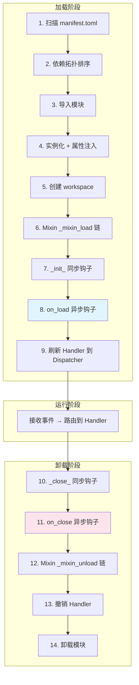

---

## 加载阶段

### 1. 扫描

`PluginIndexer` 递归扫描 `plugins/` 目录，查找所有包含 `manifest.toml` 的子目录：

```text
plugins/
├── hello_world/manifest.toml  ✅ 发现
├── my_plugin/manifest.toml    ✅ 发现
└── no_manifest/               ❌ 跳过
```

解析 `manifest.toml` 为 `PluginManifest` 对象，验证必填字段和入口文件是否存在。

### 2. 依赖拓扑排序

`DependencyResolver` 使用 **Kahn 算法**（拓扑排序）确定加载顺序：

- 根据 `manifest.toml` 中的 `[dependencies]` 构建有向依赖图
- 无依赖的插件先加载，被依赖的插件保证在依赖方之前加载
- **检测循环依赖**：如果存在 A → B → A 的环，会抛出 `PluginCircularDependencyError`
- **检测缺失依赖**：如果依赖的插件不存在，会抛出 `PluginMissingDependencyError`
- 使用 `packaging.specifiers` 验证版本约束

### 3. 导入模块

`ModuleImporter` 使用 `importlib` 动态导入插件入口模块：

- 插件根目录被添加到 `sys.path`（低优先级，不影响标准库和第三方包）
- 导入前自动清理 `__pycache__`，确保代码更新生效
- 使用 `ContextVar` 隔离当前加载插件的名称（用于装饰器注册 Handler 时标记归属）
- 如果 `__init__.py` 中含 `from .main import ...`，Python import system 会先于 `load_module()` 导入入口模块。框架会检测到入口模块已在 `sys.modules` 中，**直接复用而不重新执行**，避免装饰器注册出重复的 Handler

### 4. 实例化 + 属性注入

`PluginLoader._instantiate()` 创建插件实例并注入运行时属性：

```python
plugin.workspace = plugin_workspace_path
plugin.services = service_manager
plugin.api = bot_api_client
plugin._dispatcher = event_dispatcher
plugin._plugin_loader = self
plugin._manifest = manifest
plugin._debug = debug_flag
```

### 5-8. `__onload__()` 编排

框架调用 `plugin.__onload__()`，该方法按顺序执行：

```python
async def __onload__(self) -> None:
    self.workspace.mkdir(exist_ok=True, parents=True)  # 5. 创建工作目录
    await self._run_mixin_hooks("_mixin_load")          # 6. Mixin 加载钩子
    self._init_()                                        # 7. 同步预初始化
    await self.on_load()                                 # 8. 异步主初始化
```

### 9. 刷新 Handler

`on_load()` 中通过 `@registrar.on_*()` 装饰器注册的 Handler 会被暂存，`__onload__()` 完成后一次性刷新到 `HandlerDispatcher`。

---

## Mixin 钩子链

`NcatBotPlugin` 继承链中的每个 Mixin 都可以定义 `_mixin_load()` 和 `_mixin_unload()` 钩子。框架按 **MRO（方法解析顺序）** 自动发现并依次执行。

### 执行顺序

```text
NcatBotPlugin(BasePlugin, EventMixin, TimeTaskMixin, RBACMixin, ConfigMixin, DataMixin)
```

| 顺序 | Mixin | `_mixin_load()` 做什么 | `_mixin_unload()` 做什么 |
|------|-------|----------------------|------------------------|
| 1 | `EventMixin` | 初始化事件流列表 | 关闭所有活跃的 `EventStream` |
| 2 | `TimeTaskMixin` | 初始化任务名列表 | 清理所有定时任务 |
| 3 | `RBACMixin` | （无特殊操作） | （无特殊操作） |
| 4 | `ConfigMixin` | 从 `config.yaml` 加载配置 | 保存配置到 `config.yaml` |
| 5 | `DataMixin` | 从 `data.json` 加载数据 | 保存数据到 `data.json` |

### 独立容错

每个 Mixin 钩子在独立的 `try/except` 中执行——**单个 Mixin 失败不会阻止其他 Mixin 初始化**：

```python
async def _run_mixin_hooks(self, hook_name: str):
    for cls in type(self).__mro__:
        hook = cls.__dict__.get(hook_name)
        if hook is not None:
            try:
                result = hook(self)
                if asyncio.iscoroutine(result):
                    await result
            except Exception:
                LOG.exception("Mixin hook %s.%s 执行失败", cls.__name__, hook_name)
```

---

## 卸载阶段

### `__unload__()` 编排

```python
async def __unload__(self) -> None:
    self._close_()                                       # 10. 同步后清理
    await self.on_close()                                # 11. 异步清理
    await self._run_mixin_hooks("_mixin_unload")          # 12. Mixin 卸载钩子
```

### Handler 撤销

卸载后，`HandlerDispatcher.revoke_plugin(name)` 移除该插件注册的所有 Handler，确保不会再响应事件。

### 模块清理

`ModuleImporter.unload_module()` 从 `sys.modules` 中移除插件相关的模块条目，释放旧代码引用。

---

## 开发者钩子 API

作为插件开发者，你可以重写以下 4 个生命周期钩子：

| 钩子 | 类型 | 调用时机 | 典型用途 |
|------|------|---------|---------|
| `_init_(self)` | 同步 | Mixin 加载后、`on_load()` 之前 | 同步初始化（较少使用） |
| `on_load(self)` | 异步 | 主初始化 | **注册事件处理器、初始化数据、启动后台任务** |
| `on_close(self)` | 异步 | 卸载时 | 清理资源、保存状态 |
| `_close_(self)` | 同步 | `on_close()` 之前 | 同步清理（较少使用） |

**最常用的是 `on_load()` 和 `on_close()`**：

```python
class MyPlugin(NcatBotPlugin):
    name = "my_plugin"
    version = "1.0.0"

    async def on_load(self):
        if not self.get_config("prefix"):
            self.set_config("prefix", "/")
        self.data.setdefault("counter", 0)
        self.add_scheduled_task("heartbeat", "60s")
        LOG.info("MyPlugin 已加载")

    async def on_close(self):
        LOG.info("MyPlugin 已卸载，累计计数: %d", self.data.get("counter", 0))
```

> 完整示例：[examples/common/02_config_and_data/](../../../examples/common/02_config_and_data/) 展示了在 `on_load()` 中初始化配置和数据。

---

## 常见模式

### 在 on_load() 中注册事件处理器

所有 `@registrar.on_*()` 装饰的方法会在类定义时收集，在 `on_load()` 完成后自动刷新到分发器。通常不需要在 `on_load()` 中手动操作 Handler。

### 在 on_load() 中启动后台任务

如果需要持续运行的后台任务，在 `on_load()` 中使用 `asyncio.create_task()`，并在 `on_close()` 中取消：

```python
class MyPlugin(NcatBotPlugin):
    name = "my_plugin"
    version = "1.0.0"

    async def on_load(self):
        self._task = asyncio.create_task(self._background_worker())

    async def on_close(self):
        if hasattr(self, "_task"):
            self._task.cancel()

    async def _background_worker(self):
        try:
            async with self.events("message") as stream:
                async for event in stream:
                    LOG.info("收到消息: %s", event.data.raw_message)
        except asyncio.CancelledError:
            pass
```

> 完整示例：[examples/qq/02_event_handling/](../../../examples/qq/02_event_handling/) 的 `_stream_listener()` 方法。

---

## 下一步

- [事件注册与装饰器](4a.event-registration.md) — 深入三种事件消费模式
- [配置与数据 Mixin](5a.config-data.md) — 了解各 Mixin 钩子在生命周期中的作用
- [高级模式](7a.patterns.md) — 热重载如何利用完整的加载/卸载周期


---

# 文件: 3. 插件开发\4. 事件注册.md

---
title: 事件注册与装饰器
createTime: 2026/03/19 17:26:45
permalink: /guide/5kxxkqvy/
---

> 事件类型体系、装饰器路由模式、优先级机制与通知/请求事件处理。

---

## 目录

- [事件类型体系](#事件类型体系)
- [模式 A：装饰器注册（推荐）](#模式-a装饰器注册推荐)

---

## 事件类型体系

NcatBot 基于 OneBot v11 协议，将事件分为四大类：

| 大类 | 事件类型字符串 | 说明 |
|------|--------------|------|
| **message** | `message.group` / `message.private` | 群消息 / 私聊消息 |
| **notice** | `notice.group_increase` / `notice.group_decrease` / `notice.group_recall` / `notice.poke` 等 | 通知事件 |
| **request** | `request.friend` / `request.group` | 好友请求 / 群请求 |
| **meta** | `meta_event.lifecycle` / `meta_event.heartbeat` | 元事件 |

事件路由支持**前缀匹配**——注册 `"message"` 可以匹配所有消息类型（`message.group` 和 `message.private`）。

---

## 模式 A：装饰器注册（推荐）

最常用的方式——使用 `@registrar` 装饰器将方法注册为事件处理器，框架自动路由匹配的事件：

### 命令装饰器

```python
from ncatbot.core import registrar
from ncatbot.event.qq import GroupMessageEvent, PrivateMessageEvent

class MyPlugin(NcatBotPlugin):
    name = "my_plugin"
    version = "1.0.0"

    @registrar.on_group_command("hello", ignore_case=True)
    async def on_hello(self, event: GroupMessageEvent):
        """群里发 'hello' 时触发"""
        await self.api.qq.post_group_msg(event.group_id, text="Hello, World! 👋")

    @registrar.on_group_command("hi", ignore_case=True)
    async def on_hi(self, event: GroupMessageEvent):
        """event.reply() 自动引用 + @发送者"""
        await event.reply(text="你好呀！🎉")

    @registrar.on_private_command("hello", ignore_case=True)
    async def on_private_hello(self, event: PrivateMessageEvent):
        """私聊命令"""
        await event.reply(text="你好！👋")
```

> 取自 [examples/qq/01_hello_world/main.py](../../../examples/qq/01_hello_world/main.py)

### 参数绑定

`on_group_command` / `on_private_command` 内置了 `CommandHook`，自动从消息中提取参数并绑定到处理器函数的参数：

```python
from ncatbot.types import At

@registrar.on_group_command("禁言")
async def on_ban(
    self, event: GroupMessageEvent, target: At = None, duration: int = 60
):
    """'禁言 @xxx 60' → target=At(user_id=xxx), duration=60"""
    if target is None:
        await event.reply("请 @一个用户，例如: 禁言 @xxx 60")
        return
    await self.api.qq.manage.set_group_ban(event.group_id, target.user_id, duration)
    await event.reply(f"已禁言 {duration} 秒")

@registrar.on_group_command("设置前缀")
async def on_set_prefix(self, event: GroupMessageEvent, new_prefix: str):
    """'设置前缀 !' → new_prefix='!'"""
    self.set_config("prefix", new_prefix)
    await event.reply(f"命令前缀已更新为: {new_prefix}")
```

> 取自 [examples/qq/04_bot_api/main.py](../../../examples/qq/04_bot_api/main.py) 和 [examples/common/02_config_and_data/main.py](../../../examples/common/02_config_and_data/main.py)

支持的参数类型：

| 类型 | 说明 | 示例 |
|------|------|------|
| `str` | 命令后的文本 | `"回声 你好"` → `content="你好"` |
| `int` | 自动转为整数 | `"禁言 @xxx 60"` → `duration=60` |
| `At` | 消息中的 @段 | `"踢 @xxx"` → `target=At(user_id=xxx)` |

### 便捷装饰器一览

| 装饰器 | 事件类型 | 自动添加的 Hook |
|--------|---------|----------------|
| `on_group_command(*names)` | `message` | `MessageTypeFilter("group")` + `CommandHook` |
| `on_private_command(*names)` | `message` | `MessageTypeFilter("private")` + `CommandHook` |
| `on_command(*names)` | `message` | `CommandHook`（群/私聊均可） |
| `on_group_message()` | `message` | `MessageTypeFilter("group")` |
| `on_private_message()` | `message` | `MessageTypeFilter("private")` |
| `on_message()` | `message` | （无额外过滤） |
| `on_message_sent()` | `message_sent` | （无额外过滤） |
| `on_notice()` | `notice` | （无额外过滤） |
| `on_request()` | `request` | （无额外过滤） |
| `on_meta()` | `meta_event` | （无额外过滤） |
| `on_group_increase()` | `notice` | `NoticeTypeFilter("group_increase")` |
| `on_group_decrease()` | `notice` | `NoticeTypeFilter("group_decrease")` |
| `on_poke()` | `notice` | `NoticeTypeFilter("notify")` + `SubTypeFilter("poke")` |
| `on_friend_request()` | `request` | `RequestTypeFilter("friend")` |
| `on_group_request()` | `request` | `RequestTypeFilter("group")` |
| `on(event_type)` | 自定义 | 精确/前缀匹配 |

所有装饰器均支持 `platform` 参数，用于限定只接收特定平台的事件：

```python
# 仅处理 QQ 平台的群消息
@registrar.on_group_message(platform="qq")
async def qq_only(self, event: GroupMessageEvent):
    await event.reply(text="QQ 平台的消息")

# 处理所有平台的消息（默认）
@registrar.on_message()
async def all_platforms(self, event):
    print(f"来自 {event.platform} 的消息")
```

> 详见 [多平台开发指南](../multi_platform/)

### Handler 优先级

通过 `priority` 参数控制同事件多个 Handler 的执行优先级——**数值越大，优先级越高**：

```python
@registrar.on_group_message(priority=100)
async def count_message(self, event: GroupMessageEvent):
    """高优先级：每条群消息都计数"""
    self.data["total_messages"] += 1

@registrar.on_group_command("ping", priority=10)
async def on_ping(self, event: GroupMessageEvent):
    """标准优先级"""
    await event.reply("pong 🏓")

@registrar.on_group_command("状态", priority=0)
async def on_status(self, event: GroupMessageEvent):
    """低优先级"""
    await event.reply("运行中 ✅")
```

> 取自 [examples/qq/02_event_handling/main.py](../../../examples/qq/02_event_handling/main.py) 和 [examples/common/02_config_and_data/main.py](../../../examples/common/02_config_and_data/main.py)

### 通知与请求事件

```python
from ncatbot.event.qq import (
    GroupIncreaseEvent, NoticeEvent,
    FriendRequestEvent, GroupRequestEvent,
)

@registrar.qq.on_group_increase()
async def on_member_join(self, event: GroupIncreaseEvent):
    """新成员入群 → 发送欢迎消息"""
    msg = MessageArray()
    msg.add_at(event.user_id)
    msg.add_text(" 欢迎加入本群！📜")
    await self.api.qq.post_group_array_msg(event.group_id, msg)

@registrar.qq.on_poke()
async def on_poke(self, event: NoticeEvent):
    """戳一戳 → 回戳"""
    target_id = getattr(event.data, "target_id", None)
    if str(target_id) == str(event.self_id):
        await self.api.qq.send_poke(event.group_id, event.user_id)

@registrar.qq.on_friend_request()
async def on_friend_request(self, event: FriendRequestEvent):
    """好友请求 → 自动通过"""
    await event.approve()

@registrar.qq.on_group_recall()
async def on_recall(self, event: NoticeEvent):
    """消息撤回"""
    operator_id = getattr(event.data, "operator_id", None)
    await self.api.qq.post_group_msg(
        event.group_id,
        text=f"有人撤回了一条消息 👀 (操作者: {operator_id})"
    )
```

> 取自 [examples/qq/05_notice_and_request/main.py](../../../examples/qq/05_notice_and_request/main.py)

---

## 下一步

- [事件高级用法](4b.event-advanced.md) — 事件流、wait_event、事件实体
- [Hook 基础](6.hooks.md) — 深入了解过滤器和中间件


---

# 文件: 3. 插件开发\5. 事件高级.md

---
title: 事件高级用法
createTime: 2026/03/19 17:26:45
permalink: /guide/fzk8vub0/
---

> 事件流消费、一次性等待、三种模式对比、事件实体详解与实战组合。

---

## 目录

- [模式 B：事件流消费](#模式-b事件流消费)
- [模式 C：一次性等待](#模式-c一次性等待)
- [三种模式对比](#三种模式对比)
- [事件实体](#事件实体)
- [实战组合](#实战组合)
- [复杂工作流模式](#复杂工作流模式)

---

## 模式 B：事件流消费

使用 `EventMixin` 的 `events()` 方法创建持续的事件流，适合后台监控场景：

```python
import asyncio

class MyPlugin(NcatBotPlugin):
    name = "my_plugin"
    version = "1.0.0"

    async def on_load(self):
        self._stream_task = asyncio.create_task(self._stream_listener())

    async def on_close(self):
        if hasattr(self, "_stream_task"):
            self._stream_task.cancel()

    async def _stream_listener(self):
        """后台事件流：监听所有私聊消息"""
        try:
            async with self.events("message") as stream:
                async for event in stream:
                    if (
                        getattr(event.data, "message_type", None)
                        and event.data.message_type.value == "private"
                    ):
                        LOG.info(
                            "[事件流] 私聊消息: %s (来自 %s)",
                            event.data.raw_message,
                            event.data.user_id,
                        )
        except asyncio.CancelledError:
            pass
```

> 取自 [examples/qq/02_event_handling/main.py](../../../examples/qq/02_event_handling/main.py) 的模式 B

### 关键点

- `self.events(event_type)` — `event_type` 可选，传入则按前缀过滤
- 返回 `EventStream`：支持 `async with` + `async for`
- **必须在后台任务中运行**（`asyncio.create_task`），否则会阻塞 `on_load()`
- 卸载时自动关闭（`EventMixin._mixin_unload()` 清理所有活跃流）

---

## 模式 C：一次性等待

使用 `EventMixin` 的 `wait_event()` 等待满足条件的下一个事件，适合交互确认和多步对话：

```python
@registrar.on_group_command("确认测试")
async def on_confirm_test(self, event: GroupMessageEvent):
    """等待用户在 15 秒内回复「确认」"""
    await event.reply("请在 15 秒内回复「确认」来完成操作...")

    try:
        await self.wait_event(
            predicate=lambda e: (
                hasattr(e.data, "user_id")
                and str(e.data.user_id) == str(event.user_id)
                and hasattr(e.data, "raw_message")
                and e.data.raw_message.strip() == "确认"
            ),
            timeout=15.0,
        )
        await self.api.qq.post_group_msg(event.group_id, text="操作已确认 ✅")
    except asyncio.TimeoutError:
        await self.api.qq.post_group_msg(event.group_id, text="操作超时已取消 ⏰")
```

> 取自 [examples/qq/02_event_handling/main.py](../../../examples/qq/02_event_handling/main.py) 的模式 C

### wait_event() 签名

```python
async def wait_event(
    predicate: Optional[Callable[[Event], bool]] = None,
    timeout: Optional[float] = None,
) -> Event
```

| 参数 | 说明 |
|------|------|
| `predicate` | 过滤函数，返回 `True` 时匹配 |
| `timeout` | 超时秒数，超时抛出 `asyncio.TimeoutError` |

### 封装辅助方法

实际开发中建议使用 Predicate 语法糖（见下文）或封装 `_wait_user_reply()` 减少重复代码：

```python
async def _wait_user_reply(self, group_id, user_id):
    """等待指定用户在指定群的下一条消息"""
    event = await self.wait_event(
        predicate=lambda e: (
            hasattr(e.data, "user_id")
            and str(e.data.user_id) == str(user_id)
            and hasattr(e.data, "group_id")
            and str(e.data.group_id) == str(group_id)
            and hasattr(e.data, "raw_message")
        ),
        timeout=30,
    )
    return event.data.raw_message.strip()
```

> 取自 [examples/common/06_multi_step_dialog/main.py](../../../examples/common/06_multi_step_dialog/main.py)

### Predicate 语法糖

`ncatbot.core` 模块提供了一套声明式的 Predicate DSL，可以用运算符组合替代冗长的 lambda。

#### 运算符

| 运算符 | 含义 | 示例 |
|--------|------|------|
| `*` 或 `&` | AND（全部满足） | `from_event(event) * msg_equals("确认")` |
| `+` 或 `\|` | OR（任一满足） | `msg_equals("是") + msg_equals("yes")` |
| `~` | NOT（取反） | `~same_user(bot_id)` |

#### 核心函数：`from_event`

从触发事件 **自动推导同 session 条件**（同用户 + 群消息同群 / 私聊同私聊），是最常用的语法糖：

```python
from ncatbot.core import from_event, msg_equals

# 等待同 session 用户的下一条消息
evt = await self.wait_event(predicate=from_event(event), timeout=30)

# 同 session + 精确匹配
evt = await self.wait_event(
    predicate=from_event(event) * msg_equals("确认"),
    timeout=15,
)
```

推导规则：

| 触发事件类型 | 生成的 predicate |
|------------|-----------------|
| 群消息 | `same_user(uid) * same_group(gid) * is_group()` |
| 私聊消息 | `same_user(uid) * is_private()` |
| 其他 | `same_user(uid) * is_message()` |

#### 全部工厂函数

| 函数 | 说明 |
|------|------|
| `from_event(event)` | 从触发事件推导同 session 谓词 |
| `same_user(uid)` | 匹配 user_id |
| `same_group(gid)` | 匹配 group_id |
| `is_private()` | 事件为私聊消息 |
| `is_group()` | 事件为群消息 |
| `is_message()` | 事件为消息类型 |
| `has_keyword(*words)` | raw_message 含任一关键词 |
| `msg_equals(text)` | raw_message.strip() 完全匹配 |
| `msg_in(*options)` | raw_message.strip() 匹配选项之一 |
| `msg_matches(pattern)` | raw_message 正则匹配 |
| `event_type(prefix)` | event.type 前缀匹配 |
| `P.of(lambda)` | 将普通 callable 升级为可组合的 P |

#### 组合示例

```python
from ncatbot.core import from_event, msg_equals, msg_in, has_keyword, same_user, P

# 等"确认"或"取消"
pred = from_event(event) * (msg_equals("确认") + msg_equals("取消"))

# 等价简写
pred = from_event(event) * msg_in("确认", "取消")

# 含关键词
pred = from_event(event) * has_keyword("帮助", "help")

# 排除某用户
pred = from_event(event) * ~same_user(bot_id)

# 混用 lambda
pred = from_event(event) * P.of(lambda e: int(e.data.raw_message) > 0)
```

---

## 三种模式对比

| 维度 | 模式 A：装饰器 | 模式 B：事件流 | 模式 C：wait_event |
|------|--------------|--------------|-------------------|
| **适用场景** | 命令响应、通知处理 | 后台监控、日志记录 | 交互确认、多步对话 |
| **代码风格** | 声明式（装饰器） | 响应式（async for） | 命令式（await） |
| **并发模型** | 框架自动路由 | 需手动 create_task | Handler 内顺序执行 |
| **生命周期** | 随插件自动管理 | 需手动启动/取消 | 单次调用 |
| **优先级** | ✅ 支持 priority | ❌ 无优先级概念 | ❌ 无优先级概念 |
| **参数绑定** | ✅ CommandHook 自动 | ❌ 需手动解析 | ❌ 需手动解析 |
| **代表示例** | 01_hello_world | 02_event_handling | 10_multi_step_dialog |

**建议**：优先使用模式 A（装饰器），需要多步交互时用模式 C（wait_event），后台监控用模式 B（事件流）。

---

## 事件实体

事件实体是对原始事件数据的包装，提供便捷的属性访问和操作方法。

### BaseEvent

所有事件实体的基类，通过 `__getattr__` 代理底层数据字段——你可以直接访问 `event.user_id`、`event.group_id` 等字段。

### MessageEvent

消息事件基类，新增便捷方法：

| 方法/属性 | 说明 |
|----------|------|
| `event.message` | `MessageArray` 实例——消息段数组 |
| `event.raw_message` | 原始消息文本 |
| `event.user_id` | 发送者 QQ 号 |
| `event.message_id` | 消息 ID |
| `event.sender` | 发送者信息 |
| `await event.reply(text=, image=, ...)` | 便捷回复（自动引用 + @发送者） |
| `await event.delete()` | 撤回该消息 |

### GroupMessageEvent

继承 `MessageEvent`，增加群相关操作：

| 方法/属性 | 说明 |
|----------|------|
| `event.group_id` | 群号 |
| `await event.kick()` | 踢出发送者 |
| `await event.ban(duration=60)` | 禁言发送者 |

### 其他事件实体

| 类 | 用于 |
|----|------|
| `PrivateMessageEvent` | 私聊消息 |
| `GroupIncreaseEvent` | 群成员增加 |
| `NoticeEvent` | 通用通知事件 |
| `FriendRequestEvent` | 好友请求（有 `approve()` 方法） |
| `GroupRequestEvent` | 群请求 |

### 消息内容处理

消息内容通过 `event.message`（`MessageArray` 实例）访问，可用于提取特定类型的消息段：

```python
from ncatbot.types import Reply, Image

# 提取回复段
replies = event.message.filter(Reply)
if replies:
    quoted_msg_id = replies[0].id

# 提取图片段
images = event.message.filter(Image)

# 获取纯文本内容
text = event.message.text
```

> 消息段的完整 API 参见 [消息类型详解](../send_message/)。

---

## 实战组合

### 装饰器 + wait_event：问答机器人

结合模式 A（命令触发）和模式 C（多步输入），实现一个问答添加流程：

```python
@registrar.on_group_command("注册")
async def on_register(self, event: GroupMessageEvent):
    """多步注册流程"""
    gid, uid = event.group_id, event.user_id

    await event.reply("📝 请输入你的名字（30秒内回复，输入「取消」退出）：")

    try:
        name = await self._wait_user_reply(gid, uid)
    except asyncio.TimeoutError:
        await self.api.qq.post_group_msg(gid, text="⏰ 注册超时，已取消")
        return

    if name == "取消":
        await self.api.qq.post_group_msg(gid, text="❌ 注册已取消")
        return

    await self.api.qq.post_group_msg(gid, text=f"好的，{name}！请输入你的年龄：")

    try:
        age_str = await self._wait_user_reply(gid, uid)
    except asyncio.TimeoutError:
        await self.api.qq.post_group_msg(gid, text="⏰ 注册超时，已取消")
        return

    if not age_str.isdigit():
        await self.api.qq.post_group_msg(gid, text="❌ 年龄必须是数字，注册已取消")
        return

    # 保存数据
    self.data.setdefault("users", {})[str(uid)] = {
        "name": name, "age": int(age_str)
    }
    await self.api.qq.post_group_msg(gid, text=f"✅ 注册成功！欢迎你，{name}")
```

> 取自 [examples/common/06_multi_step_dialog/main.py](../../../examples/common/06_multi_step_dialog/main.py)

### 装饰器 + 高优先级：消息统计

用高优先级的通用 Handler 统计消息，不影响命令匹配：

```python
@registrar.on_group_message(priority=200)
async def on_count(self, event: GroupMessageEvent):
    """高优先级：每条群消息都统计"""
    gid = str(event.group_id)
    if gid not in self.data.get("enabled_groups", []):
        return
    self.data["daily_stats"]["total"] += 1
```

> 取自 [examples/qq/08_scheduled_reporter/main.py](../../../examples/qq/08_scheduled_reporter/main.py)

---

## 复杂工作流模式

当需求超越线性多步对话——需要并发等待、分支路由、或脱离插件体系直接编排事件流——可以组合 `wait_event()`、`events()` 和 `run_async()` 构建更复杂的工作流。

### 非阻塞启动 + 事件驱动主循环

在非插件模式下，使用 `run_async()` 启动 Bot 后，直接通过 `bot.dispatcher` 消费事件：

```python
import asyncio
from ncatbot.app import BotClient
from ncatbot.core import same_group, has_keyword

bot = BotClient()

async def keyword_monitor():
    """后台监控：检测到关键词时自动提醒"""
    async with bot.dispatcher.events("message.group") as stream:
        async for event in stream:
            if "紧急" in event.data.raw_message:
                await bot.api.qq.post_group_msg(
                    event.data.group_id,
                    text=f"⚠️ 检测到紧急消息 (来自 {event.data.user_id})",
                )

async def main():
    await bot.run_async()  # Bot 就绪，后台监听

    # 启动后台监控任务
    monitor_task = asyncio.create_task(keyword_monitor())

    try:
        await asyncio.Event().wait()
    except asyncio.CancelledError:
        pass
    finally:
        monitor_task.cancel()
        await bot.shutdown()

if __name__ == "__main__":
    asyncio.run(main())
```

### 并发 wait_event

使用 `asyncio.gather` 同时等待多个条件，**先到先得**：

```python
@registrar.on_group_command("投票")
async def on_vote(self, event: GroupMessageEvent):
    gid = event.group_id
    await event.reply("投票开始！请回复「赞成」或「反对」（30秒）")

    votes = {"赞成": 0, "反对": 0}

    async def collect_one():
        """收集一票"""
        return await self.wait_event(
            predicate=same_group(gid) * msg_in("赞成", "反对"),
            timeout=30.0,
        )

    # 并发收集最多 5 票
    tasks = [asyncio.create_task(collect_one()) for _ in range(5)]
    done, pending = await asyncio.wait(tasks, timeout=30.0)

    for task in pending:
        task.cancel()
    for task in done:
        try:
            evt = task.result()
            text = evt.data.raw_message.strip()
            if text in votes:
                votes[text] += 1
        except (asyncio.TimeoutError, asyncio.CancelledError):
            pass

    await self.api.qq.post_group_msg(
        gid, text=f"投票结果：赞成 {votes['赞成']}，反对 {votes['反对']}"
    )
```

### 分支工作流

使用 `wait_event` + `msg_in` 做路由分支，实现菜单式交互：

```python
from ncatbot.core import from_event, msg_in

@registrar.on_group_command("服务")
async def on_service(self, event: GroupMessageEvent):
    await event.reply("请选择服务：\n1. 查询余额\n2. 充值\n3. 帮助")

    try:
        choice_evt = await self.wait_event(
            predicate=from_event(event) * msg_in("1", "2", "3"),
            timeout=30.0,
        )
    except asyncio.TimeoutError:
        await event.reply("超时，已退出")
        return

    choice = choice_evt.data.raw_message.strip()
    if choice == "1":
        await self._handle_balance(event)
    elif choice == "2":
        await self._handle_recharge(event)  # 可继续嵌套 wait_event
    else:
        await event.reply("帮助文档：...")
```

### 要点总结

| 模式 | 适用场景 | 关键 API |
|------|---------|---------|
| 非阻塞主循环 | 脱离插件、自定义编排 | `run_async()` + `bot.dispatcher` |
| 并发等待 | 收集多人输入、竞争条件 | `asyncio.wait()` + 多个 `wait_event` |
| 分支路由 | 菜单式交互、状态机 | `msg_in()` + 条件分支 |

> 更完整的编排模式（生命周期事件等待、并发任务协调、清理策略）参见 [事件驱动工作流编排](7a.patterns.md#事件驱动工作流编排)。

---

## 下一步

- [Predicate DSL](4c.predicate-dsl.md) — 所有工厂函数和组合运算符的完整参考
- [配置与数据 Mixin](5a.config-data.md) — 配置、数据持久化
- [Hook 基础](6.hooks.md) — 深入了解过滤器和中间件的工作原理
- [消息类型详解](../send_message/) — 消息段构造、MessageArray、合并转发
- [高级模式](7a.patterns.md) — 多步对话设计模式深入讲解


---

# 文件: 3. 插件开发\6. 谓词 DSL.md

---
title: Predicate DSL
createTime: 2026/03/19 17:26:45
permalink: /guide/0io6ypv8/
---

> 声明式事件过滤——用运算符组合替代冗长的 lambda，让 `wait_event()` 和事件流过滤更简洁。

---

## 目录

- [快速示例](#快速示例)
- [P 基类](#p-基类)
- [组合运算符](#组合运算符)
- [工厂函数](#工厂函数)
- [from_event 自动推导](#from_event-自动推导)
- [实战模式](#实战模式)

---

## 快速示例

```python
from ncatbot.core import from_event, msg_equals, msg_in

# 传统写法——冗长的 lambda
await self.wait_event(
    predicate=lambda e: (
        hasattr(e.data, "user_id")
        and str(e.data.user_id) == str(event.user_id)
        and hasattr(e.data, "group_id")
        and str(e.data.group_id) == str(event.group_id)
        and hasattr(e.data, "raw_message")
        and e.data.raw_message.strip() == "确认"
    ),
    timeout=15,
)

# Predicate DSL——一行搞定
await self.wait_event(predicate=from_event(event) * msg_equals("确认"), timeout=15)
```

---

## P 基类

所有 Predicate 都继承自抽象基类 `P`。`P` 实例是一个可调用对象，接收 `Event` 返回 `bool`：

```python
from ncatbot.core.dispatcher.predicate import P

class MyPredicate(P):
    def __call__(self, event) -> bool:
        return event.data.raw_message == "hello"
```

### P.of — 将 callable 升级

如果你已经有一个普通函数或 lambda，可以用 `P.of()` 将它升级为支持运算符组合的 `P` 实例：

```python
from ncatbot.core import P, from_event

# lambda 不支持 * + ~ 运算符，但 P.of() 可以
is_positive = P.of(lambda e: int(e.data.raw_message) > 0)

# 现在可以组合了
pred = from_event(event) * is_positive
await self.wait_event(predicate=pred, timeout=30)
```

---

## 组合运算符

`P` 支持三种运算符，返回新的 `P` 实例：

| 运算符 | 含义 | 返回类型 | 示例 |
|--------|------|---------|------|
| `*` 或 `&` | AND（全部满足） | `AndP` | `p1 * p2` |
| `+` 或 `\|` | OR（任一满足） | `OrP` | `p1 + p2` |
| `~` | NOT（取反） | `NotP` | `~p` |

### 组合示例

```python
from ncatbot.core import same_user, same_group, is_group, msg_equals, msg_in

# AND：所有条件都要满足
pred = same_user(uid) * same_group(gid) * is_group() * msg_equals("确认")

# OR：满足任一即可
pred = msg_equals("是") + msg_equals("yes") + msg_equals("y")

# 简写等价
pred = msg_in("是", "yes", "y")

# NOT：排除特定条件
pred = same_group(gid) * ~same_user(bot_id)

# 混合组合
pred = from_event(event) * (msg_equals("确认") + msg_equals("取消"))
```

---

## 工厂函数

`ncatbot.core` 导出以下工厂函数，每个返回一个 `P` 实例：

| 函数 | 签名 | 说明 |
|------|------|------|
| `from_event(event)` | `(event: object) -> P` | 从触发事件自动推导同 session 谓词 |
| `same_user(uid)` | `(user_id: Union[str, int]) -> P` | 匹配 `event.data.user_id` |
| `same_group(gid)` | `(group_id: Union[str, int]) -> P` | 匹配 `event.data.group_id` |
| `is_private()` | `() -> P` | 事件为私聊消息 |
| `is_group()` | `() -> P` | 事件为群消息 |
| `is_message()` | `() -> P` | 事件为消息类型（群/私聊均可） |
| `event_type(prefix)` | `(prefix: str) -> P` | `event.type` 前缀匹配 |
| `has_keyword(*words)` | `(*words: str) -> P` | `raw_message` 包含任一关键词 |
| `msg_equals(text)` | `(text: str) -> P` | `raw_message.strip()` 完全等于 `text` |
| `msg_in(*options)` | `(*options: str) -> P` | `raw_message.strip()` 等于选项之一 |
| `msg_matches(pattern)` | `(pattern: str) -> P` | `raw_message` 正则匹配（`re.search`） |
| `P.of(fn)` | `(fn: Callable[[Event], bool]) -> P` | 将普通 callable 升级为可组合的 `P` |

### 导入

```python
# 推荐：从 ncatbot.core 导入
from ncatbot.core import (
    P, from_event, same_user, same_group,
    is_private, is_group, is_message,
    has_keyword, msg_equals, msg_in, msg_matches, event_type,
)
```

---

## from_event 自动推导

`from_event()` 是最常用的工厂函数。它从触发事件中提取 `user_id`、`group_id`、`message_type`，自动组合出 "同 session" 谓词：

| 触发事件类型 | 生成的 predicate |
|------------|-----------------|
| 群消息 | `same_user(uid) * same_group(gid) * is_group()` |
| 私聊消息 | `same_user(uid) * is_private()` |
| 其他（带 user_id） | `same_user(uid) * is_message()` |

```python
# 不需要手动写同 session 判断
pred = from_event(event)                           # 同用户 + 同场景
pred = from_event(event) * msg_equals("确认")       # + 精确匹配
pred = from_event(event) * msg_in("是", "否")       # + 选择匹配
pred = from_event(event) * has_keyword("帮助")      # + 关键词匹配
```

---

## 实战模式

### 多步对话确认

```python
@registrar.on_group_command("删除")
async def on_delete(self, event: GroupMessageEvent):
    await event.reply("确定要删除吗？请回复「确认」或「取消」")
    try:
        reply = await self.wait_event(
            predicate=from_event(event) * msg_in("确认", "取消"),
            timeout=15,
        )
        if reply.data.raw_message.strip() == "确认":
            await event.reply("已删除 ✅")
        else:
            await event.reply("已取消 ❌")
    except asyncio.TimeoutError:
        await event.reply("操作超时 ⏰")
```

### 自由文本收集

```python
@registrar.on_group_command("反馈")
async def on_feedback(self, event: GroupMessageEvent):
    await event.reply("请输入你的反馈内容：")
    try:
        reply = await self.wait_event(
            predicate=from_event(event),
            timeout=60,
        )
        feedback = reply.data.raw_message.strip()
        self.data.setdefault("feedbacks", []).append(feedback)
        await event.reply(f"收到反馈：{feedback}")
    except asyncio.TimeoutError:
        await event.reply("反馈超时 ⏰")
```

### 数值输入校验

```python
@registrar.on_group_command("设置数量")
async def on_set_count(self, event: GroupMessageEvent):
    await event.reply("请输入一个正整数：")
    try:
        reply = await self.wait_event(
            predicate=from_event(event) * P.of(
                lambda e: e.data.raw_message.strip().isdigit()
                and int(e.data.raw_message.strip()) > 0
            ),
            timeout=30,
        )
        count = int(reply.data.raw_message.strip())
        self.set_config("count", count)
        await event.reply(f"已设置为 {count}")
    except asyncio.TimeoutError:
        await event.reply("输入超时 ⏰")
```

### 排除 Bot 自身消息

```python
# 在事件流中排除 Bot 自身的消息
async def _monitor(self):
    async with self.events("message") as stream:
        async for event in stream:
            pred = is_group() * ~same_user(event.self_id)
            if pred(event):
                LOG.info("群消息: %s", event.data.raw_message)
```

---

## 下一步

- [事件注册与装饰器](4a.event-registration.md) — 装饰器注册模式
- [事件高级用法](4b.event-advanced.md) — 事件流、三种模式对比
- [Hook 基础](6.hooks.md) — 中间件式过滤


---

# 文件: 3. 插件开发\7. 配置与数据.md

---
title: 配置与数据 Mixin
createTime: 2026/03/19 17:26:45
permalink: /guide/admk508g/
---

> ConfigMixin 提供 YAML 配置持久化，DataMixin 提供 JSON 数据持久化——让插件零配置拥有持久化能力。

---

## 目录

- [设计理念](#设计理念)
- [ConfigMixin — 配置持久化](#configmixin--配置持久化)
- [DataMixin — 数据持久化](#datamixin--数据持久化)
- [ConfigMixin vs DataMixin](#configmixin-vs-datamixin)

---

## 设计理念

`NcatBotPlugin` 通过多继承组合 5 个 Mixin，每个 Mixin 提供一类独立能力：

```python
class NcatBotPlugin(BasePlugin, EventMixin, TimeTaskMixin, RBACMixin, ConfigMixin, DataMixin):
    pass
```

- 每个 Mixin 通过 `_mixin_load()` / `_mixin_unload()` 参与 [加载流程](3.lifecycle.md#mixin-钩子链)
- 各 Mixin 之间互不依赖，可独立使用
- 你不需要手动初始化任何 Mixin——继承 `NcatBotPlugin` 即可自动获得全部能力

---

## ConfigMixin — 配置持久化

`ConfigMixin` 提供 YAML 格式的配置持久化，配置文件保存在 `workspace/config.yaml`。

### 基本用法

```python
class MyPlugin(NcatBotPlugin):
    name = "my_plugin"
    version = "1.0.0"

    async def on_load(self):
        # 设置默认配置（已有的不会覆盖）
        if not self.get_config("prefix"):
            self.set_config("prefix", "/")
        if not self.get_config("welcome_msg"):
            self.set_config("welcome_msg", "欢迎使用！")
        if not self.get_config("enabled"):
            self.set_config("enabled", True)

    @registrar.on_group_command("设置前缀")
    async def on_set_prefix(self, event: GroupMessageEvent, new_prefix: str):
        """修改配置 — CommandHook 自动提取参数"""
        self.set_config("prefix", new_prefix)
        await event.reply(f"命令前缀已更新为: {new_prefix}")

    @registrar.on_group_command("查看配置")
    async def on_view_config(self, event: GroupMessageEvent):
        """遍历当前配置"""
        lines = ["📋 当前配置:"]
        for key, value in self.config.items():
            lines.append(f"  {key}: {value}")
        await event.reply("\n".join(lines))
```

> 取自 [examples/common/02_config_and_data/main.py](../../../examples/common/02_config_and_data/main.py)

### API

| 方法 | 说明 |
|------|------|
| `get_config(key, default=None)` | 读取配置值 |
| `set_config(key, value)` | 设置配置值（立即保存到文件） |
| `update_config(updates: dict)` | 批量更新配置 |
| `remove_config(key) -> bool` | 删除配置项 |
| `self.config` | 配置字典（`Dict[str, Any]`） |

### 配置文件位置

```text
workspace/
└── my_plugin/
    └── config.yaml    ← ConfigMixin 管理的文件
```

### 全局配置覆盖

在项目的 `config.yaml` 中，可以通过 `plugin.plugin_configs` 为插件预设配置：

```yaml
plugin:
  plugin_configs:
    my_plugin:
      prefix: "!"
      enabled: false
```

`ConfigMixin` 在 `_mixin_load()` 时会自动合并全局覆盖配置。

---

## DataMixin — 数据持久化

`DataMixin` 提供 JSON 格式的通用数据持久化，数据保存在 `workspace/data.json`。

### 基本用法

```python
class MyPlugin(NcatBotPlugin):
    name = "my_plugin"
    version = "1.0.0"

    async def on_load(self):
        # self.data 在 _mixin_load 时已从 data.json 恢复
        self.data.setdefault("total_messages", 0)
        self.data.setdefault("user_counts", {})
        LOG.info("累计消息: %d", self.data["total_messages"])

    @registrar.on_group_message(priority=100)
    async def count_message(self, event: GroupMessageEvent):
        """每条群消息都计数"""
        self.data["total_messages"] += 1
        uid = str(event.user_id)
        counts = self.data.setdefault("user_counts", {})
        counts[uid] = counts.get(uid, 0) + 1

    @registrar.on_group_command("统计")
    async def on_stats(self, event: GroupMessageEvent):
        total = self.data.get("total_messages", 0)
        user_counts = self.data.get("user_counts", {})
        top_users = sorted(user_counts.items(), key=lambda x: x[1], reverse=True)[:5]

        lines = ["📊 消息统计:", f"  总消息数: {total}"]
        if top_users:
            lines.append("  活跃用户 Top 5:")
            for uid, count in top_users:
                lines.append(f"    {uid}: {count} 条")
        await event.reply("\n".join(lines))

    @registrar.on_group_command("重置统计")
    async def on_reset_stats(self, event: GroupMessageEvent):
        self.data["total_messages"] = 0
        self.data["user_counts"] = {}
        await event.reply("统计数据已重置 🗑️")
```

> 取自 [examples/common/02_config_and_data/main.py](../../../examples/common/02_config_and_data/main.py)

### API

| 方法/属性 | 说明 |
|----------|------|
| `self.data` | 数据字典（`Dict[str, Any]`），直接读写 |

### 自动持久化

- **加载**：`_mixin_load()` 自动从 `data.json` 加载
- **卸载**：`_mixin_unload()` 自动保存到 `data.json`
- **手动保存**：修改 `self.data` 后，数据会在插件卸载时自动保存；如果需要立即保存可调用 `self._save_data()`

---

## ConfigMixin vs DataMixin

| 维度 | ConfigMixin | DataMixin |
|------|------------|-----------|
| 文件格式 | YAML | JSON |
| 典型用途 | 用户可配置的选项 | 运行时数据、统计、状态 |
| 保存时机 | `set_config()` 立即保存 | 卸载时自动保存 |
| 外部可编辑 | ✅ 是（YAML 可读性好） | ⚠️ 可以但不推荐 |

---

## 下一步

- [权限、定时任务与事件 Mixin](5b.rbac-schedule-event.md) — RBACMixin、TimeTaskMixin、EventMixin
- [Hook 基础](6.hooks.md) — 了解过滤器和中间件原理


---

# 文件: 3. 插件开发\8. RBAC 定时任务与事件.md

---
title: 权限、定时任务与事件 Mixin
createTime: 2026/03/19 17:26:45
permalink: /guide/sbal250z/
---

> RBACMixin 提供基于角色的权限管理，TimeTaskMixin 提供定时任务调度，EventMixin 提供直接事件流操作。

---

## 目录

- [RBACMixin — 权限管理](#rbacmixin--权限管理)
- [TimeTaskMixin — 定时任务](#timetaskmixin--定时任务)
- [EventMixin — 事件流](#eventmixin--事件流)
- [API 速查表](#api-速查表)

---

## RBACMixin — 权限管理

`RBACMixin` 提供基于角色的访问控制（RBAC），底层使用 `RBACService` 管理权限数据。

### 基本用法

```python
class MyPlugin(NcatBotPlugin):
    name = "rbac_demo"
    version = "1.0.0"

    async def on_load(self):
        # 注册权限路径
        self.add_permission("rbac.admin")
        self.add_permission("rbac.user")

        # 创建角色
        self.add_role("rbac_admin", exist_ok=True)
        self.add_role("rbac_user", exist_ok=True)

        # 给角色分配权限（通过底层 RBAC 服务）
        if self.rbac:
            self.rbac.grant("role", "rbac_admin", "rbac.admin")
            self.rbac.grant("role", "rbac_admin", "rbac.user")
            self.rbac.grant("role", "rbac_user", "rbac.user")

    @registrar.on_group_command("授权")
    async def on_grant(self, event: GroupMessageEvent, target: At = None):
        """授予用户 admin 角色"""
        if target is None:
            await event.reply("请 @一个用户")
            return
        target_uid = str(target.user_id)
        if self.rbac:
            self.rbac.assign_role("user", target_uid, "rbac_admin")
            await event.reply(f"已授予 {target_uid} 管理员权限 ✅")

    @registrar.on_group_command("管理命令")
    async def on_admin_cmd(self, event: GroupMessageEvent):
        """受权限保护的命令"""
        uid = str(event.user_id)
        if self.check_permission(uid, "rbac.admin"):
            await event.reply("🔑 管理命令执行成功！")
        else:
            await event.reply("🚫 你没有执行此命令的权限")

    @registrar.on_group_command("查权限")
    async def on_check_perm(self, event: GroupMessageEvent):
        """查看自己的权限"""
        uid = str(event.user_id)
        has_admin = self.check_permission(uid, "rbac.admin")
        is_admin_role = self.user_has_role(uid, "rbac_admin")

        await event.reply(
            f"👤 权限状态:\n"
            f"  角色 rbac_admin: {'✅' if is_admin_role else '❌'}\n"
            f"  权限 rbac.admin: {'✅' if has_admin else '❌'}"
        )
```

> 取自 [examples/common/04_rbac/main.py](../../../examples/common/04_rbac/main.py)

### API

| 方法 | 说明 |
|------|------|
| `check_permission(user, permission) -> bool` | 检查用户是否拥有权限 |
| `add_permission(path)` | 注册权限路径 |
| `remove_permission(path)` | 移除权限路径 |
| `add_role(role, exist_ok=True)` | 创建角色 |
| `user_has_role(user, role) -> bool` | 检查用户是否拥有角色 |
| `self.rbac` | 底层 `RBACService` 实例（可为 `None`） |

### 底层 RBAC 服务

通过 `self.rbac` 访问更细粒度的操作：

| 方法 | 说明 |
|------|------|
| `rbac.grant("role", role_name, permission_path)` | 给角色授予权限 |
| `rbac.assign_role("user", user_id, role_name)` | 给用户分配角色 |
| `rbac.unassign_role("user", user_id, role_name)` | 移除用户的角色 |
| `rbac.revoke("role", role_name, permission_path)` | 撤销角色权限 |

### 权限路径规范

权限路径使用点分格式，支持层级结构：

```text
plugin_name.feature           # 如 "group_manager.admin"
plugin_name.feature.sub       # 如 "group_manager.admin.kick"
```

框架内部使用 Trie 树进行高效的路径匹配。

### 实战：群管理权限控制

```python
class GroupManagerPlugin(NcatBotPlugin):
    name = "group_manager"
    version = "1.0.0"

    async def on_load(self):
        self.add_permission("group_manager.admin")
        self.add_role("gm_admin", exist_ok=True)
        if self.rbac:
            self.rbac.grant("role", "gm_admin", "group_manager.admin")

    def _is_admin(self, user_id) -> bool:
        return self.check_permission(str(user_id), "group_manager.admin")

    @registrar.on_group_command("踢")
    async def on_kick(self, event: GroupMessageEvent, target: At = None):
        if not self._is_admin(event.user_id):
            await event.reply("🚫 你没有管理权限")
            return
        if target is None:
            await event.reply("请 @一个用户")
            return
        await self.api.qq.manage.set_group_kick(event.group_id, target.user_id)
        await event.reply(f"已踢出用户 {target.user_id}")
```

> 取自 [examples/qq/06_group_manager/main.py](../../../examples/qq/06_group_manager/main.py)

---

## TimeTaskMixin — 定时任务

`TimeTaskMixin` 提供定时任务管理，支持多种时间格式。

### 基本用法

```python
class MyPlugin(NcatBotPlugin):
    name = "scheduled_tasks"
    version = "1.0.0"

    async def on_load(self):
        self._enabled = True
        self._notify_group = None

        # 带条件的定时任务：每 60 秒执行，仅在 enabled 时
        self.add_scheduled_task(
            "conditional_tick",
            "60s",
            conditions=[lambda: self._enabled],
        )

    @registrar.on_group_command("启动心跳")
    async def on_start_heartbeat(self, event: GroupMessageEvent):
        self._notify_group = str(event.group_id)
        success = self.add_scheduled_task("heartbeat", "30s")
        if success:
            await event.reply("💓 心跳任务已启动（每 30 秒）")

    @registrar.on_group_command("停止心跳")
    async def on_stop_heartbeat(self, event: GroupMessageEvent):
        self.remove_scheduled_task("heartbeat")
        await event.reply("💔 心跳任务已停止")

    @registrar.on_group_command("添加提醒")
    async def on_add_reminder(self, event: GroupMessageEvent, seconds: int = 0):
        """一次性任务：'添加提醒 10' → 10 秒后执行"""
        if seconds <= 0:
            await event.reply("请输入秒数")
            return
        self._notify_group = str(event.group_id)
        task_name = f"reminder_{seconds}s"
        self.add_scheduled_task(task_name, seconds, max_runs=1)
        await event.reply(f"⏰ 将在 {seconds} 秒后提醒你")

    @registrar.on_group_command("任务列表")
    async def on_list_tasks(self, event: GroupMessageEvent):
        tasks = self.list_scheduled_tasks()
        if not tasks:
            await event.reply("当前没有活跃的定时任务")
            return
        lines = ["📋 定时任务列表:"]
        for name in tasks:
            status = self.get_task_status(name)
            if status:
                lines.append(f"  {name}: 运行 {status.get('run_count', 0)} 次")
        await event.reply("\n".join(lines))

    # ---- 任务回调（框架自动调用同名方法） ----

    async def heartbeat(self):
        """心跳回调"""
        LOG.info("💓 心跳")
        if self._notify_group:
            await self.api.qq.post_group_msg(
                self._notify_group, text="💓 心跳 - 我还活着！"
            )

    async def conditional_tick(self):
        """条件任务回调"""
        LOG.info("⏱️ 条件定时任务执行了")
```

> 取自 [examples/common/05_scheduled_tasks/main.py](../../../examples/common/05_scheduled_tasks/main.py)

### 时间格式

| 格式 | 示例 | 说明 |
|------|------|------|
| 秒数字符串 | `"30s"` / `"2h30m"` / `"0.5d"` | 周期执行 |
| 每日时间 | `"22:00"` / `"07:30"` | 每天定时执行 |
| 秒数（数字） | `120` / `0.5` | 周期执行 |
| 一次性时间 | `"2024-12-31 23:59:59"` | 一次性执行 |

### API

| 方法 | 说明 |
|------|------|
| `add_scheduled_task(name, interval, conditions=None, max_runs=None) -> bool` | 添加定时任务 |
| `remove_scheduled_task(name) -> bool` | 移除定时任务 |
| `list_scheduled_tasks() -> List[str]` | 列出本插件的所有任务 |
| `get_task_status(name) -> Optional[Dict]` | 获取任务状态 |
| `cleanup_scheduled_tasks()` | 清理所有任务（卸载时自动调用） |

### 回调约定

任务的回调方法**必须与任务名同名**——框架自动查找插件实例上的同名异步方法：

```python
# 添加名为 "daily_report" 的任务
self.add_scheduled_task("daily_report", "22:00")

# 框架自动调用 self.daily_report()
async def daily_report(self):
    for gid in self.data.get("enabled_groups", []):
        await self._send_report(gid)
```

> 取自 [examples/qq/08_scheduled_reporter/main.py](../../../examples/qq/08_scheduled_reporter/main.py)

### 条件执行

通过 `conditions` 参数传入条件函数列表，只有所有条件都返回 `True` 时才执行：

```python
self.add_scheduled_task(
    "conditional_tick",
    "60s",
    conditions=[lambda: self._enabled],
)
```

### 一次性任务

设置 `max_runs=1` 创建一次性任务，执行后自动移除：

```python
self.add_scheduled_task(f"reminder_{seconds}s", seconds, max_runs=1)
```

---

## EventMixin — 事件流

`EventMixin` 提供直接操作底层事件流的能力，详细使用方式已在 [事件高级用法](4b.event-advanced.md#模式-b事件流消费) 和 [事件高级用法](4b.event-advanced.md#模式-c一次性等待) 中介绍。

### API

| 方法 | 说明 |
|------|------|
| `events(event_type=None) -> EventStream` | 创建事件流（支持 `async with` + `async for`） |
| `wait_event(predicate=None, timeout=None) -> Event` | 等待满足条件的下一个事件 |

---

## API 速查表

### ConfigMixin

| 方法 | 签名 | 说明 |
|------|------|------|
| `get_config` | `(key: str, default=None) -> Any` | 读取配置 |
| `set_config` | `(key: str, value: Any) -> None` | 设置配置（立即保存） |
| `update_config` | `(updates: Dict[str, Any]) -> None` | 批量更新 |
| `remove_config` | `(key: str) -> bool` | 删除配置项 |

### DataMixin

| 属性 | 类型 | 说明 |
|------|------|------|
| `self.data` | `Dict[str, Any]` | 数据字典（自动持久化） |

### RBACMixin

| 方法 | 签名 | 说明 |
|------|------|------|
| `check_permission` | `(user: str, permission: str) -> bool` | 检查权限 |
| `add_permission` | `(path: str) -> None` | 注册权限路径 |
| `remove_permission` | `(path: str) -> None` | 移除权限路径 |
| `add_role` | `(role: str, exist_ok=True) -> None` | 创建角色 |
| `user_has_role` | `(user: str, role: str) -> bool` | 检查角色 |

### TimeTaskMixin

| 方法 | 签名 | 说明 |
|------|------|------|
| `add_scheduled_task` | `(name, interval, conditions=None, max_runs=None) -> bool` | 添加任务 |
| `remove_scheduled_task` | `(name: str) -> bool` | 移除任务 |
| `list_scheduled_tasks` | `() -> List[str]` | 列出任务 |
| `get_task_status` | `(name: str) -> Optional[Dict]` | 获取状态 |

### EventMixin

| 方法 | 签名 | 说明 |
|------|------|------|
| `events` | `(event_type=None) -> EventStream` | 创建事件流 |
| `wait_event` | `(predicate=None, timeout=None) -> Event` | 等待事件 |

---

## 下一步

- [Hook 基础](6.hooks.md) — 了解过滤器和中间件原理
- [实战案例与调试](7b.case-studies.md) — 综合运用多个 Mixin 的实战案例
- [消息类型详解](../send_message/) — 消息段构造、合并转发


---

# 文件: 3. 插件开发\9. Hooks.md

---
title: Hook 基础与内置 Hook
createTime: 2026/03/19 17:26:45
permalink: /guide/m4hujs25/
---

> NcatBot 的请求处理中间件——在事件处理器执行前后拦截、过滤、增强行为，以及开箱即用的内置 Hook 和参数绑定。

---

## 目录

- [概述](#概述)
- [Hook 三阶段模型](#hook-三阶段模型)
- [HookContext 上下文](#hookcontext-上下文)
- [编写自定义 Hook](#编写自定义-hook)
- [内置 Hook 一览](#内置-hook-一览)
- [CommandHook 与参数绑定](#commandhook-与参数绑定)
- [Hook 优先级与执行顺序](#hook-优先级与执行顺序)

---

## 概述

Hook 是 NcatBot 的中间件机制，可以在事件处理器（Handler）执行的不同阶段插入逻辑：

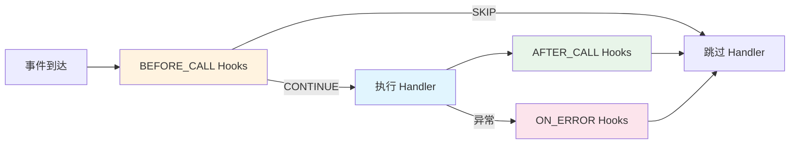

常见用途：过滤（按关键词、权限拦截）、日志、错误处理、参数注入。

---

## Hook 三阶段模型

| 阶段 | `HookStage` | 触发时机 | 可返回的 Action |
|------|------------|---------|----------------|
| **前置** | `BEFORE_CALL` | Handler 执行**之前** | `CONTINUE`（继续）/ `SKIP`（跳过 Handler） |
| **后置** | `AFTER_CALL` | Handler 执行**之后** | `CONTINUE` |
| **错误** | `ON_ERROR` | Handler 执行**异常**时 | `CONTINUE` |

---

## HookContext 上下文

每个 Hook 的 `execute()` 方法接收一个 `HookContext`：

| 字段 | 类型 | 说明 |
|------|------|------|
| `ctx.event` | `Event` | 当前事件 |
| `ctx.event_type` | `str` | 事件类型字符串 |
| `ctx.handler_entry` | `HandlerEntry` | 处理器注册信息（含 `func` 属性） |
| `ctx.api` | `BotAPIClient` | Bot API 客户端 |
| `ctx.services` | `ServiceManager` | 服务管理器（可选） |
| `ctx.kwargs` | `Dict[str, Any]` | Hook 间共享的参数字典 |
| `ctx.result` | `Any` | Handler 返回值（仅 AFTER_CALL） |
| `ctx.error` | `Exception` | 异常信息（仅 ON_ERROR） |

---

## 编写自定义 Hook

### 基本结构

```python
from ncatbot.core.registry.hook import Hook, HookAction, HookContext, HookStage

class MyHook(Hook):
    stage = HookStage.BEFORE_CALL
    priority = 50

    async def execute(self, ctx: HookContext) -> HookAction:
        return HookAction.CONTINUE  # 或 HookAction.SKIP
```

### 附加 Hook 到 Handler

**方式一：`@add_hooks()` 批量绑定**

```python
@add_hooks(keyword_filter, logging_hook, error_notify)
@registrar.on_group_command("回声")
async def on_echo(self, event: GroupMessageEvent, content: str):
    await event.reply(f"🔊 {content}")
```

**方式二：`@hook` 装饰器语法**

```python
@error_notify
@registrar.on_group_command("除零")
async def on_divide_by_zero(self, event: GroupMessageEvent):
    _ = 1 / 0
```

> 完整三阶段 Hook 示例：[examples/common/03_hook_and_filter/main.py](../../../examples/common/03_hook_and_filter/main.py)

---

## 内置 Hook 一览

### 过滤类 Hook（BEFORE_CALL）

| Hook | 构造参数 | 说明 |
|------|---------|------|
| `MessageTypeFilter(message_type)` | `"group"` / `"private"` | 按消息类型过滤 |
| `PostTypeFilter(post_type)` | `"message"` / `"notice"` 等 | 按 post_type 过滤 |
| `SubTypeFilter(sub_type)` | `"poke"` / `"invite"` 等 | 按 sub_type 过滤 |
| `NoticeTypeFilter(notice_type)` | `"group_increase"` 等 | 按通知类型过滤 |
| `RequestTypeFilter(request_type)` | `"friend"` / `"group"` | 按请求类型过滤 |
| `SelfFilter()` | — | 过滤 Bot 自身发送的消息 |
| `PlatformFilter(platform)` | `"qq"` / `"telegram"` 等 | 按平台过滤 |

### 文本匹配类 Hook（BEFORE_CALL）

| Hook | 构造参数 | 说明 |
|------|---------|------|
| `StartsWithHook(prefix)` | 前缀字符串 | 消息以指定前缀开头 |
| `KeywordHook(*words)` | 关键词列表 | 消息包含任一关键词 |
| `RegexHook(pattern, flags=0)` | 正则表达式 | 正则匹配，匹配结果存入 `ctx.kwargs['match']` |

### 便捷工厂函数

```python
from ncatbot.core.registry.builtin_hooks import (
    startswith, keyword, regex, group_only, private_only, non_self,
)
```

### 装饰器自动附加

| 装饰器 | 自动附加的 Hook |
|--------|----------------|
| `on_group_command("x")` | `MessageTypeFilter("group")` + `CommandHook("x")` |
| `on_private_command("x")` | `MessageTypeFilter("private")` + `CommandHook("x")` |
| `on_group_message()` | `MessageTypeFilter("group")` |
| `on_poke()` | `NoticeTypeFilter("notify")` + `SubTypeFilter("poke")` |

---

## CommandHook 与参数绑定

`CommandHook` 是 `on_command()` / `on_group_command()` / `on_private_command()` 内部使用的核心 Hook，负责命令匹配和参数提取。

### 绑定规则

| 参数类型 | 提取方式 | 示例 |
|---------|---------|------|
| `str` | 命令名后的剩余文本 | `"回声 你好"` → `content="你好"` |
| `int` | 从文本中提取数字 | `"禁言 @xxx 60"` → `duration=60` |
| `At` | 从消息段中提取 @段 | `"踢 @xxx"` → `target=At(user_id=xxx)` |

```python
@registrar.on_group_command("禁言")
async def on_ban(
    self, event: GroupMessageEvent,
    target: At = None,        # 从 @ 段提取
    duration: int = 60        # 从文本中提取数字
):
    ...
```

> 参数绑定的实际示例：[examples/qq/04_bot_api/](../../../examples/qq/04_bot_api/) 和 [examples/qq/09_full_featured_bot/](../../../examples/qq/09_full_featured_bot/)。

---

## Hook 优先级与执行顺序

同一阶段的 Hook 按 `priority` **降序**执行（数值越大越先执行）。

| Hook 类别 | 默认 priority |
|----------|--------------|
| `SelfFilter` | 200（最先执行） |
| `MessageTypeFilter` / `PostTypeFilter` / `SubTypeFilter` | 100 |
| `StartsWithHook` / `KeywordHook` / `RegexHook` | 90 |
| 自定义 Hook | 0（默认） |

当 `BEFORE_CALL` 阶段的任何 Hook 返回 `HookAction.SKIP` 时，**立即跳过**当前 Handler，后续 Hook 和 AFTER_CALL/ON_ERROR 均不触发。

---

## 下一步

- [常用模式](7a.patterns.md) — 多步对话、状态机、插件通信
- [事件注册与装饰器](4a.event-registration.md) — Hook 如何与装饰器注册配合工作


---

# 文件: 3. 插件开发\10. 模式.md

---
title: 高级模式
createTime: 2026/03/19 17:26:45
permalink: /guide/uwanjc8v/
---

> 热重载、依赖管理、跨插件交互、多步对话设计、事件驱动工作流编排。

---

## 目录

- [热重载机制](#热重载机制)
- [插件依赖管理](#插件依赖管理)
- [跨插件交互](#跨插件交互)
- [多步对话设计](#多步对话设计)
- [事件驱动工作流编排](#事件驱动工作流编排)

---

## 热重载机制

NcatBot 支持开发时修改插件代码后自动重载，无需重启整个 Bot。

### 工作原理

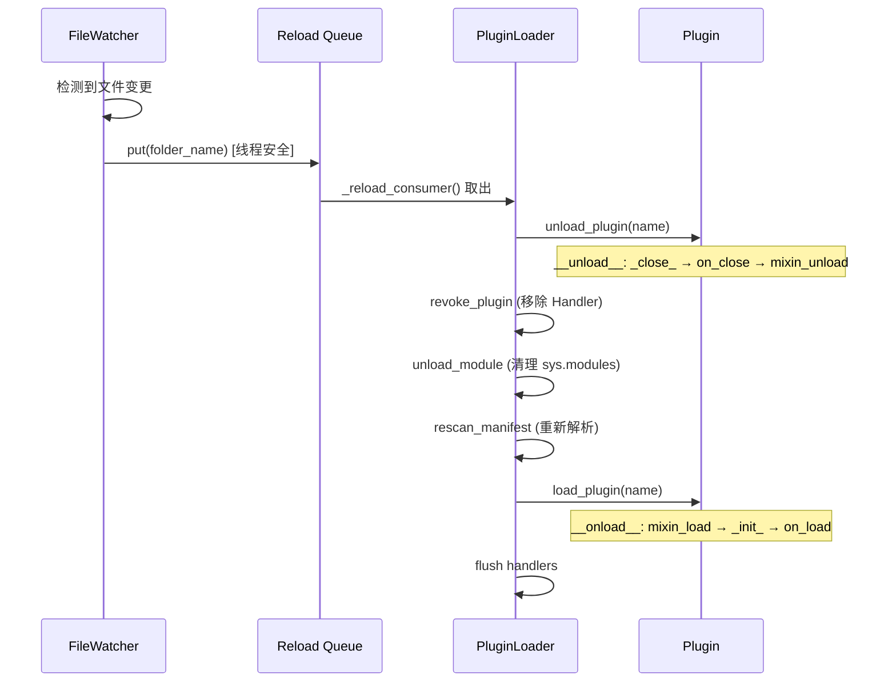

### 流程

1. **FileWatcherService** 监控 `plugins/` 目录的文件变更
2. 检测到变化后，将变更的文件夹名放入 `_reload_queue`（线程安全）
3. **`_reload_consumer`** 异步任务从队列中取出，映射到插件名
4. 执行完整的 **卸载 → 重新扫描 → 加载** 周期

### 开发体验

在开发模式下（`debug: true`），修改插件代码后保存文件，Bot 自动完成重载——无需手动重启。

### 注意事项

- 热重载会执行完整的卸载/加载周期：**`on_close()` → Mixin 保存 → 清理 → 重新加载 → `on_load()`**
- 全局变量会被重置——状态应保存在 `self.data` 中（DataMixin 自动持久化）
- Handler 会被撤销并重新注册——确保所有 Handler 都在类定义或 `on_load()` 中注册
- `__pycache__` 会被自动清除，确保新代码生效

---

## 插件依赖管理

### 插件间依赖

在 `manifest.toml` 中通过 `[dependencies]` 声明对其他插件的依赖：

```toml
[dependencies]
rbac = ">=1.0.0"
config_manager = ">=0.5.0"
```

### 拓扑排序

框架使用 **Kahn 算法**对所有插件进行拓扑排序，确保被依赖的插件先加载：

```yaml
如果 A 依赖 B，B 依赖 C：
加载顺序: C → B → A
```

### 错误检测

| 错误类型 | 说明 |
|---------|------|
| `PluginMissingDependencyError` | 依赖的插件不存在 |
| `PluginCircularDependencyError` | 检测到循环依赖（A → B → A） |
| `PluginVersionError` | 版本约束不满足 |

### pip 依赖

在 `manifest.toml` 的 `[pip_dependencies]` 中声明 Python 包依赖：

```toml
[pip_dependencies]
aiohttp = ">=3.8.0"
beautifulsoup4 = ">=4.12.0"
```

框架在加载时会自动检查这些包是否已安装，未安装时提示用户确认安装。

> 示例：[examples/common/07_external_api/manifest.toml](../../../examples/common/07_external_api/manifest.toml) 声明了 `aiohttp` 依赖。

### 版本约束语法

使用 Python `packaging.specifiers` 标准语法：

| 语法 | 含义 |
|------|------|
| `>=1.0.0` | 大于等于 1.0.0 |
| `>=1.0.0,<2.0.0` | 大于等于 1.0.0 且小于 2.0.0 |
| `==1.2.3` | 精确匹配 |
| `~=1.4` | 兼容版本（≥1.4, <2.0） |

---

## 跨插件交互

### 获取其他插件实例

```python
class MyPlugin(NcatBotPlugin):
    name = "my_plugin"
    version = "1.0.0"

    async def on_load(self):
        # 获取其他插件实例
        rbac_plugin = self.get_plugin("rbac")
        if rbac_plugin:
            LOG.info("RBAC 插件已加载: %s", rbac_plugin.version)

        # 列出所有已加载插件
        all_plugins = self.list_plugins()
        LOG.info("已加载插件: %s", all_plugins)
```

### 跨插件 Python 导入

框架将 `plugins/` 目录添加到 `sys.path`，每个插件文件夹相当于一个 Python 包。因此可以直接导入其他插件的模块：

```python
# 在 plugin_a/main.py 中导入 plugin_b 的模块
from plugin_b.utils import some_helper
```

**注意**：
- 使用跨插件导入时，务必在 `manifest.toml` 中声明依赖关系，确保加载顺序正确
- 插件根目录在 `sys.path` 中的优先级低于标准库和第三方包

---

## 多步对话设计

多步对话是 Bot 开发中的常见需求——通过 `wait_event()` 串联多轮交互。

### 设计模式

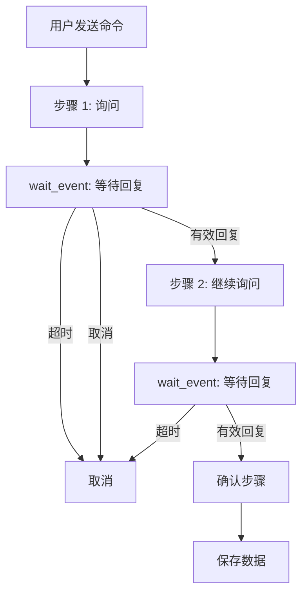

### 封装辅助方法

推荐将 `wait_event` 的通用逻辑封装为辅助方法：

```python
TIMEOUT = 30  # 每步超时秒数

async def _wait_user_reply(self, group_id, user_id):
    """等待指定用户在指定群的下一条消息"""
    event = await self.wait_event(
        predicate=lambda e: (
            hasattr(e.data, "user_id")
            and str(e.data.user_id) == str(user_id)
            and hasattr(e.data, "group_id")
            and str(e.data.group_id) == str(group_id)
            and hasattr(e.data, "raw_message")
        ),
        timeout=TIMEOUT,
    )
    return event.data.raw_message.strip()
```

### 完整多步对话示例

```python
@registrar.on_group_command("注册")
async def on_register(self, event: GroupMessageEvent):
    gid, uid = event.group_id, event.user_id

    # 步骤 1: 询问名字
    await event.reply(f"📝 请输入你的名字（{TIMEOUT}秒内回复，输入「取消」退出）：")

    try:
        name = await self._wait_user_reply(gid, uid)
    except asyncio.TimeoutError:
        await self.api.qq.post_group_msg(gid, text="⏰ 注册超时，已取消")
        return

    if name == "取消":
        await self.api.qq.post_group_msg(gid, text="❌ 注册已取消")
        return

    # 步骤 2: 询问年龄
    await self.api.qq.post_group_msg(gid, text=f"好的，{name}！请输入你的年龄：")

    try:
        age_str = await self._wait_user_reply(gid, uid)
    except asyncio.TimeoutError:
        await self.api.qq.post_group_msg(gid, text="⏰ 注册超时，已取消")
        return

    if age_str == "取消":
        await self.api.qq.post_group_msg(gid, text="❌ 注册已取消")
        return

    if not age_str.isdigit():
        await self.api.qq.post_group_msg(gid, text="❌ 年龄必须是数字，注册已取消")
        return

    age = int(age_str)

    # 步骤 3: 确认
    await self.api.qq.post_group_msg(
        gid,
        text=f"请确认你的信息:\n  名字: {name}\n  年龄: {age}\n回复「确认」完成注册：",
    )

    try:
        confirm = await self._wait_user_reply(gid, uid)
    except asyncio.TimeoutError:
        await self.api.qq.post_group_msg(gid, text="⏰ 确认超时，已取消")
        return

    if confirm != "确认":
        await self.api.qq.post_group_msg(gid, text="❌ 注册已取消")
        return

    # 保存数据
    self.data.setdefault("users", {})[str(uid)] = {"name": name, "age": age}
    await self.api.qq.post_group_msg(gid, text=f"✅ 注册成功！欢迎你，{name}（{age}岁）")
```

> 完整代码：[examples/common/06_multi_step_dialog/main.py](../../../examples/common/06_multi_step_dialog/main.py)

### 设计要点

| 要点 | 说明 |
|------|------|
| **超时处理** | 每步都应设置超时（`asyncio.TimeoutError`） |
| **取消机制** | 检测用户输入"取消"以退出流程 |
| **输入验证** | 在每步验证输入合法性 |
| **状态持久化** | 结果保存到 `self.data`（DataMixin） |
| **用户隔离** | `predicate` 中限定 `user_id` + `group_id` |

---

## 事件驱动工作流编排

当需求超越线性多步对话——需要等待生命周期事件、并发协调多个任务、或在非插件模式下用 `run_async()` 自行编排——本节提供常见模式。

### 何时用装饰器 vs wait_event 编排

| 场景 | 推荐方式 | 原因 |
|------|---------|------|
| 单命令 → 单响应 | 装饰器（模式 A） | 声明式，框架自动路由 |
| 命令 → 等用户回复 → 完成 | 装饰器触发 + `wait_event` | 线性流程，handler 内顺序执行 |
| 启动后自定义编排逻辑 | `run_async()` + dispatcher | 脱离插件体系，完全掌控执行流 |
| 后台持续监控 + 按条件触发 | `events()` 流 + `create_task` | 响应式，长期运行 |
| 多人并发输入收集 | 多个 `wait_event` + `asyncio.wait` | 并发等待，先到先得 |

---

## 下一步

- [实战案例与调试](7b.case-studies.md) — 综合实战案例分析、调试与排查


---

# 文件: 3. 插件开发\11. 案例研究.md

---
title: 实战案例与调试
createTime: 2026/03/19 17:26:45
permalink: /guide/uykkmlov/
---

> 四大实战案例概览与调试排查技巧。完整源码请访问 `examples/` 目录。

---

## 实战案例

### 案例 1：群管理机器人

> 完整代码：[examples/qq/06_group_manager/main.py](../../../examples/qq/06_group_manager/main.py)

**整合**：RBAC 权限 + 通知事件 + 群管理 API + 配置管理

**关键模式**：
- 封装 `_is_admin()` 权限检查，所有管理命令共用
- 欢迎语模板通过 ConfigMixin 持久化，支持运行时修改
- `on_group_increase()` 自动处理新成员入群

### 案例 2：定时报告与统计

> 完整代码：[examples/qq/08_scheduled_reporter/main.py](../../../examples/qq/08_scheduled_reporter/main.py)

**整合**：定时任务 + 数据持久化 + 高优先级消息统计 + 合并转发

**关键模式**：
- 高优先级 Handler（`priority=200`）统计所有消息，不影响其他命令
- 任务回调方法与任务同名（`daily_report`）
- `ForwardConstructor` 将长报告打包为合并转发消息

### 案例 3：外部 API 集成

> 完整代码：[examples/common/07_external_api/main.py](../../../examples/common/07_external_api/main.py)

**整合**：异步 HTTP 请求 + 配置管理 + 错误处理 + 优雅降级

**关键模式**：
- API 地址通过 ConfigMixin 管理，运行时可修改
- 多层异常捕获：HTTP 状态码 → 网络异常 → 未知异常
- pip 依赖声明在 `manifest.toml` 的 `[pip_dependencies]`

### 案例 4：全功能群助手

> 完整代码：[examples/qq/09_full_featured_bot/main.py](../../../examples/qq/09_full_featured_bot/main.py)

覆盖**所有框架特性**的综合案例：

| 子系统 | 使用的 Mixin / 特性 |
|--------|-------------------|
| 签到与积分 | DataMixin + MessageArray |
| 关键词自动回复 | DataMixin + 高优先级 Handler |
| 管理命令 | RBACMixin + api.manage |
| 定时早安 | TimeTaskMixin |
| 新成员欢迎 | `on_group_increase()` + ConfigMixin |

---

## 调试与排查

### 日志系统

```python
from ncatbot.utils import get_log
LOG = get_log("MyPlugin")
LOG.info("消息: %s", text)
LOG.debug("调试信息")  # 仅在 debug=True 时输出
```

### 常见问题

| 问题 | 原因 | 解决方案 |
|------|------|---------|
| 插件没有加载 | manifest.toml 缺必填字段 | 检查 `name` / `version` / `main` |
| 命令不响应 | Handler 未注册 | 确认 `@registrar.on_*()` 在类方法上 |
| 配置/数据丢失 | 异常退出 | 手动调用 `_save_data()` |
| 热重载不生效 | `__pycache__` 缓存 | 手动删除 `__pycache__` |
| 循环依赖 | A ↔ B 互相依赖 | 提取公共逻辑到第三个插件 |
| 权限检查总是 False | RBAC 服务未加载 | 检查 `self.rbac is not None` |
| 定时任务不执行 | 回调方法名不匹配 | 任务名须与方法名完全一致 |

---

## 下一步

- [消息类型详解](../send_message/) — 深入消息段构造和合并转发
- [架构总览](../../architecture.md) — 理解框架整体分层设计
- [示例插件集合](../../../examples/README.md) — 15 个渐进式示例


---

# 文件: 3. 插件开发\README.md

---
title: 插件开发指南
createTime: 2026/03/19 17:26:45
permalink: /guide/r3952n4t/
---

> 插件开发从入门到实战 — 覆盖插件结构、生命周期、事件处理、Mixin 能力、Hook 机制和高级主题。

---

## Quick Reference

### 最小可运行插件

```python
from ncatbot.plugin import NcatBotPlugin
from ncatbot.core import registrar
from ncatbot.event.qq import GroupMessageEvent

class HelloPlugin(NcatBotPlugin):
    name = "hello"
    version = "1.0.0"

    @registrar.on_group_command("hello")
    async def on_hello(self, event: GroupMessageEvent):
        await event.reply(text="Hello!")
```

### 生命周期钩子

| 钩子 | 说明 |
|------|------|
| `_init_()` | 同步初始化（on_load 之前） |
| `on_load()` | 异步初始化（注册权限、定时任务等） |
| `on_close()` | 异步清理 |
| `_close_()` | 同步清理 |

### 运行时属性

| 属性 | 类型 | 说明 |
|------|------|------|
| `self.api` | `BotAPIClient` | Bot API 客户端 |
| `self.services` | `ServiceManager` | 服务管理器 |
| `self.workspace` | `Path` | 插件工作目录 |
| `self.debug` | `bool` | 调试模式 |

### Registrar 装饰器

| 装饰器 | 监听事件 |
|--------|---------|
| `@registrar.on_group_command("cmd")` | 群命令 |
| `@registrar.on_private_command("cmd")` | 私聊命令 |
| `@registrar.on_command("cmd")` | 群+私聊命令 |
| `@registrar.on_group_message()` | 群消息 |
| `@registrar.on_private_message()` | 私聊消息 |
| `@registrar.on_message()` | 所有消息 |
| `@registrar.on_notice()` | 通知事件 |
| `@registrar.on_request()` | 请求事件 |
| `@registrar.qq.on_poke()` | QQ 戳一戳 |
| `@registrar.qq.on_group_increase()` | QQ 群成员增加 |
| `@registrar.qq.on_group_decrease()` | QQ 群成员减少 |
| `@registrar.qq.on_friend_request()` | QQ 好友请求 |
| `@registrar.qq.on_group_request()` | QQ 群请求 |
| `@registrar.bilibili.on_danmu()` | B站弹幕 |
| `@registrar.bilibili.on_gift()` | B站礼物 |
| `@registrar.github.on_push()` | GitHub Push |
| `@registrar.github.on_issue()` | GitHub Issue |
| `@registrar.on(event_type, ...)` | 通用注册 |

> 所有装饰器支持 `priority=`（优先级）和 `platform=`（平台过滤）参数。命令装饰器额外支持 `ignore_case=`。

### Mixin 能力（继承 NcatBotPlugin 自动获得）

| Mixin | 方法 | 说明 |
|-------|------|------|
| **ConfigMixin** | `get_config(key, default=None)` | 读取 YAML 配置 |
| | `set_config(key, value)` | 写入并持久化 |
| | `remove_config(key)` | 移除配置项 |
| | `update_config(updates)` | 批量更新 |
| **DataMixin** | `self.data[key]` | 读写 JSON 持久化数据（字典） |
| **RBACMixin** | `check_permission(user, permission)` | 检查权限 |
| | `add_permission(path)` | 注册权限路径 |
| | `add_role(role, exist_ok=True)` | 创建角色 |
| | `self.rbac` | 访问 RBACService 实例 |
| **TimeTaskMixin** | `add_scheduled_task(name, interval, ...)` | 添加定时任务 |
| | `remove_scheduled_task(name)` | 移除定时任务 |
| | `list_scheduled_tasks()` | 列出任务 |
| **EventMixin** | `wait_event(predicate=, timeout=)` | 等待匹配事件 |
| | `self.events(type)` | 创建事件流（async for） |

### 阅读路线

- **新手**：1 → 2 → 4a（快速入门 → 插件结构 → 事件注册）
- **进阶**：5a / 5b → 6（Mixin 能力 → Hook 机制）
- **高级**：4c → 7a → 7b（Predicate DSL → 模式 → 实战）

---

## 本目录索引

| 章节 | 说明 | 难度 |
|------|------|------|
| [1. 快速入门](1.quick-start.md) | 环境准备、安装、5 分钟跑通第一个插件 | ⭐ |
| [2. 插件结构](2.structure.md) | manifest.toml 详解、基类选择、多文件组织 | ⭐ |
| [3. 生命周期](3.lifecycle.md) | 加载流程、卸载流程、生命周期钩子 | ⭐ |
| [4a. 事件注册](4a.event-registration.md) | 事件类型体系、装饰器路由、优先级 | ⭐⭐ |
| [4b. 事件高级用法](4b.event-advanced.md) | 事件流、wait_event、实战组合 | ⭐⭐ |
| [4c. Predicate DSL](4c.predicate-dsl.md) | 谓词组合、P 基类、工厂函数 | ⭐⭐ |
| [5a. 配置与数据](5a.config-data.md) | ConfigMixin + DataMixin | ⭐⭐ |
| [5b. 权限/定时/事件](5b.rbac-schedule-event.md) | RBACMixin + TimeTaskMixin + EventMixin | ⭐⭐ |
| [6. Hook 机制](6.hooks.md) | 三阶段模型、内置 Hook、自定义编写 | ⭐⭐ |
| [7a. 高级模式](7a.patterns.md) | 热重载、依赖管理、跨插件交互 | ⭐⭐⭐ |
| [7b. 实战案例](7b.case-studies.md) | 群管理/定时报告/外部 API 案例 | ⭐⭐⭐ |


---

# 文件: 4. 消息发送\1. 通用\1. 消息段.md

---
title: 消息段参考
createTime: 2026/03/19 17:26:45
permalink: /guide/5kurthuk/
---

> 消息段的分类、构造方式和常用示例。完整字段表见 [通用消息段](../../../reference/types/1_common_segments.md) 和 [QQ 消息段](../../../reference/types/3_qq_segments.md)。

---

## 基类 MessageSegment

所有消息段继承自 `MessageSegment`（Pydantic `BaseModel`），提供 `to_dict()` / `from_dict()` 序列化。

```python
from ncatbot.types import PlainText, parse_segment

seg = PlainText(text="Hello")
seg.to_dict()  # {"type": "text", "data": {"text": "Hello"}}

seg = parse_segment({"type": "at", "data": {"qq": "123456"}})  # → At(user_id='123456')
```

---

## 基础消息段

| 类型 | 构造示例 | 关键字段 |
|------|---------|---------|
| `PlainText` | `PlainText(text="你好")` | `text: str` |
| `At` | `At(user_id="123456")` / `At(user_id="all")` | `user_id: str`（数字或 `"all"`，别名 `qq` 兼容 OB11） |
| `Face` | `Face(id=178)` | `id: str`（自动转换） |
| `Reply` | `Reply(id=12345)` | `id: str`（自动转换） |

---

## 多媒体消息段

都继承 `DownloadableSegment`，共享 `file` / `url` / `file_id` / `file_size` / `file_name` 字段。

`file` 支持三种格式：URL / 本地路径 / `base64://...`

| 类型 | 构造示例 | 额外字段 |
|------|---------|---------|
| `Image` | `Image(file="https://...")` | `sub_type`（1=动画表情）, `type`（1=闪照） |
| `Record` | `Record(file="audio.silk")` | `magic`（1=变声） |
| `Video` | `Video(file="video.mp4")` | — |
| `File` | `File(file="doc.pdf", file_name="手册.pdf")` | — |

---

## 富文本消息段

| 类型 | 关键字段 | 说明 |
|------|---------|------|
| `Share` | `url`, `title`, `content?`, `image?` | 链接分享卡片 |
| `Location` | `lat`, `lon`, `title?`, `content?` | 定位消息 |
| `Music` | `type`("qq"/"163"/"custom"), `id?`, `url?`, `audio?` | 音乐卡片 |
| `Json` | `data: str` | JSON 消息 |
| `Markdown` | `content: str` | Markdown 消息 |

---

## 延伸阅读

- [MessageArray 消息数组](2_array.md) — 消息段的容器与链式构造
- [通用消息段](../../../reference/types/1_common_segments.md) — 通用段完整字段表
- [QQ 消息段](../../../reference/types/3_qq_segments.md) — QQ 专属段完整字段表

```python
seg = Music(type="qq", id="12345")        # QQ 音乐
seg = Music(type="163", id="67890")       # 网易云
seg = Music(                              # 自定义
    type="custom",
    url="https://music.example.com",
    audio="https://music.example.com/song.mp3",
    title="自定义歌曲",
)
```

### Json — JSON 消息

| 字段 | 类型 | 必填 | 说明 |
|---|---|---|---|
| `data` | `str` | ✅ | JSON 字符串内容 |

```python
from ncatbot.types import Json

seg = Json(data='{"app":"com.example","desc":"卡片消息"}')
```

### Markdown — Markdown 消息

| 字段 | 类型 | 必填 | 说明 |
|---|---|---|---|
| `content` | `str` | ✅ | Markdown 内容 |

```python
from ncatbot.types import Markdown

seg = Markdown(content="# 标题\n**粗体**\n- 列表项")
```

---

[← 上一篇：快速上手](README.md) | [返回目录](README.md) | [下一篇：MessageArray →](2_array.md)


---

# 文件: 4. 消息发送\1. 通用\2. 消息数组.md

---
title: MessageArray 消息数组
createTime: 2026/03/19 17:26:45
permalink: /guide/1lh3ze21/
---

> 消息段的容器，链式构造、查询过滤。完整方法列表见 [reference/types/2_message_array.md](../../../reference/types/2_message_array.md)。

---

## 创建 MessageArray

```python
from ncatbot.types import MessageArray, PlainText, At

msg = MessageArray()                                   # 空数组
msg = MessageArray([PlainText(text="Hello"), At(user_id="123456")])  # 传入列表
msg = MessageArray.from_list([...])                    # 从 OB11 字典列表
msg = MessageArray.from_any("[CQ:at,qq=123456]Hello")  # 自动解析
```

---

## 链式构造

所有 `add_*` 方法返回 `self`，支持链式调用：

```python
msg = (
    MessageArray()
    .add_reply(12345)                              # 回复引用
    .add_at(123456)                                # @某人
    .add_text(" 你好！看看这张图 ")                   # 文本
    .add_image("https://example.com/img.png")       # 图片
    .add_video("https://example.com/video.mp4")     # 视频
)
```

常用方法：`add_text` / `add_image` / `add_video` / `add_at` / `add_at_all` / `add_reply` / `add_segment`

---

## 查询与过滤

```python
msg.text                     # 拼接所有纯文本段
msg.filter_text()            # [PlainText, ...]
msg.filter_image()           # [Image, ...]
msg.filter(Record)           # 按类型泛型过滤
msg.is_at(123456)            # 是否 @了指定用户
```

---

## 序列化

```python
data = msg.to_list()         # → OB11 字典列表
msg2 = MessageArray.from_list(data)
```

`MessageArray` 支持迭代、`len()`、`+` 拼接。

---

[← 上一篇：消息段参考](1_segments.md) | [返回目录](README.md) | [下一篇：QQ 合并转发 →](../qq/2_forward.md)


---

# 文件: 4. 消息发送\1. 通用\README.md

---
title: 通用消息概念
createTime: 2026/03/19 17:26:45
permalink: /guide/lk6274gr/
---

> 跨平台通用的消息构造基础 — 消息段（MessageSegment）和消息数组（MessageArray）。

---

## Quick Start

### 构造一条消息

```python
from ncatbot.types import MessageArray

# 链式构造 — 文本 + 图片 + @某人
msg = MessageArray().add_text("Hello\n").add_image("photo.jpg").add_at(user_id)

# 发送
await self.api.qq.post_group_array_msg(group_id, msg)
```

### 使用消息段

```python
from ncatbot.types import MessageSegment, MessageArray
from ncatbot.types.common.segment import PlainText, Image, At, Reply

# 手动构造消息段
text = PlainText(text="你好")
img = Image(file="https://example.com/pic.jpg")
at = At(user_id="123456")

# 组合成数组
msg = MessageArray([text, img, at])
```

### 从事件中提取消息内容

```python
@registrar.on_group_command("echo")
async def on_echo(self, event: GroupMessageEvent):
    # 获取纯文本内容
    text = event.message.text

    # 提取所有图片段
    images = event.message.filter_image()

    # 检查是否 @了某人
    if event.message.is_at("123456"):
        await event.reply(text="你 @了 TA")
```

---

## 概览

NcatBot 的消息构造体系分为两层：

| 概念 | 说明 | 适用平台 |
|------|------|---------|
| `MessageSegment` | 消息的最小单元（文本、图片、@等） | 主要用于 QQ，Bilibili 使用纯文本 |
| `MessageArray` | 消息段的有序容器，支持链式构造 | 主要用于 QQ |

### 消息段类型速查

| 类型 | 构造 | 说明 |
|------|------|------|
| `PlainText` | `PlainText(text="...")` | 纯文本 |
| `Image` | `Image(file="url或路径")` | 图片（URL / 文件路径 / base64） |
| `At` | `At(user_id="123456")` | @提及（`"all"` 为 @全体） |
| `Reply` | `Reply(id="msg_id")` | 回复引用 |
| `Video` | `Video(file="...")` | 视频 |
| `Record` | `Record(file="...")` | 语音 |
| `File` | `File(file="...")` | 文件附件 |

### MessageArray 常用方法

| 方法 | 返回 | 说明 |
|------|------|------|
| `add_text(text)` | `self` | 追加文本段 |
| `add_image(image)` | `self` | 追加图片段 |
| `add_at(user_id)` | `self` | 追加 @段 |
| `add_at_all()` | `self` | 追加 @全体 |
| `add_reply(message_id)` | `self` | 追加回复引用 |
| `add_video(video)` | `self` | 追加视频段 |
| `add_segment(seg)` | `self` | 追加任意消息段 |
| `.text` | `str` | 拼接所有纯文本内容 |
| `filter(cls)` | `list` | 按类型筛选消息段 |
| `filter_image()` | `list` | 筛选所有图片段 |
| `to_list()` | `list[dict]` | 序列化为 API 格式 |
| `from_list(data)` | `MessageArray` | 从 API 格式反序列化 |

对于 Bilibili 平台，消息以纯文本为主（弹幕、私信、评论），不需要复杂的消息段构造。

---

## 本目录索引

| 文档 | 内容 |
|------|------|
| [消息段参考](1_segments.md) | 所有消息段类型的字段、构造方式和序列化格式 |
| [MessageArray 消息数组](2_array.md) | 容器：创建、链式构造、查询过滤、序列化 |


---

# 文件: 4. 消息发送\2. QQ\1. 语法糖.md

---
title: 便捷接口参考
createTime: 2026/03/19 17:26:45
permalink: /guide/sqs446wn/
---

> `event.reply()`、`MessageSugarMixin` 全部方法、`send_poke` 的完整清单。

---

## 目录

- [event.reply() — 快速回复](#eventreply--快速回复)
- [便捷发送 — 关键字组装](#便捷发送--关键字组装)
- [直接发送 MessageArray](#直接发送-messagearray)
- [类型专用发送 — 群消息](#类型专用发送--群消息)
- [类型专用发送 — 私聊消息](#类型专用发送--私聊消息)
- [合并转发发送](#合并转发发送)
- [其他 — 戳一戳](#其他--戳一戳)

---

## event.reply() — 快速回复

在事件处理器中最便捷的回复方式，自动引用原消息。

```python
async def reply(
    self,
    text: str | None = None,
    *,
    at: str | int | None = None,
    image: str | Image | None = None,
    video: str | Video | None = None,
    rtf: MessageArray | None = None,
    at_sender: bool = True,
) -> Any
```

**行为：**
- 自动添加 `Reply`（引用原消息 ID）
- 群聊时默认 `@发送者`（`at_sender=True`）
- 私聊时只引用不 @
- 组装顺序：`reply → @sender → text → at → image → video → rtf`

```python
await event.reply(text="收到！")
await event.reply(text="看图", image="https://example.com/img.png")
await event.reply(text="不 @你", at_sender=False)
```

---

## 便捷发送 — 关键字组装

`post_group_msg` / `post_private_msg` 接受关键字参数，自动组装 `MessageArray`。

### post_group_msg

```python
async def post_group_msg(
    self,
    group_id: str | int,
    text: str | None = None,
    at: str | int | None = None,
    reply: str | int | None = None,
    image: str | Image | None = None,
    video: str | Video | None = None,
    rtf: MessageArray | None = None,
) -> dict
```

### post_private_msg

```python
async def post_private_msg(
    self,
    user_id: str | int,
    text: str | None = None,
    reply: str | int | None = None,
    image: str | Image | None = None,
    video: str | Video | None = None,
    rtf: MessageArray | None = None,
) -> dict
```

**组装顺序：** `reply → at → text → image → video → rtf`

```python
await self.api.qq.post_group_msg(gid, text="你好！", at=uid, reply=mid)
await self.api.qq.post_private_msg(uid, text="Hi", image="a.png")
```

> 如果需要更复杂的组合，使用 `rtf` 参数传入完整的 `MessageArray`。

---

## 直接发送 MessageArray

| 方法 | 说明 |
|---|---|
| `post_group_array_msg(group_id, msg)` | 发送群 MessageArray |
| `post_private_array_msg(user_id, msg)` | 发送私聊 MessageArray |

```python
msg = MessageArray().add_text("Hello").add_image("a.png")
await self.api.qq.post_group_array_msg(group_id, msg)
await self.api.qq.post_private_array_msg(user_id, msg)
```

---

## 类型专用发送 — 群消息

| 方法 | 参数 | 说明 |
|---|---|---|
| `send_group_text(group_id, text)` | `text: str` | 发送文本（CQ 码会被解析） |
| `send_group_plain_text(group_id, text)` | `text: str` | 发送纯文本（原样发送，不解析 CQ 码） |
| `send_group_image(group_id, image)` | `image: str \| Image` | 发送图片 |
| `send_group_record(group_id, file)` | `file: str` | 发送语音 |
| `send_group_video(group_id, video)` | `video: str \| Video` | 发送视频 |
| `send_group_file(group_id, file, name?)` | `file: str`, `name: str?` | 发送文件 |
| `send_group_sticker(group_id, image)` | `image: str \| Image` | 发送动画表情（sub_type=1） |

```python
await self.api.qq.send_group_text(gid, "Hello!")
await self.api.qq.send_group_plain_text(gid, "[CQ:at,qq=all] 这不会被解析")
await self.api.qq.send_group_image(gid, "https://example.com/img.png")
await self.api.qq.send_group_record(gid, "https://example.com/voice.silk")
await self.api.qq.send_group_video(gid, str(video_path))
await self.api.qq.send_group_file(gid, "https://example.com/doc.pdf", name="文档.pdf")
await self.api.qq.send_group_sticker(gid, str(image_path))
```

---

## 类型专用发送 — 私聊消息

| 方法 | 参数 | 说明 |
|---|---|---|
| `send_private_text(user_id, text)` | `text: str` | 发送文本 |
| `send_private_plain_text(user_id, text)` | `text: str` | 发送纯文本 |
| `send_private_image(user_id, image)` | `image: str \| Image` | 发送图片 |
| `send_private_record(user_id, file)` | `file: str` | 发送语音 |
| `send_private_video(user_id, video)` | `video: str \| Video` | 发送视频 |
| `send_private_file(user_id, file, name?)` | `file: str`, `name: str?` | 发送文件 |
| `send_private_sticker(user_id, image)` | `image: str \| Image` | 发送动画表情 |
| `send_private_dice(user_id, value?)` | `value: int = 1` | 发送骰子 |
| `send_private_rps(user_id, value?)` | `value: int = 1` | 发送猜拳 |

```python
await self.api.qq.send_private_text(uid, "你好")
await self.api.qq.send_private_image(uid, "a.png")
await self.api.qq.send_private_video(uid, "video.mp4")
await self.api.qq.send_private_file(uid, "doc.pdf", name="文档.pdf")
await self.api.qq.send_private_sticker(uid, "sticker.gif")
await self.api.qq.send_private_dice(uid, value=3)
await self.api.qq.send_private_rps(uid, value=2)
```

---

## 合并转发发送

| 方法 | 参数 | 说明 |
|---|---|---|
| `post_group_forward_msg(group_id, forward)` | `forward: Forward` | 发送群合并转发 |
| `post_private_forward_msg(user_id, forward)` | `forward: Forward` | 发送私聊合并转发 |
| `send_group_forward_msg_by_id(group_id, message_ids)` | `message_ids: List[str \| int]` | 通过消息 ID 逐条转发到群 |
| `send_private_forward_msg_by_id(user_id, message_ids)` | `message_ids: List[str \| int]` | 通过消息 ID 逐条转发到私聊 |

> 详见 [2_forward.md](2_forward.md)

---

## 其他 — 戳一戳

```python
async def send_poke(self, group_id: str | int, user_id: str | int) -> None
```

在群内戳指定用户：

```python
await self.api.qq.send_poke(event.group_id, event.user_id)
```

---

[← 上一篇：合并转发](2_forward.md) | [返回目录](../README.md) | [下一篇：实战示例 →](3_examples.md)


---

# 文件: 4. 消息发送\2. QQ\2. 合并转发.md

---
title: 合并转发
createTime: 2026/03/19 17:26:45
permalink: /guide/hilk8da2/
---

> `ForwardNode` 转发节点、`Forward` 合并转发消息段，以及 `ForwardConstructor` 便捷构造器。

---

## 目录

- [ForwardNode — 转发节点](#forwardnode--转发节点)
- [Forward — 合并转发](#forward--合并转发)
- [ForwardConstructor — 便捷构造器](#forwardconstructor--便捷构造器)
- [嵌套合并转发](#嵌套合并转发)
- [发送合并转发](#发送合并转发)

---

## ForwardNode — 转发节点

`ForwardNode` 代表合并转发中的单条消息。它不是 `MessageSegment` 的子类，而是独立的 Pydantic `BaseModel`。

| 字段 | 类型 | 必填 | 说明 |
|---|---|---|---|
| `user_id` | `str` | ✅ | 发送者 QQ（自动转为字符串） |
| `nickname` | `str` | ✅ | 发送者昵称（合并转发中的显示名） |
| `content` | `List[MessageSegment]` | ✅ | 消息内容（可包含多个消息段） |

`content` 字段支持传入 OB11 字典列表，会自动解析为 `MessageSegment` 对象。

```python
from ncatbot.types import ForwardNode, PlainText, Image

node = ForwardNode(
    user_id="123456",
    nickname="小明",
    content=[PlainText(text="这是转发的第一条消息")],
)

# 也可以传入字典列表
node = ForwardNode(
    user_id=123456,
    nickname="小明",
    content=[
        {"type": "text", "data": {"text": "Hello"}},
        {"type": "image", "data": {"file": "https://example.com/img.png"}},
    ],
)
```

---

## Forward — 合并转发

| 字段 | 类型 | 必填 | 说明 |
|---|---|---|---|
| `id` | `str?` | ❌ | 转发消息 ID（引用已有的合并转发） |
| `content` | `List[ForwardNode]?` | ❌ | 转发节点列表（构造新的合并转发） |

### 方式一：引用已有的合并转发（通过 `id`）

```python
from ncatbot.types import Forward

fwd = Forward(id="abc123")
```

### 方式二：构造新的合并转发（通过 `content`）

```python
from ncatbot.types import Forward, ForwardNode, PlainText, Image

fwd = Forward(content=[
    ForwardNode(
        user_id="123456",
        nickname="小明",
        content=[PlainText(text="第一条消息")],
    ),
    ForwardNode(
        user_id="654321",
        nickname="小红",
        content=[
            PlainText(text="带图片的消息"),
            Image(file="https://example.com/img.png"),
        ],
    ),
])
```

---

## ForwardConstructor — 便捷构造器

手动创建 `ForwardNode` 列表比较繁琐，`ForwardConstructor` 提供快捷方式：

```python
from ncatbot.types import ForwardConstructor
```

### 构造方法

| 方法 | 参数 | 说明 |
|---|---|---|
| `__init__(user_id, nickname)` | 默认 `"123456"`, `"QQ用户"` | 初始化，设置默认作者信息 |
| `set_author(user_id, nickname)` | — | 修改后续消息的默认作者 |
| `attach(content, user_id?, nickname?)` | `content: MessageArray` | 添加一条消息节点 |
| `attach_message(message, ...)` | `message: MessageArray` | 同 `attach` |
| `attach_text(text, ...)` | `text: str` | 添加一条纯文本消息 |
| `attach_image(image, ...)` | `image: str` | 添加一条图片消息 |
| `attach_file(file, ...)` | `file: str` | 添加一条文件消息 |
| `attach_video(video, ...)` | `video: str` | 添加一条视频消息 |
| `attach_forward(forward, ...)` | `forward: Forward` | 添加一条嵌套转发 |
| `build()` | — | 构建并返回 `Forward` 对象 |

> 所有 `attach_*` 方法都接受可选的 `user_id` 和 `nickname` 参数覆盖默认作者。

### 基本用法

```python
from ncatbot.types import ForwardConstructor, MessageArray

fc = ForwardConstructor(user_id=str(event.self_id), nickname="Bot")

fc.attach_text("这是转发消息的第一条 📝")
fc.attach_text("这是转发消息的第二条 📝")

# 图文混合节点
msg = MessageArray()
msg.add_text("这条包含图片: ")
msg.add_image(str(EXAMPLE_IMAGE))
fc.attach_message(msg)

forward = fc.build()
await self.api.qq.post_group_forward_msg(event.group_id, forward)
```

### 切换作者

```python
fc = ForwardConstructor(user_id="111", nickname="Alice")
fc.attach_text("Alice 说的话")

fc.set_author("222", "Bob")
fc.attach_text("Bob 说的话")

# 或在 attach 时临时指定
fc.attach_text("Charlie 客串", user_id="333", nickname="Charlie")
```

---

## 嵌套合并转发

通过 `attach_forward` 可以实现转发套转发：

```python
bot_id = str(event.self_id)

# 构造内层转发
inner_fc = ForwardConstructor(user_id=bot_id, nickname="Bot 内层")
inner_fc.attach_text("🔹 内层第一条消息")
inner_fc.attach_text("🔹 内层第二条消息")
inner_forward = inner_fc.build()

# 构造外层转发，嵌套内层
outer_fc = ForwardConstructor(user_id=bot_id, nickname="Bot")
outer_fc.attach_text("🔸 外层第一条消息")
outer_fc.attach_forward(inner_forward)  # 嵌套内层转发
outer_fc.attach_text("🔸 外层第三条消息（在嵌套转发之后）")

forward = outer_fc.build()
await self.api.qq.post_group_forward_msg(event.group_id, forward)
```

---

## 发送合并转发

| 方法 | 说明 |
|---|---|
| `post_group_forward_msg(group_id, forward)` | 发送群合并转发 |
| `post_private_forward_msg(user_id, forward)` | 发送私聊合并转发 |
| `send_group_forward_msg_by_id(group_id, message_ids)` | 通过消息 ID 列表逐条转发到群 |
| `send_private_forward_msg_by_id(user_id, message_ids)` | 通过消息 ID 列表逐条转发到私聊 |

```python
# 发送构造的合并转发
await self.api.qq.post_group_forward_msg(group_id, forward)

# 通过消息 ID 转发已有消息
await self.api.qq.send_group_forward_msg_by_id(group_id, [msg_id_1, msg_id_2])
```

---

[← 上一篇：MessageArray](../common/2_array.md) | [返回目录](../README.md) | [下一篇：便捷接口 →](1_sugar.md)


---

# 文件: 4. 消息发送\2. QQ\3. 示例.md

---
title: 实战示例
createTime: 2026/03/19 17:26:45
permalink: /guide/i1dakoic/
---

> 核心消息发送场景速查，完整代码请参考 `examples/` 目录。

---

## 核心示例

### 发送纯文本 / event.reply()

```python
# 1. post_group_msg 直接发送
await self.api.qq.post_group_msg(event.group_id, text="Hello, World! 👋")

# 2. event.reply() 自动引用 + @发送者
await event.reply(text="你好呀！🎉")
```

### 图文混排（MessageArray）

```python
from ncatbot.types import MessageArray

msg = MessageArray()
msg.add_text("📸 这是一条图文混排消息:\n")
msg.add_image(str(EXAMPLE_IMAGE))  # 本地路径或 URL
msg.add_text("\n以上是示例图片！")
await self.api.qq.post_group_array_msg(event.group_id, msg)
```

### 合并转发

```python
from ncatbot.types import ForwardConstructor, MessageArray

fc = ForwardConstructor(user_id=str(event.self_id), nickname="Bot")
fc.attach_text("第一条消息 📝")
fc.attach_text("第二条消息 📝")

msg = MessageArray().add_text("图片: ").add_image(str(EXAMPLE_IMAGE))
fc.attach_message(msg)

forward = fc.build()
await self.api.qq.post_group_forward_msg(event.group_id, forward)
```

### 回复消息（引用）

```python
# 方式一：event.reply()（推荐）
await event.reply(text="收到！")

# 方式二：reply 参数
await self.api.qq.post_group_msg(event.group_id, text="收到！", reply=event.message_id)

# 方式三：MessageArray
msg = MessageArray().add_reply(event.message_id).add_text("收到！")
await self.api.qq.post_group_array_msg(event.group_id, msg)
```

---

## 更多场景

### 发送 URL 图片

```python
msg = MessageArray()
msg.add_image("https://example.com/photo.jpg")
await self.api.qq.post_group_array_msg(event.group_id, msg)
```

### 发送视频

```python
await self.api.qq.post_group_msg(event.group_id, video="/path/to/video.mp4")
```

### 发送文件

```python
await self.api.qq.send_group_file(event.group_id, "/path/to/file.pdf", name="文件名.pdf")
```

### 动画表情

```python
await self.api.qq.send_group_sticker(event.group_id, "/path/to/image.jpg")
```

### 嵌套合并转发

```python
from ncatbot.types import ForwardConstructor

bot_id = str(event.self_id)

# 构造内层转发
inner_fc = ForwardConstructor(user_id=bot_id, nickname="Bot 内层")
inner_fc.attach_text("🔹 内层第一条消息")
inner_fc.attach_text("🔹 内层第二条消息")
inner_forward = inner_fc.build()

# 构造外层转发，嵌套进去
outer_fc = ForwardConstructor(user_id=bot_id, nickname="Bot")
outer_fc.attach_text("🔸 外层第一条消息")
outer_fc.attach_forward(inner_forward)  # 关键：嵌套内层
outer_fc.attach_text("🔸 外层第三条消息")

await self.api.qq.post_group_forward_msg(event.group_id, outer_fc.build())
```

### 提取消息中图片

```python
from ncatbot.types import Image

images = event.message.filter(Image)
for img in images:
    url = getattr(img, "url", None) or getattr(img, "file", "未知")
    print(url)
```

### @全体成员

```python
msg = MessageArray()
msg.add_at_all()
msg.add_text(" 全体注意！")
await self.api.qq.post_group_array_msg(event.group_id, msg)
```

### 戳一戳

```python
await self.api.qq.send_poke(event.group_id, target_user_id)
```

---

[← 上一篇：便捷接口](1_sugar.md) | [返回目录](../README.md)


---

# 文件: 4. 消息发送\2. QQ\README.md

---
title: QQ 消息发送
createTime: 2026/03/19 17:26:45
permalink: /guide/z4wqms8x/
---

> QQ 平台的消息发送方式 — sugar 便捷方法、合并转发与实战示例。

---

## Quick Start

### 最便捷：event.reply()

处理器内直接回复，自动引用原消息并 @发送者：

```python
from ncatbot.plugin import NcatBotPlugin
from ncatbot.core import registrar
from ncatbot.event.qq import GroupMessageEvent


class MyPlugin(NcatBotPlugin):
    name = "my_plugin"
    version = "1.0.0"

    @registrar.on_group_command("hello")
    async def on_hello(self, event: GroupMessageEvent):
        await event.reply(text="你好！", image="welcome.jpg")
```

### 语法糖：post_group_msg / post_private_msg

关键字自动组装 `MessageArray`，适合不在事件上下文中发送消息：

```python
# 群消息 — 文本 + 图片
await self.api.qq.post_group_msg(group_id, text="看图", image="/path/to/img.jpg")

# 群消息 — @某人 + 回复引用
await self.api.qq.post_group_msg(group_id, text="收到", at=user_id, reply=message_id)

# 私聊消息
await self.api.qq.post_private_msg(user_id, text="私聊消息")
```

### MessageArray：复杂消息构造

链式构造多类型混合消息：

```python
from ncatbot.types import MessageArray

msg = MessageArray().add_text("这是图文消息\n").add_image("photo.jpg").add_at(user_id)
await self.api.qq.post_group_array_msg(group_id, msg)
```

---

## Quick Reference

| 方式 | 调用 | 适用场景 |
|------|------|---------|
| `event.reply()` | `await event.reply(text=, at=, image=, video=, rtf=)` | 处理器内回复 |
| `post_group_msg()` | `await self.api.qq.post_group_msg(group_id, text=, at=, reply=, image=)` | 关键字快捷 |
| `MessageArray` | `MessageArray().add_text(...).add_image(...)` | 复杂消息 |

### 单类型快捷方法

| 方法 | 参数 | 说明 |
|------|------|------|
| `send_group_text(group_id, text)` | | 纯文本 |
| `send_group_image(group_id, image)` | | 图片 |
| `send_group_record(group_id, file)` | | 语音 |
| `send_group_video(group_id, video)` | | 视频 |
| `send_group_file(group_id, file, name=)` | | 文件 |
| `send_group_sticker(group_id, image)` | | 动画表情 |
| `send_private_text(user_id, text)` | | 私聊纯文本 |
| `send_private_image(user_id, image)` | | 私聊图片 |

### 合并转发

```python
from ncatbot.types.qq import ForwardConstructor

fc = ForwardConstructor(user_id="123456", nickname="Bot")
fc.attach_text("第一条消息")
fc.attach_text("第二条消息")
fc.attach_image("photo.jpg")

await self.api.qq.post_group_forward_msg(group_id, fc.build())
```

---

## 本目录索引

| 文档 | 内容 |
|------|------|
| [便捷接口参考](1_sugar.md) | event.reply()、所有 sugar 方法完整清单 |
| [合并转发](2_forward.md) | ForwardNode / Forward / ForwardConstructor 构造器 |
| [实战示例](3_examples.md) | 常见场景速查：纯文本、图文、回复、转发等 |

---

> **相关**：[通用消息概念](../common/README.md) · [QQ API 使用指南](../../api_usage/qq/README.md)


---

# 文件: 4. 消息发送\3. Bilibili\1. 消息发送.md

---
title: Bilibili 消息发送详解
createTime: 2026/03/19 17:26:45
permalink: /guide/q1cnfxn1/
---

> Bilibili 平台三种消息形式的发送方式与实战示例。

---

## 弹幕发送

直播间弹幕是 Bilibili 最常用的消息形式。

```python
# 发送弹幕
await self.api.bilibili.send_danmu(room_id=12345, text="Hello!")
```

在事件处理器中，也可以使用通用的 `event.reply()`：

```python
@registrar.on_message(platform="bilibili")
async def on_danmu(self, event):
    await event.reply(text="收到弹幕！")
```

---

## 私信发送

### 文字私信

```python
await self.api.bilibili.send_private_msg(user_id=67890, content="你好！")
```

### 图片私信

```python
await self.api.bilibili.send_private_image(
    user_id=67890,
    image_url="https://example.com/img.png",
)
```

---

## 评论发送

### 发送新评论

```python
await self.api.bilibili.send_comment(
    resource_id="BV1xx411c7mD",
    resource_type="video",
    text="好视频！",
)
```

### 回复评论

```python
await self.api.bilibili.reply_comment(
    resource_id="BV1xx411c7mD",
    resource_type="video",
    root_id=123456,
    parent_id=789012,
    text="谢谢！",
)
```

---

## 与 QQ 的对比

| 特性 | QQ | Bilibili |
|------|:--:|:--------:|
| 富文本消息（图文混排） | ✅ MessageArray | ❌ 纯文本 |
| 消息段构造 | ✅ MessageSegment | ❌ |
| 合并转发 | ✅ Forward | ❌ |
| event.reply() | ✅ | ✅ |
| 语法糖方法 | ✅ post_group_msg 等 | ❌ 直接调用 API |

---

## 实战示例

```python
class BiliMessenger(NcatBotPlugin):
    name = "bili_messenger"
    version = "1.0.0"

    @registrar.on_message(platform="bilibili")
    async def on_danmu(self, event):
        """弹幕自动回复"""
        if event.content == "签到":
            await event.reply(text=f"签到成功！欢迎 {event.sender.nickname}")

    @registrar.on_notice(platform="bilibili")
    async def on_comment(self, event):
        """新评论通知"""
        if hasattr(event, "comment_id"):
            await self.api.bilibili.reply_comment(
                resource_id=event.resource_id,
                resource_type=event.resource_type,
                root_id=event.comment_id,
                parent_id=event.comment_id,
                text="感谢评论！",
            )
```

---

> **返回**：[Bilibili 消息发送](README.md) · **相关**：[Bilibili API 指南](../../api_usage/bilibili/README.md)


---

# 文件: 4. 消息发送\3. Bilibili\README.md

---
title: Bilibili 消息发送
createTime: 2026/03/19 17:26:45
permalink: /guide/ntzxhpfp/
---

> Bilibili 平台的消息发送方式 — 弹幕、私信与评论。

---

## Quick Start

### 发送弹幕

```python
from ncatbot.plugin import NcatBotPlugin
from ncatbot.core import registrar


class MyPlugin(NcatBotPlugin):
    name = "my_plugin"
    version = "1.0.0"

    async def on_load(self):
        # 向直播间发送弹幕
        await self.api.bilibili.send_danmu(room_id=12345, text="Hello!")
```

### 发送私信

```python
# 文字私信
await self.api.bilibili.send_private_msg(user_id=67890, content="你好")

# 图片私信
await self.api.bilibili.send_private_image(user_id=67890, image_url="https://example.com/pic.jpg")
```

### 发送评论与回复

```python
# 发送视频评论
await self.api.bilibili.send_comment(resource_id="BV1xxx", resource_type="video", text="好看！")

# 回复已有评论
await self.api.bilibili.reply_comment(
    resource_id="BV1xxx",
    resource_type="video",
    root_id=100,
    parent_id=200,
    text="同意！",
)
```

---

## Quick Reference

| 类型 | 方法 | 说明 |
|------|------|------|
| 弹幕 | `send_danmu(room_id, text)` | 直播间弹幕 |
| 私信 | `send_private_msg(user_id, content)` | 文字私信 |
| 私信图片 | `send_private_image(user_id, image_url)` | 图片私信 |
| 评论 | `send_comment(resource_id, resource_type, text)` | 视频/动态评论 |
| 回复评论 | `reply_comment(resource_id, resource_type, root_id, parent_id, text)` | 回复已有评论 |
| 删除评论 | `delete_comment(resource_id, resource_type, comment_id)` | 删除评论 |
| 点赞评论 | `like_comment(resource_id, resource_type, comment_id)` | 点赞评论 |

> 所有方法通过 `self.api.bilibili` 访问。与 QQ 不同，Bilibili 的消息以纯文本为主，不需要 MessageArray 或消息段构造。

---

## 本目录索引

| 文档 | 内容 |
|------|------|
| [消息发送详解](1_messaging.md) | 弹幕、私信、评论的发送方式与示例 |

---

> **相关**：[Bilibili API 使用指南](../../api_usage/bilibili/README.md)


---

# 文件: 4. 消息发送\4. GitHub\1. 消息发送.md

---
title: GitHub 消息发送详解
createTime: 2026/03/19 17:26:45
permalink: /guide/tn3ordoc/
---

> GitHub 平台的三种消息类型：Issue Comment、PR Comment、PR Review Comment。
> 消息内容支持 GitHub Flavored Markdown。

---

## Issue 评论

### 通过事件回复

```python
from ncatbot.core import registrar
from ncatbot.event.github import GitHubIssueEvent

@registrar.github.on_issue()
async def on_new_issue(self, event: GitHubIssueEvent):
    if event.action != "opened":
        return
    await event.reply(
        f"## 感谢反馈\n\n"
        f"Issue **#{event.issue_number}** 已收到。\n"
        f"- 标签: {', '.join(event.labels) or '无'}\n"
        f"- 仓库: {event.repo}"
    )
```

### 通过 API 主动评论

```python
await self.api.github.create_issue_comment(
    repo="owner/repo",
    issue_number=42,
    body="这个问题已在 v1.2.0 修复，请升级后验证。",
)
```

## PR 评论

```python
from ncatbot.event.github import GitHubPREvent

@registrar.github.on_pr()
async def on_pr(self, event: GitHubPREvent):
    if event.action == "opened":
        await event.reply(
            f"PR **#{event.pr_number}** 已收到。\n"
            f"分支: `{event.data.head_ref}` → `{event.data.base_ref}`"
        )
```

主动评论：

```python
await self.api.github.create_pr_comment(
    repo="owner/repo",
    pr_number=10,
    body="CI 通过，LGTM! :rocket:",
)
```

## 评论的编辑与删除

### 编辑评论

```python
await self.api.github.update_comment(
    repo="owner/repo",
    comment_id=123456,
    body="[已更新] 这个问题已修复。",
)
```

### 删除评论

```python
# 方式 1：通过事件
from ncatbot.event.github import GitHubIssueCommentEvent

@registrar.github.on_comment()
async def on_comment(self, event: GitHubIssueCommentEvent):
    if "spam" in event.comment_body.lower():
        await event.delete()  # 删除当前评论

# 方式 2：通过 API
await self.api.github.delete_comment(repo="owner/repo", comment_id=123456)
```

## 列出评论

```python
comments = await self.api.github.list_issue_comments(
    repo="owner/repo",
    issue_number=42,
    page=1,
    per_page=30,
)
for c in comments:
    print(c["body"])
```

## 实战示例：Issue 自动回复 Bot

```python
from ncatbot.core import registrar
from ncatbot.event.github import GitHubIssueEvent, GitHubIssueCommentEvent
from ncatbot.plugin import NcatBotPlugin

class IssueBotPlugin(NcatBotPlugin):
    name = "issue_bot"
    version = "1.0.0"

    @registrar.github.on_issue()
    async def on_issue(self, event: GitHubIssueEvent):
        if event.action == "opened":
            await event.reply("感谢反馈！请确保已搜索过已有 Issue。")
        elif event.action == "closed":
            await event.reply("Issue 已关闭。如有后续问题请重新开启。")

    @registrar.github.on_comment()
    async def on_comment(self, event: GitHubIssueCommentEvent):
        if event.comment_body.strip().lower() == "/close":
            await self.api.github.close_issue(event.repo, event.issue_number)
            await event.reply("Issue 已通过命令关闭。")
```

---

> **返回**：[GitHub 消息发送](README.md) · **相关**：[GitHub API 使用](../../api_usage/github/README.md)


---

# 文件: 4. 消息发送\4. GitHub\README.md

---
title: GitHub 消息发送
createTime: 2026/03/19 17:26:45
permalink: /guide/solrpr7b/
---

> GitHub 平台的消息发送方式 — Issue 评论、PR 评论与 API 直接调用。
> GitHub 平台消息以纯文本 / Markdown 为主，不支持富媒体消息段（At、Image 等）。

---

## Quick Start

### 通过事件回复

```python
from ncatbot.core import registrar
from ncatbot.event.github import GitHubIssueEvent, GitHubPREvent

@registrar.github.on_issue()
async def on_issue(self, event: GitHubIssueEvent):
    await event.reply("感谢你的反馈！")                   # Issue 评论

@registrar.github.on_pr()
async def on_pr(self, event: GitHubPREvent):
    await event.reply("PR 已收到，正在 review。")          # PR 评论
```

### 通过 API 直接调用

```python
# Issue 评论
await self.api.github.create_issue_comment("owner/repo", issue_number=42, body="已处理")

# PR 评论
await self.api.github.create_pr_comment("owner/repo", pr_number=10, body="LGTM!")
```

---

## Quick Reference

| 方式 | 调用 | 适用场景 |
|------|------|---------|
| `event.reply(text)` | `await event.reply("内容")` | 事件 handler 内回复（Issue / PR / Comment） |
| `create_issue_comment()` | `await api.github.create_issue_comment(repo, issue_number, body)` | 主动评论 Issue |
| `create_pr_comment()` | `await api.github.create_pr_comment(repo, pr_number, body)` | 主动评论 PR |
| `update_comment()` | `await api.github.update_comment(repo, comment_id, body)` | 编辑已有评论 |
| `delete_comment()` | `await api.github.delete_comment(repo, comment_id)` | 删除评论 |
| `event.delete()` | `await event.delete()` | 删除当前评论（评论事件） |

### 与其他平台的差异

| 特性 | QQ | Bilibili | GitHub |
|------|-----|----------|--------|
| 消息格式 | 富文本（消息段） | 纯文本 | 纯文本 / Markdown |
| At / 图片 / 视频 | ✅ | 部分 | ❌ |
| `event.reply()` | ✅ | ✅ | ✅ |
| `event.delete()` | ✅ | ✅ | ✅（仅评论事件） |
| MessageArray | ✅ | — | — |

---

## 本目录索引

| 文档 | 内容 |
|------|------|
| [1_messaging.md](1_messaging.md) | Issue / PR / Review Comment 发送详解与示例 |

---

> **相关**：[GitHub API 使用](../../api_usage/github/README.md) · [跨平台通用消息段](../common/README.md) · [多平台开发](../../multi_platform/README.md)


---

# 文件: 4. 消息发送\README.md

---
title: 发送消息指南
createTime: 2026/03/19 17:26:45
permalink: /guide/newizyxu/
---

> 从快速发送到精细构造，NcatBot 的完整消息发送参考 — 支持多平台。

---

## Quick Reference

### 通用回复（所有平台）

```python
await event.reply(text="收到")  # 自动适配当前平台
```

### QQ 平台

```python
# sugar 方法 — 关键字自动组装
await self.api.qq.post_group_msg(group_id, text="Hello!", at=user_id, image="photo.jpg")

# MessageArray — 精细控制
msg = MessageArray().add_at(user_id).add_text(" 看看这些图 ").add_image("img.png")
await self.api.qq.post_group_array_msg(group_id, msg)
```

### Bilibili 平台

```python
# 弹幕
await self.api.bilibili.send_danmu(room_id, "Hello!")

# 私信
await self.api.bilibili.send_private_msg(user_id, "你好！")

# 评论
await self.api.bilibili.send_comment(resource_id, "video", "好视频！")
```

### GitHub 平台

```python
# Issue 评论（通过事件回复）
await event.reply("感谢你的反馈！")

# Issue 评论（通过 API）
await self.api.github.create_issue_comment("owner/repo", 42, "已处理")

# PR 评论
await self.api.github.create_pr_comment("owner/repo", 10, "LGTM!")
```

---

## 本目录索引

### 通用

| 文档 | 内容 |
|------|------|
| [通用消息概念](common/README.md) | 消息段与 MessageArray 概览 |
| [消息段参考](common/1_segments.md) | 所有消息段类型的字段、构造方式和序列化格式 |
| [MessageArray 消息数组](common/2_array.md) | 容器：创建、链式构造、查询过滤、序列化 |

### QQ 平台

| 文档 | 内容 |
|------|------|
| [QQ 消息发送](qq/README.md) | QQ 消息发送方式概览 |
| [便捷接口参考](qq/1_sugar.md) | event.reply()、所有 sugar 方法完整清单 |
| [合并转发](qq/2_forward.md) | ForwardNode / Forward / ForwardConstructor 构造器 |
| [实战示例](qq/3_examples.md) | 常见场景速查：纯文本、图文、回复、转发等 |

### Bilibili 平台

| 文档 | 内容 |
|------|------|
| [Bilibili 消息发送](bilibili/README.md) | 弹幕、私信、评论发送概览 |
| [消息发送详解](bilibili/1_messaging.md) | 弹幕、私信、评论的发送方式与示例 |

### GitHub 平台

| 文档 | 内容 |
|------|------|
| [GitHub 消息发送](github/README.md) | Issue / PR 评论发送概览 |
| [消息发送详解](github/1_messaging.md) | Issue / PR / Review Comment 发送与示例 |


---

# 文件: 5. API 使用\1. 通用\1. 事件方法.md

---
title: 事件方法
createTime: 2026/03/19 17:26:45
permalink: /guide/mg63xeur/
---

> 跨平台事件行为 Mixin — 通过 `isinstance` 检查事件能力，安全调用通用方法。

---

## 概览

事件实体通过多继承组合行为 Mixin，插件代码可用 `isinstance` 检查事件是否支持某操作：

```python
from ncatbot.event import Replyable, Deletable, Kickable

@registrar.on_message()
async def on_msg(self, event):
    if isinstance(event, Replyable):
        await event.reply(text="收到")
```

所有 Mixin 定义在 `ncatbot/event/common/mixins.py`，通过 `ncatbot.event` 导入。

---

## Replyable — 回复

支持回复的事件（消息事件、评论事件等）。

```python
async def reply(self, **kwargs) -> Any
```

| 平台 | 支持的关键字参数 |
|------|----------------|
| QQ | `text=, at=, image=, video=, rtf=`（自动引用 + @发送者） |
| Bilibili | `text=`（弹幕回复 / 评论回复，取决于事件类型） |

```python
# 最常用的回复方式
await event.reply(text="pong!")

# QQ 平台支持富文本回复
await event.reply(text="看图", image="photo.jpg")
```

---

## Deletable — 撤回/删除

支持撤回或删除的事件。

```python
async def delete(self) -> Any
```

```python
# 撤回触发事件的消息
await event.delete()
```

| 平台 | 行为 |
|------|------|
| QQ | 撤回消息（需要权限） |
| Bilibili | 删除评论（需要权限） |

---

## HasSender — 发送者信息

包含发送者信息的事件。

```python
@property
def user_id(self) -> str

@property
def sender(self) -> Any
```

```python
print(f"消息来自: {event.user_id}")
print(f"发送者昵称: {event.sender.nickname}")
```

---

## GroupScoped — 群/频道作用域

属于群或频道的事件。

```python
@property
def group_id(self) -> str
```

```python
if isinstance(event, GroupScoped):
    print(f"来自群 {event.group_id}")
```

---

## Kickable — 踢出成员

支持踢出成员的事件（群消息事件等）。

```python
async def kick(self, **kwargs) -> Any
```

```python
# 踢出发送违规消息的用户
await event.kick()
```

---

## Bannable — 禁言

支持禁言的事件。

```python
async def ban(self, duration: int = 1800, **kwargs) -> Any
```

| 参数 | 类型 | 默认值 | 说明 |
|------|------|--------|------|
| duration | int | 1800 | 禁言时长（秒），0 = 解除 |

```python
await event.ban(duration=600)   # 禁言 10 分钟
await event.ban(duration=0)     # 解除禁言
```

---

## Approvable — 同意/拒绝

支持审批的事件（好友请求、加群请求等）。

```python
async def approve(self, **kwargs) -> Any
async def reject(self, **kwargs) -> Any
```

```python
from ncatbot.event import Approvable

@registrar.qq.on_friend_request()
async def on_request(self, event):
    if isinstance(event, Approvable):
        await event.approve()
```

---

## 跨平台插件示例

```python
from ncatbot.event import Replyable, GroupScoped, Bannable

@registrar.on_message()
async def cross_platform_handler(self, event):
    """处理所有平台的消息"""
    if isinstance(event, Replyable):
        await event.reply(text=f"来自 {event.platform} 的消息已收到")

    if isinstance(event, GroupScoped):
        print(f"群/频道: {event.group_id}")

    if isinstance(event, Bannable):
        # 可以禁言的事件
        pass
```

---

> **返回**：[通用 API](README.md) · **相关**：[API Trait 协议](2_traits.md)


---

# 文件: 5. API 使用\1. 通用\2. Traits.md

---
title: API Trait 协议
createTime: 2026/03/19 17:26:45
permalink: /guide/nmcqap93/
---

> 跨平台 API 能力协议 — 各平台 APIClient 按功能实现的 Protocol 接口。

---

## 概览

NcatBot 将 API 能力拆分为 4 个 Trait 协议（`ncatbot/api/traits/`），各平台按需实现：

| Trait | 功能 | QQ | Bilibili |
|-------|------|:--:|:--------:|
| `IMessaging` | 消息发送与撤回 | ✅ | 部分 |
| `IGroupManage` | 群/频道管理 | ✅ | 部分 |
| `IQuery` | 信息查询 | ✅ | 部分 |
| `IFileTransfer` | 文件上传/下载 | ✅ | ❌ |

---

## IMessaging — 消息收发

```python
from ncatbot.api.traits import IMessaging
```

| 方法 | 说明 |
|------|------|
| `send_private_msg(user_id, message)` | 发送私聊消息 |
| `send_group_msg(group_id, message)` | 发送群消息 |
| `delete_msg(message_id)` | 撤回消息 |
| `send_forward_msg(message_type, target_id, messages)` | 合并转发 |

```python
# 跨平台消息发送
client = self.api.platform("qq")
if isinstance(client.messaging, IMessaging):
    await client.messaging.send_group_msg(group_id, message)
```

---

## IGroupManage — 群管理

```python
from ncatbot.api.traits import IGroupManage
```

| 方法 | 说明 |
|------|------|
| `set_group_kick(group_id, user_id, reject_add_request=False)` | 踢出成员 |
| `set_group_ban(group_id, user_id, duration=1800)` | 禁言 |
| `set_group_whole_ban(group_id, enable=True)` | 全员禁言 |
| `set_group_admin(group_id, user_id, enable=True)` | 设置管理员 |
| `set_group_name(group_id, name)` | 修改群名 |
| `set_group_leave(group_id, is_dismiss=False)` | 退群 |

---

## IQuery — 信息查询

```python
from ncatbot.api.traits import IQuery
```

| 方法 | 说明 |
|------|------|
| `get_login_info()` | 获取登录信息 |
| `get_stranger_info(user_id)` | 陌生人/用户信息 |
| `get_friend_list()` | 好友列表 |
| `get_group_info(group_id)` | 群信息 |
| `get_group_list()` | 群列表 |
| `get_group_member_info(group_id, user_id)` | 群成员信息 |
| `get_group_member_list(group_id)` | 群成员列表 |

---

## IFileTransfer — 文件传输

```python
from ncatbot.api.traits import IFileTransfer
```

| 方法 | 说明 |
|------|------|
| `upload_group_file(group_id, file, name, folder_id="")` | 上传群文件 |
| `upload_private_file(user_id, file, name)` | 上传私聊文件 |
| `download_file(url="", file="", headers="")` | 下载文件 |

> `upload_attachment()` 是 QQ 平台专属 sugar，不属于跨平台 Trait。参见 [QQ 文件操作](../../qq/3_query_support.md)。

---

## 在插件中使用 Trait

Trait 协议的主要用途是编写跨平台插件时进行能力检查：

```python
from ncatbot.api.traits import IMessaging, IGroupManage

class CrossPlatformPlugin(NcatBotPlugin):
    name = "cross_platform"

    @registrar.on_group_command("ban")
    async def on_ban(self, event, target=None):
        # 获取当前平台的 API
        client = self.api.platform(event.platform)

        # 检查平台是否支持群管理
        if isinstance(client.manage, IGroupManage):
            await client.manage.set_group_ban(event.group_id, target.user_id)
        else:
            await event.reply(text="当前平台不支持禁言操作")
```

---

> **返回**：[通用 API](README.md) · **相关**：[事件方法](1_event_methods.md)


---

# 文件: 5. API 使用\1. 通用\README.md

---
title: 通用 API
createTime: 2026/03/19 17:26:45
permalink: /guide/2248858x/
---

> 跨平台通用的事件方法和 API Trait 协议 — 适用于所有已接入平台。

---

## Quick Reference

NcatBot 通过 Trait 协议实现跨平台统一：

| 层级 | 说明 | 适用场景 |
|------|------|---------|
| 事件方法 | `event.reply()`, `event.delete()` 等 | 处理器内直接操作事件 |
| API Trait | `IMessaging`, `IGroupManage` 等 | 编写跨平台插件时按协议调用 |

### 事件方法 vs 平台 API

```python
# 通用 — 任何平台都能用
await event.reply(text="收到")

# 平台专属 — 仅 QQ
await self.api.qq.post_group_msg(group_id, text="Hello!")

# 平台专属 — 仅 Bilibili
await self.api.bilibili.send_danmu(room_id, "弹幕内容")
```

---

## 本目录索引

| 文档 | 内容 |
|------|------|
| [事件方法](1_event_methods.md) | `event.reply()`, `event.delete()`, `event.kick()` 等跨平台事件操作 |
| [API Trait 协议](2_traits.md) | `IMessaging`, `IGroupManage`, `IQuery`, `IFileTransfer` 协议说明 |


---

# 文件: 5. API 使用\2. QQ\1. 消息发送.md

---
title: 消息发送详解
createTime: 2026/03/19 17:26:45
permalink: /guide/eyiefl70/
---

> `BotAPIClient` 消息发送 API 的任务导向教程。完整参数表见 [reference/api/qq/1_message_api.md](../../../reference/api/qq/1_message_api.md)。

---

## 获取 API 客户端

| 方式 | 类型 | 场景 |
|------|------|------|
| `self.api.qq` | `QQAPIClient` | 插件中（推荐，含语法糖） |
| `event.reply()` | — | 最便捷的回复方式 |

---

## 常用发送方式

### 1. event.reply() — 一行回复

```python
await event.reply(text="pong!")  # 自动引用 + @发送者
```

### 2. post_group_msg — 关键字发送

```python
await self.api.qq.post_group_msg(event.group_id, text="Hello!", at=654321)
await self.api.qq.post_group_msg(event.group_id, text="看这个", reply=msg_id, image="img.png")
```

组装顺序：`reply → at → text → image → video → rtf`

### 3. MessageArray — 精细控制

```python
from ncatbot.types import MessageArray
msg = MessageArray().add_text("你好").add_image("img.png")
await self.api.qq.post_group_array_msg(event.group_id, msg)
```

### 4. 原子 API — OneBot v11 格式

```python
await self.api.qq.messaging.send_group_msg(123456, [{"type": "text", "data": {"text": "你好"}}])
```

---

## 合并转发

```python
from ncatbot.types import Forward
forward = Forward()
forward.add_message(user_id=10001, nickname="Bot", content="第一条")
await self.api.qq.post_group_forward_msg(group_id, forward)

# 或通过消息 ID 转发已有消息
await self.api.qq.send_group_forward_msg_by_id(group_id, [msg_id_1, msg_id_2])
```

---

## 撤回消息

```python
result = await self.api.qq.messaging.send_group_msg(group_id, message)
await self.api.qq.messaging.delete_msg(result["message_id"])

# 或直接撤回触发事件的消息
await event.delete()
```

---

## 延伸阅读

- [消息 API 完整参数表](../../../reference/api/qq/1_message_api.md) — 核心方法与 Sugar 方法签名
- [消息段参考](../../send_message/common/1_segments.md) — MessageSegment 类型
- [通用消息段](../../../reference/types/1_common_segments.md) — 通用段完整字段表
- [QQ 消息段](../../../reference/types/3_qq_segments.md) — QQ 专属段
- [群管理 API](2_manage.md) — 踢人、禁言等管理操作
| `group_id` | `str \| int` | 群号 |
| `user_id` | `str \| int` | 被戳的用户 QQ |

**示例**

```python
@registrar.on_group_command("戳我")
async def on_poke(self, event: GroupMessageEvent):
    await self.api.qq.messaging.send_poke(event.group_id, event.user_id)
```

---

## 语法糖方法

`QQAPIClient`（通过 `self.api.qq` 访问）继承了 `QQMessageSugarMixin`，提供 **关键字参数自动组装消息** 的便捷方法，无需手动构造 `message` 列表。

### post_group_msg — 便捷群消息

```python
async def post_group_msg(
    self,
    group_id: Union[str, int],
    text: Optional[str] = None,
    at: Optional[Union[str, int]] = None,
    reply: Optional[Union[str, int]] = None,
    image: Optional[Union[str, Image]] = None,
    video: Optional[Union[str, Video]] = None,
    rtf: Optional[MessageArray] = None,
) -> dict
```

所有关键字参数都是可选的，按需组合：

```python
# 发送纯文本
await self.api.qq.post_group_msg(group_id, text="Hello!")

# 发送文本 + @某人
await self.api.qq.post_group_msg(group_id, text="欢迎", at=user_id)

# 发送文本 + 图片
await self.api.qq.post_group_msg(group_id, text="看图", image="/path/to/img.jpg")

# 发送引用回复
await self.api.qq.post_group_msg(group_id, text="收到", reply=message_id)

# 发送自定义 MessageArray
msg = MessageArray()
msg.add_text("复杂消息")
msg.add_image("https://example.com/img.png")
await self.api.qq.post_group_msg(group_id, rtf=msg)
```

### post_private_msg — 便捷私聊消息

```python
async def post_private_msg(
    self,
    user_id: Union[str, int],
    text: Optional[str] = None,
    reply: Optional[Union[str, int]] = None,
    image: Optional[Union[str, Image]] = None,
    video: Optional[Union[str, Video]] = None,
    rtf: Optional[MessageArray] = None,
) -> dict
```

### 其他 sugar 方法速查

| 方法 | 说明 |
|------|------|
| `send_group_text(group_id, text)` | 发送群纯文本 |
| `send_group_image(group_id, image)` | 发送群图片 |
| `send_group_record(group_id, file)` | 发送群语音 |
| `send_group_file(group_id, file, name=None)` | 发送群文件消息 |
| `send_group_video(group_id, video)` | 发送群视频 |
| `send_group_sticker(group_id, image)` | 发送群动画表情 |
| `send_private_text(user_id, text)` | 发送私聊纯文本 |
| `send_private_image(user_id, image)` | 发送私聊图片 |
| `send_private_record(user_id, file)` | 发送私聊语音 |
| `send_private_file(user_id, file, name=None)` | 发送私聊文件消息 |
| `send_private_video(user_id, video)` | 发送私聊视频 |
| `send_private_sticker(user_id, image)` | 发送私聊动画表情 |
| `post_group_forward_msg(group_id, forward)` | 发送群合并转发（`Forward` 对象） |
| `post_private_forward_msg(user_id, forward)` | 发送私聊合并转发 |
| `send_group_forward_msg_by_id(group_id, message_ids)` | 通过消息 ID 列表转发群消息 |
| `send_private_forward_msg_by_id(user_id, message_ids)` | 通过消息 ID 列表转发私聊消息 |
| `post_group_array_msg(group_id, msg)` | 发送 `MessageArray` 群消息 |
| `post_private_array_msg(user_id, msg)` | 发送 `MessageArray` 私聊消息 |

---

> **返回**：[Bot API 使用指南](../README.md) · **相关**：[消息发送指南](../../send_message/README.md)


---

# 文件: 5. API 使用\2. QQ\2. 群管理.md

---
title: 群管理详解
createTime: 2026/03/19 17:26:45
permalink: /guide/2yjku6u7/
---

> `.manage` 命名空间提供的群管理操作使用指南。完整参数表见 [reference/api/qq/2_manage_api.md](../../../reference/api/qq/2_manage_api.md)。
>
> 所有方法通过 `self.api.qq.manage` 访问，均为 `async`。执行需要 Bot 拥有对应群权限。

---

## 核心操作

### 踢人

```python
@registrar.on_group_command("踢")
async def on_kick(self, event: GroupMessageEvent, target: At = None):
    if target is None:
        await event.reply("请 @一个用户")
        return
    await self.api.qq.manage.set_group_kick(event.group_id, target.user_id)
    await event.reply(f"已踢出用户 {target.user_id}")
```

### 禁言 / 解除禁言

```python
await self.api.qq.manage.set_group_ban(event.group_id, target.user_id, 60)   # 禁言 60 秒
await self.api.qq.manage.set_group_ban(event.group_id, target.user_id, 0)    # 解除禁言
```

### 全员禁言

```python
await self.api.qq.manage.set_group_whole_ban(group_id, True)   # 开启
await self.api.qq.manage.set_group_whole_ban(group_id, False)  # 关闭
```

---

## 方法速查

| 方法 | 说明 |
|------|------|
| `set_group_kick(gid, uid, reject_add_request=False)` | 踢人 |
| `set_group_ban(gid, uid, duration=1800)` | 禁言（0=解除） |
| `set_group_whole_ban(gid, enable=True)` | 全员禁言 |
| `set_group_admin(gid, uid, enable=True)` | 设置/取消管理员 |
| `set_group_card(gid, uid, card="")` | 设置群名片 |
| `set_group_name(gid, name)` | 设置群名 |
| `set_group_leave(gid, is_dismiss=False)` | 退群 |
| `set_group_special_title(gid, uid, special_title="")` | 设置专属头衔 |
| `send_group_notice(gid, content, image="")` | 发布群公告 |
| `delete_group_notice(gid, notice_id)` | 删除群公告 |
| `set_essence_msg(message_id)` | 设为精华消息 |
| `delete_essence_msg(message_id)` | 取消精华消息 |
| `set_group_kick_members(gid, user_ids, reject=False)` | 批量踢人 |
| `set_group_remark(gid, remark)` | 设置群备注 |
| `set_friend_add_request(flag, approve=True, remark="")` | 处理好友请求 |
| `set_group_add_request(flag, sub_type, approve=True, reason="")` | 处理群请求 |
| `set_friend_remark(uid, remark)` | 设置好友备注 |
| `delete_friend(uid)` | 删除好友 |

---

## 延伸阅读

- [群管理 API 参考](../../../reference/api/qq/2_manage_api.md) — 完整参数表与返回值
- [RBAC 权限控制](../../rbac/) — 限制谁可以执行管理操作
- [示例：群管理机器人](../../../../examples/qq/06_group_manager/) — 完整实现

```python
# 需要群主权限
await self.api.qq.manage.set_group_special_title(group_id, user_id, "🏆 最强王者")
```

---

## kick_and_block — 组合操作

`ManageExtension` 提供的组合操作方法：

```python
async def kick_and_block(
    self,
    group_id: Union[str, int],
    user_id: Union[str, int],
    message_id: Optional[Union[str, int]] = None,
) -> None
```

**功能**：撤回消息 → 踢出用户 → 拒绝再加群（一步到位）。

| 参数 | 类型 | 默认值 | 说明 |
|------|------|--------|------|
| `group_id` | `str \| int` | — | 群号 |
| `user_id` | `str \| int` | — | 被踢用户 QQ |
| `message_id` | `str \| int \| None` | `None` | 可选，传入则先撤回该消息 |

```python
# 撤回违规消息 + 踢出 + 拉黑
await self.api.qq.manage.kick_and_block(
    group_id=event.group_id,
    user_id=event.user_id,
    message_id=event.message_id,  # 可选，传入则先撤回
)
```

---

> **返回**：[Bot API 使用指南](../README.md) · **相关**：[查询与支持操作](3_query_support.md)


---

# 文件: 5. API 使用\2. QQ\3. 查询与支持.md

---
title: 查询与文件操作
createTime: 2026/03/19 17:26:45
permalink: /guide/q7b1pdt5/
---

> `.query` 和 `.file` 命名空间的常用方法和使用场景。完整参数表见 [reference/api/qq/3_info_support_api.md](../../../reference/api/qq/3_info_support_api.md)。

---

## 信息查询（.query 命名空间）

### 常用查询示例

```python
# 获取登录信息
info = await self.api.qq.query.get_login_info()
# {"user_id": 10001, "nickname": "MyBot"}

# 群列表
groups = await self.api.qq.query.get_group_list()

# 群成员信息
member = await self.api.qq.query.get_group_member_info(event.group_id, target.user_id)
# 含 nickname, card, role("owner"/"admin"/"member"), join_time

# 查询消息详情（通过消息 ID）
msg_data = await self.api.qq.query.get_msg(message_id)
```

### 方法速查

| 方法 | 说明 |
|------|------|
| `get_login_info()` | 获取 Bot 登录信息 |
| `get_friend_list()` | 好友列表 |
| `get_group_list()` | 群列表 |
| `get_group_info(gid)` | 群信息 |
| `get_group_member_info(gid, uid)` | 群成员详情 |
| `get_group_member_list(gid)` | 群成员列表 |
| `get_stranger_info(uid)` | 陌生人信息 |
| `get_msg(message_id)` | 查询消息详情 |
| `get_forward_msg(msg_id)` | 合并转发内容 |
| `get_group_notice(gid)` | 群公告 |
| `get_essence_msg_list(gid)` | 精华消息列表 |
| `get_group_honor_info(gid, type="all")` | 群荣誉信息 |
| `get_group_at_all_remain(gid)` | @全体成员 剩余次数 |
| `get_group_shut_list(gid)` | 群禁言列表 |
| `get_group_system_msg()` | 群系统消息 |
| `get_recent_contact(count=10)` | 最近联系人 |
| `get_version_info()` | 版本信息 |
| `get_status()` | 运行状态 |
| `ocr_image(image)` | OCR 图片识别 |

---

## 文件操作（.file 命名空间）

```python
# 上传群文件
await self.api.qq.file.upload_group_file(group_id, "/path/to/report.pdf", "月报.pdf")

# 获取群文件下载链接
url = await self.api.qq.query.get_group_file_url(group_id, file_id)

# 删除群文件
await self.api.qq.file.delete_group_file(group_id, file_id)
```

> `upload_group_file` 通过群文件系统上传。以消息形式发送文件请用 `self.api.qq.send_group_file()`（sugar 方法）。

### 方法速查

| 方法 | 说明 |
|------|------|
| `upload_group_file(gid, file, name="", folder_id="")` | 上传群文件（`file` 支持 str \| Attachment） |
| `delete_group_file(gid, file_id)` | 删除群文件 |
| `create_group_file_folder(gid, name, parent_id="")` | 创建群文件夹 |
| `delete_group_folder(gid, folder_id)` | 删除群文件夹 |
| `upload_private_file(uid, file, name="")` | 上传私聊文件（`file` 支持 str \| Attachment） |
| `download_file(url="", file="", headers="")` | 下载文件到本地 |
| `upload_attachment(target_id, att, *, folder="", ...)` | 一步上传 Attachment（sugar） |
| `get_or_create_group_folder(gid, folder_name, parent_id="")` | 查找/创建文件夹（sugar） |

#### get_or_create_group_folder 示例

```python
# 在根目录查找或创建
folder_id = await self.api.qq.file.get_or_create_group_folder(group_id, "备份")

# 在指定父文件夹下查找或创建
child_id = await self.api.qq.file.get_or_create_group_folder(
    group_id, "daily", parent_id=folder_id
)

# 使用路径格式自动创建两级目录
folder_id = await self.api.qq.file.get_or_create_group_folder(group_id, "备份/daily")

# 上传文件到该文件夹
await self.api.qq.file.upload_group_file(group_id, "/tmp/report.pdf", "报告.pdf", folder_id)
```

### 群文件查询（通过 .query）

| 方法 | 说明 |
|------|------|
| `get_group_root_files(gid)` | 群根目录文件列表 |
| `get_group_files_by_folder(gid, folder_id)` | 指定文件夹内容 |
| `get_group_file_url(gid, file_id)` | 获取文件下载 URL |
| `get_group_file_system_info(gid)` | 群文件系统信息 |
| `get_private_file_url(uid, file_id)` | 私聊文件下载 URL |
| `get_file(file_id)` | 通用文件信息 |

---

## 请求处理

好友请求和加群请求通过 `.manage` 命名空间处理。通常在 `RequestEvent` 的处理器中调用。

```python
from ncatbot.event.qq import FriendRequestEvent, GroupRequestEvent

@registrar.qq.on_friend_request()
async def on_friend_request(self, event: FriendRequestEvent):
    # 自动同意好友请求
    await event.approve()

@registrar.qq.on_group_request()
async def on_group_request(self, event: GroupRequestEvent):
    if event.sub_type == "invite":
        await self.api.qq.manage.set_group_add_request(
            flag=event.flag, sub_type=event.sub_type, approve=True,
        )
```

---

## 延伸阅读

- [查询与支持 API 参考](../../../reference/api/qq/3_info_support_api.md) — 完整签名与返回值
- [消息发送指南](1_messaging.md) — 消息发送方式
```

---

## 错误处理与日志

### _LoggingAPIProxy 自动日志

`BotAPIClient` 内部通过 `_LoggingAPIProxy` 代理所有底层 `IAPIClient` 的异步方法调用，自动输出 `INFO` 级别日志，格式如下：

```text
INFO  BotAPIClient API调用 send_group_msg 123456 [{"type":"text","data":{"text":"hello"}}]
```

日志特点：
- **自动截断**：参数超过 2000 字符时自动截断并添加 `...`
- **零侵入**：无需手动记录日志，所有 API 调用都被自动追踪
- **dict/list 自动序列化**：JSON 格式，便于排查

### 异常处理最佳实践

```python
@registrar.on_group_command("踢人")
async def on_kick(self, event: GroupMessageEvent, target: At = None):
    if target is None:
        await event.reply("请 @一个用户")
        return

    try:
        await self.api.qq.manage.set_group_kick(event.group_id, target.user_id)
        await event.reply(f"已踢出 {target.user_id}")
    except Exception as e:
        LOG.error(f"踢人失败: {e}")
        await event.reply("操作失败，请检查 Bot 权限")
```

**建议**：

1. **权限检查在先**：调用群管理 API 前，先通过 RBAC 或 `get_group_member_info` 确认 Bot 和操作者的权限
2. **善用日志**：`_LoggingAPIProxy` 已自动记录所有调用，出错时查看 `logs/bot.log.*` 即可定位
3. **避免死循环**：在处理请求事件时，注意不要无条件触发新的请求

---

> **返回**：[Bot API 使用指南](../README.md) · **相关**：[群管理详解](2_manage.md)


---

# 文件: 5. API 使用\2. QQ\README.md

---
title: QQ 平台 API 使用指南
createTime: 2026/03/19 17:26:45
permalink: /guide/bg0mhv3o/
---

> QQ 平台（NapCat 适配器）的完整 API 使用教程 — 消息收发、群管理、信息查询与文件操作。

---

## Quick Start

### 获取 API 客户端

插件中通过 `self.api.qq` 访问，类型为 `QQAPIClient`：

```python
from ncatbot.plugin import NcatBotPlugin
from ncatbot.core import registrar
from ncatbot.event.qq import GroupMessageEvent


class MyPlugin(NcatBotPlugin):
    name = "my_plugin"
    version = "1.0.0"

    @registrar.on_group_command("ping")
    async def on_ping(self, event: GroupMessageEvent):
        await self.api.qq.post_group_msg(event.group_id, text="pong!")
```

> 最便捷的回复方式：`await event.reply(text="pong!")`，内部自动引用原消息并 @发送者。

### 发送消息

```python
# 语法糖 — 最常用
await self.api.qq.post_group_msg(group_id, text="Hello!")
await self.api.qq.post_group_msg(group_id, text="看图", image="/path/to/img.jpg")
await self.api.qq.post_private_msg(user_id, text="私聊消息")

# 原子 API — 手动构造消息段
await self.api.qq.messaging.send_group_msg(group_id, [{"type": "text", "data": {"text": "你好"}}])
```

### 群管理

```python
# 禁言 60 秒
await self.api.qq.manage.set_group_ban(group_id, user_id, 60)

# 踢人
await self.api.qq.manage.set_group_kick(group_id, user_id)

# 撤回 + 踢出 + 拉黑（一步到位）
await self.api.qq.manage.kick_and_block(group_id, user_id, message_id)
```

### 信息查询

```python
# 获取群成员列表
members = await self.api.qq.query.get_group_member_list(group_id)

# 获取消息详情
msg = await self.api.qq.query.get_msg(message_id)
```

---

## Quick Reference

### 访问方式

| 方式 | 类型 | 场景 |
|------|------|------|
| `self.api.qq` | `QQAPIClient` | 插件中（推荐，含语法糖） |
| `bot.api.qq` | `QQAPIClient` | 非插件模式 |
| `event.reply()` | — | 最便捷的回复方式 |

### API 分层结构

| 层级 | 访问方式 | 说明 |
|------|---------|------|
| 事件回复 | `event.reply(text=, at=, image=, video=, rtf=)` | 最便捷，自动引用 + @发送者 |
| 语法糖 | `self.api.qq.post_group_msg(...)` | 关键字自动组装 MessageArray |
| 消息 API | `self.api.qq.messaging.*` | QQMessaging — 底层 OB11 消息操作 |
| 群管理 | `self.api.qq.manage.*` | QQManage — 踢人/禁言/设置等 |
| 信息查询 | `self.api.qq.query.*` | QQQuery — 群/好友/消息查询 |
| 文件操作 | `self.api.qq.file.*` | QQFile — 上传/下载/文件夹管理 |

### sugar — 便捷消息发送

| 方法 | 关键参数 | 说明 |
|------|---------|------|
| `post_group_msg(group_id, ...)` | `text=, at=, reply=, image=, video=, rtf=` | 群消息（关键字自动组装） |
| `post_private_msg(user_id, ...)` | `text=, reply=, image=, video=, rtf=` | 私聊消息 |
| `post_group_array_msg(group_id, msg)` | `msg: MessageArray` | 直接发送 MessageArray |
| `post_private_array_msg(user_id, msg)` | `msg: MessageArray` | 直接发送 MessageArray |
| `send_group_text(group_id, text)` | | 纯文本 |
| `send_group_image(group_id, image)` | | 图片 |
| `send_group_sticker(group_id, image)` | | 动画表情 |
| `send_group_record(group_id, file)` | | 语音 |
| `send_group_video(group_id, video)` | | 视频 |
| `send_group_file(group_id, file, name=)` | | 文件 |
| `send_private_text(user_id, text)` | | 私聊纯文本 |
| `send_private_image(user_id, image)` | | 私聊图片 |
| `post_group_forward_msg(group_id, forward)` | `forward: Forward` | 群合并转发 |
| `post_private_forward_msg(user_id, forward)` | `forward: Forward` | 私聊合并转发 |

> 私聊还有 `send_private_record`, `send_private_file`, `send_private_video` 等方法，签名与群聊版对称。

### messaging — 消息操作

| 方法 | 关键参数 | 说明 |
|------|---------|------|
| `send_group_msg(group_id, message)` | `message: list` | 发送群消息（原始格式） |
| `send_private_msg(user_id, message)` | `message: list` | 发送私聊消息 |
| `delete_msg(message_id)` | | 撤回消息 |
| `send_forward_msg(message_type, target_id, messages)` | | 合并转发 |
| `send_poke(group_id, user_id)` | | 群内戳一戳 |
| `friend_poke(user_id)` | | 好友戳一戳 |
| `send_like(user_id, times=1)` | | 点赞 |
| `set_msg_emoji_like(message_id, emoji_id, set=True)` | | 消息表情回应 |
| `mark_group_msg_as_read(group_id)` | | 标记群消息已读 |
| `mark_private_msg_as_read(user_id)` | | 标记私聊已读 |
| `mark_all_as_read()` | | 全部已读 |
| `forward_friend_single_msg(user_id, message_id)` | | 转发到好友 |
| `forward_group_single_msg(group_id, message_id)` | | 转发到群 |
| `get_group_msg_history(group_id, message_seq=, count=20)` | | 群消息历史 |
| `get_friend_msg_history(user_id, message_seq=, count=20)` | | 好友消息历史 |

### manage — 群管理 / 账号操作

| 方法 | 关键参数 | 说明 |
|------|---------|------|
| `set_group_kick(group_id, user_id, reject_add_request=False)` | | 踢出群成员 |
| `set_group_ban(group_id, user_id, duration=1800)` | | 禁言 |
| `set_group_whole_ban(group_id, enable=True)` | | 全员禁言 |
| `set_group_admin(group_id, user_id, enable=True)` | | 设置/取消管理员 |
| `set_group_card(group_id, user_id, card="")` | | 设置群名片 |
| `set_group_name(group_id, name)` | | 修改群名 |
| `set_group_leave(group_id, is_dismiss=False)` | | 退群/解散群 |
| `set_group_special_title(group_id, user_id, special_title="")` | | 设置专属头衔 |
| `send_group_notice(group_id, content, image="")` | | 发布群公告 |
| `delete_group_notice(group_id, notice_id)` | | 删除群公告 |
| `set_essence_msg(message_id)` | | 设置精华消息 |
| `delete_essence_msg(message_id)` | | 移除精华消息 |
| `set_group_kick_members(group_id, user_ids, ...)` | | 批量踢人 |
| `set_friend_add_request(flag, approve=True, remark="")` | | 处理好友请求 |
| `set_group_add_request(flag, sub_type, approve=True, reason="")` | | 处理加群请求 |
| `kick_and_block(group_id, user_id, message_id=None)` | | 撤回+踢出+拉黑 |

### query — 信息查询

| 方法 | 返回类型 | 说明 |
|------|---------|------|
| `get_login_info()` | `LoginInfo` | 获取登录号信息 |
| `get_friend_list()` | `List[FriendInfo]` | 好友列表 |
| `get_group_info(group_id)` | `GroupInfo` | 群信息 |
| `get_group_list()` | `List[GroupInfo]` | 群列表 |
| `get_group_member_info(group_id, user_id)` | `GroupMemberInfo` | 群成员信息 |
| `get_group_member_list(group_id)` | `List[GroupMemberInfo]` | 群成员列表 |
| `get_stranger_info(user_id)` | `StrangerInfo` | 陌生人信息 |
| `get_msg(message_id)` | `MessageData` | 获取消息详情 |
| `get_forward_msg(message_id)` | `ForwardMessageData` | 获取合并转发内容 |
| `get_group_msg_history(group_id, ...)` | `MessageHistory` | 群消息历史 |
| `get_friend_msg_history(user_id, ...)` | `MessageHistory` | 好友消息历史 |
| `get_essence_msg_list(group_id)` | `List[EssenceMessage]` | 精华消息列表 |
| `get_group_honor_info(group_id, type="all")` | `GroupHonorInfo` | 群荣誉信息 |
| `get_group_notice(group_id)` | `List[GroupNotice]` | 群公告 |
| `get_status()` | `BotStatus` | 运行状态 |
| `get_version_info()` | `VersionInfo` | 版本信息 |

> 完整查询方法还包括 `get_group_at_all_remain`, `get_group_shut_list`, `get_group_system_msg` 等。

### file — 文件操作

| 方法 | 说明 |
|------|------|
| `upload_group_file(group_id, file, name="", folder_id="")` | 上传群文件（`file` 支持 str \| Attachment） |
| `upload_private_file(user_id, file, name="")` | 上传私聊文件（`file` 支持 str \| Attachment） |
| `upload_attachment(target_id, att, *, folder="", ...)` | 一步上传 Attachment（sugar） |
| `download_file(url=, file=, headers=)` | 下载文件 |
| `get_group_root_files(group_id)` | 获取群根目录文件 |
| `get_group_file_url(group_id, file_id)` | 获取文件下载链接 |
| `delete_group_file(group_id, file_id)` | 删除群文件 |
| `create_group_file_folder(group_id, name, parent_id="")` | 创建文件夹 |
| `delete_group_folder(group_id, folder_id)` | 删除文件夹 |
| `get_or_create_group_folder(group_id, folder_name, parent_id="")` | 查找/创建文件夹（sugar） |

---

## 本目录索引

| 文档 | 内容 |
|------|------|
| [消息发送详解](1_messaging.md) | sugar 方法、原子 messaging API、合并转发 |
| [群管理详解](2_manage.md) | .manage 每个方法的参数与示例 |
| [查询与文件操作](3_query_support.md) | .query + .file 方法详解 |

---

> **返回**：[Bot API 使用指南](../README.md) · **相关**：[QQ 消息发送指南](../../send_message/qq/README.md) · [QQ API 参考](../../../reference/api/qq/1_message_api.md)


---

# 文件: 5. API 使用\3. Bilibili\1. 直播间.md

---
title: 直播间操作
createTime: 2026/03/19 17:26:45
permalink: /guide/tokfrklt/
---

> Bilibili 直播间相关 API — 弹幕发送、用户禁言、全员禁言与房间信息查询。
>
> 所有方法通过 `self.api.bilibili` 访问，均为 `async`。

---

## 发送弹幕

```python
await self.api.bilibili.send_danmu(room_id=12345, text="Hello!")
```

| 参数 | 类型 | 说明 |
|------|------|------|
| `room_id` | `int` | 直播间 ID |
| `text` | `str` | 弹幕内容 |

---

## 禁言用户

```python
# 禁言 1 小时（默认）
await self.api.bilibili.ban_user(room_id=12345, user_id=67890)

# 禁言 24 小时
await self.api.bilibili.ban_user(room_id=12345, user_id=67890, hour=24)
```

| 参数 | 类型 | 默认值 | 说明 |
|------|------|--------|------|
| `room_id` | `int` | — | 直播间 ID |
| `user_id` | `int` | — | 被禁言的用户 ID |
| `hour` | `int` | `1` | 禁言时长（小时） |

---

## 解除禁言

```python
await self.api.bilibili.unban_user(room_id=12345, user_id=67890)
```

| 参数 | 类型 | 说明 |
|------|------|------|
| `room_id` | `int` | 直播间 ID |
| `user_id` | `int` | 被解除禁言的用户 ID |

---

## 全员禁言

```python
await self.api.bilibili.set_room_silent(room_id=12345, enable=True)   # 开启
await self.api.bilibili.set_room_silent(room_id=12345, enable=False)  # 关闭
```

| 参数 | 类型 | 说明 |
|------|------|------|
| `room_id` | `int` | 直播间 ID |
| `enable` | `bool` | `True` 开启全员禁言，`False` 关闭 |

---

## 获取直播间信息

```python
info = await self.api.bilibili.get_room_info(room_id=12345)
```

| 参数 | 类型 | 说明 |
|------|------|------|
| `room_id` | `int` | 直播间 ID |

**返回值**：`dict` — 直播间信息（标题、状态、主播信息等）

---

## 实战示例

```python
from ncatbot.core import registrar

class LiveManager(NcatBotPlugin):
    name = "live_manager"
    version = "1.0.0"

    async def on_enable(self):
        await self.api.bilibili.add_live_room(12345)

    @registrar.on_message(platform="bilibili")
    async def on_danmu(self, event):
        # 自动回复弹幕
        if "你好" in event.content:
            await self.api.bilibili.send_danmu(event.room_id, "欢迎！")

        # 违规弹幕自动禁言
        if "广告" in event.content:
            await self.api.bilibili.ban_user(event.room_id, event.user_id, hour=1)
```

---

> **返回**：[Bilibili API 指南](README.md) · **下一篇**：[私信操作](2_private_msg.md) · **示例**：[examples/bilibili/02_live_room/](../../../../examples/bilibili/02_live_room/)


---

# 文件: 5. API 使用\3. Bilibili\2. 私信.md

---
title: 私信操作
createTime: 2026/03/19 17:26:45
permalink: /guide/w7cuu5v9/
---

> Bilibili 私信 API — 发送文字/图片私信与获取私信历史。
>
> 所有方法通过 `self.api.bilibili` 访问，均为 `async`。

---

## 发送私信

```python
await self.api.bilibili.send_private_msg(user_id=67890, content="你好！")
```

| 参数 | 类型 | 说明 |
|------|------|------|
| `user_id` | `int` | 目标用户 ID |
| `content` | `str` | 私信文字内容 |

---

## 发送私信图片

```python
await self.api.bilibili.send_private_image(user_id=67890, image_url="https://example.com/img.png")
```

| 参数 | 类型 | 说明 |
|------|------|------|
| `user_id` | `int` | 目标用户 ID |
| `image_url` | `str` | 图片 URL |

---

## 获取私信历史

```python
history = await self.api.bilibili.get_session_history(user_id=67890, count=20)
```

| 参数 | 类型 | 默认值 | 说明 |
|------|------|--------|------|
| `user_id` | `int` | — | 目标用户 ID |
| `count` | `int` | `20` | 拉取条数 |

**返回值**：`list` — 私信历史记录列表

---

## 实战示例

```python
@registrar.on_private_message(platform="bilibili")
async def on_bili_pm(self, event):
    # 自动回复私信
    await self.api.bilibili.send_private_msg(event.user_id, "收到你的消息！")

    # 查看历史记录
    history = await self.api.bilibili.get_session_history(event.user_id, count=5)
    print(f"最近 {len(history)} 条私信")
```

---

> **返回**：[Bilibili API 指南](README.md) · **上一篇**：[直播间操作](1_live_room.md) · **下一篇**：[评论操作](3_comment.md) · **示例**：[examples/bilibili/03_private_message/](../../../../examples/bilibili/03_private_message/)


---

# 文件: 5. API 使用\3. Bilibili\3. 评论.md

---
title: 评论操作
createTime: 2026/03/19 17:26:45
permalink: /guide/d6derub8/
---

> Bilibili 评论 API — 发送、回复、删除、点赞评论与获取评论列表。
>
> 所有方法通过 `self.api.bilibili` 访问，均为 `async`。

---

## 发送评论

```python
await self.api.bilibili.send_comment(
    resource_id="BV1xx411c7mD",
    resource_type="video",
    text="好视频！",
)
```

| 参数 | 类型 | 默认值 | 说明 |
|------|------|--------|------|
| `resource_id` | `str` | — | 资源 ID（BV 号、动态 ID 等） |
| `resource_type` | `str` | — | 资源类型：`"video"`, `"dynamic"` 等 |
| `text` | `str` | — | 评论内容 |

---

## 回复评论

```python
await self.api.bilibili.reply_comment(
    resource_id="BV1xx411c7mD",
    resource_type="video",
    root_id=123456,      # 根评论 ID
    parent_id=789012,    # 被回复的评论 ID
    text="谢谢！",
)
```

| 参数 | 类型 | 说明 |
|------|------|------|
| `resource_id` | `str` | 资源 ID |
| `resource_type` | `str` | 资源类型 |
| `root_id` | `int` | 根评论 ID（楼主评论） |
| `parent_id` | `int` | 被回复的评论 ID |
| `text` | `str` | 回复内容 |

---

## 删除评论

```python
await self.api.bilibili.delete_comment(
    resource_id="BV1xx411c7mD",
    resource_type="video",
    comment_id=123456,
)
```

| 参数 | 类型 | 说明 |
|------|------|------|
| `resource_id` | `str` | 资源 ID |
| `resource_type` | `str` | 资源类型 |
| `comment_id` | `int` | 要删除的评论 ID |

---

## 点赞评论

```python
await self.api.bilibili.like_comment(
    resource_id="BV1xx411c7mD",
    resource_type="video",
    comment_id=123456,
)
```

| 参数 | 类型 | 说明 |
|------|------|------|
| `resource_id` | `str` | 资源 ID |
| `resource_type` | `str` | 资源类型 |
| `comment_id` | `int` | 要点赞的评论 ID |

---

## 获取评论列表

```python
comments = await self.api.bilibili.get_comments(
    resource_id="BV1xx411c7mD",
    resource_type="video",
    page=1,
)
```

| 参数 | 类型 | 默认值 | 说明 |
|------|------|--------|------|
| `resource_id` | `str` | — | 资源 ID |
| `resource_type` | `str` | — | 资源类型 |
| `page` | `int` | `1` | 页码 |

**返回值**：`list` — 评论列表

---

## 实战示例

```python
class CommentBot(NcatBotPlugin):
    name = "comment_bot"
    version = "1.0.0"

    async def on_enable(self):
        # 监听视频评论
        await self.api.bilibili.add_comment_watch("BV1xx411c7mD", "video")

    @registrar.on_notice(platform="bilibili")
    async def on_new_comment(self, event):
        # 自动回复新评论
        if hasattr(event, "comment_id"):
            await self.api.bilibili.reply_comment(
                resource_id=event.resource_id,
                resource_type=event.resource_type,
                root_id=event.comment_id,
                parent_id=event.comment_id,
                text="感谢评论！",
            )
```

---

> **返回**：[Bilibili API 指南](README.md) · **上一篇**：[私信操作](2_private_msg.md) · **下一篇**：[数据源与查询](4_source_query.md) · **示例**：[examples/bilibili/04_comment/](../../../../examples/bilibili/04_comment/)


---

# 文件: 5. API 使用\3. Bilibili\4. 源查询.md

---
title: 数据源与查询
createTime: 2026/03/19 17:26:45
permalink: /guide/jjmcihg7/
---

> Bilibili 数据源管理与用户查询 — 添加/移除直播间和评论监听，查询用户信息。
>
> 所有方法通过 `self.api.bilibili` 访问，均为 `async`。

---

## 数据源管理

Bilibili 适配器通过"数据源"概念管理监听目标。需要先添加数据源，才能接收对应的事件。

### 添加直播间监听

```python
await self.api.bilibili.add_live_room(room_id=12345)
```

| 参数 | 类型 | 说明 |
|------|------|------|
| `room_id` | `int` | 直播间 ID |

添加后，Bot 将接收该直播间的弹幕、礼物、进场等事件。

### 移除直播间监听

```python
await self.api.bilibili.remove_live_room(room_id=12345)
```

### 添加评论监听

```python
await self.api.bilibili.add_comment_watch(
    resource_id="BV1xx411c7mD",
    resource_type="video",
)
```

| 参数 | 类型 | 默认值 | 说明 |
|------|------|--------|------|
| `resource_id` | `str` | — | 资源 ID（BV 号、动态 ID 等） |
| `resource_type` | `str` | `"video"` | 资源类型 |

### 移除评论监听

```python
await self.api.bilibili.remove_comment_watch(resource_id="BV1xx411c7mD")
```

### 列出所有数据源

```python
sources = await self.api.bilibili.list_sources()
for src in sources:
    print(src)
```

**返回值**：`List[Dict[str, Any]]` — 所有已注册的数据源列表

---

## 用户查询

### 获取用户信息

```python
info = await self.api.bilibili.get_user_info(user_id=67890)
```

| 参数 | 类型 | 说明 |
|------|------|------|
| `user_id` | `int` | B 站用户 ID |

**返回值**：`dict` — 用户信息（昵称、头像、等级等）

---

## 实战示例

```python
class BiliMonitor(NcatBotPlugin):
    name = "bili_monitor"
    version = "1.0.0"

    async def on_enable(self):
        # 启动时添加监听
        await self.api.bilibili.add_live_room(12345)
        await self.api.bilibili.add_comment_watch("BV1xx411c7mD")

        # 查看当前数据源
        sources = await self.api.bilibili.list_sources()
        print(f"已监听 {len(sources)} 个数据源")

    async def on_disable(self):
        # 停用时清理
        await self.api.bilibili.remove_live_room(12345)
        await self.api.bilibili.remove_comment_watch("BV1xx411c7mD")
```

---

> **返回**：[Bilibili API 指南](README.md) · **上一篇**：[评论操作](3_comment.md)


---

# 文件: 5. API 使用\3. Bilibili\README.md

---
title: Bilibili 平台 API 使用指南
createTime: 2026/03/19 17:26:45
permalink: /guide/9jzb0z71/
---

> Bilibili 平台（B 站适配器）的完整 API 使用教程 — 直播间操作、私信、评论与数据源管理。

---

## Quick Reference

### 访问方式

| 方式 | 类型 | 场景 |
|------|------|------|
| `self.api.bilibili` | `IBiliAPIClient` | 插件中 |
| `bot.api.bilibili` | `IBiliAPIClient` | 非插件模式 |
| `event.reply()` | — | 通用回复（弹幕/评论回复） |

### API 功能分类

| 类别 | 典型方法 | 说明 |
|------|---------|------|
| 直播间操作 | `send_danmu`, `ban_user`, `set_room_silent` | 弹幕、禁言、房间管理 |
| 私信 | `send_private_msg`, `send_private_image` | 私信文字与图片 |
| 评论 | `send_comment`, `reply_comment`, `delete_comment` | 视频/动态评论操作 |
| 数据源管理 | `add_live_room`, `add_comment_watch` | 监听直播间/评论 |
| 用户查询 | `get_user_info` | 获取用户信息 |

### 快速示例

```python
from ncatbot.plugin import NcatBotPlugin
from ncatbot.core import registrar

class BiliPlugin(NcatBotPlugin):
    name = "bili_demo"
    version = "1.0.0"

    async def on_enable(self):
        # 添加直播间监听
        await self.api.bilibili.add_live_room(12345)

    @registrar.on_message(platform="bilibili")
    async def on_msg(self, event):
        await event.reply(text="收到弹幕！")
```

---

## 认证方式

### 方式 1：扫码登录（推荐）

将 bilibili 适配器的 `sessdata` / `bili_jct` 留空，启动 Bot 时会自动在终端显示二维码：

```yaml
adapters:
  - type: bilibili
    platform: bilibili
    enabled: true
    config:
      sessdata: ""         # 留空即可触发扫码
      bili_jct: ""
      live_rooms: [12345]
```

启动后终端会打印 ASCII 二维码，同时保存 PNG 到临时目录（路径会打印在终端）。使用 Bilibili APP 扫码确认后，凭据自动写入 config.yaml，下次启动不再需要扫码。

凭据过期后再次启动会自动检测并重新触发扫码流程。

### 方式 2：手动填入 Cookie

从浏览器 DevTools → Application → Cookies → bilibili.com 获取以下字段并填入 config.yaml：

```yaml
config:
  sessdata: "从浏览器获取"
  bili_jct: "从浏览器获取"
  buvid3: "可选"
  dedeuserid: "可选"
```

---

## 本目录索引

| 文档 | 内容 |
|------|------|
| [直播间操作](1_live_room.md) | 弹幕发送、用户禁言、全员禁言、房间信息 |
| [私信操作](2_private_msg.md) | 发送私信文字/图片、获取私信历史 |
| [评论操作](3_comment.md) | 发送/回复/删除/点赞评论 |
| [数据源与查询](4_source_query.md) | 直播间/评论监听管理、用户信息查询 |

---

> **返回**：[Bot API 使用指南](../README.md) · **相关**：[Bilibili 消息发送](../../send_message/bilibili/README.md) · [Bilibili API 参考](../../../reference/api/bilibili/1_api.md) · **示例**：[examples/bilibili/](../../../../examples/bilibili/)


---

# 文件: 5. API 使用\4. GitHub\1. Issue 评论.md

---
title: Issue 与评论 API
createTime: 2026/03/19 17:26:45
permalink: /guide/k1fd317a/
---

> Issue 的创建、更新、关闭、标签管理、指派管理，以及 Issue 评论的增删改查。

---

## Issue 管理

### 创建 Issue

```python
result = await self.api.github.create_issue(
    repo="owner/repo",
    title="Bug: 启动失败",
    body="## 复现步骤\n\n1. 执行 `ncatbot run`\n2. 报错",
    labels=["bug", "high-priority"],
    assignees=["octocat"],
)
print(result.number)  # 新 Issue 编号
```

### 更新 Issue

```python
await self.api.github.update_issue(
    repo="owner/repo",
    issue_number=42,
    title="[Updated] Bug: 启动失败",
    labels=["bug", "confirmed"],
)
```

### 关闭与重开

```python
await self.api.github.close_issue("owner/repo", 42)
await self.api.github.reopen_issue("owner/repo", 42)
```

### 查询 Issue

```python
issue = await self.api.github.get_issue("owner/repo", 42)
print(issue.title, issue.state)
```

## 标签管理

```python
# 添加标签
await self.api.github.add_labels("owner/repo", 42, ["enhancement", "v2.0"])

# 移除单个标签
await self.api.github.remove_label("owner/repo", 42, "enhancement")
```

## 指派管理

```python
await self.api.github.set_assignees("owner/repo", 42, ["user1", "user2"])
```

## 评论操作

### 创建评论

```python
result = await self.api.github.create_issue_comment(
    repo="owner/repo",
    issue_number=42,
    body="已确认，将在下个版本修复。",
)
print(result.id)  # 评论 ID
```

### 更新评论

```python
await self.api.github.update_comment(
    repo="owner/repo",
    comment_id=123456,
    body="[更新] 已在 v1.3.0 修复。",
)
```

### 删除评论

```python
await self.api.github.delete_comment("owner/repo", 123456)
```

### 列出评论

```python
comments = await self.api.github.list_issue_comments(
    repo="owner/repo",
    issue_number=42,
    page=1,
    per_page=50,
)
for c in comments:
    print(f"#{c.id} by {c.user.login}: {c.body[:50]}")
```

## 实战：自动标签分类

```python
@registrar.github.on_issue()
async def auto_label(self, event: GitHubIssueEvent):
    if event.action != "opened":
        return
    title = event.issue_title.lower()
    labels = []
    if "bug" in title or "错误" in title:
        labels.append("bug")
    if "feature" in title or "功能" in title:
        labels.append("enhancement")
    if labels:
        await self.api.github.add_labels(event.repo, event.issue_number, labels)
```

---

> **返回**：[GitHub API 使用](README.md) · **相关**：[PR 与查询 API](2_pr_query.md)


---

# 文件: 5. API 使用\4. GitHub\2. PR 查询.md

---
title: PR 与查询 API
createTime: 2026/03/19 17:26:45
permalink: /guide/mb9besxp/
---

> Pull Request 评论、合并、关闭、审查请求，以及仓库 / 用户信息查询。

---

## PR 管理

### PR 评论

```python
await self.api.github.create_pr_comment(
    repo="owner/repo",
    pr_number=10,
    body="CI 全部通过，LGTM! :white_check_mark:",
)
```

> GitHub REST API 中 PR 评论与 Issue 评论共用同一端点，`create_pr_comment()` 是 `create_issue_comment()` 的语义别名。

### 合并 PR

```python
from ncatbot.types.github import GitHubMergeMethod

result = await self.api.github.merge_pr(
    repo="owner/repo",
    pr_number=10,
    merge_method=GitHubMergeMethod.SQUASH,   # "merge" | "squash" | "rebase"
    commit_title="feat: add new feature (#10)",
    commit_message="Squashed commit from PR #10",
)
```

### 关闭 PR

```python
await self.api.github.close_pr("owner/repo", 10)
```

### 请求审查

```python
await self.api.github.request_review(
    repo="owner/repo",
    pr_number=10,
    reviewers=["reviewer1", "reviewer2"],
)
```

### 查询 PR

```python
pr = await self.api.github.get_pr("owner/repo", 10)
print(pr.title, pr.state, pr.merged)
```

## 信息查询

### 查询仓库

```python
repo_info = await self.api.github.get_repo("owner/repo")
print(repo_info.full_name, repo_info.description)
```

### 查询用户

```python
user = await self.api.github.get_user("octocat")
print(user.login, user.html_url)
```

### 查询当前认证用户

```python
me = await self.api.github.get_authenticated_user()
print(me.login)
```

## 实战：PR 自动审查流程

```python
from ncatbot.core import registrar
from ncatbot.event.github import GitHubPREvent
from ncatbot.plugin import NcatBotPlugin

class PRReviewPlugin(NcatBotPlugin):
    name = "pr_review"
    version = "1.0.0"

    @registrar.github.on_pr()
    async def on_pr(self, event: GitHubPREvent):
        if event.action != "opened":
            return
        # 自动请求审查
        await self.api.github.request_review(
            event.repo, event.pr_number, ["lead-reviewer"]
        )
        # 添加评论
        await event.reply(
            f"PR #{event.pr_number} 已提交。\n"
            f"分支: `{event.data.head_ref}` → `{event.data.base_ref}`\n"
            f"已自动请求 @lead-reviewer 审查。"
        )
```

---

> **返回**：[GitHub API 使用](README.md) · **相关**：[Issue 与评论 API](1_issue_comment.md) · [GitHub API 参考](../../../reference/api/github/1_api.md)


---

# 文件: 5. API 使用\4. GitHub\README.md

---
title: GitHub API 使用
createTime: 2026/03/19 17:26:45
permalink: /guide/kd1r9jkg/
---

> 通过 `self.api.github` 调用 GitHub REST API — Issue 管理、评论操作、PR 管理与信息查询。

---

## Quick Start

```python
from ncatbot.core import registrar
from ncatbot.event.github import GitHubIssueEvent
from ncatbot.plugin import NcatBotPlugin

class MyPlugin(NcatBotPlugin):
    name = "github_ops"
    version = "1.0.0"

    @registrar.github.on_issue()
    async def on_issue(self, event: GitHubIssueEvent):
        if event.action == "opened":
            # 自动添加标签
            await self.api.github.add_labels(event.repo, event.issue_number, ["triage"])
            # 评论
            await self.api.github.create_issue_comment(
                event.repo, event.issue_number, "已标记为 triage，等待处理。"
            )
```

---

## Quick Reference

### 访问方式

| 方式 | 调用 |
|------|------|
| 插件内 | `self.api.github.*` |
| 按名称 | `self.api.platform("github").*` |
| 查看平台 | `self.api.platforms` |

### API 功能分类

| 类别 | 方法数 | 典型操作 |
|------|--------|---------|
| Issue 管理 | 8 | 创建 / 更新 / 关闭 / 重开 / 标签 / 指派 |
| 评论操作 | 4 | 创建 / 更新 / 删除 / 列出 |
| PR 管理 | 5 | 评论 / 合并 / 关闭 / 请求审查 / 查询 |
| 信息查询 | 3 | 查仓库 / 查用户 / 查认证用户 |

### 方法速查

| 方法 | 说明 |
|------|------|
| `create_issue(repo, title, body, labels, assignees)` | 创建 Issue |
| `update_issue(repo, issue_number, *, title, body, state, labels, assignees)` | 更新 Issue |
| `close_issue(repo, issue_number)` | 关闭 Issue |
| `reopen_issue(repo, issue_number)` | 重开 Issue |
| `get_issue(repo, issue_number)` | 查询 Issue |
| `add_labels(repo, issue_number, labels)` | 添加标签 |
| `remove_label(repo, issue_number, label)` | 移除标签 |
| `set_assignees(repo, issue_number, assignees)` | 设置指派人 |
| `create_issue_comment(repo, issue_number, body)` | 创建评论 |
| `update_comment(repo, comment_id, body)` | 更新评论 |
| `delete_comment(repo, comment_id)` | 删除评论 |
| `list_issue_comments(repo, issue_number, page, per_page)` | 列出评论 |
| `create_pr_comment(repo, pr_number, body)` | PR 评论 |
| `merge_pr(repo, pr_number, *, merge_method, commit_title, commit_message)` | 合并 PR |
| `close_pr(repo, pr_number)` | 关闭 PR |
| `request_review(repo, pr_number, reviewers)` | 请求审查 |
| `get_pr(repo, pr_number)` | 查询 PR |
| `get_repo(repo)` | 查询仓库 |
| `get_user(username)` | 查询用户 |
| `get_authenticated_user()` | 查询当前认证用户 |

---

## 本目录索引

| 文档 | 内容 |
|------|------|
| [1_issue_comment.md](1_issue_comment.md) | Issue CRUD、Label、Assignee、评论操作 |
| [2_pr_query.md](2_pr_query.md) | PR 评论 / 合并 / 审查 + 信息查询 |

---

> **相关**：[GitHub 消息发送](../../send_message/github/README.md) · [GitHub API 参考](../../../reference/api/github/1_api.md) · [跨平台 Trait](../common/2_traits.md)


---

# 文件: 5. API 使用\README.md

---
title: Bot API 使用指南
createTime: 2026/03/19 17:26:45
permalink: /guide/reuhhz5p/
---

> 掌握 `BotAPIClient` 的全部能力 — 跨平台通用方法与各平台专属 API。

---

## Quick Reference

### 多平台 API 访问

```python
# 通用 — 任何平台
await event.reply(text="收到")

# QQ 平台
await self.api.qq.post_group_msg(group_id, text="Hello!")
await self.api.qq.messaging.send_group_msg(group_id, message)
await self.api.qq.manage.set_group_ban(group_id, user_id, 600)

# Bilibili 平台
await self.api.bilibili.send_danmu(room_id, "弹幕内容")
await self.api.bilibili.send_private_msg(user_id, "私信内容")

# GitHub 平台
await self.api.github.create_issue_comment("owner/repo", 42, "已处理")
await self.api.github.merge_pr("owner/repo", 10, merge_method="squash")
```

### API 架构总览

```text
BotAPIClient                        ← 多平台路由（纯门面）
├── .qq : QQAPIClient               ← QQ 平台 API
│   ├── .messaging : QQMessaging    ← 消息收发
│   ├── .manage : QQManage          ← 群管理
│   ├── .query : QQQuery            ← 信息查询
│   ├── .file : QQFile              ← 文件操作
│   └── post_group_msg() ...        ← Sugar 便捷方法
├── .bilibili : IBiliAPIClient      ← Bilibili 平台 API
│   ├── send_danmu()                ← 弹幕
│   ├── send_private_msg()          ← 私信
│   ├── send_comment()              ← 评论
│   └── ban_user() ...              ← 直播间管理
├── .github : GitHubBotAPI          ← GitHub 平台 API
│   ├── create_issue()              ← Issue 管理
│   ├── create_issue_comment()      ← 评论
│   ├── merge_pr()                  ← PR 管理
│   └── get_repo() ...              ← 信息查询
├── .platform("xxx")                ← 按名称获取平台 API
└── .platforms                      ← 所有已注册平台
```

### 插件模式示例

```python
from ncatbot.plugin import NcatBotPlugin
from ncatbot.core import registrar
from ncatbot.event.qq import GroupMessageEvent

class DemoPlugin(NcatBotPlugin):
    name = "demo"
    version = "1.0.0"

    @registrar.on_group_command("ping")
    async def on_ping(self, event: GroupMessageEvent):
        await event.reply(text="pong!", image="photo.jpg")
        await self.api.qq.post_group_msg(event.group_id, text="Hello!", at=event.user_id)
```

---

## 本目录索引

### 通用

| 文档 | 内容 |
|------|------|
| [通用 API](common/README.md) | 跨平台事件方法与 Trait 协议 |
| [事件方法](common/1_event_methods.md) | `event.reply()`, `event.delete()`, `event.kick()` 等 |
| [API Trait 协议](common/2_traits.md) | `IMessaging`, `IGroupManage`, `IQuery`, `IFileTransfer` |

### QQ 平台

| 文档 | 内容 |
|------|------|
| [QQ API 概览](qq/README.md) | QQ 平台 API 分层结构与速查 |
| [消息发送详解](qq/1_messaging.md) | sugar 方法、原子 messaging API、合并转发 |
| [群管理详解](qq/2_manage.md) | .manage 每个方法的参数与示例 |
| [查询与文件操作](qq/3_query_support.md) | .query + .file 方法详解 |

### Bilibili 平台

| 文档 | 内容 |
|------|------|
| [Bilibili API 概览](bilibili/README.md) | Bilibili 平台 API 功能分类与速查 |
| [直播间操作](bilibili/1_live_room.md) | 弹幕、禁言、房间信息 |
| [私信操作](bilibili/2_private_msg.md) | 私信文字/图片、历史记录 |
| [评论操作](bilibili/3_comment.md) | 发送/回复/删除/点赞评论 |
| [数据源与查询](bilibili/4_source_query.md) | 监听管理、用户信息查询 |

### GitHub 平台

| 文档 | 内容 |
|------|------|
| [GitHub API 概览](github/README.md) | GitHub 平台 API 功能分类与速查 |
| [Issue 与评论](github/1_issue_comment.md) | Issue CRUD、标签、指派、评论操作 |
| [PR 与查询](github/2_pr_query.md) | PR 评论 / 合并 / 审查 + 信息查询 |


---

# 文件: 6. 配置管理\1. 配置安全.md

---
title: ConfigManager 与配置安全
createTime: 2026/03/19 17:26:45
permalink: /guide/ovucb7o3/
---

> `ConfigManager` 配置读写接口、`ConfigStorage` YAML 原子读写、以及安全工具。

---

## 目录

- [架构概览](#架构概览)
- [获取管理器](#获取管理器)
- [读取配置](#读取配置)
- [修改与保存](#修改与保存)
- [配置安全](#配置安全)
- [全局配置覆盖](#全局配置覆盖)

---

## 架构概览

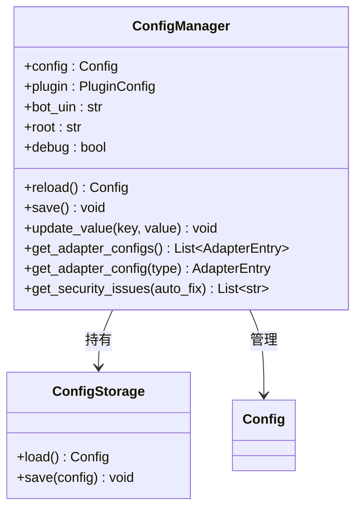

---

## 获取管理器

```python
from ncatbot.utils import get_config_manager, ncatbot_config

manager = get_config_manager()                  # 全局单例
manager = get_config_manager("/path/to/config.yaml")  # 指定路径
print(ncatbot_config.bot_uin)                   # 便捷别名
```

---

## 读取配置

`ConfigManager` 使用**懒加载**——首次访问 `config` 属性时才从磁盘加载：

```python
manager = get_config_manager()
uin = manager.bot_uin                         # str
config: Config = manager.config               # 完整配置对象

# 读取适配器配置
entry = manager.get_adapter_config("napcat")  # AdapterEntry | None
if entry:
    ws_uri = entry.config.get("ws_uri", "ws://localhost:3001")
```

> **已弃用**：`manager.napcat` 属性仍可用，但会发出 `DeprecationWarning`，请迁移到 `get_adapter_config()`。

---

## 修改与保存

### update_value — 通用键值写入

支持直接键和嵌套点分键：

```python
manager.update_value("debug", True)
manager.save()
```

### 修改适配器配置

```python
entry = manager.get_adapter_config("napcat")
if entry:
    entry.config["ws_uri"] = "ws://192.168.1.100:3001"
    entry.config["ws_token"] = "my_strong_token"
    manager.save()
```

> **已弃用**：`update_napcat()` 仍可用，但会发出 `DeprecationWarning`。

### reload — 重新加载

```python
config = manager.reload()  # 从磁盘重新读取
```

---

## 配置安全

安全工具定义在 `ncatbot.utils.config.security` 模块中。

### strong_password_check

检查密码/令牌强度（≥12位、含大小写字母+数字+特殊字符）：

```python
from ncatbot.utils.config.security import strong_password_check
strong_password_check("Abc123!defgh")   # True
```

### generate_strong_token

```python
from ncatbot.utils.config.security import generate_strong_token
token = generate_strong_token()       # 16 位强令牌
token = generate_strong_token(32)     # 32 位强令牌
```

### 自动修复

`ConfigManager.get_security_issues(auto_fix=True)` 遍历所有 NapCat 类型适配器，检查 `ws_token` 和 `webui_token` 安全性：

- 当 `ws_listen_ip == "0.0.0.0"` 且 `ws_token` 强度不足时，`auto_fix=True` 会自动生成新令牌
- 当 `enable_webui=True` 且 `webui_token` 强度不足时，同样自动替换

---

## 全局配置覆盖

在 `config.yaml` 的 `plugin.plugin_configs` 节统一管理插件配置，优先级高于插件本地配置：

```yaml
plugin:
  plugin_configs:
    MyPlugin:
      api_key: sk-prod-xxxx
      max_retries: 10
```

---

## Bilibili 凭据管理

Bilibili 适配器支持**扫码登录**：当 config.yaml 中 `sessdata` 为空或凭据已过期时，启动时会自动弹出二维码。扫码成功后，`sessdata`、`bili_jct`、`dedeuserid`、`ac_time_value` 会自动写回 config.yaml 的 bilibili 适配器配置段。

```yaml
# 扫码登录后 config.yaml 自动更新为:
adapters:
  - type: bilibili
    config:
      sessdata: "<自动填入>"    # 扫码后自动写入
      bili_jct: "<自动填入>"
      dedeuserid: "<自动填入>"
      ac_time_value: "<自动填入>"
      live_rooms: [12345]
```

> **安全提示**：`sessdata` 等凭据等同于登录 Cookie，请勿泄露 config.yaml 文件。建议将 config.yaml 加入 `.gitignore`。

---

## 延伸阅读

- [CLI 配置管理](../cli/1.commands.md#配置管理) — config show / get / set 命令
- [配置/数据 Mixin](../plugin/5a.config-data.md) — 插件中的 ConfigMixin
- [配置参考](../../reference/utils/1a_config.md) — Config / AdapterEntry / NapCatConfig 完整字段


---

# 文件: 6. 配置管理\README.md

---
title: 配置管理
createTime: 2026/03/19 17:26:45
permalink: /guide/44hxka0i/
---

> NcatBot 的配置体系基于 Pydantic 模型 + YAML 文件，提供类型安全的全局配置、适配器连接配置和插件独立配置。

---

## Quick Reference

### Config 模型字段

| 字段 | 类型 | 默认值 | 说明 |
|------|------|--------|------|
| `bot_uin` | `str` | `"123456"` | Bot QQ 号 |
| `root` | `str` | `"123456"` | 超级管理员 QQ 号 |
| `adapters` | `List[AdapterEntry]` | `[]` | 适配器列表 |
| `plugin` | `PluginConfig` | — | 插件配置 |
| `debug` | `bool` | `False` | 调试模式 |
| `websocket_timeout` | `int` | `15` | WebSocket 超时秒数 |
| `check_ncatbot_update` | `bool` | `True` | 启动时检查更新 |

### AdapterEntry 字段

| 字段 | 类型 | 说明 |
|------|------|------|
| `type` | `str` | 适配器类型（如 `"napcat"`） |
| `platform` | `str` | 平台标识（如 `"qq"`） |
| `enabled` | `bool` | 是否启用 |
| `config` | `dict` | 适配器专属配置（`ws_uri`, `ws_token` 等） |

### ConfigManager 方法

| 方法/属性 | 说明 |
|----------|------|
| `get_config_manager()` | 获取全局单例（`from ncatbot.utils import get_config_manager`） |
| `.config` | Config 模型实例 |
| `.bot_uin` | Bot QQ 号 |
| `.debug` | 调试模式 |
| `update_value(key, value)` | 修改配置值 |
| `save()` | 保存到 config.yaml |
| `reload()` | 重新加载配置文件 |
| `get_adapter_configs()` | 获取适配器配置列表 |

### 插件配置方法（ConfigMixin）

| 方法 | 说明 |
|------|------|
| `get_config(key, default=None)` | 读取配置值 |
| `set_config(key, value)` | 设置并立即持久化 |
| `remove_config(key)` | 移除配置项 |
| `update_config(updates: dict)` | 批量更新并持久化 |

### 最小 config.yaml

```yaml
bot_uin: '1234567890'
root: '9876543210'
adapters:
  - type: napcat
    platform: qq
    enabled: true
    config:
      ws_uri: ws://localhost:3001
```

> **旧格式兼容**：如果你的 `config.yaml` 仍使用顶层 `napcat:` 字段，框架会自动迁移为 `adapters:` 列表格式并回写配置文件。

---

## 本目录索引

| 文档 | 内容 |
|------|------|
| [配置管理与安全校验](1.config-security.md) | 配置管理器单例、读取/修改/保存 API、令牌强度检查、自动修复流程 |


---

# 文件: 7. RBAC 权限\1. RBAC 模型.md

---
title: RBAC 模型详解
createTime: 2026/03/19 17:26:45
permalink: /guide/06vj015z/
---

> 三层模型、权限路径体系、rbac.json 完整格式、角色继承与权限命名规范。

---

## 目录

- [1. 三层模型](#1-三层模型)
- [2. 权限路径体系](#2-权限路径体系)
  - [2.1 路径格式与 PermissionPath](#21-路径格式与-permissionpath)
  - [2.2 Trie 树结构](#22-trie-树结构)
  - [2.3 通配符机制](#23-通配符机制)
- [3. 角色与继承](#3-角色与继承)
- [4. rbac.json 完整格式](#4-rbacjson-完整格式)
- [5. 权限命名规范](#5-权限命名规范)

---

## 1. 三层模型

RBAC（Role-Based Access Control）的核心思想是通过角色间接关联用户与权限：

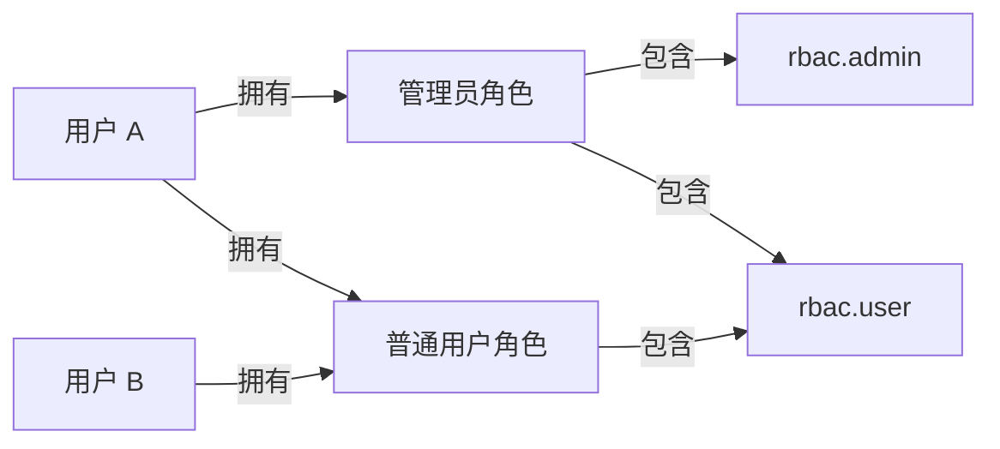

修改角色的权限集合即可批量影响该角色下所有用户。

NcatBot 在经典模型基础上做了以下扩展：

| 特性 | 说明 |
|---|---|
| **白名单/黑名单双模式** | 权限可通过白名单授予，也可通过黑名单显式拒绝 |
| **黑名单优先** | 检查规则：黑名单 > 白名单 > 默认拒绝 |
| **角色继承** | 角色可以继承父角色的权限集，支持多层继承 |
| **路径通配符** | 权限路径支持 `*`（单层）和 `**`（任意深度）通配符匹配 |
| **Trie 树存储** | 权限路径以 Trie 树结构存储，高效检索与前缀匹配 |
| **自动持久化** | 服务关闭时自动保存至 `data/rbac.json` |
| **插件友好** | 通过 `RBACMixin` 为插件提供简洁的高层 API |

判定流程：

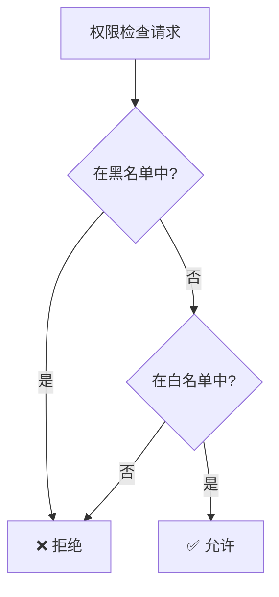

---

## 2. 权限路径体系

### 2.1 路径格式与 PermissionPath

权限路径使用 **点分隔** 的层级格式，由 `PermissionPath` 类表示：

```text
<命名空间>.<模块>.<操作>
```

**示例路径：**

| 路径 | 含义 |
|---|---|
| `rbac.admin` | RBAC 系统管理权限 |
| `rbac.user` | RBAC 系统普通用户权限 |
| `group_manager.admin` | 群管理插件的管理权限 |
| `my_plugin.feature.edit` | 自定义插件的编辑功能权限 |

`PermissionPath` 的核心属性：

```python
from ncatbot.service.builtin.rbac import PermissionPath

path = PermissionPath("plugin.admin.kick")
path.raw      # "plugin.admin.kick" — 原始字符串
path.parts    # ("plugin", "admin", "kick") — 各层级元组
path.SEPARATOR  # "." — 分隔符
```

`PermissionPath` 支持多种初始化方式：

```python
PermissionPath("a.b.c")           # 字符串
PermissionPath(["a", "b", "c"])   # 列表
PermissionPath(("a", "b", "c"))   # 元组
PermissionPath(another_path)      # 另一个 PermissionPath 实例
```

还可以使用 `join()` 拼接路径：

```python
base = PermissionPath("my_plugin")
full = base.join("admin", "kick")  # PermissionPath("my_plugin.admin.kick")
```

### 2.2 Trie 树结构

权限路径在内部以 **Trie 树**（`PermissionTrie`）存储，保证高效的路径检索和前缀匹配。

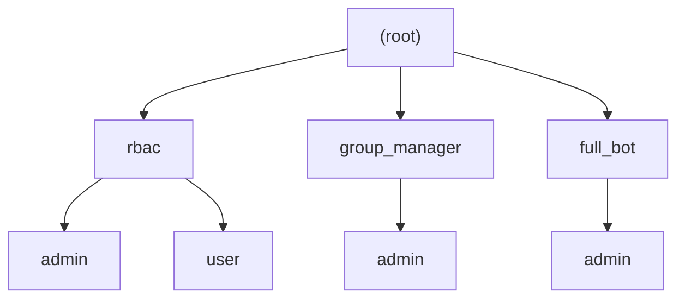

上图对应 `data/rbac.json` 中 `permissions` 字段的树结构：

```json
{
  "permissions": {
    "rbac": {
      "admin": {},
      "user": {}
    },
    "group_manager": {
      "admin": {}
    },
    "full_bot": {
      "admin": {}
    }
  }
}
```

`PermissionTrie` 的核心方法：

| 方法 | 签名 | 说明 |
|---|---|---|
| `add` | `add(path: str) -> None` | 添加权限路径（不允许含通配符） |
| `remove` | `remove(path: str) -> None` | 删除权限路径 |
| `exists` | `exists(path: str, exact: bool = False) -> bool` | 检查路径是否存在，`exact=True` 要求精确匹配到叶子节点 |
| `get_all_paths` | `get_all_paths() -> List[str]` | 获取所有已注册路径 |
| `to_dict` | `to_dict() -> Dict` | 导出为字典 |
| `from_dict` | `from_dict(data: Dict) -> None` | 从字典恢复 |

### 2.3 通配符机制

`PermissionPath.matches()` 方法支持两种通配符：

| 通配符 | 含义 | 示例 |
|---|---|---|
| `*` | 匹配 **单层** 任意节点 | `plugin.*.read` 匹配 `plugin.foo.read`，不匹配 `plugin.foo.bar.read` |
| `**` | 匹配 **任意深度** 的节点 | `plugin.**` 匹配 `plugin.foo`、`plugin.foo.bar.baz` |

```python
from ncatbot.service.builtin.rbac import PermissionPath

pattern = PermissionPath("plugin.*.read")
pattern.matches("plugin.news.read")      # True
pattern.matches("plugin.news.bar.read")  # False

pattern2 = PermissionPath("plugin.**")
pattern2.matches("plugin.news")          # True
pattern2.matches("plugin.news.detail")   # True
```

::: warning
通配符用于权限检查阶段的模式匹配，注册权限路径时（`PermissionTrie.add`）不允许包含通配符。
:::


---

## 3. 角色与继承

每个角色内部维护两个权限集合：

| 字段 | 类型 | 说明 |
|---|---|---|
| `whitelist` | `set` | 白名单 — 拥有该角色的用户将获得这些权限 |
| `blacklist` | `set` | 黑名单 — 拥有该角色的用户将被显式拒绝这些权限 |

角色支持 **多层继承**：子角色会聚合所有父角色的白名单和黑名单权限。

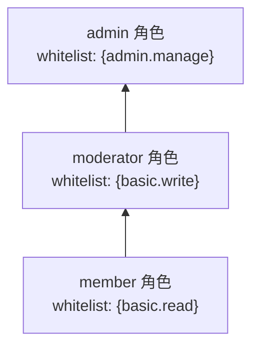

上图中 `admin` 继承 `moderator`，`moderator` 继承 `member`。拥有 `admin` 角色的用户将同时获得 `admin.manage`、`basic.write`、`basic.read` 三项权限。

**继承循环检测**：`set_role_inheritance` 会自动检测循环继承（如 A→B→A），检测到时抛出 `ValueError`。

---

## 4. rbac.json 完整格式

RBAC 数据默认存储在 `data/rbac.json`，由 `save_rbac_data` / `load_rbac_data` 函数处理。完整结构如下：

```json
{
  "case_sensitive": true,
  "default_role": null,
  "roles": {
    "rbac_admin": {
      "whitelist": ["rbac.admin", "rbac.user"],
      "blacklist": []
    },
    "rbac_user": {
      "whitelist": ["rbac.user"],
      "blacklist": []
    }
  },
  "users": {
    "3051561876": {
      "whitelist": [],
      "blacklist": [],
      "roles": ["rbac_admin"]
    }
  },
  "role_users": {
    "rbac_admin": ["3051561876"],
    "rbac_user": []
  },
  "role_inheritance": {
    "rbac_admin": [],
    "rbac_user": []
  },
  "permissions": {
    "rbac": {
      "admin": {},
      "user": {}
    }
  }
}
```

**各字段说明：**

| 字段 | 类型 | 说明 |
|---|---|---|
| `case_sensitive` | `bool` | 权限路径是否区分大小写 |
| `default_role` | `str \| null` | 新用户自动分配的默认角色 |
| `roles` | `Dict[str, {whitelist, blacklist}]` | 角色定义，每个角色包含白名单和黑名单 |
| `users` | `Dict[str, {whitelist, blacklist, roles}]` | 用户数据，包含个人权限和角色列表 |
| `role_users` | `Dict[str, List[str]]` | 角色到用户的反向映射 |
| `role_inheritance` | `Dict[str, List[str]]` | 角色继承关系（值为父角色列表） |
| `permissions` | `Dict` | 权限 Trie 树的字典序列化 |

**存储机制：**

存储层由 `storage.py` 中的四个函数组成：

| 函数 | 说明 |
|---|---|
| `save_rbac_data(path: Path, data: Dict) -> None` | 将数据保存为 JSON 文件，自动创建父目录 |
| `load_rbac_data(path: Path) -> Optional[Dict]` | 从文件加载数据，文件不存在时返回 `None` |
| `serialize_rbac_state(...)` | 将内存中的 RBAC 状态（含 `set` 等类型）序列化为可 JSON 化的字典 |
| `deserialize_rbac_state(data: Dict) -> Dict` | 将 JSON 数据反序列化为内存状态（`list` → `set` 等） |

序列化过程中的类型转换：

```text
内存 (set)  ──serialize──>  JSON (list)  ──deserialize──>  内存 (set)
```

---

## 5. 权限命名规范

推荐采用 `<插件名>.<模块>.<操作>` 的层级命名：

```text
✅ 推荐
my_plugin.admin                    # 插件管理权限
my_plugin.user                     # 插件用户权限
my_plugin.feature.read             # 功能级别 — 读
my_plugin.feature.write            # 功能级别 — 写

❌ 避免
admin                              # 过于笼统，容易与其他插件冲突
MyPlugin.Admin                     # 不建议使用大写（除非 case_sensitive=True 且有必要）
my-plugin.admin                    # 避免使用连字符，使用下划线
```

---

> **返回**：[RBAC 权限管理](README.md) · **下一篇**：[RBAC 核心模块与插件集成](2.integration.md)


---

# 文件: 7. RBAC 权限\2. 集成.md

---
title: RBAC 插件集成
createTime: 2026/03/19 17:26:45
permalink: /guide/t1gkufbl/
---

> EntityManager / PermissionAssigner / PermissionChecker 核心模块详解与 RBACMixin 插件集成、高级用法。

---

## 目录

- [1. 核心模块](#1-核心模块)
- [2. 插件集成：RBACMixin](#2-插件集成rbacmixin)
- [3. RBACService 完整 API](#3-rbacservice-完整-api)
- [4. 高级用法](#4-高级用法)

---

## 1. 核心模块

NcatBot 的 RBAC 由四个核心模块组成：

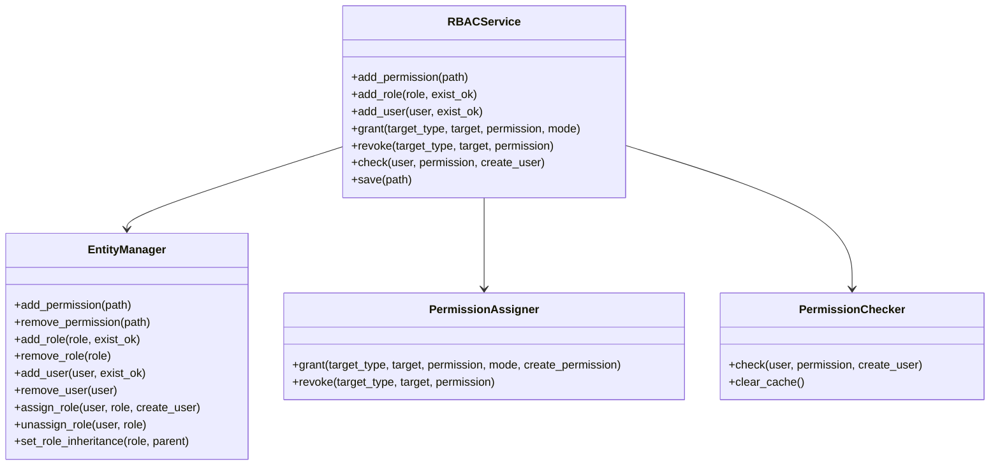

### 1.1 实体管理（EntityManager）

```python
# 权限管理
entity_manager.add_permission("my_plugin.admin")
entity_manager.permission_exists("my_plugin.admin")  # True

# 角色管理
entity_manager.add_role("admin", exist_ok=True)
entity_manager.set_role_inheritance("admin", "user")  # admin 继承 user 的权限

# 用户管理
entity_manager.add_user("12345678")
entity_manager.assign_role("12345678", "admin", create_user=True)
```

### 1.2 权限分配（PermissionAssigner）

```python
def grant(self, target_type, target, permission, mode="white", create_permission=True): ...
def revoke(self, target_type, target, permission): ...
```

- `mode="white"` 授予权限；`mode="black"` 拒绝权限
- `revoke` 同时从白名单和黑名单中移除

### 1.3 权限检查（PermissionChecker）

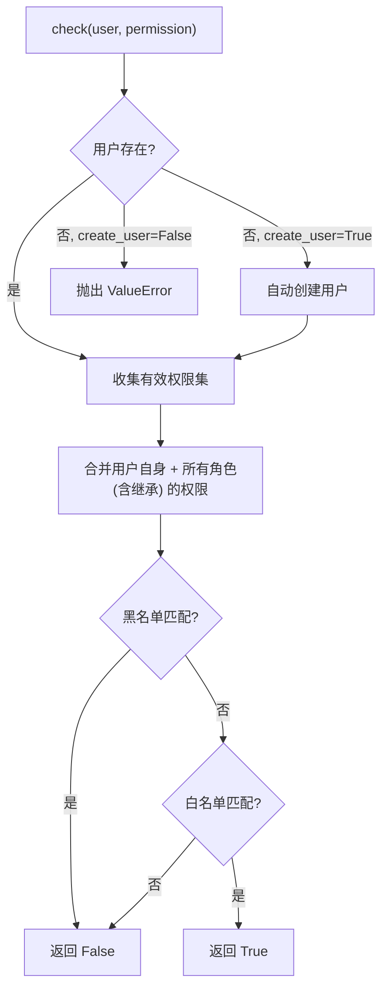

---

## 2. 插件集成：RBACMixin

> 详见 [guide/plugin/5b.rbac-schedule-event.md](../plugin/5b.rbac-schedule-event.md) 了解 RBACMixin 在插件中的基础用法。

---

## 3. RBACService 完整 API

### 3.1 服务生命周期

`RBACService` 继承自 `BaseService`，作为内置服务由 `ServiceManager` 管理。启动时从 `data/rbac.json` 加载数据，关闭时自动保存。

### 3.2 完整接口表

> 完整方法签名见 [reference/services/1_rbac_service.md](../../reference/services/1_rbac_service.md)

**权限路径管理**：`add_permission` / `remove_permission` / `permission_exists`

**角色管理**：`add_role` / `remove_role` / `role_exists` / `set_role_inheritance`

**用户管理**：`add_user` / `remove_user` / `user_exists` / `user_has_role` / `assign_role` / `unassign_role`

**权限分配**：`grant` / `revoke`

**权限检查**：`check`

**持久化**：`save`

---

## 4. 高级用法

### 4.1 层级权限设计

利用角色继承实现层级权限体系：

```python
async def on_load(self):
    self.add_permission("shop.browse")
    self.add_permission("shop.buy")
    self.add_permission("shop.manage")
    self.add_permission("shop.admin")

    self.add_role("shop_guest")
    self.add_role("shop_member")
    self.add_role("shop_manager")
    self.add_role("shop_admin")

    if self.rbac:
        self.rbac.grant("role", "shop_guest", "shop.browse")
        self.rbac.grant("role", "shop_member", "shop.buy")
        self.rbac.grant("role", "shop_manager", "shop.manage")
        self.rbac.grant("role", "shop_admin", "shop.admin")

        # 继承链: admin > manager > member > guest
        self.rbac.set_role_inheritance("shop_member", "shop_guest")
        self.rbac.set_role_inheritance("shop_manager", "shop_member")
        self.rbac.set_role_inheritance("shop_admin", "shop_manager")
```

### 4.2 默认权限策略

**默认角色**：通过 `default_role` 参数，新用户自动获得基础权限。

**白名单模式（推荐）**：默认拒绝，仅通过授权开放。

**黑名单排除**：`mode="black"` 拒绝特定用户，黑名单优先级高于白名单。

---

## 下一步

- [权限模型](1_model.md) — 权限路径、Trie 树、匹配规则
- [RBAC 服务参考](../../reference/services/1_rbac_service.md) — 完整 API 签名


---

# 文件: 7. RBAC 权限\README.md

---
title: RBAC 权限管理
createTime: 2026/03/19 17:26:45
permalink: /guide/ofkjsvyt/
---

> NcatBot 内置基于角色的访问控制（RBAC）服务，为插件提供细粒度的权限管理能力。

---

## Quick Reference

3 步为插件添加权限控制：**注册权限 → 配置角色 → 检查权限**。

### RBACMixin 方法

| 方法 | 说明 |
|------|------|
| `add_permission(path)` | 注册权限路径（如 `"my_plugin.admin"`） |
| `remove_permission(path)` | 移除权限路径 |
| `check_permission(user, permission)` | 检查用户是否有权限 → `bool` |
| `add_role(role, exist_ok=True)` | 创建角色 |
| `user_has_role(user, role)` | 检查用户角色归属 |
| `self.rbac` | 访问底层 `RBACService` 实例 |

### RBACService 底层操作

| 方法 | 说明 |
|------|------|
| `rbac.grant("role", role_name, permission)` | 给角色授权 |
| `rbac.revoke("role", role_name, permission)` | 撤销角色权限 |
| `rbac.grant("user", user_id, role=role_name)` | 给用户分配角色 |
| `rbac.check(user_id, permission)` | 检查权限 |

### 权限路径格式

- 使用点分层级：`"plugin_name.action"`，如 `"weather.query"`、`"admin.ban"`
- 通配符 `"*"` 匹配同级所有权限
- 基于 Trie 树实现，层级路径自动继承

### 典型流程

```python
async def on_load(self):
    self.add_permission("my_plugin.admin")
    self.add_role("my_plugin_admin")
    self.rbac.grant("role", "my_plugin_admin", "my_plugin.admin")

@registrar.on_group_command("管理命令")
async def on_admin_cmd(self, event: GroupMessageEvent):
    if self.check_permission(str(event.user_id), "my_plugin.admin"):
        await event.reply(text="执行成功")
```

---

## 本目录索引

| 文档 | 内容 |
|------|------|
| [RBAC 模型详解](1_model.md) | 三层模型、权限路径、Trie 树、通配符、rbac.json 格式、角色继承 |
| [RBAC 插件集成](2.integration.md) | RBACMixin API、RBACService 底层操作、层级权限与默认策略 |


---

# 文件: 8. 命令行工具\1. 命令.md

---
title: CLI 实战教程
createTime: 2026/03/19 17:26:45
permalink: /guide/actioaxc/
---

> 通过真实场景学习 `ncatbot` 命令行工具的使用。完整命令签名速查请见 [CLI 命令参考](../../reference/cli.md)。

---

## 场景一：从零创建并运行一个 Bot

### 第 1 步 — 初始化项目

```bash
mkdir my-bot && cd my-bot
ncatbot init
```

按提示输入机器人 QQ 号和管理员 QQ 号，完成后目录结构如下：

```text
my-bot/
├── config.yaml            # 自动生成的配置文件
├── plugins/               # 插件目录
└── plugins/{username}/    # 自动生成的模板插件
    ├── manifest.toml
    └── plugin.py
```

> 💡 也可以用 `ncatbot init --dir ./my-bot` 在当前目录外创建。

### 第 2 步 — 以开发模式启动

```bash
ncatbot dev
```

将以 `debug=True` + 热重载启动 Bot。修改插件代码后无需重启。

### 第 3 步 — 切换到生产模式

```bash
ncatbot run
```

关闭 debug 日志并保持热重载。如需禁用热重载：

```bash
ncatbot run --no-hot-reload
```

---

## 场景二：创建、调试并管理插件

### 创建一个新插件

```bash
ncatbot plugin create weather_bot
```

自动在 `plugins/weather_bot/` 下生成 `__init__.py`、`manifest.toml`、`plugin.py`、`README.md` 标准脚手架。

### 查看插件详情

```bash
ncatbot plugin list               # 列出所有已安装插件
ncatbot plugin info weather_bot   # 查看 weather_bot 的版本、作者等元信息
```

### 临时禁用 / 重新启用

```bash
ncatbot plugin disable weather_bot   # 禁用（加入黑名单）
ncatbot plugin enable weather_bot    # 启用（移出黑名单）
```

全局开关：

```bash
ncatbot plugin off    # 全局关闭插件加载
ncatbot plugin on     # 全局开启插件加载
```

### 删除插件

```bash
ncatbot plugin remove weather_bot   # 删除目录及黑白名单记录（需确认）
```

---

## 场景三：配置调优与安全检查

### 查看与修改配置

```bash
ncatbot config show                                       # 查看全部 YAML 配置
ncatbot config get napcat.ws_uri                          # 查看某一项
ncatbot config set napcat.ws_uri "ws://localhost:3001"    # 修改值（自动类型转换）
```

类型转换规则：`true`/`yes` → `bool`，纯数字 → `int`，`[...]` JSON → `list`。

### 安全检查

```bash
ncatbot config check
```

自动检查弱密码/Token、必填项缺失等安全问题，输出修复建议。

---

## 场景四：NapCat 连接诊断

Bot 连接不上 NapCat？用诊断命令一键排查：

```bash
ncatbot napcat diagnose            # 完整诊断（WebSocket + WebUI）
ncatbot napcat diagnose ws         # 仅检测 WebSocket 连接
ncatbot napcat diagnose webui      # 仅检测 WebUI 状态
```

可临时覆盖配置中的地址：

```bash
ncatbot napcat diagnose ws --uri ws://192.168.1.100:3001 --token mytoken
```

---

## 场景五：交互式操作（REPL）

直接运行 `ncatbot`（不带子命令）进入交互式 Shell，适合探索性操作：

```bash
$ ncatbot
ncatbot [123456789]> config show
ncatbot [123456789]> plugin list
ncatbot [123456789]> config set debug true
ncatbot [123456789]> exit
```

REPL 内支持所有子命令，输入 `help` 查看可用命令。

---

## 延伸阅读

- [CLI 命令参考](../../reference/cli.md) — 全部命令签名、选项、参数速查
- [配置管理指南](../configuration/) — config.yaml 字段详解
- [插件开发指南](../plugin/) — 插件开发完整教程


---

# 文件: 8. 命令行工具\README.md

---
title: CLI 工具 — 命令行管理 NcatBot
createTime: 2026/03/19 17:26:45
permalink: /guide/txmbm7xd/
---

> 通过 `ncatbot` 命令完成项目初始化、启动、插件管理、配置管理和 NapCat 诊断。

## Quick Reference

安装 NcatBot 后即可使用 `ncatbot` 命令。

### 命令一览

| 命令 | 参数 | 说明 |
|------|------|------|
| `ncatbot init` | `[--force]` | 初始化项目（生成 config.yaml + plugins/ + 模板插件） |
| `ncatbot run` | `[--config PATH]` | 启动 Bot |
| `ncatbot dev` | `[--config PATH]` | 开发模式启动（debug + 热重载） |
| `ncatbot` | — | 进入交互模式（REPL） |
| `ncatbot config get <key>` | | 读取配置值 |
| `ncatbot config set <key> <value>` | | 设置配置值 |
| `ncatbot plugin list` | | 列出已安装插件 |
| `ncatbot plugin install <name>` | | 安装插件 |
| `ncatbot plugin remove <name>` | | 卸载插件 |

## 本目录索引

| 文件 | 说明 | 难度 |
|------|------|------|
| [1.commands.md](1.commands.md) | 命令详解（初始化 / 启动 / 插件与配置管理） | ⭐ |

## 推荐阅读顺序

1. 先读 [命令详解](1.commands.md) — 从零创建并运行 Bot，管理插件和配置


---

# 文件: 9. 测试指南\1. 快速开始.md

---
title: 快速入门：插件测试
createTime: 2026/03/19 17:26:45
permalink: /guide/aec0t56x/
---

> 5 分钟为你的插件编写第一个自动化测试

---

## 目录

1. [前置条件](#1-前置条件)
2. [测试目录结构](#2-测试目录结构)
3. [第一个测试](#3-第一个测试)
4. [事件工厂基础](#4-事件工厂基础)
5. [运行测试](#5-运行测试)
6. [关键概念速查](#6-关键概念速查)
7. [下一步](#7-下一步)

---

## 1. 前置条件

安装测试依赖：

```bash
uv pip install ncatbot55[test]
```

这会安装 `pytest`、`pytest-asyncio`、`pytest-cov` 等工具。

在项目根目录的 `pyproject.toml` 中添加配置：

```toml
[tool.pytest.ini_options]
asyncio_mode = "strict"
testpaths = ["tests"]
```

> `asyncio_mode = "strict"` 要求所有异步测试显式标记 `@pytest.mark.asyncio` 或使用全局 `pytestmark`。

---

## 2. 测试目录结构

推荐的项目结构：

```python
my-bot/
├── plugins/
│   └── my_plugin/
│       ├── manifest.toml
│       └── main.py
├── tests/
│   ├── conftest.py          # 共享 fixtures
│   └── test_my_plugin.py    # 插件测试
├── main.py
└── pyproject.toml
```

`conftest.py` 可以放共享的 fixture：

```python
import pytest
from pathlib import Path

@pytest.fixture
def plugin_dir():
    return Path(__file__).resolve().parent.parent / "plugins"
```

---

## 3. 第一个测试

创建 `tests/test_my_plugin.py`：

```python
"""my_plugin 插件测试"""

import pytest
from pathlib import Path
from ncatbot.testing import PluginTestHarness, group_message

pytestmark = pytest.mark.asyncio

PLUGIN_NAME = "my_plugin"


@pytest.fixture
def plugin_dir():
    return Path(__file__).resolve().parent.parent / "plugins"


async def test_plugin_loads(plugin_dir):
    """插件可以正常加载"""
    async with PluginTestHarness(
        plugin_names=[PLUGIN_NAME],
        plugin_dir=plugin_dir,
    ) as h:
        assert PLUGIN_NAME in h.loaded_plugins


async def test_hello_command(plugin_dir):
    """群里发 'hello' → 回复消息"""
    async with PluginTestHarness(
        plugin_names=[PLUGIN_NAME],
        plugin_dir=plugin_dir,
    ) as h:
        # 1. 注入群消息事件
        await h.inject(group_message("hello", group_id="100", user_id="99"))

        # 2. 等待 handler 处理
        await h.settle()

        # 3. 断言 API 被调用
        assert h.api_called("send_group_msg")
```

### 测试三件套

所有测试都遵循同一模式：

```text
inject → settle → assert
```

1. **inject** — 注入一个事件（模拟用户发消息 / 入群 / 加好友等）
2. **settle** — 等待 handler 完成处理
3. **assert** — 检查 MockAPI 是否收到了预期的调用

---

## 4. 事件工厂基础

`ncatbot.testing` 提供 8 个工厂函数，快速构造测试事件：

```python
from ncatbot.testing import group_message, private_message

# 群消息 — 最常用
event = group_message("hello", group_id="123", user_id="456")

# 私聊消息
event = private_message("hi", user_id="456")
```

所有工厂函数返回经过 `model_validate` 验证的合法数据模型，可直接注入 Harness。

自定义参数通过关键字参数传入，未指定的使用默认值：

```python
# 使用默认值（group_id="100200", user_id="99999"）
event = group_message("test")

# 自定义发送者信息
event = group_message(
    "test",
    group_id="888",
    user_id="777",
    nickname="自定义昵称",
)
```

---

## 5. 运行测试

```bash
# 运行所有测试
python -m pytest tests/ -v

# 运行单个文件
python -m pytest tests/test_my_plugin.py -v

# 带覆盖率报告
python -m pytest tests/ --cov=plugins --cov-report=term-missing
```

VSCode 中也可使用 Debug 配置运行测试（参见 [开发环境搭建](../../contributing/development_setup/1_advanced.md)）。

---

## 6. 关键概念速查

| 概念 | 说明 |
|------|------|
| `PluginTestHarness` | 插件测试编排器，选择性加载指定插件，提供事件注入和 API 断言 |
| `TestHarness` | 基础编排器（不加载插件），PluginTestHarness 的父类 |
| `group_message()` | 事件工厂函数，构造群消息事件 |
| `private_message()` | 事件工厂函数，构造私聊消息事件 |
| `inject(event)` | 向 Harness 注入一个事件 |
| `settle(delay)` | 等待 handler 处理完成（默认 0.05 秒） |
| `api_called(action)` | 检查某个 API 是否被调用过 |
| `api_call_count(action)` | 获取某个 API 的调用次数 |
| `reset_api()` | 清空 API 调用记录（多步测试必备） |

### API action 名称速查

| action | 说明 |
|--------|------|
| `"send_group_msg"` | 发送群消息 |
| `"send_private_msg"` | 发送私聊消息 |
| `"delete_msg"` | 撤回消息 |
| `"set_group_kick"` | 踢出群成员 |
| `"set_group_ban"` | 群禁言 |

> 完整列表参见 [MockBotAPI 参考](../../reference/testing/2_factory_scenario_mock.md)。

---

## 7. 下一步

| 我想… | 去看 |
|-------|------|
| 深入了解 Harness 能力 | [Harness 详解](2.harness.md) |
| 学习 Scenario 链式测试 | [工厂与场景](3.factory-scenario.md) |
| 查完整 API 签名 | [测试 API 参考](../../reference/testing/) |


---

# 文件: 9. 测试指南\2. 测试工具.md

---
title: Harness 详解
createTime: 2026/03/19 17:26:45
permalink: /guide/lp4pyty0/
---

> TestHarness 与 PluginTestHarness 的完整使用指南

---

## 目录

1. [TestHarness 生命周期](#1-testharness-生命周期)
2. [事件注入](#2-事件注入)
3. [API 断言](#3-api-断言)
4. [Mock 响应配置](#4-mock-响应配置)
5. [PluginTestHarness](#5-plugintestharness)
6. [对比表](#6-对比表)
7. [常见模式与陷阱](#7-常见模式与陷阱)

---

## 1. TestHarness 生命周期

TestHarness 在后台启动一个完整的 `BotClient`（使用 `MockAdapter`），无需连接 NapCat。

### async with（推荐）

```python
async with TestHarness() as h:
    # h.bot, h.adapter, h.mock_api, h.dispatcher 可用
    await h.inject(group_message("hi"))
    await h.settle()
# 自动 stop
```

### 手动管理

```python
h = TestHarness()
await h.start()    # 启动 BotClient
try:
    # ... 测试逻辑 ...
finally:
    await h.stop()  # 停止 BotClient
```

### 内部做了什么

- `start()` → 调用 `BotClient.run_async()`，启动 MockAdapter + Dispatcher + HandlerDispatcher
- `stop()` → 调用 `BotClient.shutdown()`，停止所有后台任务
- MockAdapter 替代了真实的 NapCat 连接，所有 API 调用被 `MockBotAPI` 记录

---

## 2. 事件注入

### 注入单个事件

```python
await h.inject(group_message("hello"))
```

### 注入多个事件

```python
await h.inject_many([
    group_message("a"),
    private_message("b"),
    group_message("c"),
])
```

### settle — 等待处理

`settle()` 给 handler 一点时间执行（默认 50ms）：

```python
await h.settle()        # 默认 0.05 秒
await h.settle(0.2)     # 复杂 handler 可增大
```

> **何时增大 settle？** handler 中有 `asyncio.sleep()`、`self.wait_event()` 或多步对话时。

### wait_event — 等待特定事件

```python
event = await h.wait_event(
    predicate=lambda e: e.type == "message.group",
    timeout=2.0,
)
```

---

## 3. API 断言

所有 API 调用都被 `MockBotAPI` 记录为 `APICall(action, args, kwargs)`。

### 基础断言

```python
# 检查是否被调用
assert h.api_called("send_group_msg")

# 检查调用次数
assert h.api_call_count("send_group_msg") == 1

# 检查未被调用
assert not h.api_called("set_group_kick")
```

### 检查调用参数

```python
# 获取最近一次调用
call = h.last_api_call("send_group_msg")
print(call.action)   # "send_group_msg"
print(call.args)     # (group_id, message)
print(call.kwargs)   # 额外关键字参数

# 获取所有调用
calls = h.get_api_calls("send_group_msg")
for c in calls:
    print(c.args, c.kwargs)
```

### 重置调用记录

多步测试中，用 `reset_api()` 隔离每步的断言：

```python
await h.inject(group_message("step1"))
await h.settle()
assert h.api_called("send_group_msg")

h.reset_api()  # 清空记录

await h.inject(group_message("step2"))
await h.settle()
assert h.api_call_count("send_group_msg") == 1  # 只计 step2
```

---

## 4. Mock 响应配置

如果 handler 依赖 API 返回值，可预配置 Mock 响应：

```python
# 配置 get_group_member_info 的返回值
h.mock_api.set_response("get_group_member_info", {
    "user_id": "99",
    "nickname": "测试用户",
    "role": "member",
})

# handler 中 await self.api.get_group_member_info(...) 会收到上面的 dict
```

未配置的 API 调用返回空 `{}`。

---

## 5. PluginTestHarness

`PluginTestHarness` 继承 `TestHarness`，增加了插件选择性加载和查询能力。

### 构造参数

```python
async with PluginTestHarness(
    plugin_names=["hello_world"],       # 要加载的插件名
    plugin_dir=Path("examples/qq/01_hello_world"),  # 插件根目录
    skip_builtin=True,                  # 不加载内置插件（默认）
    skip_pip=True,                      # 不安装 pip 依赖（默认）
) as h:
    ...
```

> **plugin_dir** 是包含插件文件夹的**父目录**。例如插件在 `examples/qq/01_hello_world/hello_world/` 下，则 `plugin_dir` 应为 `examples/qq/01_hello_world`。

### 查询已加载的插件

```python
# 列出所有已加载的插件名
print(h.loaded_plugins)  # ["hello_world"]

# 获取插件实例
plugin = h.get_plugin("hello_world")

# 获取插件配置/数据
config = h.plugin_config("hello_world")
data = h.plugin_data("hello_world")
```

### 热重载

```python
success = await h.reload_plugin("hello_world")
assert success
```

### 传递依赖

如果目标插件在 `manifest.toml` 中声明了 `[dependencies]`，`PluginTestHarness` 会自动解析并加载传递依赖。

---

## 6. 对比表

| 能力 | TestHarness | PluginTestHarness |
|------|:-----------:|:-----------------:|
| 事件注入 | ✓ | ✓ |
| API 断言 | ✓ | ✓ |
| Mock 响应 | ✓ | ✓ |
| 选择性加载插件 | ✗ | ✓ |
| 插件状态查询 | ✗ | ✓ |
| 热重载 | ✗ | ✓ |
| skip_builtin / skip_pip | — | ✓ |

> **插件开发者请始终使用 `PluginTestHarness`。** `TestHarness` 主要用于框架内部测试。

---

## 7. 常见模式与陷阱

### ✅ 多步对话测试

```python
async with PluginTestHarness(...) as h:
    await h.inject(group_message("注册", group_id="100", user_id="99"))
    await h.settle(0.1)
    assert h.api_called("send_group_msg")

    h.reset_api()  # 关键：隔离每步断言
    await h.inject(group_message("张三", group_id="100", user_id="99"))
    await h.settle(0.1)
    assert h.api_called("send_group_msg")
```

### ⚠️ settle 时间不足

默认 `settle(0.05)` 对简单 handler 足够。如果断言失败，先尝试增大 settle：

```python
await h.settle(0.2)  # 复杂 handler
await h.settle(0.5)  # 含 wait_event 的多步对话
```

### ⚠️ plugin_dir 路径错误

```python
# ✗ 错误：指向插件本身
PluginTestHarness(plugin_names=["hello"], plugin_dir=Path("plugins/hello/"))

# ✓ 正确：指向插件的父目录
PluginTestHarness(plugin_names=["hello"], plugin_dir=Path("plugins/"))
```

### ⚠️ 同一测试中测试多个命令

每个命令测试前用 `reset_api()` 清空记录，避免断言受之前调用的干扰。


---

# 文件: 9. 测试指南\3. 工厂与场景.md

---
title: 事件工厂与场景构建器
createTime: 2026/03/19 17:26:45
permalink: /guide/7hj5h6v3/
---

> 构造测试事件和声明式场景测试

---

## 目录

1. [事件工厂](#1-事件工厂)
2. [Scenario 构建器](#2-scenario-构建器)
3. [组合场景示例](#3-组合场景示例)
4. [自动冒烟测试](#4-自动冒烟测试)
5. [NapCat E2E 简介](#5-napcat-e2e-简介)

---

## 1. 事件工厂

`ncatbot.testing` 提供 8 个工厂函数，覆盖消息、请求、通知三大类事件。

### 消息事件

```python
from ncatbot.testing import group_message, private_message

# 群消息
event = group_message("hello")
event = group_message("hello", group_id="888", user_id="777", nickname="小明")

# 私聊消息
event = private_message("hi")
event = private_message("hi", user_id="777")
```

### 请求事件

```python
from ncatbot.testing import friend_request, group_request

# 好友请求
event = friend_request(user_id="777", comment="我是小明")

# 加群请求
event = group_request(user_id="777", group_id="888", sub_type="add")
```

### 通知事件

```python
from ncatbot.testing import group_increase, group_decrease, group_ban, poke

# 群成员增加
event = group_increase(user_id="777", group_id="888")

# 群成员减少（被踢）
event = group_decrease(user_id="777", group_id="888", sub_type="kick")

# 群禁言（10 分钟）
event = group_ban(user_id="777", group_id="888", duration=600)

# 戳一戳
event = poke(user_id="777", target_id="10001", group_id="888")
```

### 默认值一览

| 参数 | 默认值 | 说明 |
|------|--------|------|
| `text` | `"hello"` | 仅消息事件 |
| `group_id` | `"100200"` | 群号 |
| `user_id` | `"99999"` | 发送者 QQ |
| `self_id` | `"10001"` | Bot QQ |
| `nickname` | `"测试用户"` | 仅消息事件 |
| `message_id` | 自增 | 自动递增，无需手动指定 |

### 自定义消息结构

默认情况下，`group_message("hello")` 会生成纯文本消息段。如果需要自定义消息结构：

```python
# 自定义 message 段（at + 文本）
event = group_message(
    "hello",
    message=[
        {"type": "at", "data": {"qq": "10001"}},
        {"type": "text", "data": {"text": " hello"}},
    ],
    raw_message="[CQ:at,qq=10001] hello",
)
```

### **extra 扩展

所有工厂函数支持 `**extra` 传入额外字段：

```python
event = group_message("hello", custom_field="value")
```

---

## 2. Scenario 构建器

`Scenario` 提供声明式链式 API，将「注入 → 等待 → 断言」流程写为可读的测试场景。

### 基础用法

```python
from ncatbot.testing import Scenario, group_message

await (
    Scenario("群消息回复")
    .inject(group_message("hello"))
    .settle()
    .assert_api_called("send_group_msg")
    .run(harness)
)
```

### 方法链一览

| 方法 | 说明 |
|------|------|
| `.inject(event)` | 注入一个事件 |
| `.inject_many(events)` | 注入多个事件 |
| `.settle(delay=0.05)` | 等待 handler 处理 |
| `.assert_api_called(action, **match)` | 断言 API 被调用，可选参数匹配 |
| `.assert_api_not_called(action)` | 断言 API 未被调用 |
| `.assert_api_count(action, count)` | 断言调用次数 |
| `.assert_that(predicate, desc)` | 自定义断言（接收 harness） |
| `.reset_api()` | 清空调用记录 |
| `.run(harness)` | 执行场景（async） |

### assert_api_called 参数匹配

```python
.assert_api_called("send_group_msg", group_id="888")
```

这会在所有 `send_group_msg` 调用中查找 `kwargs` 包含 `group_id="888"` 的调用。

### 自定义断言

```python
def check_message_content(h):
    call = h.last_api_call("send_group_msg")
    assert "hello" in str(call.args)

await (
    Scenario("检查消息内容")
    .inject(group_message("hello"))
    .settle()
    .assert_that(check_message_content, "回复中包含 hello")
    .run(harness)
)
```

---

## 3. 组合场景示例

### 多步对话

```python
await (
    Scenario("注册流程")
    .inject(group_message("注册", group_id="100", user_id="99"))
    .settle(0.1)
    .assert_api_called("send_group_msg")
    .reset_api()
    .inject(group_message("张三", group_id="100", user_id="99"))
    .settle(0.1)
    .assert_api_called("send_group_msg")
    .run(harness)
)
```

### 权限拦截

```python
await (
    Scenario("非管理员被拦截")
    .inject(group_message("/ban 777", group_id="100", user_id="99"))
    .settle()
    .assert_api_not_called("set_group_ban")
    .run(harness)
)
```

### 批量事件

```python
from ncatbot.testing import group_message, private_message

await (
    Scenario("多类型事件")
    .inject_many([
        group_message("a"),
        private_message("b"),
        group_message("c"),
    ])
    .settle(0.1)
    .assert_api_count("send_group_msg", 2)
    .assert_api_count("send_private_msg", 1)
    .run(harness)
)
```

---

## 4. 自动冒烟测试

`ncatbot.testing` 提供插件自动发现和冒烟测试代码生成。

### discover_testable_plugins

```python
from ncatbot.testing import discover_testable_plugins

manifests = discover_testable_plugins(Path("examples/"))
for m in manifests:
    print(m.name, m.version)
```

扫描目录下所有包含 `manifest.toml` 的子文件夹，返回 `PluginManifest` 列表。

### generate_smoke_tests

```python
from ncatbot.testing import generate_smoke_tests

code = generate_smoke_tests(manifests)
Path("tests/test_smoke.py").write_text(code)
```

生成的冒烟测试为每个插件验证：
- 加载成功
- 卸载成功
- 收到基础群消息不崩溃

### pytest 插件集成

在 `conftest.py` 中注册 pytest 插件，可使用 `--plugin-dir` 和 `@pytest.mark.plugin`：

```python
# conftest.py
from ncatbot.testing import *  # noqa
```

```bash
python -m pytest --plugin-dir=examples/ -v
```

---

## 5. NapCat E2E 简介

除了 Mock 环境下的离线测试，NcatBot 还支持连接真实 NapCat 的端到端测试。

E2E 测试位于 `tests/e2e/napcat/run.py`，需要：

- 运行中的 NapCat 实例
- 配置环境变量：`NAPCAT_TEST_GROUP`、`NAPCAT_TEST_USER`

```bash
$env:NAPCAT_TEST_GROUP="123456"
$env:NAPCAT_TEST_USER="654321"
python tests/e2e/napcat/run.py
```

> NapCat E2E 测试主要用于框架开发者验证真实协议兼容性，插件开发者通常使用 Mock 测试即可。

---

## 相关资源

| 资源 | 链接 |
|------|------|
| Harness 详解 | [2.harness.md](2.harness.md) |
| 测试 API 参考 | [reference/testing/](../../reference/testing/) |
| Factory + Mock 完整签名 | [reference/testing/2_factory_scenario_mock.md](../../reference/testing/2_factory_scenario_mock.md) |


---

# 文件: 9. 测试指南\README.md

---
title: 插件测试指南
createTime: 2026/03/19 17:26:45
permalink: /guide/2kgrpw5d/
---

> 为你的 NcatBot 插件编写自动化测试。

---

## Quick Reference

### 核心组件

| 组件 | 说明 |
|------|------|
| `PluginTestHarness` | 加载真实插件目录，模拟事件流的完整测试编排器 |
| `TestHarness` | 轻量无插件测试，直接注册 handler 并注入事件 |
| `Scenario` | 链式构建器，编排多步交互场景 |
| `MockAdapter` / `MockBotAPI` | 内存级模拟，无需网络 |

### 事件工厂函数

| 工厂函数 | 说明 |
|---------|------|
| `group_message(text, group_id=, user_id=)` | 群消息事件 |
| `private_message(text, user_id=)` | 私聊消息事件 |
| `friend_request(user_id=, comment=)` | 好友请求 |
| `group_request(group_id=, user_id=)` | 加群请求 |
| `group_increase(group_id=, user_id=)` | 群成员增加 |
| `group_decrease(group_id=, user_id=)` | 群成员减少 |
| `group_ban(group_id=, user_id=)` | 群禁言 |
| `poke(group_id=, user_id=)` | 戳一戳 |

### Harness 常用方法

| 方法 | 说明 |
|------|------|
| `h.inject(event)` | 注入事件 |
| `h.settle()` | 等待所有 handler 执行完成 |
| `h.api_called("method_name")` | 断言：API 被调用 → `bool` |
| `h.api_not_called("method_name")` | 断言：API 未被调用 → `bool` |
| `h.get_api_calls("method_name")` | 获取 API 调用记录列表 |

### 典型测试示例

```python
import pytest
from ncatbot.testing import PluginTestHarness, group_message

@pytest.mark.asyncio
async def test_hello_command():
    async with PluginTestHarness(plugin_names=["hello_world"], plugin_dir=Path("plugins/")) as h:
        await h.inject(group_message("hello", group_id="100", user_id="99"))
        await h.settle()
        assert h.api_called("send_group_msg")
```

---

## 本目录索引

| 章节 | 说明 | 难度 |
|------|------|------|
| [1. 快速入门](1.quick-start.md) | 5 分钟写出第一个插件测试 | ⭐ |
| [2. Harness 详解](2.harness.md) | TestHarness 与 PluginTestHarness 深入使用 | ⭐⭐ |
| [3. 工厂与场景](3.factory-scenario.md) | 事件工厂、Scenario 构建器、自动冒烟测试 | ⭐⭐ |


---

# 文件: 10. 多平台开发\README.md

---
title: 多平台开发指南
createTime: 2026/03/19 17:26:45
permalink: /guide/jod8utht/
---

> NcatBot 5.2 起支持跨平台运行 — 通过 Adapter/Platform/Trait 三层抽象实现多平台统一开发。

---

## Quick Reference

### 核心三层抽象

| 层 | 说明 |
|----|------|
| **Platform** | 适配器的 `platform` 标识（如 `"qq"`），用于事件路由、API 注入、Handler 过滤 |
| **API Trait** | 跨平台 API 能力协议：`IMessaging`（消息）、`IGroupManage`（群管理）、`IQuery`（查询）、`IFileTransfer`（文件） |
| **事件 Trait** | 事件实体通用能力：`Replyable`、`Deletable`、`GroupScoped`、`Kickable`、`Bannable`、`HasSender`、`Approvable` |

### 多平台 API 访问

| 操作 | 调用方式 |
|------|---------|
| QQ 平台 API | `self.api.qq.messaging.*` / `self.api.qq.manage.*` 等 || Bilibili 平台 API | `self.api.bilibili.send_danmu()` 等 |
| GitHub 平台 API | `self.api.github.create_issue()` / `self.api.github.merge_pr()` 等 || 按名称访问 | `self.api.platform("telegram").*` |
| 查看已注册平台 | `self.api.platforms` → `Dict[str, IAPIClient]` |

### 平台过滤

所有装饰器支持 `platform` 参数限定事件来源：

| 示例 | 说明 |
|------|------|
| `@registrar.on_group_command("hello", platform="qq")` | 仅 QQ 群命令 |
| `@registrar.on_message(platform="qq")` | 仅 QQ 消息 |
| `@registrar.on_notice()` | 所有平台通知（不设 platform） |

### 跨平台插件编写

使用 Trait 协议检查事件能力：`isinstance(event, Replyable)` → 可调用 `event.reply()`。

---

## 核心概念

### 平台 (Platform)

每个适配器有一个 `platform` 标识符（如 `"qq"`、`"telegram"`），用于：
- 事件路由：`event.platform` 区分事件来源
- API 注入：`HandlerDispatcher` 自动为事件实体注入对应平台的 API
- Handler 过滤：`@bot.on("message", platform="qq")` 仅接收 QQ 消息

### Trait 协议

跨平台 API 按功能拆分为 Trait 协议（`api/traits/`）：

| Trait | 功能 |
|---|---|
| `IMessaging` | 发送/撤回消息、转发 |
| `IGroupManage` | 群管理（踢人、禁言、设管理） |
| `IQuery` | 信息查询（好友列表、群信息） |
| `IFileTransfer` | 文件上传/下载 |

事件实体也有 Trait 协议（`event/traits.py`）：

| Trait | 功能 |
|---|---|
| `Replyable` | 可回复（`reply()`, `send()`） |
| `Deletable` | 可撤回（`delete()`） |
| `HasSender` | 有发送者信息 |
| `GroupScoped` | 群相关（有 `group_id`） |
| `Kickable` | 可踢出群成员 |
| `Bannable` | 可禁言 |

### 多平台运行

单个 `BotClient` 可同时运行多个适配器，共享插件和服务：

```python
from ncatbot.app import BotClient
from ncatbot.adapter import NapCatAdapter
from ncatbot.adapter.github import GitHubAdapter

bot = BotClient(adapters=[
    NapCatAdapter(),           # platform="qq"
    GitHubAdapter(),           # platform="github"
    # TelegramAdapter(),       # platform="telegram" (未来)
])
bot.run()
```

---

## 单平台用法（默认）

对于只使用 QQ 的场景，用法与 5.0 完全相同：

```python
from ncatbot.app import BotClient

bot = BotClient()  # 默认 NapCatAdapter

@bot.on("message.group")
async def on_msg(event):
    await event.reply("hello")

bot.run()
```

---

## 多平台 API 访问

`plugin.api`（`BotAPIClient`）是多平台门面，提供三种访问方式：

```python
# 方式 1: 直接属性访问（推荐，有类型提示）
await self.api.qq.messaging.send_group_msg(group_id, message)
await self.api.bilibili.send_danmu(room_id, text)
await self.api.github.create_issue_comment(repo, issue_number, body)

# 方式 2: 动态平台访问（按名称获取）
client = self.api.platform("qq")        # → IQQAPIClient
await client.messaging.send_group_msg(group_id, message)

# 方式 3: 查看已注册的平台
print(self.api.platforms)  # {"qq": <IQQAPIClient>, "bilibili": ..., "github": ...}
```

**选择建议**：

| 方式 | 适用场景 |
|------|---------|
| `api.qq.*` / `api.bilibili.*` | 平台确定、需要 IDE 自动补全 |
| `api.platform(name)` | 平台名来自变量或运行时动态决定 |
| `api.platforms` | 遍历/列出所有已注册平台 |

---

## 平台过滤

通过 `platform` 参数限定 handler 只接收特定平台的事件：

```python
@bot.on("message.group", platform="qq")
async def qq_only(event):
    """仅处理 QQ 群消息"""
    await event.reply("QQ!")

@bot.on("message")
async def all_platforms(event):
    """处理所有平台的消息"""
    print(f"来自 {event.platform} 的消息")
```

所有便捷装饰器都支持 `platform` 参数：

```python
@bot.on_group_message(platform="qq")
@bot.on_command("/help", platform="qq")
@bot.on_notice(platform="qq")
```

---

## 编写跨平台插件

使用 Trait 协议编写跨平台逻辑：

```python
from ncatbot.event import Replyable, GroupScoped

@bot.on("message")
async def cross_platform(event):
    if isinstance(event, Replyable):
        await event.reply("hello from any platform!")

    if isinstance(event, GroupScoped):
        print(f"群 {event.group_id} 的消息")
```

---

## 参考

- [适配器登录与使用指南](../adapter/) — 各平台具体的登录、认证、配置流程
- [架构文档](../../architecture.md) — 整体设计
- [ADR-005: 多平台架构](../../contributing/design_decisions/1_architecture.md#adr-005多平台架构--组合优于继承) — 设计决策
- [ADR-006: 多适配器运行时](../../contributing/design_decisions/1_architecture.md#adr-006多适配器运行时) — 运行时设计
- **示例**：[examples/cross_platform/](../../../examples/cross_platform/) — 跨平台开发示例

---

## 实战案例

### GitHub ↔ QQ 双向桥接

[examples/cross_platform/03_github_qq_bridge/](../../../examples/cross_platform/03_github_qq_bridge/) 展示了一个完整的跨平台双向桥接机器人：

- **GitHub → QQ**：Issue/PR/Push/Comment 事件自动转发到指定 QQ 群
- **QQ → GitHub**：在 QQ 群中引用(reply)通知消息，回复内容自动作为 GitHub Issue Comment 发送
- **消息映射追踪**：维护 QQ 消息 ID ↔ GitHub Issue 的映射表，支持 reply 反向关联

核心技术点：
- 同时使用 `registrar.github.*` 和 `registrar.qq.*` 平台子注册器
- 通过 `self.api.qq.*` 和 `self.api.github.*` 访问多平台 API
- `ConfigMixin` 读取桥接群号和仓库名，避免硬编码
- `HasSender` Trait 统一获取 GitHub/QQ 事件的发送者信息

> ⚠️ 本示例依赖开发中的 GitHub Adapter，API 可能变动。


---

# 文件: 11. 架构与概念\1. 架构总览.md

---
title: NcatBot 架构文档
createTime: 2026/03/19 17:26:45
permalink: /guide/uxoxz0nf/
---

::: info
5.2.0 &nbsp;|&nbsp; **Python**: ≥ 3.12 &nbsp;|&nbsp; **协议**: OneBot v11 (NapCat) + 跨平台扩展
:::


---

## 目录

- [1. 项目概览](#1-项目概览)
- [2. 目录结构](#2-目录结构)
- [3. 分层架构](#3-分层架构)
- [4. 核心模块详解](#4-核心模块详解)
  - [4.1 Adapter 适配层](#41-adapter-适配层)
  - [4.2 Types 类型模型](#42-types-类型模型)
  - [4.3 Event 事件实体](#43-event-事件实体)
  - [4.4 Core 核心引擎](#44-core-核心引擎)
  - [4.5 API 接口层](#45-api-接口层)
  - [4.6 Plugin 插件系统](#46-plugin-插件系统)
  - [4.7 Service 服务层](#47-service-服务层)
  - [4.8 Utils 工具集](#48-utils-工具集)
  - [4.9 Testing 测试支持](#49-testing-测试支持)
  - [4.10 App 编排层](#410-app-编排层)
  - [4.11 CLI 命令行工具](#411-cli-命令行工具)
- [5. 生命周期](#5-生命周期)
  - [5.1 启动流程](#51-启动流程)
  - [5.2 事件处理流程](#52-事件处理流程)
  - [5.3 关闭流程](#53-关闭流程)
- [6. 插件开发模型](#6-插件开发模型)
  - [6.1 插件结构](#61-插件结构)
  - [6.2 Mixin 体系](#62-mixin-体系)
  - [6.3 插件加载与热重载](#63-插件加载与热重载)
- [7. 关键设计模式](#7-关键设计模式)

---

## 1. 项目概览

NcatBot 是基于 OneBot v11 协议的 Python 跨平台机器人框架，通过可插拔的适配器架构同时支持 QQ（NapCat）、Bilibili 等多个平台。核心设计目标：

- **跨平台** — 适配器注册表 + 平台工厂，单一 BotClient 同时运行多个平台适配器
- **配置驱动** — YAML 配置声明适配器列表，自动创建与连接，支持旧格式自动迁移
- **异步事件驱动** — 基于 asyncio 的纯异步事件流，多适配器并行监听
- **插件化** — 热重载、依赖解析、Mixin 扩展的插件系统
- **服务化** — 内置 RBAC、定时任务、文件监控等可插拔服务

### 核心依赖

| 库 | 用途 |
|---|---|
| pydantic ≥ 2.0 | 事件数据模型校验 |
| websockets | WebSocket 通信 |
| aiofiles | 异步文件 I/O |
| pyyaml / toml | 配置文件解析 |
| schedule | 定时任务调度 |
| rich | 终端输出美化 |

---

## 2. 目录结构

```text
ncatbot/
├── adapter/              # 协议适配器
│   ├── base.py           #   BaseAdapter 抽象接口
│   ├── registry.py       #   AdapterRegistry 注册表（注册 / 发现 / 工厂）
│   ├── napcat/           #   NapCat OneBot v11 适配器（platform="qq"）
│   │   ├── adapter.py    #     NapCatAdapter 主编排器
│   │   ├── parser.py     #     NapCatEventParser（OB11→BaseEventData）
│   │   ├── constants.py  #     协议常量
│   │   ├── api/          #     NapCatBotAPI + Mixin（message / group / account / query / file）
│   │   ├── connection/   #     NapCatWebSocket + OB11Protocol
│   │   ├── setup/        #     Launcher / Installer / Auth / Config
│   │   ├── service/      #     PreUpload 文件流式上传服务
│   │   └── debug/        #     诊断工具（WebSocket / WebUI 检查）
│   ├── bilibili/         #   Bilibili 适配器（platform="bilibili"）
│   │   ├── adapter.py    #     BilibiliAdapter 主编排器
│   │   ├── parser.py     #     Bilibili 事件解析
│   │   ├── config.py     #     Bilibili 配置模型
│   │   ├── api/          #     BiliBotAPI + Mixin（comment / danmu / query / session / room / source）
│   │   └── source/       #     数据源管理器
│   ├── github/           #   GitHub 适配器（platform="github"，实验性）
│   │   ├── adapter.py    #     GitHubAdapter 主编排器
│   │   ├── parser.py     #     GitHub Webhook 事件解析
│   │   ├── config.py     #     GitHub 配置模型
│   │   ├── api/          #     GitHub API 操作
│   │   └── source/       #     数据源管理
│   └── mock/             #   测试用 Mock 适配器（platform 可配置）
├── api/                  # Bot API 封装
│   ├── base.py           #   IAPIClient 抽象接口
│   ├── client.py         #   BotAPIClient 多平台 API 门面
│   ├── proxy.py          #   BaseLoggingProxy 异步日志代理
│   ├── errors.py         #   API 异常定义
│   ├── traits/           #   跨平台 Trait 协议（IMessaging / IGroupManage / IQuery / IFileTransfer）
│   ├── qq/               #   QQ 平台 API
│   │   ├── interface.py  #     IQQAPIClient 接口
│   │   ├── client.py     #     QQAPIClient（4 命名空间 + Sugar）
│   │   ├── sugar.py      #     QQMessageSugarMixin 便捷发送
│   │   ├── messaging.py  #     QQMessaging 消息操作
│   │   ├── manage.py     #     QQManage 群管理
│   │   ├── query.py      #     QQQuery 信息查询
│   │   ├── file.py       #     QQFile 文件操作
│   │   └── proxy.py      #     QQLoggingProxy
│   └── bilibili/         #   Bilibili 平台 API 接口
├── app/                  # 应用编排层（Composition Root）
│   └── client.py         #   BotClient 生命周期管理（多适配器）
├── core/                 # 核心引擎
│   ├── dispatcher/       #   AsyncEventDispatcher 事件广播（event / stream / predicate）
│   └── registry/         #   HandlerDispatcher / Registrar / Hook / CommandHook / Context
├── event/                # 事件实体与工厂
│   ├── common/           #   跨平台基类与路由
│   │   ├── base.py       #     BaseEvent 包装器
│   │   ├── mixins.py     #     事件 Trait（Replyable / Kickable / ...）
│   │   └── factory.py    #     create_entity() + register_platform_factory()
│   ├── qq/               #   QQ 平台事件实体与工厂
│   └── bilibili/         #   Bilibili 平台事件实体与工厂
├── plugin/               # 插件框架
│   ├── base.py           #   BasePlugin 抽象基类
│   ├── ncatbot_plugin.py #   NcatBotPlugin（推荐基类）
│   ├── manifest.py       #   manifest.toml 解析
│   ├── loader/           #   PluginLoader / Indexer / Resolver / Importer / PipHelper
│   └── mixin/            #   Event / TimeTask / RBAC / Config / Data 混入
├── service/              # 服务层
│   ├── base.py           #   BaseService 抽象基类
│   ├── manager.py        #   ServiceManager 注册与生命周期
│   └── builtin/          #   RBAC / Schedule / FileWatcher 内置服务
├── types/                # Pydantic 数据模型
│   ├── common/           #   跨平台通用类型
│   │   ├── base.py       #     BaseEventData（含 platform 字段）
│   │   ├── sender.py     #     BaseSender
│   │   └── segment/      #     通用消息段（PlainText / At / Image / MessageArray 等）
│   ├── qq/               #   QQ 平台专用类型（消息 / 通知 / 请求 / 元事件）
│   ├── bilibili/         #   Bilibili 平台专用类型
│   └── napcat/           #   NapCat API 响应类型
├── testing/              # 测试工具
│   ├── factory.py        #   8 个事件数据工厂函数
│   ├── harness.py        #   TestHarness 测试编排
│   ├── plugin_harness.py #   PluginTestHarness 插件测试编排
│   ├── scenario.py       #   Scenario 链式场景构建器
│   └── discovery.py      #   插件发现与冒烟测试生成
├── utils/                # 公共工具
│   ├── logger/           #   日志配置
│   ├── config/           #   ConfigManager + Config / AdapterEntry 模型
│   ├── network.py        #   HTTP 工具函数
│   ├── error.py          #   异常体系
│   ├── status.py         #   全局状态追踪
│   └── prompt.py         #   交互式 CLI 工具
└── cli/                  # CLI 命令行工具
    ├── main.py           #   Click 入口
    ├── commands/         #   run / dev / config / plugin / napcat / init
    ├── utils/            #   颜色输出 / REPL
    └── templates/        #   插件脚手架模板
```

---

## 3. 分层架构

NcatBot 采用自底向上的分层设计，每层只**逻辑上依赖**其下方的层：

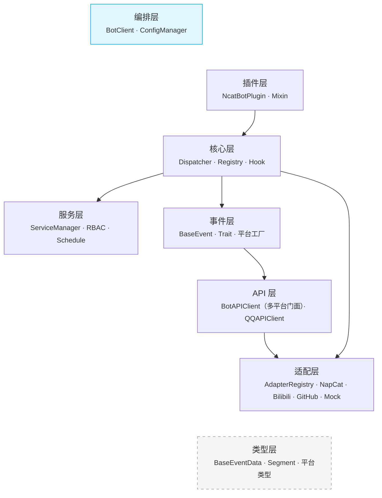

### 模块依赖关系

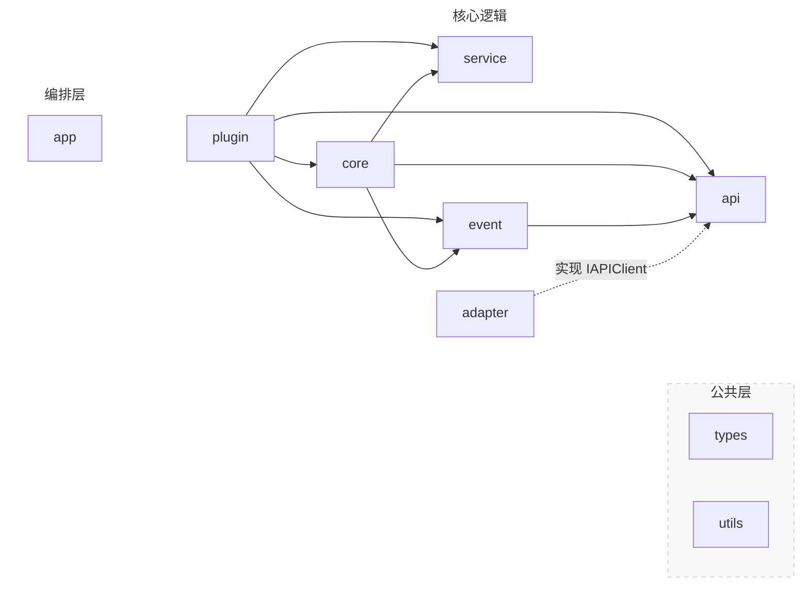

#### 依赖反转

`adapter -.->|实现 IAPIClient| api` 表示**依赖反转**：`IAPIClient` 接口定义在 `api/` 层，`NapCatBotAPI` 等具体实现在 `adapter/` 层。上层代码仅依赖接口，不依赖具体适配器。

---

## 4. 核心模块详解

### 4.1 Adapter 适配层

适配器负责底层协议通信，将平台特定的消息格式转换为框架统一的数据模型。

#### AdapterRegistry

适配器注册表是适配层的核心协调者，管理适配器的注册、发现和工厂创建：

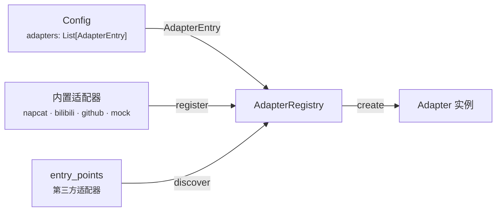

| 方法 | 签名 | 说明 |
|---|---|---|
| `register` | `(name, cls) → None` | 注册内置适配器 |
| `discover` | `() → Dict[str, Type]` | 合并内置 + `entry_points(group="ncatbot.adapters")` 第三方适配器 |
| `list_available` | `() → list[str]` | 列出所有可用适配器类型名 |
| `create` | `(entry, *, bot_uin, websocket_timeout) → BaseAdapter` | 根据 `AdapterEntry` 创建实例，可覆盖 platform |

模块级单例 `adapter_registry` 在 `adapter/__init__.py` 中注册内置适配器。

#### BaseAdapter

所有适配器的抽象基类，定义统一的生命周期接口：

| 属性/方法 | 说明 |
|---|---|
| `name: str` | 适配器名称，如 `"napcat"` |
| `platform: str` | 平台标识，如 `"qq"` / `"bilibili"` |
| `supported_protocols: List[str]` | 支持的协议列表 |
| `pip_dependencies: Dict[str, str]` | Python 包依赖声明 |
| `ensure_deps()` | 检查并安装 pip 依赖，返回是否就绪 |
| `setup()` | 准备平台环境（安装 / 配置 / 启动） |
| `connect()` | 建立连接并初始化 API |
| `disconnect()` | 断开连接，释放资源 |
| `listen()` | 阻塞监听消息，解析事件后调用回调 |
| `get_api() → IAPIClient` | 返回平台 API 实现 |
| `set_event_callback(cb)` | 设置事件数据回调（由 Dispatcher 注入） |
| `connected: bool` | 当前连接状态 |

回调签名为 `Callable[[BaseEventData], Awaitable[None]]`，即适配器只产出纯数据模型，不创建实体。

#### 已注册适配器

| 注册名 | 类 | 默认 platform | 说明 |
|---|---|---|---|
| `napcat` | `NapCatAdapter` | `"qq"` | QQ / OneBot v11（WebSocket + OB11Protocol） |
| `bilibili` | `BilibiliAdapter` | `"bilibili"` | Bilibili 直播 / 私信 / 评论 |
| `github` | `GitHubAdapter` | `"github"` | GitHub Webhook（实验性） |
| `mock` | `MockAdapter` | 可配置 | 测试用，支持 `inject_event()` 注入事件 |

### 4.2 Types 类型模型

所有事件数据的 Pydantic 模型定义，是框架最底层的协议无关数据结构。

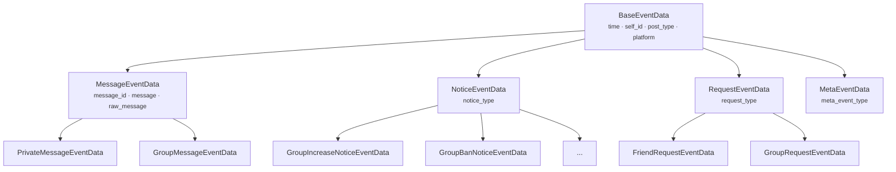

**关键字段**：`BaseEventData.platform` 默认为 `"unknown"`，各平台子类覆盖为具体值（QQ 子类默认 `"qq"`），用于 `create_entity()` 的平台路由。

#### 消息段体系

| 位置 | 内容 |
|---|---|
| `types/common/segment/` | 通用段基类（`base.py`）、文本段（`text.py`）、多媒体段（`media.py`）、`MessageArray` 容器（`array.py`） |
| `types/qq/segment/` | QQ 专用段（Face / Forward / Markdown 等） |

核心段类型：`PlainText` / `At` / `Image` / `Record` / `Video` / `File` / `Reply` / `Forward` / `MessageArray`

#### 平台类型包

| 包 | 说明 |
|---|---|
| `types/qq/` | QQ 消息 / 通知 / 请求 / 元事件数据模型 + 枚举 + 发送者 |
| `types/bilibili/` | Bilibili 平台专用数据类型 |
| `types/napcat/` | NapCat API 响应类型（`SendMessageResult` / `GroupInfo` 等） |

### 4.3 Event 事件实体

在 `BaseEventData`（纯数据）之上封装 API 操作能力，为插件提供富接口。

#### 事件 Trait 体系

通过 Mixin 为事件实体附加操作能力：

| Trait | 方法 | 说明 |
|---|---|---|
| **Replyable** | `reply(**kwargs)` | 回复事件 |
| **Deletable** | `delete()` | 撤回消息 |
| **HasSender** | `user_id` / `sender` | 包含发送者信息 |
| **GroupScoped** | `group_id` | 属于某个群/频道 |
| **Kickable** | `kick(**kwargs)` | 踢出成员 |
| **Bannable** | `ban(duration=1800)` | 禁言成员 |
| **Approvable** | `approve()` / `reject()` | 审批加群/好友请求 |

#### 核心组件

| 组件 | 职责 |
|---|---|
| **BaseEvent** | 包装 `BaseEventData` + `IAPIClient` 引用，`__getattr__` 代理数据字段 |
| **create_entity()** | 工厂函数：按 `data.platform` 路由到平台工厂，fallback 到 `BaseEvent` |
| **register_platform_factory()** | 注册平台专用事件工厂（如 QQ 注册 `create_qq_entity`） |

#### 平台路由机制

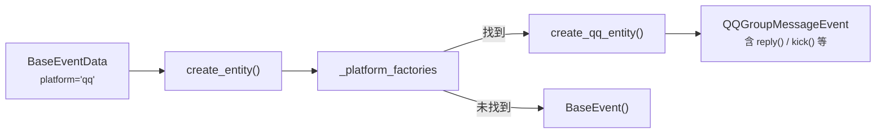

每个平台包（`event/qq/`、`event/bilibili/`）在导入时自动调用 `register_platform_factory()` 注册自己的工厂函数。

### 4.4 Core 核心引擎

#### 4.4.1 Dispatcher 事件分发

`AsyncEventDispatcher` — 纯异步事件广播器，无业务逻辑：

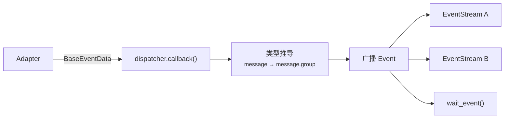

| 组件 | 职责 |
|---|---|
| **AsyncEventDispatcher** | 接收事件、类型推导（`BaseEventData.resolve_type()` 推导 `"message.group"` 等类型）、广播到所有活跃 Stream |
| **Event** | 不可变数据类，包含解析后的事件类型 + 原始数据 |
| **EventStream** | 异步迭代器，支持 `async with` / `async for` |

#### 4.4.2 Registry 处理器注册与路由

`HandlerDispatcher` — 事件到处理器的路由调度：

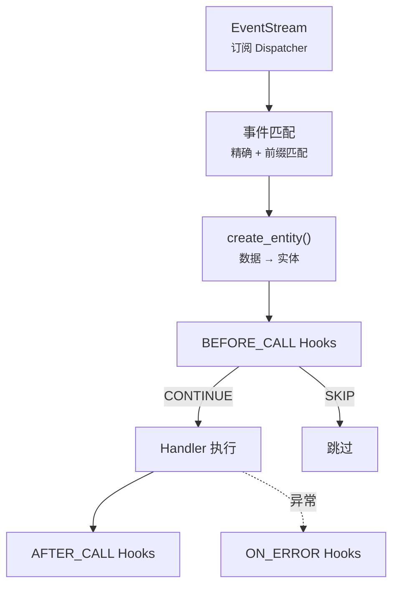

`HandlerDispatcher` 构造时接收 `platform_apis: Dict[str, IAPIClient]`，在 `create_entity()` 时根据 `data.platform` 选择对应的原始 API 注入事件实体。

| 组件 | 职责 |
|---|---|
| **HandlerDispatcher** | 订阅事件流、创建事件实体、匹配处理器、按优先级执行、管理 Hook 链 |
| **Registrar** | 装饰器工厂：`@registrar.on_group_command()` 等收集待注册处理器 |
| **Hook** | 中间件基类，`HookStage`（`BEFORE_CALL` / `AFTER_CALL` / `ON_ERROR`）+ `HookAction`（`CONTINUE` / `SKIP`） |
| **HookContext** | Hook 执行上下文：event / handler / services / kwargs / result / error / api |
| **CommandHook** | 命令匹配：按命令名精确/前缀匹配，类型注解参数绑定（`At` / `int` / `float` / `str`） |
| **内置过滤 Hook** | `MessageTypeFilter` / `PostTypeFilter` / `SubTypeFilter` / `SelfFilter` 等 |
| **内置匹配 Hook** | `StartsWithHook` / `KeywordHook` / `RegexHook` |
| **上下文隔离** | `set_current_plugin()` / `get_current_plugin()` — ContextVar 隔离并发插件注册 |

### 4.5 API 接口层

API 层采用多平台门面模式，`BotAPIClient` 作为统一入口路由到各平台的专用 API 客户端。

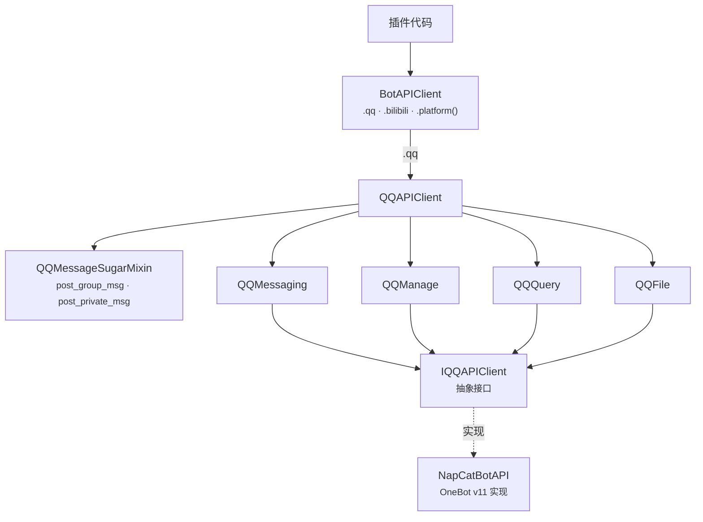

#### BotAPIClient（多平台门面）

| 方法/属性 | 签名 | 说明 |
|---|---|---|
| `register_platform` | `(name, client) → None` | 注册平台 API 客户端 |
| `platform` | `(name) → Any` | 获取指定平台的 API 客户端 |
| `qq` | `→ QQAPIClient` | QQ 平台快捷属性 |
| `bilibili` | `→ Any` | Bilibili 平台快捷属性 |
| `platforms` | `→ Dict[str, Any]` | 所有已注册平台 |

#### QQAPIClient

`QQAPIClient` 将 QQ 平台 API 组织为 4 个命名空间 + Sugar 便捷方法：

| 命名空间 | 说明 | 示例方法 |
|---|---|---|
| `messaging` | 消息操作 | `send_group_msg()` / `send_private_msg()` / `delete_msg()` |
| `manage` | 群管理 | `set_group_kick()` / `set_group_ban()` / `set_group_admin()` |
| `query` | 信息查询 | `get_group_list()` / `get_group_member_info()` / `get_login_info()` |
| `file` | 文件操作 | `upload_group_file()` / `download_file()` |

**Sugar 方法**（QQMessageSugarMixin）：

| 方法 | 说明 |
|---|---|
| `post_group_msg(group_id, text=, at=, reply=, image=, ...)` | 便捷群消息 — 关键字参数自动组装 MessageArray |
| `post_private_msg(user_id, text=, ...)` | 便捷私聊消息 |
| `post_group_array_msg(group_id, msg)` | 发送预构造的 MessageArray |
| `send_group_text()` / `send_group_image()` / ... | 单类型快捷发送 |

所有调用经 `QQLoggingProxy`（继承 `BaseLoggingProxy`）自动记录日志。

### 4.6 Plugin 插件系统

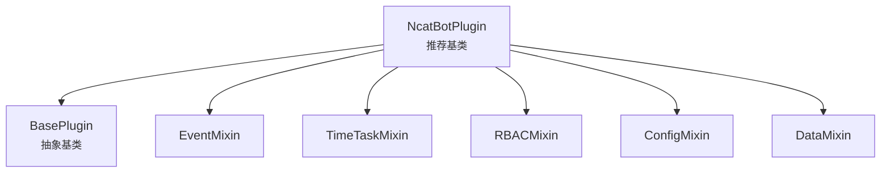

**加载子系统：**

| 组件 | 职责 |
|---|---|
| **PluginLoader** | 主协调器，组合 PluginIndexer + DependencyResolver + ModuleImporter |
| **PluginIndexer** | 扫描 `manifest.toml`，建立插件索引 |
| **DependencyResolver** | 拓扑排序解析依赖顺序 |
| **ModuleImporter** | 动态导入/卸载 Python 模块，查找插件类 |
| **PipHelper** | 校验 pip 依赖、自动安装缺失包（支持 uv / pip 后端） |

### 4.7 Service 服务层

长生命周期的后台服务，与插件系统解耦：

| 组件 | 职责 |
|---|---|
| **BaseService** | 抽象基类：`name` / `on_load()` / `on_close()` / `emit_event` |
| **ServiceManager** | 服务注册、依赖排序加载、统一关闭 |
| **RBACService** | 角色权限管理（`PermissionTrie` 高效查询、`EntityManager`、`PermissionChecker`） |
| **TimeTaskService** | 定时任务执行（`TaskExecutor` 异步执行、`TimeTaskParser` 解析 `'30s'` / `'HH:MM'`） |
| **FileWatcherService** | 文件系统监控，支持插件热重载 |

### 4.8 Utils 工具集

| 模块 | 职责 |
|---|---|
| `logger/` | `BoundLogger` 上下文日志 + `setup_logging()` 初始化（控制台 + 滚动文件） |
| `config/` | `ConfigManager` YAML 配置管理 + `Config` / `AdapterEntry` Pydantic 模型 |
| `network.py` | `post_json()` / `get_json()` / `download_file()` + 代理支持 |
| `error.py` | `NcatBotError` / `NcatBotValueError` / `NcatBotConnectionError` 异常体系 |
| `status.py` | `Status` 全局状态追踪 |
| `prompt.py` | 交互式 CLI 工具：`confirm()` / `ask()` / `select()` + `is_interactive()` 控制模式 |

#### Config 配置模型

配置系统通过 `adapters` 列表声明式定义适配器：

```yaml
# 新格式（推荐）
bot_uin: "999999"
adapters:
  - type: napcat
    platform: qq
    enabled: true
    config:
      ws_uri: ws://localhost:3001
      ws_token: napcat_ws
```

**AdapterEntry**：

| 字段 | 类型 | 说明 |
|---|---|---|
| `type` | `str` | 适配器注册表中的 key（`"napcat"` / `"bilibili"` / `"github"` / `"mock"`） |
| `platform` | `str = ""` | 平台标识，留空则使用适配器默认值 |
| `enabled` | `bool = True` | 是否启用 |
| `config` | `Dict[str, Any] = {}` | 适配器专属配置，透传给构造函数 |

**旧格式自动迁移**：`Config` 模型的 `_migrate_legacy_napcat` 验证器自动将旧版 `napcat:` 顶层配置转换为 `adapters:` 列表格式，并通过 `_migrated` PrivateAttr 标记触发配置文件自动回写。

### 4.9 Testing 测试支持

测试模块提供离线测试全套工具，无需真实连接即可验证框架和插件行为。

| 组件 | 职责 |
|---|---|
| **TestHarness** | 框架级测试编排：BotClient + MockAdapter + 事件注入 + API 断言 |
| **PluginTestHarness** | 插件测试编排：选择性加载指定插件，提供 `get_plugin()` / `reload_plugin()` |
| **Scenario** | 链式 DSL 构建器：`inject()` → `settle()` → `assert_api_called()` → `run()` |
| **factory** | 8 个事件数据工厂：`group_message()` / `private_message()` / `friend_request()` 等 |
| **discovery** | `discover_testable_plugins()` 扫描插件 + `generate_smoke_tests()` 生成测试代码 |

#### TestHarness 核心 API

| 方法 | 说明 |
|---|---|
| `inject(event_data)` | 注入单个事件 |
| `inject_many(events)` | 注入多个事件 |
| `settle(delay)` | 等待 handler 执行完 |
| `api_called(action) → bool` | 是否调用过某 API |
| `api_call_count(action) → int` | API 调用次数 |
| `get_api_calls(action) → list` | 某 API 的所有调用记录 |
| `reset_api()` | 清空调用记录 |

#### PluginTestHarness

继承 `TestHarness`，增加插件管理能力：

| 参数/方法 | 说明 |
|---|---|
| `plugin_names: list[str]` | 要加载的插件名列表 |
| `plugin_dir: Path` | 插件目录 |
| `loaded_plugins → list[str]` | 已加载插件名 |
| `get_plugin(name) → NcatBotPlugin` | 获取插件实例 |
| `plugin_config(name)` / `plugin_data(name)` | 获取插件配置/数据 |
| `reload_plugin(name)` | 热重载插件 |

### 4.10 App 编排层

`BotClient` 是整个 Bot 的入口和生命周期管理器（Composition Root），位于 `ncatbot/app/`，组装所有核心组件。

```python
from ncatbot.app import BotClient

bot = BotClient()

@bot.on("message.group")
async def on_group_msg(event):
    await event.reply("hello")

bot.run()
```

#### 多适配器支持

`BotClient` 支持三种适配器配置方式：

| 方式 | 用法 | 说明 |
|---|---|---|
| 配置驱动（推荐） | `BotClient()` | 从 `config.yaml` 的 `adapters` 列表自动创建 |
| 单适配器 | `BotClient(adapter=...)` | 直接传入适配器实例 |
| 多适配器 | `BotClient(adapters=[...])` | 传入适配器列表 |

**配置驱动创建流程**：

```mermaid
graph LR
    YAML["config.yaml"] --> Config["Config 模型<br/><small>adapters: List[AdapterEntry]</small>"]
    Config -->|遍历 enabled 条目| Registry["AdapterRegistry.create()"]
    Registry --> Adapters["[NapCatAdapter, BilibiliAdapter, ...]"]
```

#### 启动编排

`BotClient` 启动时按以下顺序组装各组件：

```mermaid
sequenceDiagram
    participant Client as BotClient
    participant Registry as AdapterRegistry
    participant Adapters as Adapters
    participant API as BotAPIClient
    participant Disp as Dispatcher
    participant HDis as HandlerDispatcher
    participant Svc as ServiceManager
    participant Plug as PluginLoader

    Client->>Registry: create(entry) × N
    Registry->>Adapters: 适配器实例列表
    Client->>Adapters: setup() + connect()
    Client->>API: register_platform(name, client) × N
    Client->>Disp: 绑定所有适配器回调
    Client->>HDis: 初始化（api, platform_apis）
    Client->>Svc: register_builtin() + load_all()
    Client->>Plug: load_all(plugin_dir)
    Client->>Adapters: listen()（多适配器 asyncio.gather 并行）
```

### 4.11 CLI 命令行工具

基于 Click 框架的命令行入口，位于 `ncatbot/cli/`：

| 子命令 | 功能 |
|---|---|
| `run` | 启动 Bot（可选 `--debug` / `--hot-reload`） |
| `dev` | 开发模式启动（默认开启 debug + 热重载） |
| `config` | 配置管理（查看 / 修改） |
| `plugin` | 插件管理（list / create / remove） |
| `napcat` | NapCat 安装与控制 |
| `init` | 初始化项目目录结构 |

---

## 5. 生命周期

### 5.1 启动流程

```mermaid
sequenceDiagram
    participant User as 用户代码
    participant Client as BotClient
    participant Config as ConfigManager
    participant Registry as AdapterRegistry
    participant Adapter as Adapters
    participant API as BotAPIClient
    participant Svc as ServiceManager
    participant Plug as PluginLoader

    User->>Client: bot.run()
    Client->>Config: 加载 config.yaml
    Client->>Registry: create(entry) × N
    Client->>Adapter: setup() + connect()
    Client->>API: register_platform() × N
    Client->>Client: 创建 Dispatcher + HandlerDispatcher
    Client->>Svc: register_builtin() + load_all()
    Client->>Plug: load_all(plugin_dir)
    Client->>Adapter: listen()
```

### 5.2 事件处理流程

以 `AsyncEventDispatcher` 为分界，事件处理分为**上游采集**和**下游消费**两阶段。

#### 5.2.1 上游：事件采集与广播

```mermaid
sequenceDiagram
    participant Platform as 平台
    participant Adapter as Adapter
    participant Disp as AsyncEventDispatcher

    Platform->>Adapter: 原始消息
    Adapter->>Adapter: 解析为 BaseEventData（含 platform 字段）
    Adapter->>Disp: callback(BaseEventData)
    Disp->>Disp: 推导事件类型（如 "message.group"）
    Disp->>Disp: 广播 Event 到所有消费者
```

#### 5.2.2 下游：Handler 匹配与执行

```mermaid
sequenceDiagram
    participant Disp as AsyncEventDispatcher
    participant HDis as HandlerDispatcher
    participant Hook as Hooks
    participant Handler as Handler 函数
    participant Plugin as 插件 EventMixin

    par HandlerDispatcher 消费
        Disp-->>HDis: Event（全量事件流）
        HDis->>HDis: create_entity(data, platform_apis[data.platform])
        HDis->>HDis: 匹配处理器（按优先级排序）
        HDis->>Hook: BEFORE_CALL
        alt CONTINUE
            HDis->>Handler: await handler(event)
            HDis->>Hook: AFTER_CALL
        else SKIP
            Note over HDis: 跳过该处理器
        end
        opt 异常
            HDis->>Hook: ON_ERROR
        end
    and 插件直接消费
        Disp-->>Plugin: async for event in self.events(...)
    and 一次性等待
        Disp-->>Plugin: wait_event(predicate, timeout)
    end
```

### 5.3 关闭流程

```mermaid
sequenceDiagram
    participant Client as BotClient
    participant Plug as PluginLoader
    participant Svc as ServiceManager
    participant HDis as HandlerDispatcher
    participant Disp as AsyncEventDispatcher
    participant Adapters as Adapters

    Client->>Plug: stop_hot_reload()
    Client->>Plug: unload_all()
    Client->>Svc: close_all()
    Client->>HDis: stop()
    Client->>Disp: close()
    Client->>Adapters: disconnect() × N
```

---

## 6. 插件开发模型

### 6.1 插件结构

每个插件是一个独立目录，包含 `manifest.toml` 和入口模块：

```text
plugins/
└── my_plugin/
    ├── manifest.toml    # 插件元信息
    └── main.py          # 入口模块
```

**manifest.toml 示例：**

```toml
name = "my_plugin"
version = "1.0.0"
main = "main.py"
author = "developer"
description = "示例插件"
dependencies = []
pip_dependencies = []
```

**入口模块示例：**

```python
from ncatbot.core import registrar
from ncatbot.event.qq import GroupMessageEvent
from ncatbot.plugin import NcatBotPlugin

class MyPlugin(NcatBotPlugin):
    name = "my_plugin"
    version = "1.0.0"

    async def on_load(self):
        pass

    async def on_close(self):
        pass

    @registrar.on_group_command("hello")
    async def on_hello(self, event: GroupMessageEvent):
        # self.api 是 BotAPIClient，通过 .qq 访问 QQ 平台 API
        await self.api.qq.post_group_msg(event.group_id, text="Hello! 👋")
```

### 6.2 Mixin 体系

`NcatBotPlugin` 通过 Mixin 组合提供丰富能力：

| Mixin | 能力 | 核心方法 |
|---|---|---|
| **EventMixin** | 事件消费 | `events(type)` / `wait_event(predicate, timeout)` |
| **TimeTaskMixin** | 定时任务 | `add_scheduled_task(name, interval)` / `remove_scheduled_task(name)` |
| **RBACMixin** | 权限管理 | `check_permission(user, perm)` / `add_permission()` / `remove_permission()` |
| **ConfigMixin** | 配置持久化 | `get_config(key)` / `set_config(key, value)` |
| **DataMixin** | 数据持久化 | `self.data[key]` — 字典式 JSON 存储 |

Mixin 加载顺序：EventMixin → TimeTaskMixin → RBACMixin → ConfigMixin → DataMixin。加载和卸载时 Mixin Hook 按 MRO 顺序自动执行。

### 6.3 插件加载与热重载

```mermaid
graph LR
    Scan["扫描 manifest.toml"]
    Index["建立索引"]
    Resolve["拓扑排序"]
    Import["动态导入模块"]
    Init["注入依赖 + 初始化"]
    Load["on_load()"]

    Scan --> Index --> Resolve --> Import --> Init --> Load
```

**热重载机制：**
- `FileWatcherService` 监控插件目录文件变更
- 检测到变更后通知 `PluginLoader`
- PluginLoader 执行：`unload_plugin()` → `rescan` → `load_plugin()`
- `HandlerDispatcher.revoke_plugin(name)` 清除旧处理器

---

## 7. 关键设计模式

| 模式 | 应用位置 | 说明 |
|---|---|---|
| **注册表模式** | `adapter/registry.py` | `AdapterRegistry` 管理适配器的注册、发现和工厂创建 |
| **门面模式** | `api/client.py` | `BotAPIClient` 作为多平台 API 的统一入口，路由到各平台专用客户端 |
| **适配器模式** | `adapter/` | `BaseAdapter` 抽象协议差异，支持 NapCat / Bilibili / GitHub / Mock 等多种实现 |
| **观察者模式** | `core/dispatcher/` | `AsyncEventDispatcher` 广播事件到多个 `EventStream` 订阅者 |
| **责任链模式** | `core/registry/` | Hook 链按优先级依次执行，可中断或跳过 |
| **工厂模式** | `event/common/factory.py` | `create_entity()` 根据 `data.platform` 路由到平台工厂创建对应事件实体 |
| **Mixin 模式** | `plugin/mixin/` | 通过多继承组合插件能力，按 MRO 管理生命周期 |
| **依赖注入** | `app/client.py` | `BotClient` 作为 Composition Root 组装并注入 API / Dispatcher / Services 到插件 |
| **ContextVar 隔离** | `core/registry/` | Python ContextVar 隔离并发插件加载的注册上下文 |
| **拓扑排序** | `plugin/loader/resolver.py` | 插件依赖解析，确保加载顺序正确 |


---

# 文件: 11. 架构与概念\2. 核心概念.md

---
title: 核心概念
createTime: 2026/03/19 17:26:45
permalink: /guide/zj0efcir/
---

> NcatBot 核心概念速查 — 术语定义、用途、关键类、概念关系一览。用于快速建立全局认知，或按术语检索理解特定概念。

---

## 概念地图

```text
                        ┌──────────────┐
                        │  BotClient   │ ← 编排入口：组装一切，管理生命周期
                        └──────┬───────┘
              ┌────────────────┼───────────────┐
              ▼                ▼               ▼
      ┌──────────────┐ ┌────────────┐  ┌─────────────┐
      │   Adapter    │ │  Service   │  │ PluginLoader │
      │ (NapCat/Mock)│ │ (RBAC/     │  │ (依赖解析 +  │
      │              │ │  Schedule/ │  │  热重载)     │
      └──────┬───────┘ │  Watcher)  │  └──────┬──────┘
             │         └────────────┘         │
             ▼                                ▼
    ┌─────────────────┐              ┌─────────────────┐
    │    Dispatcher    │              │     Plugin       │
    │ (事件广播 +      │◄────────────│ (NcatBotPlugin   │
    │  Handler 分发)  │  注册 Handler │  + Mixin 能力)   │
    └────────┬────────┘              └─────────────────┘
             │                                │
             ▼                                │ 使用
    ┌─────────────────┐              ┌────────┴────────┐
    │  Event / Entity  │              │   Registrar     │
    │ (BaseEventData + │              │ (装饰器注册 +    │
    │  Trait 协议)     │              │  Hook / Filter) │
    └────────┬────────┘              └─────────────────┘
             │
             ▼
    ┌─────────────────┐
    │   API Client     │
    │ (BotAPIClient +  │
    │  QQAPIClient +   │
    │  Sugar)          │
    └────────┬────────┘
             │
             ▼
    ┌─────────────────┐
    │ MessageArray /   │
    │ Segment          │
    │ (消息构造与解析)  │
    └─────────────────┘
```

数据流向：Adapter 接收原始数据 → Dispatcher 广播事件 → Handler（经 Hook 链）执行回调 → API Client 发送响应。

---

## 1. 适配器与平台 (Adapter / Platform / Trait)

### Adapter — 协议适配器

将特定平台的通信协议转换为框架统一的事件流和 API 接口。每个 Adapter 封装一个平台的 WebSocket 连接管理、协议解析、事件标准化和 API 调用转换。

**用途**：
- 隔离平台差异 — 插件代码无需关心底层协议细节
- 多平台并行 — 单个 BotClient 可同时运行 NapCat + Bilibili + GitHub 等多个适配器
- 可扩展 — 新增平台只需实现 BaseAdapter 接口，零修改已有代码

**内置适配器**：NapCatAdapter（QQ，OneBot v11）、BilibiliAdapter（Bilibili 直播/私信/评论）、GitHubAdapter（GitHub Webhook/Polling）、MockAdapter（测试用模拟）

**关键类**：`BaseAdapter`、`AdapterRegistry`、`NapCatAdapter`、`MockAdapter`

### Platform — 平台标识

字符串标识符（`"qq"` / `"bilibili"` / `"github"` / `"mock"`），决定事件路由到哪个适配器、API 调用走哪条通道。

**用途**：在多适配器模式下区分事件来源和 API 目标。

### Trait — 跨平台 API 协议

定义跨平台统一的 API 能力接口：`IMessaging`（消息收发）、`IGroupManage`（群管理）、`IQuery`（信息查询）、`IFileTransfer`（文件操作）。

**用途**：让插件编写平台无关的代码 — 只依赖 Trait 接口而不依赖具体平台 API。

**参见**：[适配器参考](reference/adapter/)、[多平台开发指南](guide/multi_platform/)

---

## 2. 事件系统 (Event / EventStream / Dispatcher)

### Event — 事件实体

适配器接收到的原始数据经 `create_entity()` 工厂函数包装为事件实体。事件实体携带平台信息和 Trait 能力（如 `Replyable` 允许直接回复、`GroupScoped` 提供 `group_id`）。

**用途**：
- 统一数据模型 — 不同平台的消息/通知/请求统一为同一套事件类型
- Trait 赋能 — 事件对象自带操作能力（`event.reply()`、`event.delete()`）

**关键类**：`BaseEvent`、`BaseEventData`、`GroupMessageEvent`、`PrivateMessageEvent`

### EventStream — 异步事件流

`AsyncEventDispatcher` 的消费接口，每个监听者获得独立的队列（互不阻塞）。支持 `async with` + `async for` 消费模式。

**用途**：
- 多步对话 — 在 Handler 中等待用户的后续输入
- 后台监控 — 持续监听特定类型的事件
- 插件间协调 — 订阅其他插件产生的事件

### Dispatcher — 事件分发器

分为两层：`AsyncEventDispatcher`（纯广播，一对多分发事件到所有订阅者）和 `HandlerDispatcher`（事件→Handler 匹配与执行，含 Hook 链调用）。

**用途**：
- 解耦事件生产与消费 — 适配器只管生产事件，不关心谁消费
- 多消费者并行 — 每个 EventStream 独立队列，一个消费者阻塞不影响其他

**关键类**：`AsyncEventDispatcher`、`HandlerDispatcher`

**参见**：[事件类型参考](reference/events/)、[核心模块参考](reference/core/)

---

## 3. 注册与拦截 (Registrar / Handler / Hook / Filter)

### Registrar — 全局注册器

提供装饰器 API，将函数注册为事件 Handler。通过 ContextVar 在模块加载期隔离各插件的注册上下文，确保 Handler 归属正确的插件。

**用途**：
- 声明式注册 — `@registrar.on_group_command("hello")` 一行代码完成事件绑定
- 自动参数绑定 — 命令装饰器自动为 Handler 附加 CommandHook，解析消息中的 `str`、`int`、`At` 参数

**核心装饰器**：
- 命令：`on_group_command()` / `on_private_command()` / `on_command()`
- 消息：`on_group_message()` / `on_private_message()` / `on_message()`
- 事件：`on_notice()` / `on_request()` / `on_poke()` / `on_friend_request()` / `on(event_type)`

### Handler — 事件处理器

注册的回调函数，关联到特定的 EventType + Predicate 条件。支持 `priority` 优先级排序。

**用途**：框架事件处理的基本单元 — 每个 Handler 就是一个功能点的入口。

### Hook — 拦截钩子

三阶段拦截链：`BEFORE_CALL`（Handler 执行前）→ `AFTER_CALL`（执行后）→ `ON_ERROR`（异常时）。每阶段可挂载多个 Hook，按优先级排序执行。BEFORE_CALL Hook 可返回 `SKIP` 阻止 Handler 执行。

**用途**：
- **权限检查** — 在 Handler 执行前验证用户权限，无权限则 SKIP
- **参数预处理** — CommandHook 自动从消息中解析命令名和参数，绑定到函数签名
- **文本匹配** — StartsWithHook / KeywordHook / RegexHook 匹配消息内容
- **日志审计** — AFTER_CALL Hook 记录谁触发了什么命令
- **错误通知** — ON_ERROR Hook 在 Handler 异常时通知管理员

### Filter — 过滤器（BEFORE_CALL Hook 的特化）

Filter 不是独立概念，而是所有返回 `SKIP` 来阻止 Handler 执行的 BEFORE_CALL Hook 的统称。

**内置 Filter**：
- `MessageTypeFilter("group"|"private")` — 消息来源过滤
- `SelfFilter()` — 过滤 Bot 自身发送的消息
- `PlatformFilter("qq")` — 平台过滤
- `PostTypeFilter()` / `SubTypeFilter()` — 事件类型过滤
- `CommandHook("命令名")` — 命令前缀匹配 + 参数解析（最常用，由命令装饰器自动附加）

**关键类**：`Registrar`、`HandlerEntry`、`HookManager`

**参见**：[Hook 机制指南](guide/plugin/6.hooks.md)、[Registry 参考](reference/core/3_registry.md)

---

## 4. 插件系统 (Plugin / Mixin / Lifecycle)

### Plugin — 插件

功能模块化的基本单元。每个插件是一个独立目录，含 `manifest.toml`（元信息）和 Python 模块。插件通过 PluginLoader 加载，支持依赖声明和拓扑排序。

**用途**：
- 功能隔离 — 每个功能封装为独立插件，独立开发/测试/部署
- 热重载 — 运行时修改代码自动重载，无需重启 Bot
- 依赖管理 — 声明式依赖，自动按序加载

### NcatBotPlugin — 推荐基类

组合了所有 Mixin 能力的插件基类。继承它即获得配置持久化、数据存储、权限控制、定时任务、事件流等全部能力。

### Mixin — 能力混入

通过多继承组合到 NcatBotPlugin 中，每个 Mixin 提供一种独立能力。MRO 保证 `on_load()` / `on_unload()` 按固定顺序执行，单个 Mixin 故障不影响其他。

| Mixin | 提供的能力 | 典型用途 |
|-------|-----------|---------|
| **EventMixin** | 事件流 + `wait_event()` | 监听事件、多步对话 |
| **TimeTaskMixin** | 定时任务 | 定时推送、定期清理 |
| **RBACMixin** | 权限控制 | 管理员命令保护、分级权限 |
| **ConfigMixin** | YAML 配置持久化 | 可修改的插件配置 |
| **DataMixin** | JSON 数据持久化 | 计数器、用户数据、状态存储 |

### Lifecycle — 插件生命周期

`on_load()` → 运行中 → `on_unload()`。加载时初始化资源和注册 Handler，卸载时清理资源和取消注册。热重载 = unload + 重新 import + load。

**关键类**：`NcatBotPlugin`、`BasePlugin`、`PluginLoader`、`DependencyResolver`

**参见**：[插件开发指南](guide/plugin/)、[插件系统参考](reference/plugin/)

---

## 5. 消息模型 (MessageArray / Segment)

### Segment — 消息段

消息的原子单元，对应 OneBot v11 的 CQ 码。每种段类型是一个 Pydantic 模型。

**常用段类型**：
- `PlainText` — 纯文本
- `At` — @某人（`user_id="all"` 为 @全体）
- `Image` — 图片（URL 或本地路径，`type=1` 为闪照）
- `Reply` — 引用回复
- `Face` — QQ 表情
- `Record` — 语音
- `Video` — 视频

### MessageArray — 消息容器

Segment 的有序容器，支持链式构造（`.add_text().add_at().add_image()`）和查询过滤（`.filter(At)` 获取所有 @段）。

**用途**：
- 自由组装 — 混合文本、图片、@、引用等构建复杂消息
- 结构化解析 — 从收到的消息中按类型提取特定段
- 参数绑定来源 — CommandHook 从 MessageArray 中提取 `At`、`Image` 等参数

### Sugar — 语法糖

`QQMessageSugarMixin` 提供的关键字快捷发消息方式：`api.qq.post_group_msg(group_id, text="...", image="...", at=uid)`。自动将关键字组装为 MessageArray。

**用途**：避免手动构造 MessageArray — 简单消息一行搞定。

### DownloadableSegment — 可下载媒体段

`Image`、`Video`、`Record`、`File` 四种媒体段的共同基类。携带 `file`、`url`、`file_id`、`file_size`、`file_name` 等字段，表示**一条消息中的某个媒体子段**。

**本质**：消息的组成部分 — 始终附着于 `MessageArray`，不独立存在。

### Attachment — 跨平台附件对象

平台无关的可下载文件模型（Pydantic）。携带 `name`、`url`、`size`、`content_type`、`kind` 等字段，表示**独立的可下载对象**。

**本质**：独立的数据实体 — 不依附于消息，可来自 GitHub Release 资产、文件系统，或经由段转换而来。

### DownloadableSegment vs Attachment

两者都代表"可下载的媒体"，但语义和使用场景截然不同：

| 维度 | DownloadableSegment | Attachment |
|------|-------------------|------------|
| **定位** | 消息的子段 | 独立的可下载对象 |
| **来源** | QQ/聊天消息中的媒体 | GitHub Release 资产、文件系统、或由段转换 |
| **所属** | 附着于 MessageArray | 独立存在 |
| **跨平台** | 与 OneBot 消息协议绑定 | 平台无关 |
| **获取方式** | `MessageArray.filter(Image)` | `event.get_attachments()` / `segment.to_attachment()` |

**桥接**：`DownloadableSegment.to_attachment()` 将消息段转为 Attachment，`Attachment.to_segment()` 反向转回。`MessageArray.get_attachments()` 批量提取所有可下载段为 `AttachmentList`。

**设计意图**：Attachment 提供统一的跨平台文件处理抽象 — 无论文件来自 QQ 消息图片还是 GitHub Release，都用同一套 `download()` / `as_bytes()` / `upload_attachment()` 接口操作。

**关键类**：`Segment`（各子类）、`MessageArray`、`QQMessageSugarMixin`、`Attachment`（及子类）、`AttachmentList`

**参见**：[消息发送指南](guide/send_message/)、[类型参考](reference/types/)

---

## 6. 服务层 (Service / RBAC / Schedule)

### Service — 可插拔服务

生命周期由 ServiceManager 管理的单例组件。提供插件可共享的后台功能。

**用途**：
- 跨插件共享 — 多个插件共用同一个 RBAC 服务或定时任务调度器
- 生命周期管理 — 随 Bot 启动加载，关闭时自动清理

### RBACService — 权限服务

基于 Trie 树的权限管理。支持层级权限路径（`admin.ban.temporary`）、通配符匹配（`admin.*`）、角色继承。

**用途**：
- 命令权限控制 — 限制敏感命令仅管理员可用
- 分级权限 — 不同角色（owner > admin > moderator > user）拥有不同权限范围
- 插件集成 — 通过 RBACMixin 一行代码检查权限

### TimeTaskService — 定时任务服务

支持间隔时间（`"60s"` / `"1h"`）和 cron 表达式的任务调度。

**用途**：
- 定时推送 — 每日新闻、整点报时
- 定期清理 — 清理过期数据、刷新缓存
- 心跳检测 — 定期检查服务状态

### FileWatcherService — 文件监控服务

监控插件 `.py` 文件变化，触发热重载。

**用途**：开发模式下修改代码自动重载，无需手动重启 Bot。

**关键类**：`BaseService`、`ServiceManager`、`RBACService`、`TimeTaskService`、`FileWatcherService`

**参见**：[RBAC 指南](guide/rbac/)、[服务层参考](reference/services/)

---

## 7. Predicate DSL — 声明式事件过滤

将 lambda 过滤条件替换为可组合的运算符表达式，用于 `wait_event()` 和事件流过滤。

**用途**：
- 多步对话 — 等待同一用户在同一群的下一条消息：`from_event(event) * msg_equals("确认")`
- 可读性 — 比嵌套 lambda 和 hasattr 检查更直观
- 可组合 — `*`（AND）、`+`（OR）、`~`（NOT）运算符自由组合

**核心工厂函数**：`from_event()`（自动推导会话上下文）、`same_user()`、`same_group()`、`msg_equals()`、`msg_matches()`

**参见**：[Predicate DSL 指南](guide/plugin/4c.predicate-dsl.md)、[Predicate API 参考](reference/core/2_predicate.md)

---

## 8. 编排入口 (BotClient)

### BotClient — 应用编排器

Composition Root — 组装适配器、分发器、插件加载器、服务管理器和 API 客户端，管理整个 Bot 的生命周期。

**用途**：
- 零配置启动 — `BotClient().run()` 从 `config.yaml` 自动加载一切
- 异步非阻塞启动 — `await BotClient().run_async()` 完成 startup 后立即返回，`bot.api` / `bot.dispatcher` 可用于自定义事件编排
- 多适配器编排 — 同时连接多个平台
- 生命周期管理 — 启动（配置→适配器→分发器→插件→服务→监听）→ 关闭（逆序清理）

**关键类**：`BotClient`

**参见**：[架构文档 §4.10](architecture.md)、[Quick Start](guide/quick_start/)


---

# 文件: README.md

---
title: 使用指南
createTime: 2026/03/19 17:26:45
permalink: /guide/
---

> NcatBot 从入门到进阶的完整指南 — 面向 Bot 开发者的任务导向文档。

---

## Quick Reference

### 两种使用模式

| 模式 | 入口 | 特点 | Mixin / 热重载 |
|------|------|------|---------------|
| 非插件模式 | `main.py` + `registrar` 装饰器 | 快速原型，无需插件目录 | ❌ |
| 插件模式（推荐） | `NcatBotPlugin` 子类 + `manifest.toml` | 配置持久化、RBAC、定时任务等 | ✅ |

从零开始的完整流程见 [quick_start/](quick_start/)。

### 核心导入路径

| 导入 | 说明 |
|------|------|
| `from ncatbot.app import BotClient` | 应用入口 |
| `from ncatbot.core import registrar` | 全局事件注册器 |
| `from ncatbot.plugin import NcatBotPlugin` | 插件基类 |
| `from ncatbot.event.qq import GroupMessageEvent` | QQ 群消息事件 |
| `from ncatbot.event.qq import PrivateMessageEvent` | QQ 私聊事件 |
| `from ncatbot.types import MessageArray` | 消息数组 |
| `from ncatbot.utils import get_log` | 日志工具 |

### 最常用操作速查

| 操作 | 调用方式 | 需要插件模式 |
|------|---------|-------------|
| 注册群命令 | `@registrar.on_group_command("cmd")` | ❌ |
| 注册私聊命令 | `@registrar.on_private_command("cmd")` | ❌ |
| 回复消息 | `await event.reply(text="内容")` | ❌ |
| 发送群消息 | `await self.api.qq.post_group_msg(gid, text="内容")` | ❌ |
| 发送图片 | `await self.api.qq.send_group_image(gid, "url")` | ❌ |
| 读取配置 | `self.get_config("key")` | ✅ ConfigMixin |
| 写入配置 | `self.set_config("key", value)` | ✅ ConfigMixin |
| 持久化数据 | `self.data["key"] = value` | ✅ DataMixin |
| 权限检查 | `self.check_permission(uid, "perm")` | ✅ RBACMixin |
| 定时任务 | `self.add_scheduled_task("名称", "60s")` | ✅ TimeTaskMixin |
| 等待事件 | `await self.wait_event(predicate, timeout=30)` | ✅ EventMixin |
| 群管理 | `await self.api.qq.manage.set_group_ban(gid, uid)` | ❌ |
| 信息查询 | `await self.api.qq.query.get_group_info(gid)` | ❌ |

### 按需求找文档

| 我想… | 去这里 |
|-------|--------|
| 从零跑通第一个 Bot | [quick_start/](quick_start/) |
| 开发插件 | [plugin/](plugin/) |
| 发消息、构造复杂消息 | [send_message/](send_message/) |
| 调用群管理/查询/文件 API | [api_usage/](api_usage/) |
| 管理 config.yaml | [configuration/](configuration/) |
| 用 CLI 管理项目 | [cli/](cli/) |
| 添加权限控制 | [rbac/](rbac/) |
| 写插件测试 | [testing/](testing/) |
| 接入多平台 | [multi_platform/](multi_platform/) |
| 各平台登录与配置 | [adapter/](adapter/) |

---

## 本目录索引

| 目录 | 说明 | 难度 |
|------|------|------|
| [quick_start/](quick_start/) | 从零启动 — 安装、配置、两种模式启动 | ⭐ |
| [adapter/](adapter/) | 适配器登录与使用 — NapCat / Bilibili / GitHub / Mock | ⭐ |
| [plugin/](plugin/) | 插件开发完整指南（11 篇） | ⭐ - ⭐⭐⭐ |
| [send_message/](send_message/) | 消息发送 — 消息段、MessageArray、转发、语法糖 | ⭐ |
| [api_usage/](api_usage/) | Bot API 使用 — 消息、群管理、查询 | ⭐⭐ |
| [configuration/](configuration/) | 配置管理 — config.yaml 结构与安全校验 | ⭐⭐ |
| [cli/](cli/) | CLI 工具 — init / run / dev / config / plugin | ⭐ |
| [rbac/](rbac/) | RBAC 权限管理 — 权限模型与插件集成 | ⭐⭐⭐ |
| [testing/](testing/) | 插件测试 — Harness、工厂函数、Scenario | ⭐⭐ |
| [multi_platform/](multi_platform/) | 多平台开发 — Trait 协议与跨平台插件 | ⭐⭐ |

---

## 交叉引用

- API 完整签名 → [reference/](../reference/)
- 核心概念速查 → [concepts.md](../concepts.md)
- 架构全景 → [architecture.md](../architecture.md)
