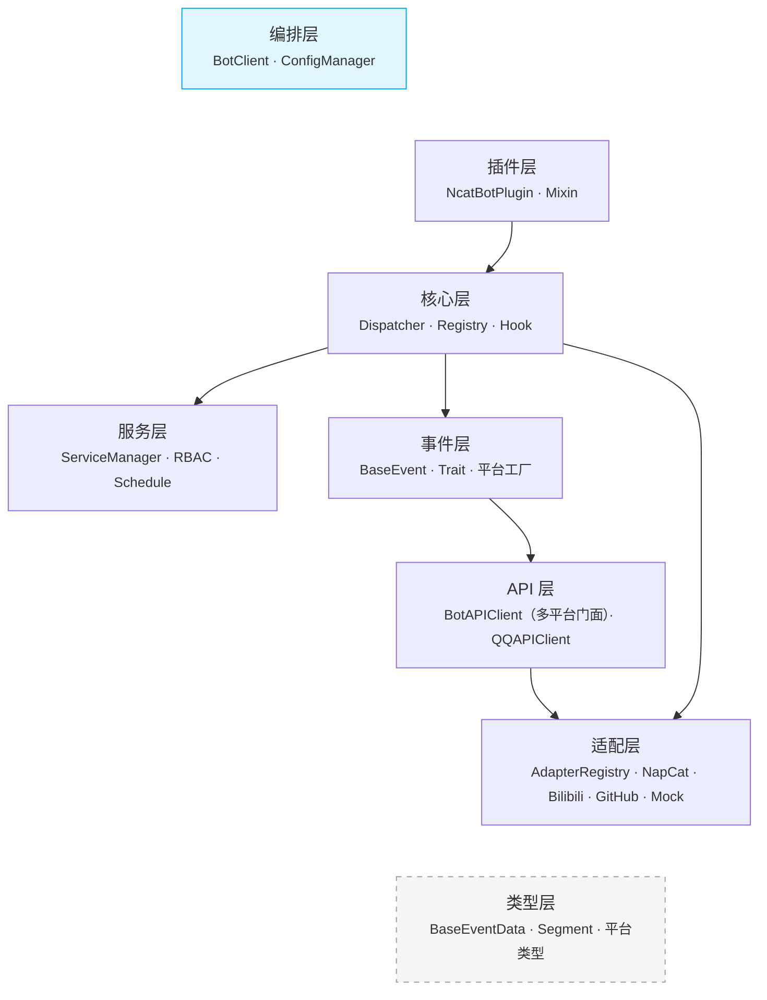
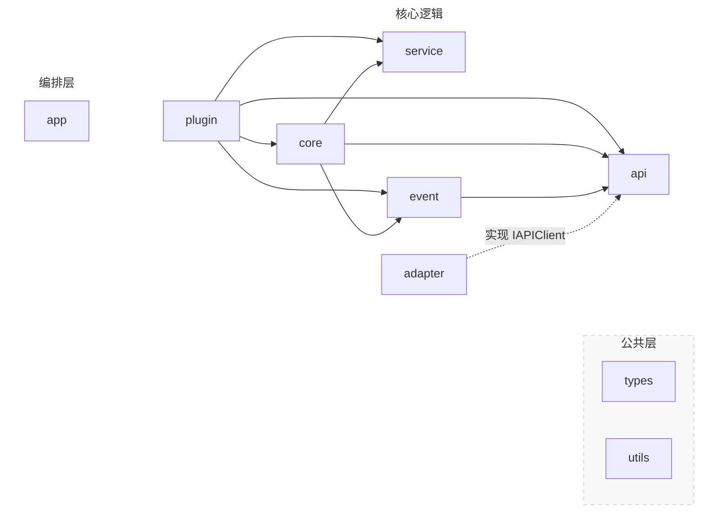

::: info
5.2.0 &nbsp;|&nbsp; **Python**: ≥ 3.12 &nbsp;|&nbsp; **协议**: OneBot v11 (NapCat) + 跨平台扩展
:::


---

## 目录

- [1. 项目概览](#1-项目概览)
- [2. 目录结构](#2-目录结构)
- [3. 分层架构](#3-分层架构)
- [4. 关键设计模式](#4-关键设计模式)

**详细模块文档：**

| 文档 | 内容 |
|------|------|
| [数据流模块](<3. 数据流模块.md>) | Adapter · Types · Event · Core · API 层详解 |
| [框架组件与生命周期](<4. 框架组件与生命周期.md>) | Plugin · Service · Utils · Testing · App · CLI + 启动/事件/关闭流程 + 插件开发模型 |

---

## 1. 项目概览

NcatBot 是基于 OneBot v11 协议的 Python 跨平台机器人框架，通过可插拔的适配器架构同时支持 QQ（NapCat）、Bilibili 等多个平台。核心设计目标：

- **跨平台** — 适配器注册表 + 平台工厂，单一 BotClient 同时运行多个平台适配器
- **配置驱动** — YAML 配置声明适配器列表，自动创建与连接，支持旧格式自动迁移
- **异步事件驱动** — 基于 asyncio 的纯异步事件流，多适配器并行监听
- **插件化** — 热重载、依赖解析、Mixin 扩展的插件系统
- **服务化** — 内置 RBAC、定时任务、文件监控等可插拔服务

### 核心依赖

| 库 | 用途 |
|---|---|
| pydantic ≥ 2.0 | 事件数据模型校验 |
| websockets | WebSocket 通信 |
| aiofiles | 异步文件 I/O |
| pyyaml / toml | 配置文件解析 |
| schedule | 定时任务调度 |
| rich | 终端输出美化 |

---

## 2. 目录结构

```text
ncatbot/
├── adapter/              # 协议适配器
│   ├── base.py           #   BaseAdapter 抽象接口
│   ├── registry.py       #   AdapterRegistry 注册表（注册 / 发现 / 工厂）
│   ├── napcat/           #   NapCat OneBot v11 适配器（platform="qq"）
│   │   ├── adapter.py    #     NapCatAdapter 主编排器
│   │   ├── parser.py     #     NapCatEventParser（OB11→BaseEventData）
│   │   ├── constants.py  #     协议常量
│   │   ├── api/          #     NapCatBotAPI + Mixin（message / group / account / query / file）
│   │   ├── connection/   #     NapCatWebSocket + OB11Protocol
│   │   ├── setup/        #     Launcher / Installer / Auth / Config / WebUIClient
│   │   ├── service/      #     PreUpload 文件流式上传服务
│   │   └── debug/        #     诊断工具（WebSocket / WebUI 检查）
│   ├── bilibili/         #   Bilibili 适配器（platform="bilibili"）
│   │   ├── adapter.py    #     BilibiliAdapter 主编排器
│   │   ├── parser.py     #     Bilibili 事件解析
│   │   ├── config.py     #     Bilibili 配置模型
│   │   ├── api/          #     BiliBotAPI + Mixin（comment / danmu / query / session / room / source）
│   │   └── source/       #     数据源管理器
│   ├── github/           #   GitHub 适配器（platform="github"，实验性）
│   │   ├── adapter.py    #     GitHubAdapter 主编排器
│   │   ├── parser.py     #     GitHub Webhook 事件解析
│   │   ├── config.py     #     GitHub 配置模型
│   │   ├── api/          #     GitHub API 操作
│   │   └── source/       #     数据源管理
│   └── mock/             #   测试用 Mock 适配器（platform 可配置）
├── api/                  # Bot API 封装
│   ├── base.py           #   IAPIClient 抽象接口
│   ├── client.py         #   BotAPIClient 多平台 API 门面
│   ├── proxy.py          #   BaseLoggingProxy 异步日志代理
│   ├── errors.py         #   API 异常定义
│   ├── traits/           #   跨平台 Trait 协议（IMessaging / IGroupManage / IQuery / IFileTransfer）
│   ├── qq/               #   QQ 平台 API
│   │   ├── interface.py  #     IQQAPIClient 接口
│   │   ├── client.py     #     QQAPIClient（4 命名空间 + Sugar）
│   │   ├── sugar.py      #     QQMessageSugarMixin 便捷发送
│   │   ├── messaging.py  #     QQMessaging 消息操作
│   │   ├── manage.py     #     QQManage 群管理
│   │   ├── query.py      #     QQQuery 信息查询
│   │   ├── file.py       #     QQFile 文件操作
│   │   └── proxy.py      #     QQLoggingProxy
│   └── bilibili/         #   Bilibili 平台 API 接口
├── app/                  # 应用编排层（Composition Root）
│   └── client.py         #   BotClient 生命周期管理（多适配器）
├── core/                 # 核心引擎
│   ├── dispatcher/       #   AsyncEventDispatcher 事件广播（event / stream / predicate）
│   └── registry/         #   HandlerDispatcher / Registrar / Hook / CommandHook / Context
├── event/                # 事件实体与工厂
│   ├── common/           #   跨平台基类与路由
│   │   ├── base.py       #     BaseEvent 包装器
│   │   ├── mixins.py     #     事件 Trait（Replyable / Kickable / ...）
│   │   └── factory.py    #     create_entity() + register_platform_factory()
│   ├── qq/               #   QQ 平台事件实体与工厂
│   └── bilibili/         #   Bilibili 平台事件实体与工厂
├── plugin/               # 插件框架
│   ├── base.py           #   BasePlugin 抽象基类
│   ├── ncatbot_plugin.py #   NcatBotPlugin（推荐基类）
│   ├── manifest.py       #   manifest.toml 解析
│   ├── loader/           #   PluginLoader / Indexer / Resolver / Importer / PipHelper
│   └── mixin/            #   Event / TimeTask / RBAC / Config / Data 混入
├── service/              # 服务层
│   ├── base.py           #   BaseService 抽象基类
│   ├── manager.py        #   ServiceManager 注册与生命周期
│   └── builtin/          #   RBAC / Schedule / FileWatcher 内置服务
├── types/                # Pydantic 数据模型
│   ├── common/           #   跨平台通用类型
│   │   ├── base.py       #     BaseEventData（含 platform 字段）
│   │   ├── sender.py     #     BaseSender
│   │   └── segment/      #     通用消息段（PlainText / At / Image / MessageArray 等）
│   ├── qq/               #   QQ 平台专用类型（消息 / 通知 / 请求 / 元事件）
│   ├── bilibili/         #   Bilibili 平台专用类型
│   └── napcat/           #   NapCat API 响应类型
├── testing/              # 测试工具
│   ├── factory.py        #   8 个事件数据工厂函数
│   ├── harness.py        #   TestHarness 测试编排
│   ├── plugin_harness.py #   PluginTestHarness 插件测试编排
│   ├── scenario.py       #   Scenario 链式场景构建器
│   └── discovery.py      #   插件发现与冒烟测试生成
├── utils/                # 公共工具
│   ├── logger/           #   日志配置
│   ├── config/           #   ConfigManager + Config / AdapterEntry 模型
│   ├── network.py        #   HTTP 工具函数
│   ├── error.py          #   异常体系
│   ├── status.py         #   全局状态追踪
│   └── prompt.py         #   交互式 CLI 工具
└── cli/                  # CLI 命令行工具
    ├── main.py           #   Click 入口
    ├── commands/         #   run / dev / config / plugin / napcat / init
    ├── utils/            #   颜色输出 / REPL
    └── templates/        #   插件脚手架模板
```

---

## 3. 分层架构

NcatBot 采用自底向上的分层设计，每层只**逻辑上依赖**其下方的层：



### 模块依赖关系



#### 依赖反转

`adapter -.->|实现 IAPIClient| api` 表示**依赖反转**：`IAPIClient` 接口定义在 `api/` 层，`NapCatBotAPI` 等具体实现在 `adapter/` 层。上层代码仅依赖接口，不依赖具体适配器。

---

## 4. 关键设计模式

| 模式 | 应用位置 | 说明 |
|---|---|---|
| **注册表模式** | `adapter/registry.py` | `AdapterRegistry` 管理适配器的注册、发现和工厂创建 |
| **门面模式** | `api/client.py` | `BotAPIClient` 作为多平台 API 的统一入口，路由到各平台专用客户端 |
| **适配器模式** | `adapter/` | `BaseAdapter` 抽象协议差异，支持 NapCat / Bilibili / GitHub / Mock 等多种实现 |
| **观察者模式** | `core/dispatcher/` | `AsyncEventDispatcher` 广播事件到多个 `EventStream` 订阅者 |
| **责任链模式** | `core/registry/` | Hook 链按优先级依次执行，可中断或跳过 |
| **工厂模式** | `event/common/factory.py` | `create_entity()` 根据 `data.platform` 路由到平台工厂创建对应事件实体 |
| **Mixin 模式** | `plugin/mixin/` | 通过多继承组合插件能力，按 MRO 管理生命周期 |
| **依赖注入** | `app/client.py` | `BotClient` 作为 Composition Root 组装并注入 API / Dispatcher / Services 到插件 |
| **ContextVar 隔离** | `core/registry/` | Python ContextVar 隔离并发插件加载的注册上下文 |
| **拓扑排序** | `plugin/loader/resolver.py` | 插件依赖解析，确保加载顺序正确 |
