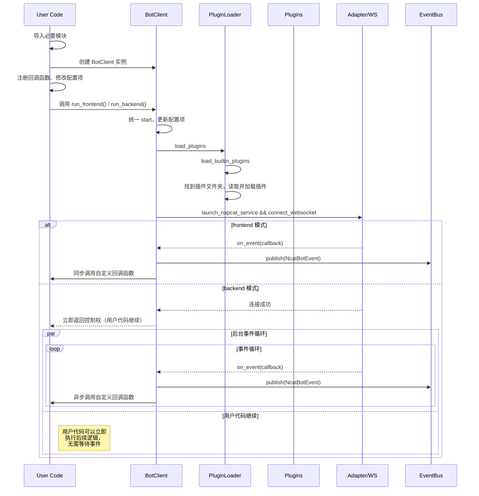

## 生命周期阶段

1. 初始化
2. 启动流程
3. 插件装载
4. 运行
5. 关闭

## 关键组件

- `BotClient`: 生命周期协调者；注册官方事件回调 → 启动 NapCat 服务 → 建立 WS → 适配器事件转投 `event_bus`。
- `PluginLoader`: 加载、扫描目录并识别和加载插件。
- `NcatBotPlugin`: 插件基类，提供插件和插件系统交互所需的基本方法。
- `EventBus`: 线程化事件总线，向插件系统分发事件。
- `Adapter`: 接收 QQ 事件和消息。
- `BotAPI`: 调用 QQ 接口。

## 插件生命周期与持久化

- 载入：若存在数据文件则反序列化 YAML → `_init_()` → `on_load()`。
- 卸载：`unregister_all_handler()` → `_close_()` → `on_close()` → 序列化当前 `config` 并保存。
- 重载：调用旧实例 `_reinit_()` + `on_reload()` → 卸载旧 → 动态 reload 模块 → 重新 `load_plugin()`。（此功能不稳定）

## 关闭流程

- 触发方式：前台模式 `Ctrl+C` 触发 `KeyboardInterrupt`；或后台模式调用 `bot_exit()`。
- 步骤：设置 `status.exit` → `plugin_loader.unload_all()` → 插件写回配置 → 日志记录。

## Mermaid 流程图

## 1. 初始化

调用 `BotClient.run_xxxend()` 之前的流程称为初始化。

1. 导入必要的模块
2. 创建 BotClient 实例
3. 修改[配置项]() (可选)
4. 注册回调函数 (可选)

## 2. 启动流程

启动流程发生在调用 `BotClient.run_xxxend()` 后。

### 2.1. 验证配置项

1. 如果是公网监听模式，检查 ws_token 强度，过弱的 ws_token 会被强制修改。
2. 如果启用了 WebUI，检查 webui_token 强度，过弱的 webui_token 会被强制修改。
3. 不支持 https/wss，会被强制修改为 http/ws。
4. 如果没有设置 bt_uin，会要求用户输入；如果没有设置 root，会 warning 提醒。
5. 如果以 `mock_mode` 启动，则执行 `Adapter` 级别的 Mock 注入，然后直接进入 [3. 加载插件](#3-加载插件)。

### 2.2 实际加载插件

插件加载操作实际上在这里执行。

### 2.3 安装或更新 NapCat (可选)

1. 尝试连接到 ws_uri 指定的 NapCat WebSocket 服务。如果成功，直接进入 2.5.1，否则下一步。
2. 检查操作系统，如果不是 Windows/Linux，直接报错。
3. 检查 NapCat 是否被安装/是否有可用更新；用户输入 `y` 确认安装/更新操作。
4. 安装对应的 NapCat 版本。

### 2.4 配置和启动 NapCat

1. 读取原有的 NapCat OneBot 配置文件（如果存在），检查当前配置和原有配置文件的兼容性：
    1. 如果不兼容则进行提示，按照用户选择，停止运行或者进行覆盖。
    2. 如果兼容，则正确合并配置。
2. 启动 NapCat 服务。

### 2.5 登录 NapCat（如果启用了 enable_webui_interaction）

1. 尝试连接到 NapCat WebUI，获取所需的登录信息。
2. 检查登录状态
    1. 如果未登录，要求用户扫码登录。
    2. 如果已登录，但登录信息有错，提示用户重启设备以刷新缓存。
    3. 如果已登录且登录信息正确，继续下一步。

### 2.6 建立 WebSocket 连接

1. 连接到 NapCat WebSocket 服务。

## 3. 加载插件

加载插件发生在启动流程后。

:::tip
实际代码实现中，launch_napcat_service 和 connect_websocket 发生在插件加载之后。由于这些过程的顺序不影响最终结果，因此将 launch_napcat_service 和 connect_websocket 归类到启动流程中。
:::

1. 调用 `PluginLoader.load_builtin_plugins` 加载**[内置插件]()**。
2. 查找工作目录下的 `plugins` 目录, 读取插件 meta 信息.
3. 根据插件 meta 中的依赖信息构建加载拓扑图.
4. 加载每个插件
   1. 加载插件私有可持久化数据(包括配置项).
   2. 调用插件 `BasePlugin.on_load` 函数, 执行自定义初始化操作.
   3. 事件总线注册**插件功能**和**插件配置项**.

## 4. 运行

1. `Adapter` 接收事件，调用 `BotClient` 传递的事件钩子。
2. `BotClient` 的事件钩子执行以下操作：
   1. 将事件转换为 `NcatBotEvent` 标准对象。
   2. 将事件发布到插件系统的事件总线 `EventBus`。
   3. 同步/异步调用用户直接注册的回调函数。
3. 事件总线的行为
    1. 将事件按照优先级顺序，分发给所有订阅了该事件的处理函数。
    2. 如果事件被处理器拦截，则不再向后传递。
    3. 收集事件的处理结果，返回给事件发布者。
4. 内置插件的行为
    1. `UnifiedRegistry` 订阅了所有消息事件，将这些事件正确分发到使用 `command_registry` 或 `filter_registry` 注册的处理函数。
    2. `UnifiedRegistry` 订阅了通知事件、请求事件，将这些事件正确分发到使用 `command_registry` 或 `filter_registry` 注册的处理函数。
    3. `SystemManager` 在 `UnifiedRegistry` 里注册了一些处理函数，用于获取一些系统信息。
    <!-- 4. `GroupWhitelist` 以最高优先级订阅了所有消息事件 -->

## 5. 退出

:::warning
点 X 关闭属于异常退出, 不会触发退出流程。
:::

前台模式按下 `Ctrl+C` 正常退出，或者后台模式调用对应 `BotClient` 实例的 `exit` 方法, 进入退出流程：
1. 保存权限数据。
2. 调用 `BasePlugin._unload_` 函数，完成自定义卸载操作。
3. 保存插件配置项。
4. 关闭 NapCat 服务 (可选，默认不关闭)。

