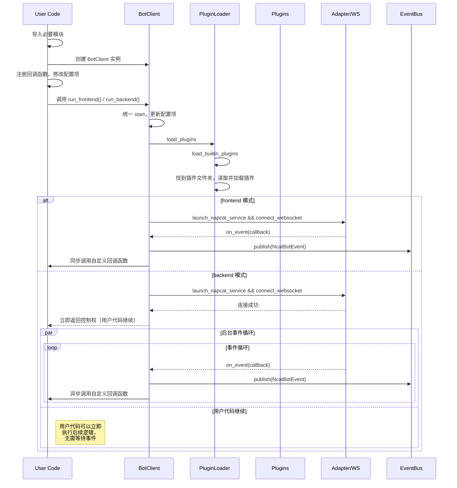

# NcatBot 生命周期概览

> 本文概述 Bot 从“创建实例”到“优雅退出”的核心阶段，聚焦：配置→启动→插件加载→事件分发→运行期并发→关闭。示例基于 `BotClient` 与插件系统源码（2025-09）。

## 1. 生命周期阶段
1. 初始化 (Instantiation)
2. 启动前配置 (Config Injection)
3. 启动流程 (Start / Frontend & Backend)
4. 插件装载与依赖解析 (Plugin Loading)
5. 事件接入与派发 (Event Dispatch)
6. 运行期并发与超时控制 (Runtime & Concurrency)
7. 关闭与资源回收 (Shutdown)

## 2. 关键对象
- `BotClient`: 生命周期协调者；注册官方事件回调 → 启动 NapCat 服务 → 建立 WS → 适配器事件转投 `event_bus`。
- `PluginLoader`: 目录扫描 → 依赖拓扑排序 → 并发执行插件 `__onload__()`（含同步 `_init_` + 异步 `on_load`）。
- `BasePlugin`: 定义插件三组钩子：同步 `_init_/_reinit_/_close_` 与异步 `on_load/on_reload/on_close`；配置持久化于 `<data_dir>/<name>.yaml`。
- `EventBus`: 线程化事件总线；支持精确 / 正则订阅、优先级、超时替换线程、强制终止超时处理器。
- `Adapter + BotAPI`: 对外消息与内部事件桥梁。

## 3. 启动流程概述
见顺序图 `lifecycle_diagrams.md` 中 `sequence`：
1. 用户 `bot = BotClient()`：构造适配器、线程池、官方事件 handler 容器。
2. `bot.run_frontend()` / `run_backend()` → 调用 `start()`。
3. 合法化配置参数（写入 `ncatbot_config` → `validate_config()`）。
4. 构造 `EventBus`、`PluginLoader` → 调用 `load_plugins()`：
   - 加载内置插件（如 `SystemManager`）。
   - 扫描插件目录 → 收集类 → 依赖解析（拓扑排序）。
   - 为每个插件创建工作线程池上下文并并发执行 `__onload__()`。
5. 非 mock 模式：启动 NapCat 外部服务 → 建立 WebSocket → 注册回调。
6. 适配器接收原始事件 → 映射为官方事件常量 → 投递到 `event_bus.publish()`。

## 4. 事件派发与执行
- `BotClient` 为每个官方事件维护处理器列表；接收后将 handler 以异步形式投递线程池（防阻塞）。
- 插件层：`plugin.register_handler(type, fn, priority, timeout)` → `EventBus.subscribe()` 存入精确或正则表。
- 发布：`publish(NcatBotEvent)` 收集匹配处理器 → 逐个提交任务队列。
- 每个处理任务：独立工作线程执行（同步或包装协程）。结果 / 异常存入对应队列，汇总至事件对象。

## 5. 并发与超时策略
- 工作线程集合 + 监控线程周期扫描 `worker_timeouts`。
- 若处理超时：调用 `PyThreadState_SetAsyncExc` 强制注入 `TimeoutError`，移除旧线程并补齐新线程，事件聚合 `HandlerTimeoutError`。
- 优先级排序：先按 `priority` 降序，再按处理函数名字典序；正则与精确结果合并统一排序。

## 6. 插件生命周期钩子与持久化
- 载入：若存在数据文件则反序列化 YAML → `_init_()` → `on_load()`。
- 卸载：`unregister_all_handler()` → `_close_()` → `on_close()` → 序列化当前 `config`。
- 重载：调用旧实例 `_reinit_()` + `on_reload()` → 卸载旧 → 动态 reload 模块 → 重新 `load_plugin()`。

## 7. 关闭流程
- 触发方式：`KeyboardInterrupt` 或连接异常 → 调用 `bot_exit()`。
- 步骤：设置 `status.exit` → `plugin_loader.unload_all()` → 插件写回配置 → 日志记录。“后端”模式下还会释放启动锁以通知调用方。

## 8. 状态 & 全局注入
- `status.global_api` 在 `BotClient.__init__` 中设定，用于插件访问统一 `BotAPI`。
- `status.global_access_manager` 在 `PluginLoader` 初始化时绑定 RBAC 管理器。

## 9. 典型扩展点
- 增加新官方事件：`EVENTS` 新常量 + `create_official_event_handler_group()` 建立容器。
- 增强线程策略：替换当前“超时=杀线程”方案为协程执行 (需要改执行模型)。
- 插件隔离：为插件提供独立事件循环 + 限流器。

> 图示与顺序 / 状态图请见 `lifecycle_diagrams.md`。

## 简介

NcatBot 的生命周期按照时间顺序分为以下几步:

- 引导
- 

## 引导

1. 导入必要的模块
2. 设置配置项(可选)
3. 创建 BotClient 实例
   1. 检查配置项是否合法, 检查是否已经创建过 BotClient 实例.
   2. 初始化 BotAPI.
   3. 初始化事件总线和内置功能.
   4. 加载功能注册钩子.
   5. 加载权限数据.
4. 注册回调函数(可选)
5. 启动 BotClient 实例

以上过程称为**引导**，用于**引导**的代码称作**引导程序**。

[插件模式引导](./1.%20插件模式最小示例.md#运行)

[主动模式引导](./2.%20主动模式最小示例.md#运行)

## 环境检查

环境检查发生在调用 `BotClient.run()` 或者 `BotClient.run_blocking()` 时，包含以下步骤：

1. **检查 NcatBot 安装**：检查 NcatBot 是否通过 pip 安装。如果开启了 NcatBot 更新检查，则额外检查 NcatBot 是否有新版本可用，如果有新版本则提醒用户更新。
2. **检查 NapCat 服务**： 检查 `ws_uri` 中指定的 NapCat 服务是否能被连接并且可用, 如果可用则跳过**环境检查**、 **NapCat 启动**、**引导登录**，进入**确认登录**。
3. **检查 NapCat 安装**：NapCat 是否被正确安装。
4. **安装或更新 NapCat**：如果 NapCat 未安装，则安装 NapCat。如果开启了 NapCat 更新检查且 NapCat 有新版本可用, 则在用户确认后更新 NapCat。
5. **配置 NapCat**： 自动配置 NapCat 的各项内容, 以便 NcatBot 能正常连接 NapCat 服务. ==如果你自行改动了 NapCat 配置, NcatBot 会直接覆盖掉你的修改==.

## 连接 NapCat 服务

1. **启动 NapCat 服务**：Linux 通过命令行启动无感启动 NapCat。Windows 下会询问是否允许 NapCat 对计算机进行修改, 需要同意后才能启动。
2. **引导登录**：如果之前本地有登录记录，则会使用快速登录。否则需要扫描终端的二维码登录。
3. **确认登录**：通过 NapCat WebUI 接口确认登录结果，如果登录信息不一致，则终止运行并提醒。
4. **连接 NapCat 服务**：使用 WebSocket 协议连接到 NapCat 服务。

## 加载插件

1. 查找工作目录下的 `plugins` 目录, 读取插件 meta 信息.
2. 根据插件 meta 中的依赖信息构建加载拓扑图.
3. 加载每个插件
   1. 加载插件私有可持久化数据(包括配置项).
   2. 调用插件 `BasePlugin.on_load` 函数, 执行自定义初始化操作.
   3. 事件总线注册**插件功能**和**插件配置项**.

## 运行

1. 监听来在 NapCat 的事件并上报. 事件对应的回调函数被调用, 同时事件上报到事件总线.
2. 处理事件
   - 通过 `BotClient` 注册的回调函数对事件做第一次处理。
   - 事件进入事件总线，激活**功能函数**做第二次处理, 调用订阅了该事件的所有**回调函数**做第三次处理。
3. 事件被拦截或者被处理
   - 订阅事件的回调函数可以拦截该事件, 阻止其继续传播.
   - 订阅事件的回调函数可以添加事件的处理结果, 以便和其它部分通信.

## 退出

:::warning
点 X 关闭属于异常退出, 不会触发退出流程。
:::

插件模式按下 `Ctrl+C` 正常退出，或者主动模式调用对应 `BotClient` 实例的 `exit` 方法, 进入退出流程。

1. 保存权限数据.
2. 调用 `BasePlugin._unload_` 函数, 完成自定义卸载操作.
3. 保存插件私有可持久化数据(包括配置项).
4. 关闭 NapCat 服务(可选, 默认不关闭).

