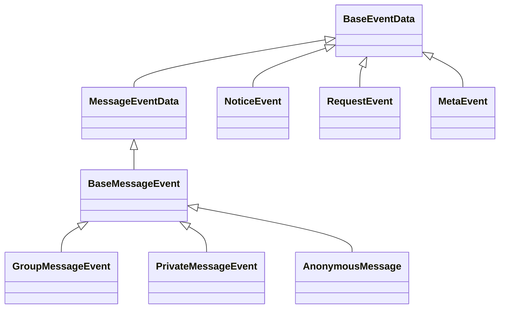

## 概览

NcatBot 将 OneBot/NapCat 的原始事件结构封装为更易用的事件对象。本文介绍全部事件对象及其附属数据结构：
- GroupMessageEvent（群消息）
- PrivateMessageEvent（私聊消息）
- RequestEvent（请求：加好友/加群）
- NoticeEvent（通知：群上传/变更/撤回等）

这些事件对象都会出现在 BotClient 的回调或插件的 EventBus 订阅中。它们不仅承载数据，也内置了常用的便捷操作方法（如 reply/approve 等），直接走 BotAPI 完成上行操作。

---

## 事件类继承关系



## BaseEventData（基础事件）

关键字段：
- `self_id`: `str`，当前 Bot QQ 号
- `time`: `int`，事件时间戳（秒）
- `post_type`: `str`，事件类型，如 `message`、`notice`、`request`、`meta_event`


## BaseMessageEvent（消息事件基类）

关键字段：
- [BaseEventData](#BaseEventData) 的所有字段。
- `message_type`: `str`，消息类型，如 `private`、`group`
- `sub_type`: `str`，消息子类型，这里太多，下级再介绍。
- `message_id`: `str`，消息 ID
- `user_id`: `str`，消息发送者 QQ 号
- `message`: `MessageArray`，结构化消息片段集合，参见[MessageArray 使用指南](./3.%20MessageArray.md)
- `raw_message`: `str`，原始文本消息
- `sender`: `BaseSender`，发送者信息，参见下文。

## GroupMessageEvent（群消息）

关键字段：
- 包括 [BaseMessageEvent](#BaseMessageEvent) 的所有字段。
- `group_id`: `str`，群号
- `sub_type`: `str`，消息子类型，`normal` | `anonymous` | `notice`。
- `sender`: `GroupSender`，发送者信息，参见下文。

便捷方法：
- `await reply(text=None, image=None, at=True, space=True, rtf=None) -> str`：在群内回复，默认 at 发送者并引用原消息，返回消息 ID；
- `await delete()`：撤回该消息；
- `await kick()`：踢出发送者；
- `await ban(ban_duration=30)`：禁言发送者（秒）。
- 方法名后缀加 `_sync` 即同步调用。

典型使用（BotClient 装饰器）：
```python
@bot.on_group_message()
async def on_group(e: GroupMessageEvent):
    if "ping" in e.raw_message:
        e.reply_sync("pong 1")
        await e.reply("pong 2")
```

---

## PrivateMessageEvent（私聊消息）

关键字段（只列核心）：
- 包括 [BaseMessageEvent](#BaseMessageEvent) 的所有字段。
- `sub_type`: `str`，消息子类型，`friend` | `group` | `other`。
- `sender`: `PrivateSender`，发送者信息，参见下文。

便捷方法：
- `await reply(text=None, image=None, rtf=None) -> str`：私聊回复，会自动引用原消息，返回消息 ID；

---

## Sender（消息发送者信息）

### BaseSender（基础发送者信息）

关键字段：
- `user_id`: `str`，发送者 QQ 号
- `nickname`: `str`，发送者昵称

### GroupSender（群消息发送者）

关键字段：
- 包括 [BaseSender](#BaseSender) 的所有字段。
- `card`: `str`，群名片/备注
- `level`: `int`，成员等级
- `role`: `str`，成员角色，`owner` | `admin` | `member`
- `title`: `str`，成员专属头衔，如果无，则为 `None`。

### PrivateSender（私聊消息发送者）

关键字段：
- 包括 [BaseSender](#BaseSender) 的所有字段。

## RequestEvent（请求）

用于处理「加好友」或「加群」请求。

关键字段：
- 包括 [BaseEventData](#BaseEventData) 的所有字段。
- `request_type`：`friend` | `group`
- `flag`：请求标识（用于执行通过/拒绝操作）
- `comment`：验证信息。

便捷方法：
- `await approve(approve=True, remark=None, reason=None)`：
  - `request_type` 为 `friend`：可传 `remark` 作为通过后的好友备注；
  - `request_type` 为 `group`：可传 `reason` 作为拒绝理由；
  - 内部会调用 `set_friend_add_request` 或 `set_group_add_request`。

示例：
```python
@bot.on_request(filter="group")
async def on_group_request(e: RequestEvent):
    await e.approve(approve=True)  # 通过加群
```

---

## NoticeEvent（通知）

承载群文件上传、成员变更、撤回、禁言、戳一戳等通知。

关键字段：
- 包括 [BaseEventData](#BaseEventData) 的所有字段。
- `notice_type`：通知类型
  
`notice_type` 字段选项：

- `group_upload` 
- `group_admin`
- `group_decrease`
- `group_increase`
- `friend_add`
- `group_recall`
- `group_ban`
- `notify`
...

更多详细信息参考[OneBot 事件文档](https://github.com/botuniverse/onebot-11/blob/master/event/notice.md)。

### group_increase（群成员增加）

关键字段：
- `group_id`：群号
- `user_id`：新成员 QQ 号
- `operator_id`：操作者 QQ 号（邀请者）
- `sub_type`：事件子类型，`approve` | `invite`，分别表示管理员已同意入群、管理员邀请入群。

### group_decrease（群成员减少）

关键字段：
- `group_id`：群号
- `user_id`：离开者 QQ 号
- `operator_id`：操作者 QQ 号（如果是主动退群，则和 user_id 相同）
- `sub_type`：事件子类型，`leave` | `kick` | `kick_me`，分别表示主动退群、成员被踢、登录号被踢。

### group_recall（群消息撤回）

关键字段：
- `group_id`：群号
- `user_id`：消息发送者 QQ 号
- `operator_id`：操作者 QQ 号（如果是自己撤回，则和 user_id 相同）
- `message_id`：被撤回的消息 ID

---

## 与 BotAPI 的协作

这些事件对象的方法（如 `reply/approve/delete/ban`）本质上都是对 `` 的便捷封装：
- GroupMessageEvent → 调用 `post_group_msg/set_group_ban/delete_msg/...`
- PrivateMessageEvent → 调用 `post_private_msg` 等
- RequestEvent → 调用 `set_friend_add_request/set_group_add_request`

因此你既可以用事件自带的方法快速完成处理，也可以直接使用 `BotAPI` 获得更细粒度的控制（如发送转发消息、贴表情、OCR 等）。
