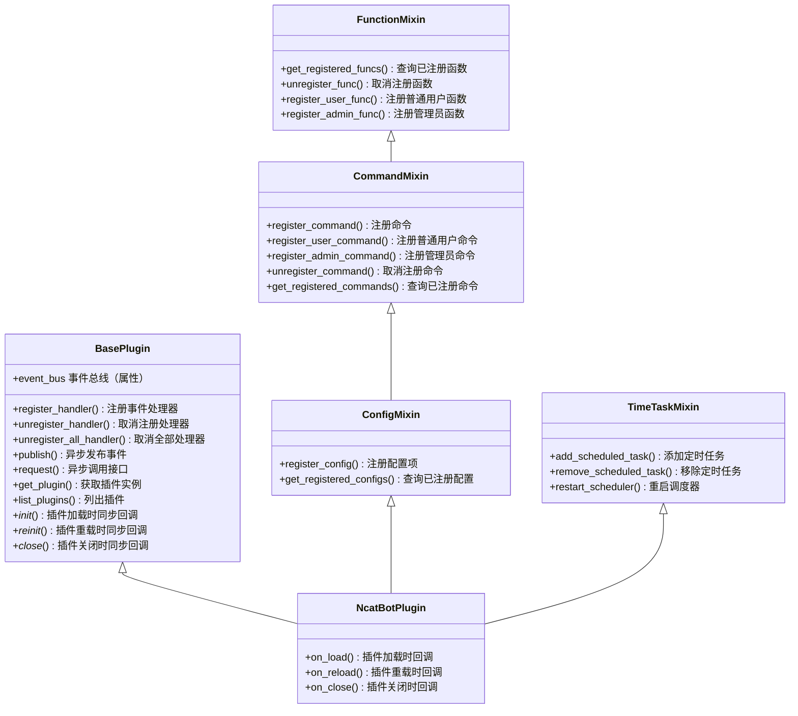
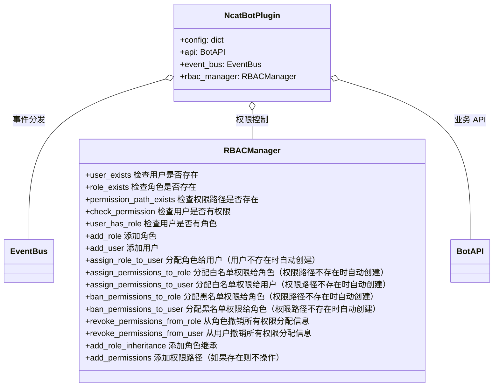

::: details NcatBot 插件系统小故事
凌晨三点的机房里，鱼鱼面前的四块显示器泛着幽幽蓝光。她机械地敲击着键盘， console 里不断刷新的报错信息在视网膜上投下跳动的残影。

“为什么就是抓不到这个事件触发时机......”鱼鱼扯下挂在脖子上的工牌甩在桌上，金属链子撞到咖啡杯发出清脆响声。ncatbot的插件系统像座迷宫，每个API接口都藏着意想不到的陷阱。五天前就该完成的天气插件，此刻仍卡在事件订阅的泥潭里。

冷风突然掀动窗帘，鱼鱼下意识缩了缩脖子。带着松木香气的保温杯轻轻落在手边，蒸腾的热气在显示器的代码注释区晕开一片水雾。

“异步回调里嵌套同步方法，不卡死才怪。”熟悉的声音让鱼鱼猛地转头，三个月未见的彭彭正俯身查看她的屏幕，苍白的指尖点在某个await关键字上，“这里需要加个 Promise.resolve 做缓冲层。”

鱼鱼怔怔看着好友从帆布包里掏出那台贴满电路板贴纸的 ThinkPad ，十指翻飞地调出半个月前的 git 提交记录。“你看，上周重构事件总线的时候，是不是把生命周期钩子的执行顺序改了？”彭彭的呼吸声里混着细微的杂音，像是老旧的通风管道。

他们并排而坐的姿势与大学时代别无二致。那时彭彭总能在鱼鱼卡壳时，用他特有的“五层分析法”把问题拆解成漂亮的思维导图。此刻他正用vscode的调试器下断点，控制台突然跳出的内存警告却让动作顿住。

“你的肝酶指标...”鱼鱼瞥见彭彭袖口下露出的住院手环，话音被剧烈的咳嗽声打断。零散的药片从彭彭口袋里滚落，在机械键盘的缝隙间闪着微光。

彭彭却已重新聚焦在屏幕上：“还记得我们给开源社区写的那个中间件吗？把它的发布-订阅模式移植过来，事件触发延迟能降低70%。”他苍白的脸上泛起病态的红晕，手指在触摸板上划出流畅的轨迹，“看，用RxJS重构事件流，再配合...咳咳...配合装饰器语法做插件注册...”

当晨曦爬上窗棂时，编译成功的提示框终于弹出。鱼鱼看着单元测试全部通过的绿色标记，突然发现彭彭的呼吸不知何时变得平稳绵长。那些散落的头孢克肟药片旁，静静躺着一本翻旧的《分布式系统设计模式》，扉页上是他们毕业时在樱花树下的合影。

“下周的CT复查...”鱼鱼轻声开口，却被彭彭截住话头。好友正在给 README.MD 添加最后一行文档，光标在“特别鸣谢”后欢快地跳动：“就说感谢某位不愿透露姓名的架构师——就像我们给 Linux 内核提交 Patch 时那样。”

晨光中，两个影子在满墙的架构图上交错重叠。鱼鱼突然想起三年前那个暴雨夜，当她的毕业设计因硬盘损坏即将泡汤时，是彭彭连夜用数据恢复工具从物理坏道中抢救出源码。此刻他们面前的屏幕上，NcatBot 的天气插件正在测试群里弹出今日的朝阳预报，而窗外真正的曙光正漫过彭彭不再颤抖的指尖。

TO BE CONTINUED...
:::

## NcatBot 插件

NcatBot 的插件位于工作目录下 `plugins` 文件夹中。每个插件是一个**独立的 Python 包**，包含插件代码和资源。

因而，一个典型的插件结构如下:

::: file-tree
- main.py
- plugins
  - your_plugin1
    - folder1
      - f1.py
      - f2.py
    - \_\_init\_\_.py
    - plugin.py
  - your_plugin2.py
:::

`main.py` 负责启动 NcatBot, `plugins/` 文件夹下的每个文件夹或 `.py` 文件都是一个插件。注意，如果插件以文件夹的形式存在，那么必须包含一个 `__init__.py` 文件。

使用 `bot.run_xxxend()` 启动 NcatBot 时, 会自动加载所有插件。

## 插件基类的结构

`NcatBot` 提供 `NcatBotPlugin` 作为插件的基类, 所有插件类必须继承自 `NcatBotPlugin`.

`NcatBotPlugin` 位于 `ncatbot.plugin_system.base_plugin.NcatBotPlugin`。

`NcatBotPlugin` 继承模式图：



`NcatBotPlugin` 成员模式图



## 插件的结构

### 单文件插件

```python
from ncatbot.plugin_system import NcatBotPlugin, filter_registry
from ncatbot.utils import get_log
from ncatbot.core import PrivateMessage

LOG = get_log("MyPlugin")

class MyPlugin(NcatBotPlugin):
    name = "MyPlugin" # 必须，插件名称，要求全局独立
    version = "0.0.1" # 必须，插件版本
    dependencies = {}  # 必须，依赖的其他插件和版本
    description = "这是一个示例插件" # 可选
    author = "你的名字" # 可选

    async def on_load(self):
        print(f"{self.name} 插件已加载")
        print(f"插件版本: {self.version}")
    
    @filter_registry.private_filter
    async def on_private_message(self, msg: PrivateMessage):
        await self.api.post_group_msg(msg.group_id, text="Hello, world!")

__all__ = ["MyPlugin"]
```

注意事项：
- 插件类必须继承自 `NcatBotPlugin`。
- 插件类必须定义 `name`、 `version`、`dependencies` 属性。
- 这里定义了 `on_load` 方法, 该方法在插件加载时调用。
- 这里使用 `@filter_registry.private_filter` 装饰器注册私聊消息处理函数，收到私聊消息时会回复 `Hello, World!`。

其他：
- 一个文件可以定义多个插件，只要在 `__all__` 中声明即可。


### 文件夹插件

一个插件包含以下文件:

::: file-tree
- main.py
- plugins
  - your_plugin
    - \_\_init\_\_.py
    - plugin.py
    - other.py
    - README.md
    - requirements.txt
    - .gitignore


其中：
- `__init__.py`：插件声明文件，必须包含且只能包含插件声明代码。
- `plugin.py`：插件主程序，必须包含且只能包含插件定义代码。
- `other.py`：插件其他代码文件，可选。
- `README.md`：插件说明文件，可选。
- `requirements.txt`：插件依赖文件，可选。
- `.gitignore`：Git 忽略文件，可选。

我们称 `your_plugin` 为**插件文件夹**, 字符串 `your_plugin` 称为**插件文件夹名**。

::: tip
推荐使用 `__file__` 参数来定位代码的路径.
:::

#### \_\_init\_\_.py

`__init__.py` 中：

```python
from .plugin import MyPlugin

__all__ = ["MyPlugin"]
```

NcatBot 不对工作目录做任何保证, 插件项目内部只建议使用==相对导入==.

#### plugin.py

一般在 `plugin.py` 中定义插件, `name` 称为**插件名**, 派生类类名(即 `MyPlugin.__name__` 的值)称为**插件类名**.

一般来说，一个**插件文件夹**只能包含一个**插件类**。为了方便管理，我们推荐以下三个值保持一致：
- 插件文件夹名
- 插件类名
- 插件名

```python
from ncatbot.plugin import BasePlugin, CompatibleEnrollment

class MyPlugin(BasePlugin):
    name = "MyPlugin" # 插件名
    version = "0.0.1" # 插件版本
    dependencies = {}  # 依赖的其他插件和版本
```

## 文档导航

