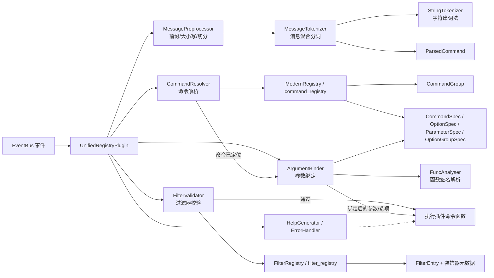
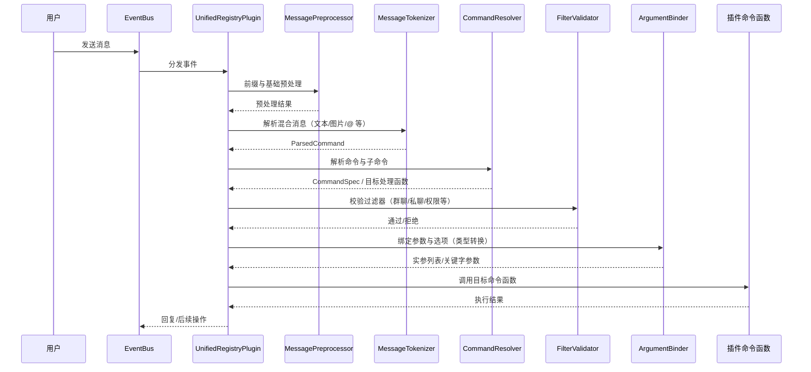
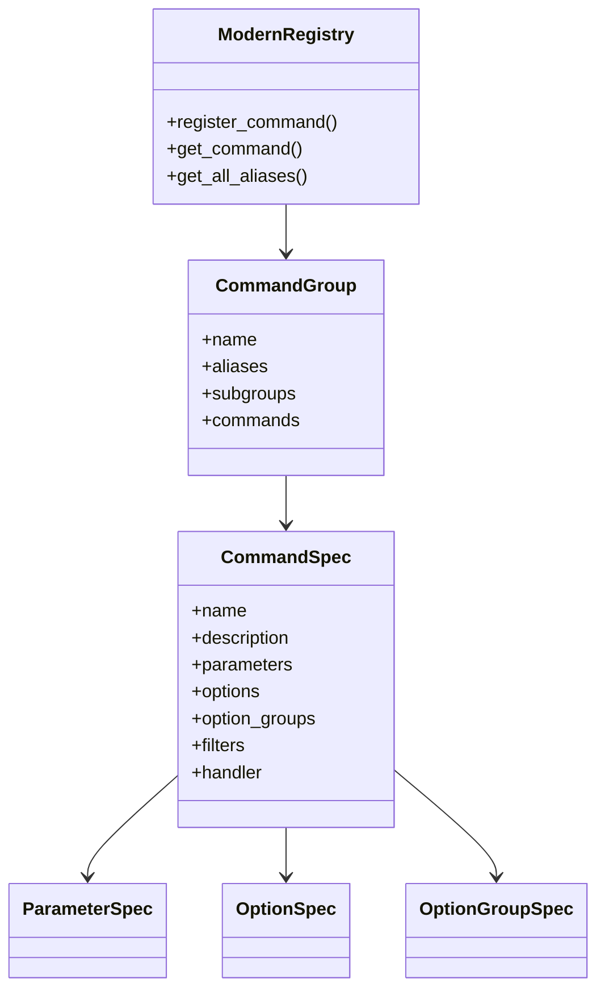
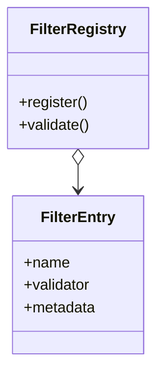

# UnifiedRegistry 统一注册系统

## 🚀 概述

**UnifiedRegistry** 是 NCatBot 的现代化插件系统核心，提供统一的命令注册和过滤器管理功能。它采用声明式设计，支持现代化的命令行参数解析，让插件开发变得简单而强大。

## ✨ 核心特性

### 🎯 统一注册管理
- **命令注册**: 使用装饰器轻松注册命令
- **过滤器系统**: 灵活的权限控制和消息过滤
- **参数处理**: 智能的参数解析和类型转换

### 🔧 现代化命令行解析
- **多种选项格式**: 支持 `-v`, `--verbose`, `--env=prod`
- **引用字符串**: 支持 `"包含空格的参数"`
- **非文本元素**: 智能处理图片、@用户等消息元素

### 🛡️ 智能过滤器
- **内置过滤器**: 群聊、私聊、管理员权限等
- **自定义过滤器**: 支持自定义过滤逻辑
- **过滤器组合**: 多个过滤器可以组合使用

## 🚀 最小示例

```python
from ncatbot.plugin_system import NcatBotPlugin
from ncatbot.plugin_system import command_registry
from ncatbot.plugin_system import group_filter, admin_filter
from ncatbot.plugin_system import option, param
from ncatbot.core.event import BaseMessageEvent
from ncatbot.utils import get_log
LOG = get_log(__name__)

class MyPlugin(NcatBotPlugin):
    name = "MyPlugin"
    version = "1.0.0"
    
    async def on_load(self):
        pass

    # 简单命令（注意：除self外的所有参数必须有类型注解）
    @command_registry.command("hello")
    async def hello_cmd(self, event: BaseMessageEvent):
        await event.reply("Hello, World!")
    
    # 带权限的命令
    @group_filter
    @command_registry.command("kick")
    async def kick_cmd(self, event: BaseMessageEvent, user_id: str):
        await event.reply(f"踢出用户: {user_id}")
    
    # 复杂参数命令
    @admin_filter
    @command_registry.command("deploy")
    @option(short_name="v", long_name="verbose", help="详细输出")
    @param(name="env", default="dev", help="部署环境")
    async def deploy_cmd(self, event: BaseMessageEvent, app_name: str, env: str = "dev", verbose: bool = False):
        result = f"部署 {app_name} 到 {env} 环境"
        if verbose:
            result += " (详细模式)"
        await event.reply(result)
```

## 结构图

### 高层组件关系（Component）



要点：
- 事件由 `EventBus` 分发到 `UnifiedRegistryPlugin`，随后按“预处理 → 分词 → 解析 → 过滤 → 绑定 → 执行”的主链路推进。
- 命令与过滤器均通过注册表统一管理：`command_registry` 与 `filter_registry`。
- 帮助与错误处理贯穿各阶段，确保良好的开发与使用体验。

---

### 消息到执行的时序（Sequence）


### 命令注册结构（Class Diagram）



装饰器生态（示例）：
- `@command_registry.command("name", description=...)`
- `@option("-v", "--verbose", help=...)`
- `@param("target", type=..., help=...)`

---

### 过滤器系统结构（Class Diagram）



典型过滤器：
- 群聊限定、私聊限定、管理员权限、自定义复合过滤器等。

## 📚 文档导航

### 🎯 快速入门
- **[快速开始指南](2.%20快速开始.md)** - 5分钟上手教程

### 📖 功能指南
- **[过滤器系统](./5.%20过滤器系统.md)** - 权限控制和消息过滤
- **[命令注册系统](3.%20命令系统.md)** - 命令注册和管理
- **[参数解析指南](4.%20参数解析.md)** - 现代化参数处理

### 💡 进阶内容
- **[最佳实践](8.%20最佳实践.md)** - 专业开发指导
- **[实战案例](7.%20实战案例.md)** - 真实应用场景
- **[测试指南](6.%20测试指南.md)** - 插件测试方法
- **[常见问题](9.%20FAQ.md)** - 问题解决手册

## 🎯 适用场景

- ✅ **群管理机器人**: 踢人、禁言、公告等管理功能
- ✅ **信息查询服务**: 天气、翻译、搜索等工具
- ✅ **游戏娱乐插件**: 签到、抽奖、小游戏等
- ✅ **数据处理工具**: 统计、分析、报表生成
- ✅ **自动化服务**: 定时任务、监控告警等


## 🚦 开始使用

1. **阅读**: [快速开始指南](2.%20快速开始.md)
2. **学习**: 选择相应的功能指南深入了解
3. **实践**: 参考实战案例开发自己的插件
4. **测试**: 使用测试指南确保插件质量

---

**💡 提示**: UnifiedRegistry 设计注重简洁性和可维护性，推荐优先使用内置功能，在需要时再考虑自定义扩展。
